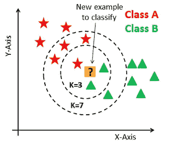
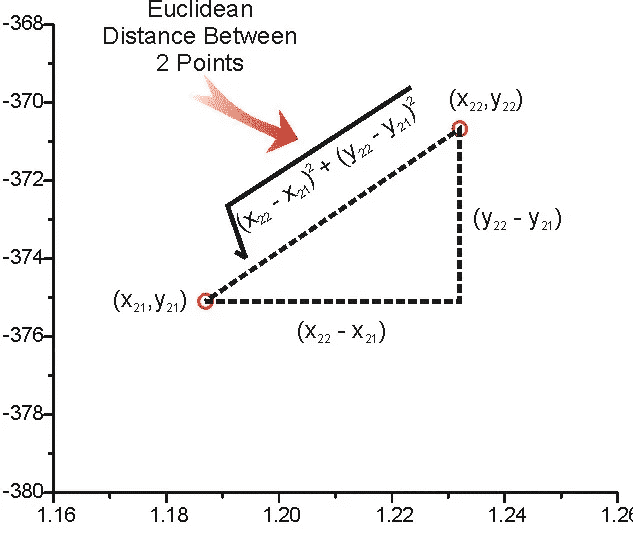
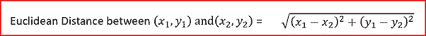
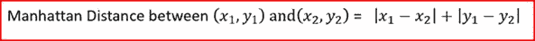
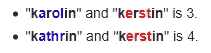
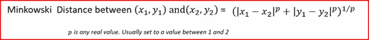
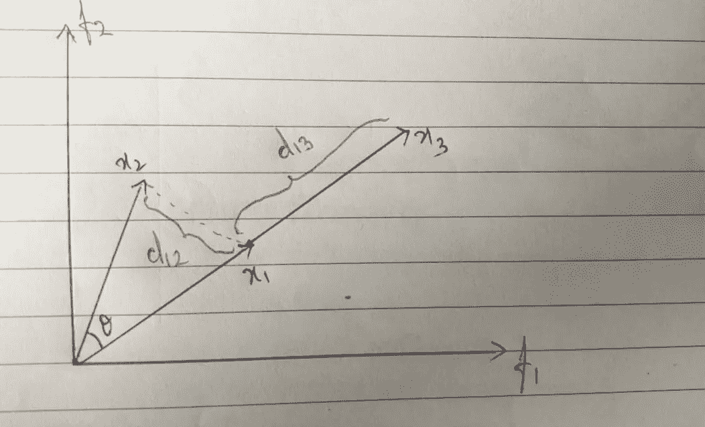

# k-最近邻(KNN)

> 原文：<https://levelup.gitconnected.com/knn-k-nearest-neighbours-d3ce76380e14>

在这一系列文章中，我们将详细了解 K-最近邻(KNN)算法。

首先，K-NN 被归类为有监督的机器学习算法。对于想了解有监督和无监督机器学习算法的人来说， [***这里的***](https://en.wikipedia.org/wiki/Machine_learning#Supervised_learning) 同样是一个链接。简而言之，监督学习已经定义了类别标签。

在深入 KNN 的细节之前，我们先来理解一下我们所说的分类问题 v/s 回归问题是什么意思。

考虑泰坦尼克号数据集的例子。泰坦尼克号数据集被认为是“hello world！”机器学习领域的一个项目。这个问题的目标是根据某些特征对一个人是否在灾难中幸存进行分类。因此，给定一系列特征，如人的年龄、性别、他/她购买的头等舱机票等，我们应该预测这个人是否幸存。例如，如果一个人是女性或儿童，他们幸存的概率更高。因此，我们应该在两个类别标签之一之间进行分类，即存活与否。由于有两种可能的结果，它也被称为**二类分类**问题或**二元分类**问题。现在，假设你刚刚使用一个在线出租车聚合器乘坐了一辆出租车。游乐设施完成后，您可以选择对您的游乐设施体验进行评分。该评级系统有助于公司了解负责该游乐设备的司机的表现。现在，给你 5 个可能的选择，即非常差、差、一般、好、非常好。根据你的经验，从 5 个选项中选择一个。在这里，你正试图将你的乘坐体验分为 5 个可能的类别。由于可能的类别数大于 2，称为**多类分类**。

让我们继续了解什么是回归问题？在上面的两个例子中，我的类别标签有一个有限的值集，如幸存与否或在 5 个可能的类别标签中对乘坐体验进行评级。但是在回归的情况下，我们没有这个有限的类别标签集。我举个例子来解释一下。给你一些特征，如一些学生的体重、年龄、性别，目标是预测学生的身高。在这种情况下，学生的身高不属于一个有限的班级标签集。它是一个实数值，可以取特定范围内的任何值。这种类别标签是实数的问题被称为**回归问题。**

KNN 既可用于分类问题，也可用于回归问题。我们将首先从分类的角度来理解 KNN。

考虑下面的例子。

[图像信用](https://medium.com/@madanflies/k-nearest-neighbour-for-classification-on-breast-cancer-data-results-with-preprocessing-and-w-o-e21b0cc98a2f)

我们有一组红绿点。我们观察到红色点属于类别标签 A，绿色点属于类别标签 b。给定这些点，我们现在得到另一个黄色点。任务/目标是将这个也被称为**查询点**的黄色点分类到一个类别标签中。

## 用通俗的语言给 KNN 下定义:

KNN 代表 K 个最近邻居。其中 K 是指示要考虑的最近邻居的数量的整数值。k 可以取 1 到 n 之间的任何整数值，其中 n =数据集中的点数。因此，我们考虑查询点的 K 个最近邻居，并对这些最近邻居执行多数投票。具有最高投票的类别标签被分配给查询点。

回到上面的例子。假设我的 K=3，那么我们应该确定查询点的 3 个最近的邻居(我们如何确定这些邻居，我们将在本文的后面部分看到)。当我们考虑 3 个最近的邻居时，在这 3 个最近的邻居中，2 个属于 B 类，1 个属于 a 类。按照多数，我们将查询点分类为 B 类。现在，让我们考虑 K=7。意味着，现在我们将考虑 7 个最近的邻居，而不是 3 个最近的邻居。当我们考虑 7-NN 时，我们得到属于类别 A 的 4 个最近邻和属于类别 b 的 3 个最近邻。现在，按照多数类别，我们将查询点分类为类别 A。

你可能想知道刚刚发生了什么？当我们选择 K=3 时，我们将查询点分类为 B 类，而当我们选择 K=7 时，分类标签变为 a。这太令人困惑了。我如何确定选择什么样的 K 值？

不要担心，你所有的疑问都会很快得到解答。现在，我只想确保你理解 KNN 背后的直觉。我们很快就会明白如何确定最近的邻居，以及如何选择最佳的“K”值。

## 如何找到最近的邻居？

对上述问题的一个简单而直接的回答是计算两点之间的距离。我们将了解计算两点间距离的 4 种主要距离度量。

## 1.欧几里得距离

考虑下面的例子:

[形象信用](https://hlab.stanford.edu/brian/making_measurements.html)

点 A = (X_21，Y_21)

点 B = (X_22，Y_22)

d =从 A 点到 B 点的最短直线的长度= A 点和 B 点之间的欧几里德距离。

欧几里德距离是两点间距离平方之和的平方根。它也被称为 L2 规范。我们将在后面的文章中看到什么是 L1 和 L2 规范。

## 2.曼哈顿距离

曼哈顿距离是两点之间差异的绝对值之和

## 3.汉明距离

主要用于文本处理，当我们有一个二进制或布尔向量。简单来说，它告诉我们两个分类变量是否相同。考虑下面的例子，其中汉明距离在:

## 4.闵可夫斯基距离

闵可夫斯基距离用于寻找两点之间的距离相似性。当 p=1 时，它变成曼哈顿距离，当 p=2 时，它变成欧几里德距离

这些是距离测量技术，主要用于计算点之间的距离，以确定最近的邻居。

现在，你可能会想，还有别的吗？我的意思是，我理解距离测量的部分，但有没有其他方法也可以理解最近的邻居？答案是肯定的！

到目前为止，我们用距离来衡量最近的邻居，我们用“角度”来衡量他们怎么样？

让我给你介绍一下“**余弦相似度和余弦距离”**的概念

余弦相似度考虑两点之间的角度(**θ**)**T5)，等于 **cos( *θ)*** 。考虑下面的例子:**

a 和 B 是两个数据点，θ是它们之间的角度。可以肯定地说，如果两点之间的距离增加，则两点之间的角度将增加，并且随着两点之间的角度增加， **cos( *θ)*** 减小意味着它们的余弦相似性减小。

考虑下面的例子:

我们有 3 个向量——x1、x2 和 x3。

余弦相似性(x1，x2)=**cos(*θ)*** 余弦相似性(x1，x3) = 1(自，θ = 0 且 cos(0) = 1)
余弦距离(x1，x2) = 1 — cos(θ)
余弦距离(x1，x3)= 1–1 = 0(自，cos(θ) = 1

***所以观察结果是，就欧几里得距离而言，其清楚地表明距离 d13>d12***

***但是在比较余弦距离时，cos-dist (x1，x3) < cos-dist (x1，x2)***

从上面的观察中，很明显 cos-sim 或 cos-dist 使用向量之间的角度，而不是几何距离。

欧几里得和余弦相似性之间有关系吗？

是的。有，具体如下:

**x1 和 x2 之间的平方欧氏距离= 2*(1 — cos( *θ)* )**

要了解同样的详细数学证明请参考此 [***链接***](https://mc.ai/relationship-between-cosine-similarity-and-euclidean-distance/)

总之，我们非常详细地了解了 K-NN。我们还讲述了各种距离度量和余弦相似性，以理解最近邻是如何计算的以及它们是如何相关的。

## **附加阅读材料**:

在我研究这个话题的时候，我看到了克里斯·埃米瑞的一篇精彩的文章。我会推荐你去一次这个 [***链接***](https://cmry.github.io/notes/euclidean-v-cosine)

***在下一篇文章中，我们将了解 KNN 的局限性，它的失败案例，如何挑选正确的“K”值。***

***直到那时，快乐学习***