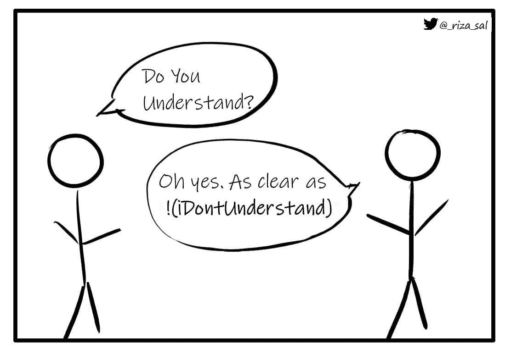
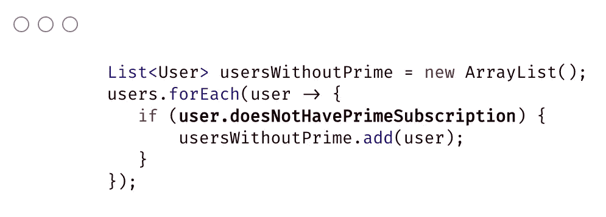
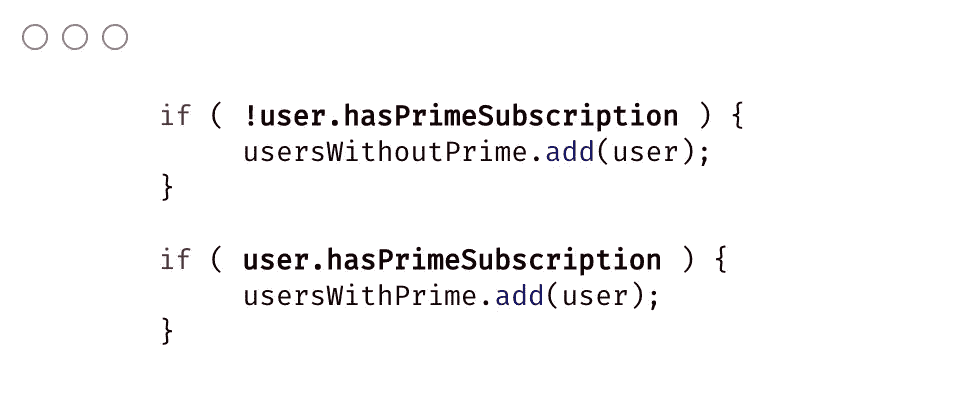

# 打结:避免布尔方法的负面名称

> 原文：<https://levelup.gitconnected.com/knot-of-nots-avoiding-negative-names-for-boolean-methods-641896a94a42>

## 命名返回布尔值的方法的更好做法

命名返回 boolean 的方法的通常惯例是在谓词前面加上前缀动词，如“is”或“h as ”,作为一个问题，或者使用谓词作为一个断言。例如，要检查用户是否处于活动状态，您可以说 ***user.isActive()*** 或者要检查用户是否存在，您可以说 ***user.exists()*** 。

但是当目的是检查用户是否不活动时，我遇到过被写成***user . isnotactive()***或***user . is inactive()***的代码。使用负面方法名的问题是，当你试图为正面用例重用相同的方法时，会变得更加难以理解。

考虑下面的场景。我们需要一个用户列表，这些用户没有 prime**。具有此逻辑的方法可以命名为***user . doesnothaveprimesubscription()****或****user . hasnoprimesubscription()***。**

****

**适用于此用例。然而，将来我们很可能需要获得**拥有 prime 订阅**的用户列表。为了重用现有的方法，if 语句必须按照以下格式编写:**

****

****！user . doesnothaveprimesubscription**是的双重否定语句，这使得理解这样一个简单的用例变得令人困惑，尤其是在涉及复杂的方法时。为了使你的代码易于阅读，将否定动词改为肯定动词。**

****

**使用动词的阳性形式和前缀
a’**来构造方法名，总比以一堆 nots 结束要好！**’(非)仅用于否定用例。一个非常简单的约定，如果遵循，将有助于更好的代码可读性和可重用性。**