# 15 分钟知识图谱 App

> 原文：<https://levelup.gitconnected.com/knowledge-graph-app-in-15min-c76b94bb53b3>

用 JSONs、MongoDB 和自动生成的 GraphQL API 原型化一个简单的知识图应用程序

*这个帖子是与* [*安娜*](https://medium.com/@annakoniec) *和* [*阿图尔*](https://medium.com/@arturhaczek) *共同努力的结果。*

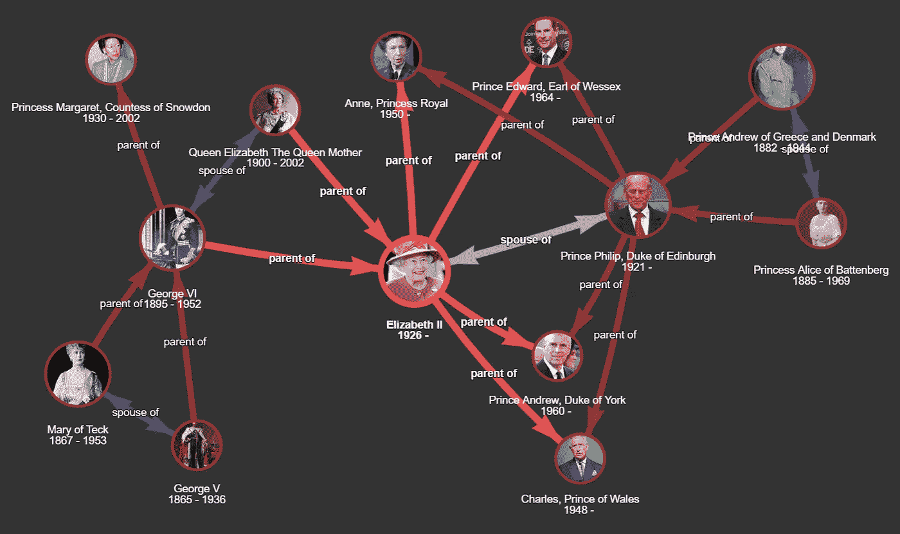

来源:[贵族人脉](http://demo.staple-api.org/)

# TL；速度三角形定位法(dead reckoning)

使用完全通过 GraphQL 层管理的 JSON 数据，可以轻松构建简单的知识图应用程序。我们描述了一个快速的原型制作方法， [Noble Connections](http://demo.staple-api.org/) ，它包括:

1.  存储在自由层 [MongoDB Atlas](https://www.mongodb.com/cloud/atlas) 实例中的 JSON 文档
2.  Staple API —一个基于 GraphQL 的语义抽象中间件，用于访问数据并将其虚拟化为知识图
3.  在 [Repl.it](https://repl.it/) IDE 上测试部署

此演示的代码和部署说明可从以下网址获得:

> [https://github.com/epistemik-co/staple-api-kg-demo](https://github.com/epistemik-co/staple-api-kg-demo)

# 简介:走在知识图表上，一步一个脚印

所以你想构建一个简单的知识图驱动的应用程序？太好了！你知道它将是关于什么的，你已经起草了应该支撑你的知识图的核心数据模式，并且你已经有了填充该结构的初始数据集——没有什么非常复杂的东西可以开始，比如一些人、地点以及它们之间的一些基本关系。类似这样的[贵族关系](http://demo.staple-api.org)演示可以让人们探索欧洲贵族之间不同的家庭关系。您认为将所有这些放在一起并通过一些基本的 UI 公开应该不会太难，但是突然您开始学习另一个教程，并确信您的下一个主要挑战是选择合适的技术堆栈。应该是什么？可能是一些“本地的”*图形数据库*实现了*标记的属性图*模型——但是是哪一个呢？可能性的范围很广，并且在迅速增长。或者也许你应该走 RDF 路线，使用 *W3C 标准*来表示你的数据，并在 *RDF 三重存储*中管理它？或者一个*多模型数据库*可能是最安全“包罗万象”的选择..？

知识图空间中有大量详细的比较，并推荐了最适合构建核心图驱动应用程序的高级工具。然而，在我们的情况下，他们最终似乎承诺的是一个相对陡峭的学习曲线，以换取在第一个知识图应用程序原型制作时可能不太清楚的收益。

> 最后，一切都归结到用例，可以说，简单的用例可以用简单的方法有效地解决。

人们常说，知识图仅仅是应用数据的抽象视图，与具体的数据库、数据架构或实现没有直接联系。知识图存在于关系数据库、文档存储、数据仓库、Web 本身以及跨 REST 端点。

> 这实际上是要认识到，在你感兴趣的领域中，不同类型的实体通过不同的关系彼此内在地联系在一起。

这并不意味着需要对该结构运行复杂的网络分析，或者对其类型层次结构进行逻辑推理，或者并行路径搜索算法。这些确实都是有效的任务，并且在这些任务中，上面提到的高级工具完全提供了其与众不同的价值主张。

> 但有时真的只是在知识图上一步一步地走。

在这篇博文中，我们描述了一个简单的知识图应用程序原型的快速制作方法， [Noble Connections](http://demo.staple-api.org/) ，它利用了:

*   普通 JSON 文档，存储在自由层 [MongoDB Atlas](https://www.mongodb.com/cloud/atlas) 实例中，用来表示应用程序数据；
*   基于 GraphQL 的 [Staple API](https://staple-api.org) 服务，用于将数据自动结构化和虚拟化为图形。

该应用程序具有 vis.js 支持的前端图形可视化，最终使用 Repl.it IDE 环境进行现场部署。

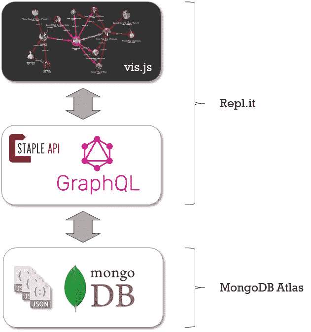

Noble Connections 应用程序的架构和部署。

# I .用 JSONs 编码图形数据

JSON 是一种简单但极其灵活的数据序列化格式，由于它非常流行，可能不需要向任何人介绍。从形式上讲，它的目的是表示树型结构，即:对象、它们的属性以及与其他具有属性的对象的外部关系，等等。然而，按照一点系统惯例，它也非常适合捕捉图形形状的模型。从本质上讲，这就是在所有 JSON 对象上一致地使用惟一标识符，并注意哪些属性用于引用这样的标识符。例如，下面两个 JSON 对象描述了伊丽莎白女王二世和英国。标识符，在这种情况下都是 URIs，总是与关键字`_id`、(因此分别是:`[http://dbpedia.org/resource/Elizabeth_II](http://dbpedia.org/resource/Elizabeth_II)`和`[http://dbpedia.org/resource/United_Kingdom](http://dbpedia.org/resource/United_Kingdom)`)相关联，并从属性`birthCountry`、`deathCountry`、`parent`、`child`和`spouse`中进一步引用。

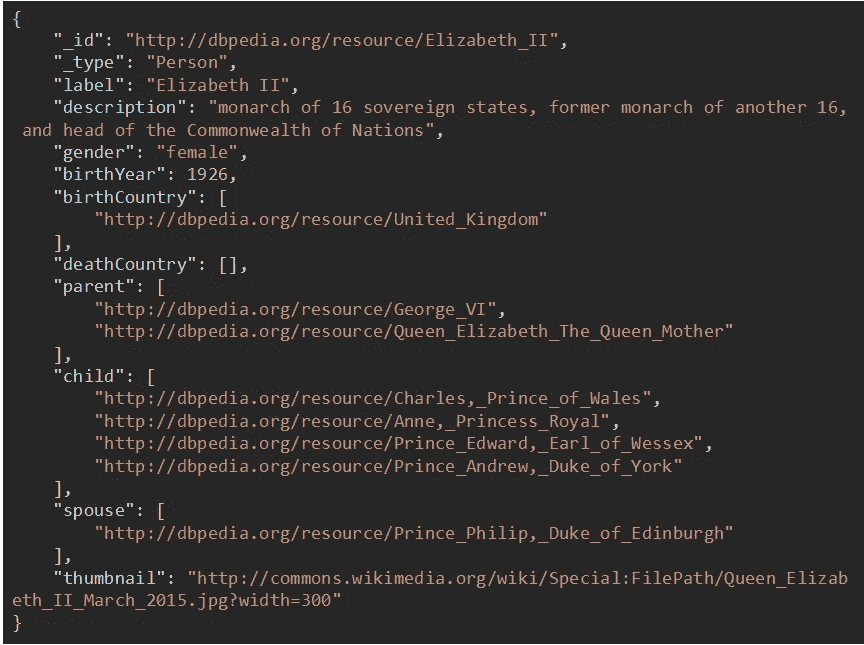

JSON 中表示的实体“伊丽莎白二世女王”。

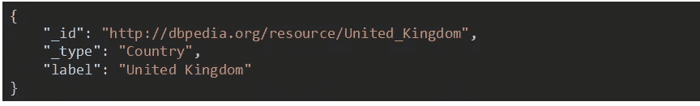

JSON 中表示的实体“英国”。

那些更熟悉关联数据标准的人可能会立即意识到这基本上是 [JSON-LD](https://www.w3.org/TR/json-ld/) 格式背后的建模原则。这里唯一缺少的组件是所谓的 JSON-LD 上下文，它正式强制执行上述约定，如下所示:

```
{
    "_id": "@id",
    "_type": "@type",
    "@vocab": "http://example.com/",
    "birthCountry": {
        "@type": "@id"
    },
    "deathCountry": {
        "@type": "@id"
    },
    "parent": {
        "@type": "@id"
    },
    "child": {
        "@type": "@id"
    },
    "spouse": {
        "@type": "@id"
    }
}
```

通过采用这种表示方法，单个 JSON 对象可以自然地变成任意大且复杂的图形拼图，这就是问题的关键。上例中的两个 JSONs 一起陈述了一个叫“伊丽莎白二世”的人出生在一个叫“英国”的国家

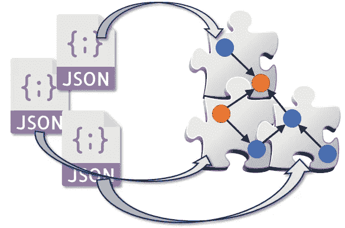

通过一致地使用惟一标识符，可以很容易地将图结构编码成 JSON 格式。

JSONs 的另一个优点是围绕它的现有工具生态系统——例如， [MongoDB Atlas](https://www.mongodb.com/cloud/atlas) —一个流行的 MongoDB JSON 商店的基于云的版本，它提供高达 512MB 数据的自由层存储，零维护成本。为了给我们的 Noble Connections 应用程序部署[数据](https://github.com/epistemik-co/staple-api-kg-demo/blob/master/data.zip)(最初从 [DBpedia](http://dbpedia.org/) 中提取)，我们创建了一个这样的免费实例和一个专用的文档集合，使用 [python 客户端](https://www.w3schools.com/python/python_mongodb_getstarted.asp)上传数据，并配置一个具有只读访问权限的访客用户来启用应用程序查询。

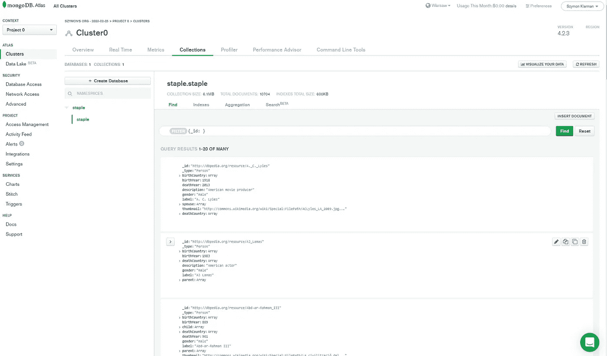

MongoDB Atlas 实例的 web 仪表板，带有 Noble Connections 数据。

# 二。graph QL——一个图形抽象中间件

关于 GraphQL、它多样化的数据管理能力以及它可能对如何构建数据驱动的 API 产生的变革性影响，已经说了很多。有趣的是，GraphQL 也越来越被认为是知识图之上的一个方便的数据抽象和访问层，这主要是因为它的严格类型化模式和查询语言，这有助于导航语义知识图，以及从不同来源获取数据的灵活性。简单地说，GraphQL 非常适合管理来自不同结构数据源的连接数据。特别是，它非常适合公开以 JSON 对象形式序列化的图形数据，如上所述。

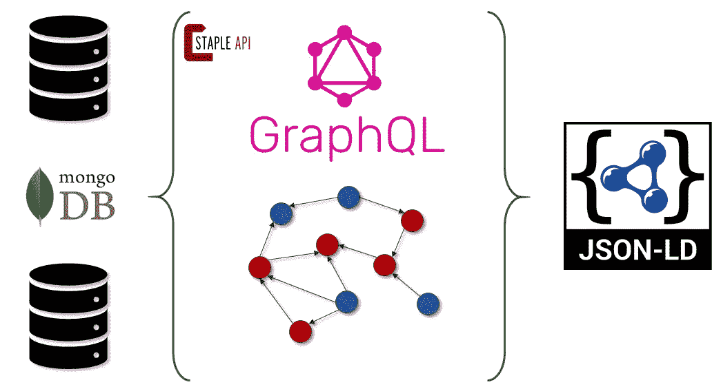

Staple API 将来自不同后端的数据虚拟化为(链接数据)知识图，并通过自动生成的 GraphQL 服务公开它。

为了简化合适的 GraphQL 端点在 MongoDB 上的实现，我们使用了[Staple API](http://staple-api.org/)——一个轻量级的基于 GraphQL 的 API，用于管理不同数据存储后端之上的知识图，包括 MongoDB。简而言之，Staple API 接受一个指定的 RDF 本体(在 Noble Connections 示例中[这个就足够了](https://github.com/epistemik-co/staple-api-kg-demo/blob/master/docs/ontology.ttl))，一个后端源的配置，并自动启动一个准备好的 GraphQL 服务，以及一个相应的模式和解析器。这个过程的自动化实际上节省了大量的开发时间，因为通常 GraphQL 解析器依赖于基于高度重复模式的数据结构，而这些数据结构都必须手动编码。

根据提供的本体和 MongoDB 数据源配置构建一个 Staple API 服务器。

GraphQL 模式对其管理的数据实施了严格的结构，因此我们必须确保我们插入到 MongoDB 中的数据确实与从本体生成的模式相匹配。或者，我们可以使用由 Staple API 创建的相应突变，以便将数据插入 MongoDB，并让 GraphQL 验证其正确的结构。

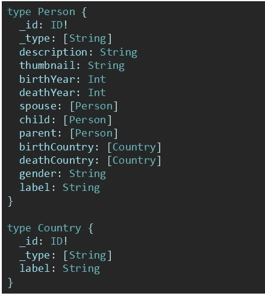

用于 Noble Connections 应用程序的 GraphQL 模式。

一旦启动，Staple API 就会公开一组查询，这些查询能够将单个数据点连接成整个知识图的更大片段。不可否认，GraphQL 查询语言的表达能力主要允许“在图上行走”，即获取对象及其选定的邻居，以及这些对象的邻居等。但是如果行走是我们所追求的，那么 GraphQL 只是完成了任务。例如，下面的原型查询获取一个带有标识符`[http://dbpedia.org/resource/Elizabeth_II](http://dbpedia.org/resource/Elizabeth_II.)`的人及其出生国家，以及她的孩子，分别带有他们的父母和出生国家。

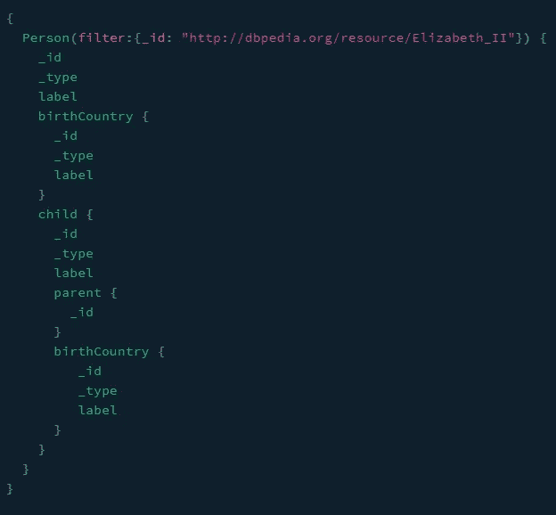

用 GraphQL 查询 Nobel 连接数据。

这种类型的查询是 Noble Connections 演示 UI 的全部内容，支持对整个图形的可控探索。

# 三。Repl.it 上的部署

在线测试部署简单 web 应用程序的最快方法之一是使用 [Repl.it](https://repl.it) IDE 环境。

1.  转到 [https://repl.it](https://repl.it/) 。
2.  按 **+ new repl** 创建一个新的 repl 环境，选择从 GitHub 导入。
3.  粘贴演示库的 URL([https://github.com/epistemik-co/staple-api-kg-demo](https://github.com/epistemik-co/staple-api-kg-demo/))并导入它。
4.  按下运行按钮，等待应用程序在自动生成的一个表单的网址启动:【https://* * *-five-nine.repl.co[。](https://github.com/epistemik-co/staple-api-kg-demo/#)

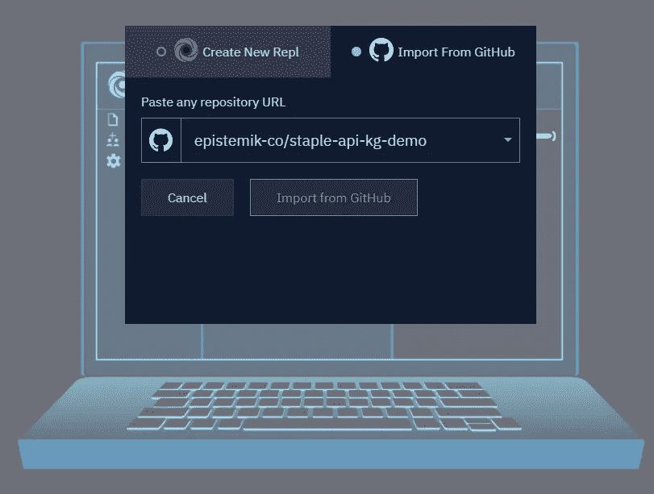

将 GitHub 项目导入 Repl.it。

该应用程序(从 [demo.js](https://github.com/epistemik-co/staple-api-kg-demo/blob/master/demo.js) 文件运行)公开了两个图形界面:

*   [处的前端 UI https://* * *-five-nine.repl.co](https://github.com/epistemik-co/staple-api-kg-demo/#)
*   位于[https://* * *-five-nine.repl.co/graphql](https://github.com/epistemik-co/staple-api-kg-demo/#)的底层 Staple API 的 Apollo 游乐场，

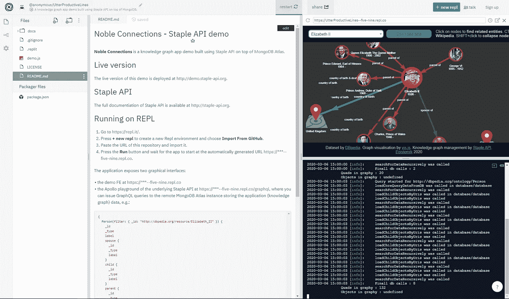

在 Repl.it 中运行 Noble 连接

完成了。知识图表应用程序正在运行，并准备玩，因为欧洲贵族之间的联系即将被发现！:)

前端 UI 上的核心图形可视化是使用流行的 [vis.js](https://dataviz.tools/category/network-visualization/) 库创建的，该库足以呈现中小型网络，并支持轻松定制的表示、行为和交互模式。Apollo playground 通常不会作为应用程序本身的一部分公开，它被包含在内，以便在 GraphQL 查询级别上进一步探索数据集。

# 摘要

很明显，在现实世界中，构建和管理知识图表没有一个放之四海而皆准的方法。具有复杂查询和分析需求的苛刻用例通常需要高级工具，如图形/三元存储、语义数据描述模型、推理引擎或图形计算框架。然而，在其他情况下，基于普通 JSONs、MongoDB 和 GraphQL 的更简单的解决方案将完全有效，并将很好地支持预期的使用场景，同时大大减少开发工作以及部署和维护应用程序的成本。