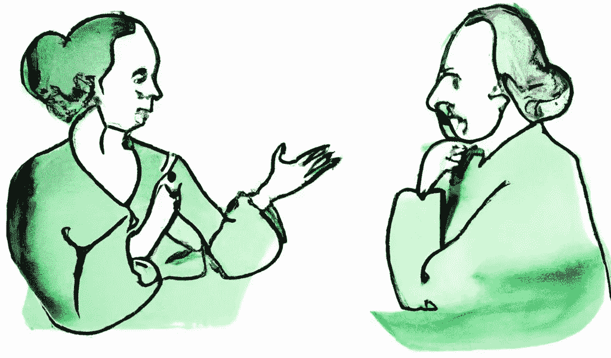
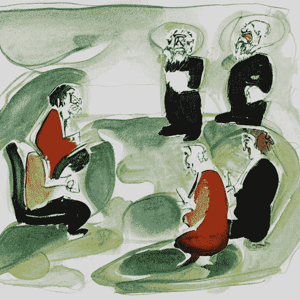

# 知识表示(第 2 章:人工智能手册)

> 原文：<https://levelup.gitconnected.com/knowledge-representation-chapter-2-ai-handbook-f37da56d5868>

所有人工智能产品都采用的基本问题空间，这是对知识表示及其应用的一个非常简单的介绍。

来自[作者](https://medium.com/@aniltilbe)【2】

在人工智能(AI)中，知识表示是将关于世界的信息编码成计算机可以用来解决问题的形式的过程。通常，这意味着创建概念的正式模型以及它们如何相互关联。目标是让计算机能够从一组事实或假设中得出逻辑结论。

不存在适用于所有情况的理想的知识表示形式。命题逻辑、一阶谓词逻辑、规则系统(如产生式规则或正向链接)、默认逻辑、描述逻辑、基于框架的系统和基于案例的推理等方法都被广泛使用。一些表示，比如一列想法，是静态的，而另一些随着时间的推移而发展，比如描述如何随着新信息的出现而更新表示的 datalog 程序。不同种类的表示，每一种都有自己的专业，可以共存于同一系统中。

以下是人工智能中更常见的识别和使用的定义和描述。

## **命题逻辑**

在逻辑中，一个命题是一个可能为真也可能为假的陈述。在命题逻辑中使用逻辑运算符，如 AND、OR 和 NOT，可以构建更复杂的语句。我们可以用命题逻辑来判断两个命题是否等价。

简而言之，命题逻辑是一种记数法，其中数据由称为“命题”的符号来表示。通过组合几个这样的断言，可以构建更复杂的模型。许多人工智能算法和活动，如规划和推理，都是基于命题逻辑的。

让我们假设我们有一个机器人需要从一个房间旅行到另一个房间。这种情况可以用下面的命题逻辑来表示:

> 有五个房间:A、B、C、D 和 e。
> 机器人目前在房间 A。
> 房间 D 是目标房间。为了从房间 A 到达房间 D，机器人必须通过房间 B、C 或 e。

我们可以使用命题逻辑符号为这种情况创建一个公式。

来自[作者](https://medium.com/@aniltilbe)【2】

## **一阶谓词逻辑**

在一阶谓词逻辑中，我们使用符号来表示我们世界中的事物。例如，我们可以用符号“约翰”来代表一个叫约翰的人。然后，我们可以用这些符号来创造句子，描述我们世界中不同事物之间的关系。例如，句子“杰克比乔高”可以用如下符号表示:*杰克>乔。*

这个句子说名叫约翰的人比名叫比尔的人高。在一阶谓词逻辑中，我们还可以使用量词来描述各组事物之间的关系。

一些人工智能应用包括自然语言处理和知识表示和推理。作为人工智能的一个例子，机器人可能需要知道哪些物体是安全的。另一个例子是

## **规则系统**

简单来说，在 AI 中，规则系统就是一套规则，可以用来做决策或做某件事。例如，一个简单的规则系统可能有这样的规则:“如果交通灯是绿色的，那么就走，”或者“如果一盘食物被端上来，那么就吃它。”规则是一个 if-then 语句，其中“if”部分是一个条件，“then”部分是一个操作。

在规则系统中，规则集用于描述如何处理某些条件。产生式规则是规则系统的一种类型；它们由两部分组成:一组条件(左侧或 [LHS](https://www.aaai.org/Papers/Buchanan/Buchanan04.pdf) )和一组相应的动作(右侧或 [RHS](https://www.aaai.org/Papers/Buchanan/Buchanan04.pdf) )。当满足 LHS 中的所有条件时，执行 RHS 上的操作。

另一种类型的规则系统被称为[正向链接](http://www.ijmlc.org/vol5/492-A14.pdf):我们从一堆 if-then 规则开始，这些规则告诉我们在某些情况下该做什么。然后，每当我们遇到其中一条规则适用的情况时，我们就立即按照规则去做。其理论是，正向链接是一种推理方法，根据已知的事实和规则进行推理。它与反向链接相反，反向链接在相反的方向工作，首先试图找到一个目标，然后反向工作，看看需要做些什么来实现这个目标。

## **默认逻辑**

计算机科学家使用一种常见的方式来构建人工智能:从一组规则开始，然后根据需要添加更多的规则。这个想法是，人工智能应该能够从基本逻辑开始，独立地解决如何做事情的问题。在默认逻辑中，在没有任何相反信息的情况下，一组规则用于描述关于世界的已知信息。当新的信息变得可用时，它可以用来覆盖或“击败”默认设置。这种方法的优点是，在某些信息缺失或不完整的情况下，它允许知识的适度退化。缺省逻辑已经成功地应用于复杂系统的故障诊断和专家系统的故障排除等问题。

出自[作者](https://medium.com/@aniltilbe)【2】

## **描述逻辑**

在人工智能中，描述逻辑是一系列形式主义，可以描述概念和关系，以便对它们进行推理。描述逻辑(DL)是一种形式主义，用于表示和推理使用一阶谓词逻辑的结构表达的概念描述。

描述逻辑与基于框架的表示方案密切相关；这两种方法都利用“角色”来指定对象之间的关系。鉴于*角色*在 DLs 内的对象分类中也起着重要的作用，*帧*关注单个实例及其属性。

今天的人工智能应用包括:诊断病人，在互联网上提供智能搜索，律师助理推理，以及业务流程自动化的知识表示。

## **基于框架的系统**

基于框架的系统是将信息存储在“框架”中的人工智能系统这些框架可以被认为是包含特定事物所有信息的独立盒子。例如，一帧可能包含一个人的姓名、年龄和地址的所有信息。另一个框架可能包含关于一个人的工作的所有信息。

理论上，框架是上下文信息与实体的关联。框架具有对应于属性或相关对象的槽；这些槽可以包含指向其他帧的值或指针(取决于实现)。基于框架的表示有时被称为面向对象的表示，因为它们与面向对象编程语言有许多共同的特征。基于框架的系统的一个优点是它们可以支持关于实体的特定和一般知识；另一个优点是继承(一种在相关实体间共享公共属性的机制)可以使用这种方法直接实现。

## **离别的思念**

如果你对这篇文章有任何建议或拓宽主题的建议，我将非常感谢你的来信。

我在 Medium 上创建了以下“列表”，你可以访问以查看这个 [**【人工智能手册】**](https://aniltilbe.medium.com/list/b67f31a002b3) 系列中的所有其他帖子。

还有，这是我的时事通讯；我希望你能考虑订阅。

此外，我还写了以下帖子，你可能会感兴趣:

 [## 前 20 个机器学习算法，每个用不到 10 秒钟解释

### 对 20 个最重要的机器学习算法的简单解释，每个都在 10 秒内完成。

levelup.gitconnected.com](/top-20-machine-learning-algorithms-explained-in-less-than-10-seconds-each-8fd728f70b19)  [## 演绎推理与人工智能中的偏见，简化

### 人工智能如何从哲学中学习，以改善现实世界人工智能应用的算法

levelup.gitconnected.com](/deductive-inference-vs-bias-in-artificial-intelligence-simplified-74774e65393a)  [## 最简单的人工智能指南:10 秒钟解释的 15 大模型

### 对 15 个最重要的 NLP、机器学习和深度学习模型的简单解释，全部在 10 秒钟内完成…

uxplanet.org](https://uxplanet.org/simplest-artificial-intelligence-guide-top-15-models-with-10-second-explanations-13325967d322) 

*参考文献烘焙成帖；另外:*

1.  *蒂尔贝，阿尼尔(2022，8 月 18 日)。演绎推理与人工智能中的偏见，简化。升级编码。*
2.  *OpenAI 协助开发了这一可视化工具*

*如果你喜欢阅读这样的故事，并想支持我成为一名作家，可以考虑注册成为一名 Medium 会员，并获得无限制访问 Medium 上所有故事的权利。*

*阿尼尔·蒂尔贝*