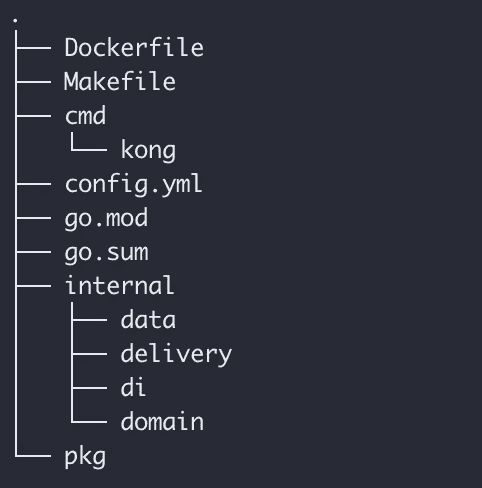
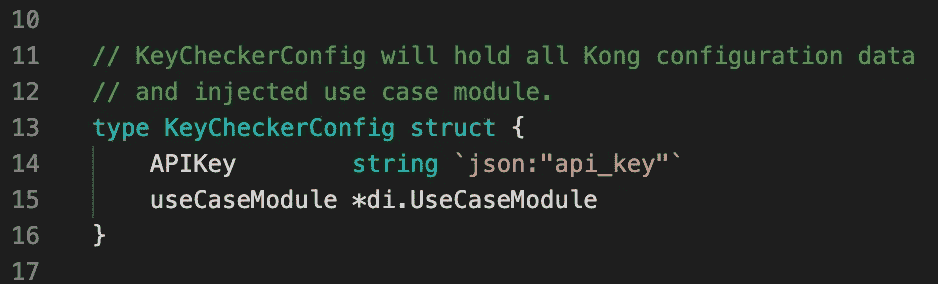
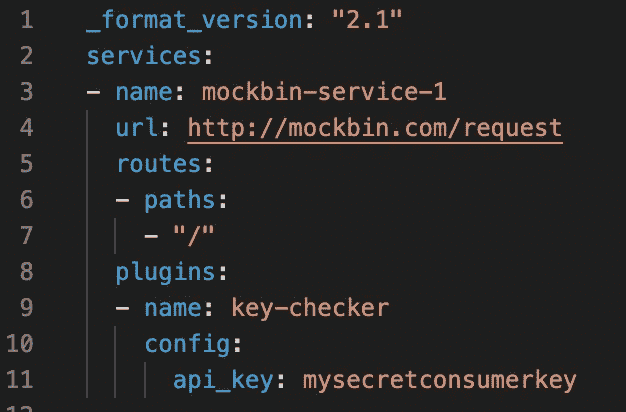
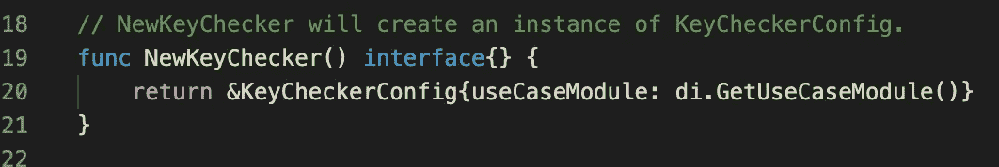
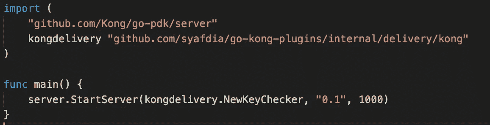
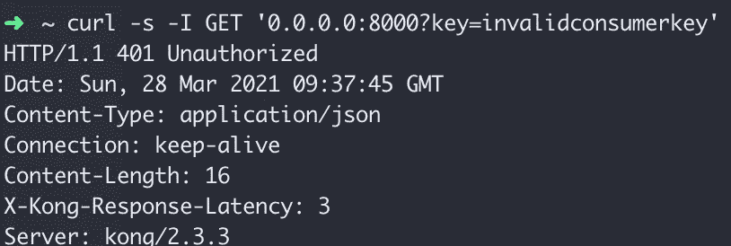
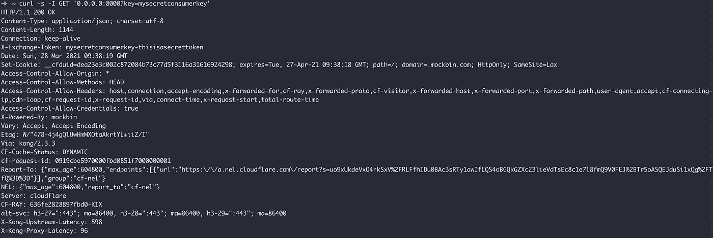

# 孔使用 Go 开发自定义插件

> 原文：<https://levelup.gitconnected.com/kong-custom-plugin-development-using-go-abab906b89b4>


从 2.0 版本开始， [Kong](https://konghq.com/kong/) 宣布将 [Go](https://golang.org/) 作为除 [Lua](http://www.lua.org/) 之外的一种用于 Kong API Gateway 插件开发的支持语言。孔在其官方知识库上为 Go 用户发布了[(PDK)](https://github.com/Kong/go-pdk)。在本文中，我们将尝试使用 Go 为 Kong [2.3](https://docs.konghq.com/enterprise/2.3.x/external-plugins/) 开发和部署定制插件。

我们将使用官方的 [go-plugin-tool](https://hub.docker.com/r/kong/go-plugin-tool) 使用 [Docker](https://www.docker.com/) 构建 Kong 插件，本图使用 1.13 版本进行开发。我们的文档:

```
# Stage 1 - Build plugin
# Pull image from official go-plugin-tool.FROM kong/go-plugin-tool:2.0.4-alpine-latest AS builder # Copy current workspace to container.RUN mkdir -p /tmp/go-plugins/COPY . /tmp/go-plugins/ # Build the plugin.RUN cd /tmp/go-plugins/ && \ apk add make && \ make all # Stage 2 - Create Kong container and add custom plugin# Pull Kong version 2.3 from official repository.
FROM kong:2.3.3-alpine# Copy plugin from build container to Kong container
RUN mkdir /tmp/go-pluginsCOPY --from=builder  /tmp/go-plugins/key-checker /usr/local/bin/key-checker# Copy Kong configuration to Kong container
COPY config.yml /tmp/config.yml# Dump plugin infoRUN /usr/local/bin/key-checker -dump
```

我们使用 Docker [多阶段构建](https://docs.docker.com/develop/develop-images/multistage-build/)来构建和安装我们的插件。首先，我们构建插件，然后我们将新创建的插件和 Kong 配置复制到一个单独的 Kong 容器中。对于这个插件开发，下面是我们的项目结构:



项目结构

结构基于[标准 Go 项目布局](https://github.com/golang-standards/project-layout)(更详细的信息可以参考内嵌链接)，我们所有的插件都会放在`cmd/kong`里面。每个插件都将被编译成独立的可执行二进制文件。而我们的主代码库会放在一个`internal`目录下。我们使用[干净的架构](https://blog.cleancoder.com/uncle-bob/2012/08/13/the-clean-architecture.html)来管理我们的代码库。

基于[孔插件开发文档](https://docs.konghq.com/enterprise/2.3.x/external-plugins/)，有一些契约要在我们的代码上实现。

1.  **定义一个结构类型来保存配置**

我们应该创建一个结构体来保存我们的插件配置，这个结构体的公共属性将被自动填充为 Kong 插件配置。



配置结构

基于上面的结构，`APIKey`属性将用来自孔的`api_key`填充。例如，如果我们使用[孔下面的声明性配置](https://docs.konghq.com/gateway-oss/2.3.x/db-less-and-declarative-config/)，`APIKey`值将`mysecretconsumerkey`。



孔陈述结构

**2。编写一个函数来创建配置结构的实例**

我们应该定义一个函数来创建我们的配置结构的实例，返回类型应该是`interface{}`例如:



用于创建实例的函数

**3。向配置结构添加方法以处理阶段**

我们可以实现在请求处理生命周期的不同点执行的定制逻辑。根据 Kong 文档，在请求/响应生命周期中将执行一些阶段:

**证书:**在 SSL 握手的 SSL 证书服务阶段执行。

**重写:**作为重写阶段处理程序，在从客户端接收到每个请求时执行

**访问**:为来自客户端的每个请求执行，并且在它被代理到上游服务之前执行。

**响应:**在从上游服务接收到整个响应之后，但在向客户端发送任何部分之前执行。

**预读:**每次连接执行一次

**Log:** 每次连接关闭后执行一次。

**4。添加一个** `**main()**` **函数，调用** `**server.StartServer**`

由于我们将把插件编译成独立的可执行文件，我们将使用来自`go-pdk`包的嵌入式服务器，并在我们的主函数上启动服务器。



初始化嵌入式服务器

现在，让我们通过开发我们的自定义插件来动手。我们将开发一个钥匙检查插件。这个插件从 URL 查询参数中获取密钥，并用我们配置中存储的密钥验证给定的密钥。这个简单的插件是受这篇文章[的启发，这个插件将用于我们的学习目的。](https://dev.to/_mertsimsek/go-plugin-development-on-kong-50pb)

我们将创建一个结构来保存配置，并实现`Access`钩子来验证从下游到上游的每个请求。然后，我们应该将查询参数中的密钥与配置中的现有密钥进行比较。如果这个键与我们的配置键不匹配，我们将用 HTTP 401 错误进行响应，如果给定的键与我们的配置键匹配，请求将被转发到上游。

```
// KeyCheckerConfig will hold all Kong configuration data// and injected use case module.type KeyCheckerConfig struct { APIKey        string `json:"api_key"` useCaseModule *di.UseCaseModule} // NewKeyChecker will create an instance of KeyCheckerConfig.func NewKeyChecker() interface{} { return &KeyCheckerConfig{useCaseModule: di.GetUseCaseModule()}}func (conf *KeyCheckerConfig) Access(kong *pdk.PDK) { // Get `key` value from URL query 
    key, err := kong.Request.GetQueryArg("key") if err != nil { kong.Log.Err(err.Error()) } // Validate given `key`, compare it with our key
    // on configuration. Response with 401 if given key doesn't
    // match with our key on configuration ctx := context.Background() respHeaders := make(map[string][]string) respHeaders["Content-Type"] = append(
        respHeaders["Content-Type"], 
        "application/json"
    ) err = conf.useCaseModule.ValidateKeyUseCase.Execute(
        ctx, 
        keychecker.ValidateKeyInput{
            GivenKey: key, 
            ValidKey: conf.APIKey,
        }
    ) if err != nil { switch err { case keychecker.ErrKeyEmpty, keychecker.ErrKeyNotValid: kong.Response.Exit(401, err.Error(), respHeaders) default: kong.Response.Exit(500, err.Error(), respHeaders) } return } // Get exchange token based on given key, and append it to
    // `X-Exchange-Token` header. token, err := conf.useCaseModule.GetTokenUseCase.Execute(
        ctx, 
        key
    ) if err != nil { kong.Response.Exit(500, err.Error(), respHeaders) return } kong.Response.SetHeader("X-Exchange-Token", token)}
```

上面的代码反映了我们的主要逻辑应该在 Access hook 上实现，你可以在这个 GitHub repo [上查看完整版本的代码 https://GitHub . com/syaf dia/go-exercise/tree/master/src/etc/demo-kong-plugin](https://github.com/syafdia/go-exercise/tree/master/src/etc/demo-kong-plugin)。

现在，让我们在自定义的 kong 插件上运行，只需克隆上面提到的 repo，并使用`docker build -t kong-demo`运行构建映像，使用:

```
docker run -ti --rm --name kong-go-plugins \
-e "KONG_DATABASE=off" \
-e "KONG_DECLARATIVE_CONFIG=/tmp/config.yml" \
-e "KONG_PLUGINS=bundled,key-checker" \
-e "KONG_PLUGINSERVER_NAMES=key-checker" \
-e "KONG_PLUGINSERVER_KEY_CHECKER_START_CMD=/usr/local/bin/key-checker" \
-e "KONG_PLUGINSERVER_KEY_CHECKER_QUERY_CMD=/usr/local/bin/key-checker -dump" \
-e "KONG_PROXY_LISTEN=0.0.0.0:8000" \
-e "KONG_LOG_LEVEL=debug" \
-p 8000:8000 \
 kong-demo
```

当我们试图使用一个无效的密钥访问我们的孔时，我们将得到 HTTP 401 响应和主体上的`key is not valid`。但是当我们使用有效的键时，我们将在响应头和响应体上得到 HTTP 200 和`X-Exchange-Token`。



401 来自自定义插件的响应



来自自定义插件的附加 X-Exchange-Token 标头

有了 Kong 2 . x 版本，我们可以使用 Go 构建我们的自定义插件，而从 Kong 2.3 版本开始，每个插件都可以是一个服务，被编译成一个独立的可执行二进制文件。

**参考**:

*   [https://docs.konghq.com/enterprise/2.3.x/external-plugins/](https://docs.konghq.com/enterprise/2.3.x/external-plugins/)
*   [https://dev . to/_ mertsimsek/go-plugin-development-on-kong-50pb](https://dev.to/_mertsimsek/go-plugin-development-on-kong-50pb)
*   [https://medium . com/swlh/creating-a-go-plugin-in-kong-e54a 1315 faaa](https://medium.com/swlh/creating-a-go-plugin-in-kong-e54a1315faaa)