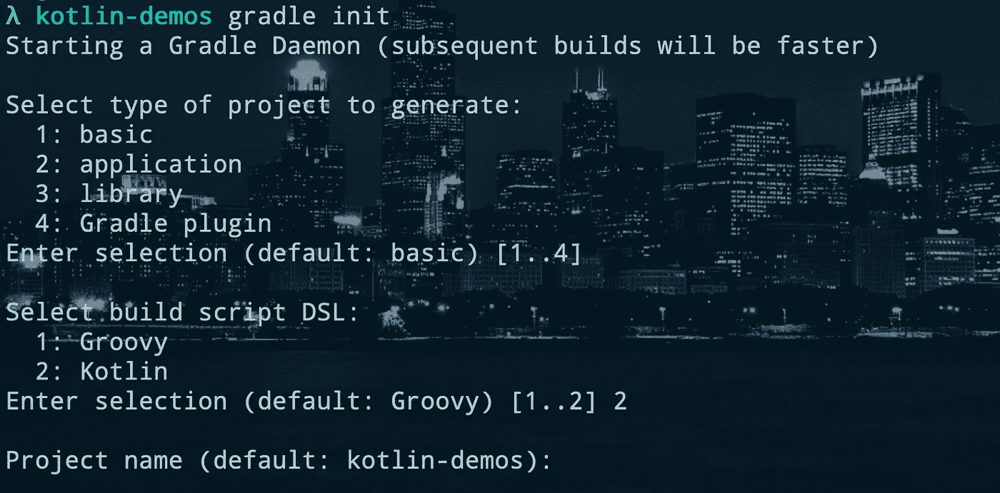
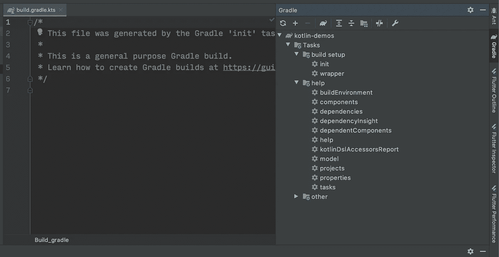
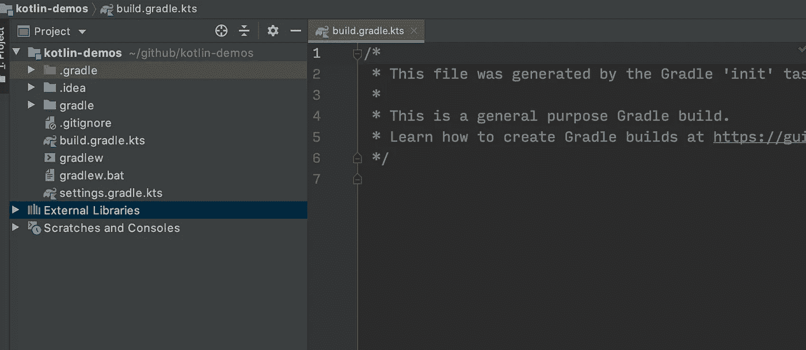
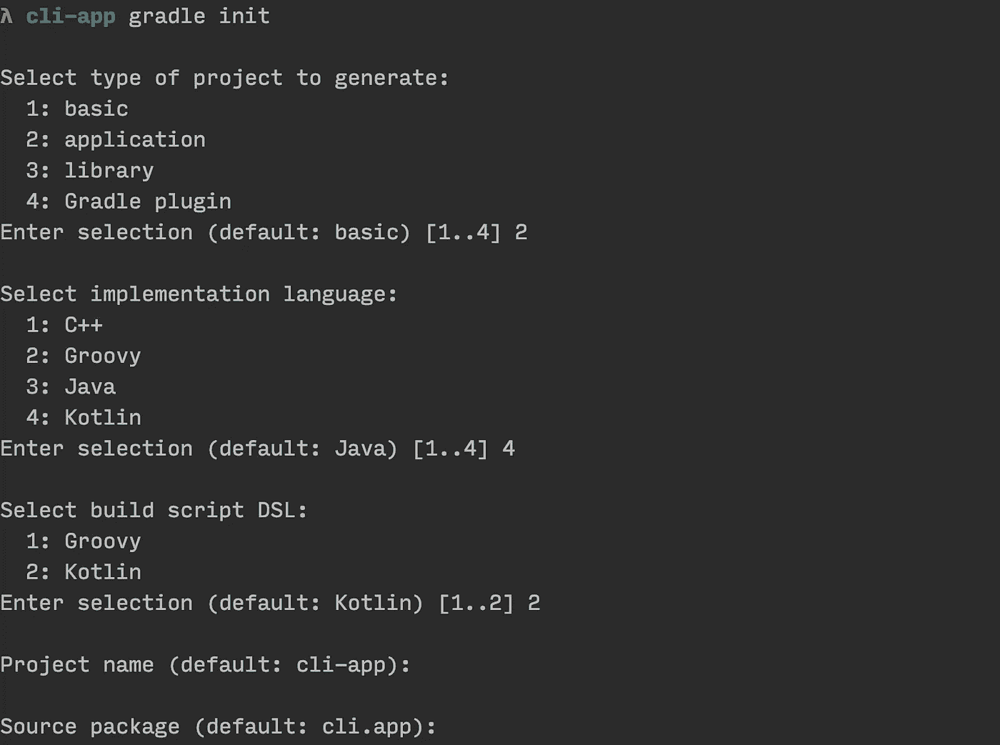
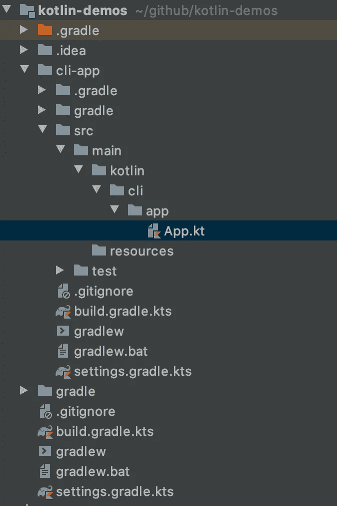
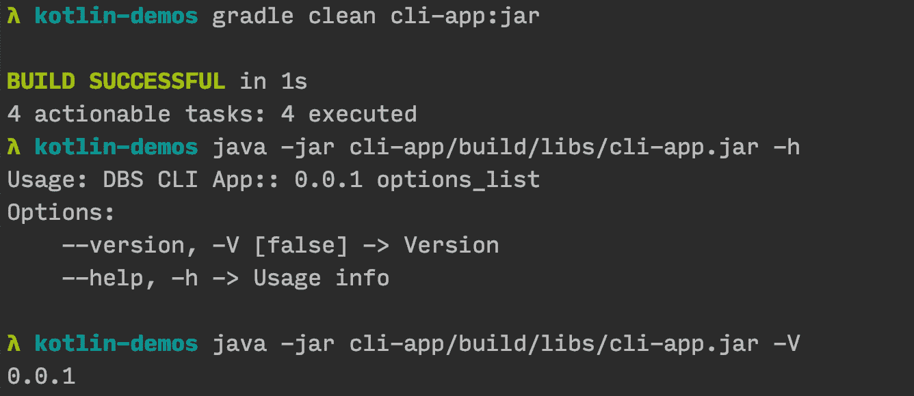
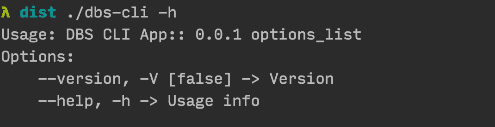

# 使用 kotlinx-cli | Kotlin 初级到高级构建命令行应用程序

> 原文：<https://levelup.gitconnected.com/kotlin-beginner-to-advance-build-real-command-line-tool-using-kotlinx-cli-608bbc6d9a3>


科特林标志

在许多面向对象语言中，编写命令行应用程序是一个挑战。大多数面向对象的语言需要沉重的结构(源代码)来运行一个简单的程序。Java/Kotlin 就是其中之一。在这里，格雷尔来救我们了。

Gradle 是一个帮助我们创建和维护大型应用程序的框架。格拉德太棒了。然而，设置 Gradle 也是一项繁琐的任务。在这里，我将一步一步地展示如何在 Kotlin 中构建一个可伸缩的 CLI(命令行界面)工具。

## 先决条件:

1.  Java 1.8 及以上版本
2.  [Gradle 5.5。](https://gradle.org/install/) 1 及以上(支持 Kotlin DSL 的 Gradle)

## 步骤 1:创建一个多模块的 Gradle 项目

创建一个文件夹，用 Gradle 搭建结构。

```
mkdir kotlin-demos #[your project name]
cd kotlin-demos && gradle init
```



选择基本**【选项 1】**或直接按回车键。之后选择 Kotlin **【选项 2】**作为构建脚本 DSL。您可以输入所需的项目名称。项目名称可以不同于文件夹名称。

初始化完成后，您可以在 IntelliJ(IDE)中打开项目。它将同步 Gradle 项目，您可以在 ide 的右侧看到可用的 Gradle 命令。



**注意:**本教程不需要 IntelliJ。然而，IntelliJ 与 Gradle 一起工作非常方便。

**文件夹结构:**



一旦项目初始化完成，您将看到`settings.gradle.kts`和`build.gradle.kts` 文件。

## **第二步:创建 App 或 CLI 项目，添加 Java 插件**

在创建任何新项目之前，添加依赖项的存储库。它可以与其他模块单独完成。

```
// build.gradle.kts
allprojects **{** *repositories* **{** jcenter() 
    **}
}**
```

现在创建一个模块。

```
mkdir cli-app && cd cli-app
gradle init
```



这里选择如下所述

1.  项目类型申请[选项 2]
2.  语言为科特林语[选项 4]
3.  DSL[选项 2]
4.  休息默认[按回车键]

一旦初始化完成:你将看到带有 cli-app 的目录。



# 需要注意的事项:

在`cli-app/build.gradle.kts`里面，你会看到`kotlin.jvm`这个插件。可以将插件升级到最新的。 `**(While the time writing, kotlin.jvm was 1.3.70)**`

```
plugins **{** id("org.jetbrains.kotlin.jvm").version("1.3.70")
    *application* **}**
```

另外需要注意的是:`*mainClassName*` *在应用配置中。如果您的类名不同，您可以更新确切的类名。*

```
*application* **{** // Define the main class for the application
    *mainClassName* = "cli.app.AppKt"
**}**
```

注意:你仍然不能运行这个项目。

## **第三步:将子模块配置到主项目**

由于我们使用的是命令行，Gradle 在默认情况下不会包含子模块。我们必须在根项目的***settings . gradle . kts***中手动添加。

```
# kotlin-demos/settings.gradle.ktsinclude("cli-app")
```

验证一切工作，并测试运行应用程序。

**运行:** `gradle cli-app:clean cli-app:run`

```
**# output::**
> Task :cli-app:run
**Hello world.**
```

设置更改完成后，您可以执行运行命令并在控制台中查看`Hello World` 。

## **步骤 4:作为独立 CLI 工具运行**

你可以看到输出 *Hello World，*然而，如果没有 Gradle，这个项目将无法独立运行。Gradle Java 插件提供了从源代码生成`.jar`的命令。

**命令:**

**跑:** `java -jar cli-app/build/libs/cli-app.jar`

**说明:**一旦运行 **cli-app:jar** 命令，就可以在`cli-app/build/libs`看到 **cli-app.jar** 。当您试图运行 jar 文件时。您将得到一个错误。

> `no main manifest attribute, in cli-app/build/libs/cli-app.jar`

此错误是由于 jar 文件中缺少清单文件造成的。清单文件是指示 java jar 入口点的文件。它还有一些 jar 的其他元数据，比如包名是什么。它还包含其他库的其他类路径的条目。

## **第五步:添加**构建 jar 任务，创建可执行的 Jar

默认情况下，Gradle Java plugin jar 命令不知道 jar 文件的**主类【入口类】**。对于可执行的 jar，您需要定义主类。你可以通过修改 **build.gradle.kts** 来配置它

首先，让我们为了简化而修改 **App.kt**

```
// cli-app/src/main/kotlin/cli/app/App.kt**object App {
    const val appName = "DBS CLI App"
    const val version = "0.0.1"
}**
fun main(args: Array<String>) {
    *println*(**"${App.appName}:: ${App.version}"**)
}
```

因为我们已经更新了应用程序代码。我们需要为它更新测试用例。

```
// cli-app/src/main/kotlin/cli/app/App.ktclass AppTest {
    @Test fun testAppHasAGreeting() {
        ***assertNotNull*(App.appName, "DBS CLI App")
        *assertNotNull*(App.version, "0.0.1")**
    }
}
```

现在更新 **build.gradle.kts**

```
// cli-app/build.gradle.ktsval jar by *tasks*.*getting*(Jar::class) **{** manifest **{** *attributes*["Main-Class"] = "ktor.demo.AppKt"
    **}** from(*configurations*.*runtimeClasspath*.get().*map* **{** if (**it**.*isDirectory*) **it** else zipTree(**it**) **}**) **{** exclude("META-INF/*.RSA", "META-INF/*.SF", "META-INF/*.DSA")
    **}
}**
```

**构建 Jar:** `gradle clean cli-app:jar`

**运行:** `java -jar cli-app/build/libs/cli-app.jar`

现在您可以使用 **java -jar** 命令运行 CLI

**输出:** `DBS CLI App:: 0.0.1`

## Tada！！您的 CLI 无需任何外部工具即可运行。

现在，您的初始 CLI 工具正在工作。让我们添加 Kotlin 核心库来接受用户的输入。

## 第 6 步:使用 [kotlinx-cli](https://github.com/Kotlin/kotlinx.cli) 添加支持用户输入

是一个帮助解析用户输入并以优雅的方式添加验证的库。`kotlinx-cli`最近发布了稳定版。开发仍在进行中，然而好到足以使用它。

```
// cli-app/build.gradle.kts*repositories* **{** jcenter()
    ***maven*("https://dl.bintray.com/kotlin/kotlinx/")**
**}** *dependencies* **{** // Use the Kotlin JDK 8 standard library.
    *implementation*("org.jetbrains.kotlin:kotlin-stdlib-jdk8")
    ***compile*("org.jetbrains.kotlinx", "kotlinx-cli", "0.2")**... rest
}
```

**打造:**

更新应用程序以接受用户输入并添加`--help`命令。

```
import kotlinx.cli.*
fun main(args: Array<String>) {
    **val parser = ArgParser("${App.appName}:: ${App.version}")
    val version by parser.option(ArgType.Boolean, shortName = "V", description = "Version").default(false)

    // Add all input to parser
    parser.parse(args)

    if(version) *println*(App.version)**
}
object App {
    const val appName = "DBS CLI App"
    const val version = "0.0.1"
}
```

**注意:** `Kotlinx-cli`默认添加帮助命令。要查看所有 API，您可以查看`[kotlinx.cli](https://github.com/Kotlin/kotlinx.cli)`

## **构建并运行:**



是啊！！你做到了。现在您有了一个工作的可执行 jar。我们可以清理我们的 CLI 工具。因为用户很难记住所有这些 java 命令。让我们制作一个可执行的 bash 文件。

## **步骤 7:为分发文件创建 Bash**

创建一个 bash 文件`scripts/dbs-cli`并赋予执行权限。

```
mkdir scripts && touch scripts/dbs-cli && chmod +x scripts/dbs-cli// scripts/dbs-cli
## Add command in scripts/dbs-cli#/usr/bin
java -jar lib/cli-app.jar $@
```

在根目录`build.gradle.kts`中创建一个包(zip)任务。这将把所有需要的文件移动到`dist`文件夹。

```
// kotlin-demos/build.gradle.ktssubprojects **{** *tasks*.*register*<Copy>("packageDistribution") **{** dependsOn("jar")
        from("${*project*.*rootDir*}/scripts/dbs-cli")
        from("${*project*.*projectDir*}/build/libs/${*project*.*name*}.jar") **{** into("lib")
        **}** into("${*project*.*rootDir*}/dist")
    **}
}**
```

现在我们可以运行定制的 Gradle 任务来构建 jar 并转移到 dist。

**构建:**

**运行:**

运行上述命令后，您可以看到 CLI 工具帮助菜单。



**感谢支持！！干杯！！**🙏👍🏻🥂

所有的源代码都可以在我的 GitHub 上找到

[](https://github.com/deepakshrma/kotlin-demos) [## deepakshrma/kotlin-demos

### 在 GitHub 上创建一个帐户，为 deepakshrma/kotlin-demos 的开发做出贡献。

github.com](https://github.com/deepakshrma/kotlin-demos)