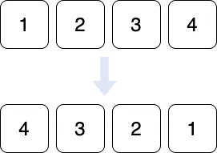
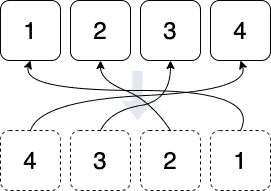
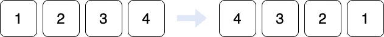

# Kotlin 系列 asReversed() vs reversed()

> 原文：<https://levelup.gitconnected.com/kotlin-collection-asreversed-vs-reversed-6fb0e01f1dd4>

## 学习科特林语

## 他们是相同的，但不同的


莎伦·麦卡琴在 [Unsplash](https://unsplash.com?utm_source=medium&utm_medium=referral) 拍摄的照片

在浏览收藏品时，我注意到有`asReversed()`和`reversed()`。困惑，所以我探索了解他们的区别。

# 相似之处

对于`reversed()`和`asReversed()`，您将获得与原始提供的列表相反的列表。即

```
val myList = listOf(1, 2, 3)
println(myList.reversed())    // [3, 2, 1]
println(myList.asReversed())  // [3, 2, 1]
```

简单的😊

# 差异

好的，这就是我们要找的

## 1.适用的集合类型

`reversed()`可以应用于任何*数组、列表、*和*可变列表*。

`asReversed()`只能应用于*列表*和*可变列表*

## 2.生成一个新列表或只是一个参考列表

列表的`reversed()`实际上是生成一个新的反向列表



因此，如果我们在此之后修改了原始列表，反转后的列表将保持原样。

列表的`asReversed()`不是生成一个新列表，而是一个指向原始列表的反向列表——它在适当的位置反向它。



因此，如果我们在那之后修改原始列表(假设它是可变的),反转的列表也会被修改。

## 3.返回不可变或可变类型

一个列表的`reversed()`将总是生成一个不可变列表，不管原始列表是可变的还是不可变的。所以结果反转列表不能改变(除非转换成可变类型)。

列表的`asReversed()`将根据原始类型返回类型。如果原始列表是可变的，那么反向列表也是可变的；如果原始列表是不可变的，那么反向列表也是不可变的。

## **4。数组更细微的区别。**

对于数组，有`reversed()`和`reversedArray()`。

`reversed()`同上，返回一个列表。

要返回一个数组，请使用`reversedArray()`。

**更新:**

除了`reversed()`、`asReversed()`、`reversedArray()`之外，还有`reverse()`。

`reverse()`的行为与`reversed()`不同。不是生成新的列表或数组，而是反转原始数组的元素。这只适用于`mutableList`和`array`。



# asReversed on List 有什么用？

我们知道`List`的默认性质是不可变类型。如果我们从中生成`asReversed()`，就会生成一个不可变的`List`引用原始列表。

所以问题是，既然我们无论如何都不能改变原始的(不可变的)`List`，那么使用`asReversed()`和`reversed()`不是会产生相同的结果吗？即不能改变的反向列表。

## 答案

从技术上来说，他们在这方面是一样的。然而，有一个微妙的区别如下。

```
val original = mutableListOf('a', 'b', 'c', 'd', 'e')
val originalReadOnly = original as List<Char>
val reversedA = originalReadOnly.asReversed()
val reversedB = originalReadOnly.reversed()

println(original)  // [a, b, c, d, e]
println(reversedA) // [e, d, c, b, a]
println(reversedB) // [e, d, c, b, a]

// changing the original list affects its reversed view
original.add('f')
println(original)  // [a, b, c, d, e, f]
println(reversedA) // [f, e, d, c, b, a] this is altered as well.
println(reversedB) // [e, d, c, b, a]

original[original.lastIndex] = 'z'
println(original)  // [a, b, c, d, e, z]
println(reversedA) // [z, e, d, c, b, a] this is altered as well.
println(reversedB) // [e, d, c, b, a]
```

如果我们有办法改变(不可变的)`List`(即上面的`originalReadOnly`)，那么它们的行为将会不同。上面的代码显示我们可以通过改变原始的`MutableList`来改变(不可变的)`List`。

感谢阅读。你可以在这里查看我的其他话题[。](https://medium.com/@elye.project/)

你可以在这里订阅或者关注我的[](https://medium.com/@elye.project)**[*Twitter*](https://twitter.com/elye_project)*[*脸书*](https://www.facebook.com/elye.project/) *，以及* [*Reddit*](https://www.reddit.com/user/elyeproj/) 获取关于移动开发、媒介写作等相关话题的小技巧和学习。~Elye~***