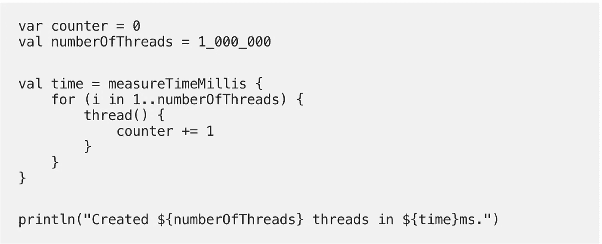
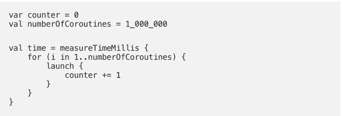

# Kotlin 协程(第 1 部分)-基础知识

> 原文：<https://levelup.gitconnected.com/kotlin-coroutines-basics-part1-617389b168f8>

凯文·Ku 在 [Unsplash](https://unsplash.com?utm_source=medium&utm_medium=referral) 上的照片

# 协程简介

在我的[之前的](https://medium.com/@faizanwar027/asynchronous-programming-in-android-22965c11cf34)系列中，我讨论了 android 中异步编程的需要以及开发人员实现它的各种选择。作为这个新系列的一部分，我想深入研究协程，并评估它如何给代码增加价值。

让我们从理解协程背后的基本概念开始。每次我们运行一个程序，它都会启动一个进程，在这个进程中，计算机会创建一个叫做**的主例程**。这个主例程是任何程序中最重要的部分，因为程序中的所有代码都在这里执行。我们可以说 main 函数是我们程序的入口点，是这个主例程的一部分。随着程序变得越来越大，我们最终会编写越来越多的函数来完成工作。当从主方法调用这些方法时，就会创建子例程。

子例程就是嵌套在主例程中的例程。计算机将所有这些例程和子例程放在一个调用栈中，调用栈的主要工作是监视哪个例程当前正在运行以及它是如何被调用的。当这个例程结束运行时，它从堆栈中弹出，控制权传递给调用方例程。当整个堆栈变空时，表明我们的程序已经执行完毕。

有趣的是，调用一个子程序是一个**阻塞调用**。正是对这个函数的调用导致**暂停执行**，即调用方不会恢复执行，直到被调用的函数执行完毕。但是正如我们许多人所知，android 是一个单线程框架，我们严重依赖**回调**将长时间运行的操作结果返回给我们(这涉及到相当长的等待时间)。协程旨在使这些阻塞调用成为非阻塞调用。在我们了解更多之前，让我们看看 Google 文档是怎么说的:

> 一个*协程*是一个并发设计模式，你可以在 Android 上使用它来简化异步执行的代码。[协同程序](https://kotlinlang.org/docs/reference/coroutines/coroutines-guide.html)是在版本 1.3 中添加到 Kotlin 中的，它基于其他语言中已有的概念。
> 
> 在 Android 上，协程有助于解决**两个**主要问题:
> 
> 管理长时间运行的任务，否则这些任务可能会阻塞主线程并导致应用程序冻结。
> 
> **提供*主安全*，或者从主线程安全调用网络或磁盘操作。**

# 协同程序的性能

我们在 android 中已经有了执行长时间运行任务的机制，比如线程。那么，为什么我们需要协程来完成同样的工作呢？

在上面的代码中，我创建了一个用 0 初始化的计数器，线程计数为 1，000，000。这个循环我运行了一百万次，每次迭代我都创建一个新线程来完成一个简单的任务。在我的机器(Macbook 2018，16gb RAM，2.9Ghz 英特尔 I7 处理器)上，代码块完成执行需要 **33.6 秒**。

让我们试着运行相同的代码，但不是在每次迭代中创建一个新的线程，而是创建新的协程来完成相同的工作。

令人惊讶的是，上面的代码块在同一台机器上只花了不到**一秒**的时间就完成了！

# 理解线程和协程

为了理解这种性能差异，我们需要理解线程和协程是如何工作的。线程被操作系统抢先调度。支持**本机线程**的语言可以在操作系统线程**内核线程**上执行其线程(用户线程)。每个进程至少有一个内核线程。内核线程类似于进程，只是它们在自己的进程中与该进程中的所有其他线程共享内存空间。一个进程“拥有”所有分配给它的资源，如内存、文件句柄、套接字、设备句柄等。，并且这些资源都在其内核线程之间共享。

操作系统调度程序是内核的一部分，它在一定时间内运行每个线程(在单处理器机器上)。调度程序为每个线程分配时间(时间分片)，如果线程在这段时间内没有完成，调度程序会先发制人(中断它并切换到另一个线程)。

线程消耗资源。在 JVM 中，每个线程都有自己的堆栈，通常大小为 1MB。64k 是 JVM 中每个线程允许的最小堆栈空间。尽管名字如此，线程并不是自由的，因为它们使用资源，比如每个线程需要自己的堆栈、线程本地存储(如果有的话)，以及线程调度/上下文切换/CPU 缓存失效的成本。Mac OS 只允许一个进程分配大约 2000 个线程，Linux 为每个线程分配 8MB 堆栈，并且只允许物理 RAM 中容纳的线程数。因此，线程是最大的权重(就内存使用和上下文切换时间而言)。

协程是协同切换的，这意味着程序员(可能还有编程语言及其运行时)控制切换的发生时间。它可以用来实现协作功能。它们不是在内核线程上运行并由操作系统调度，而是在单个线程中运行，直到它们**让步或完成**，让位于程序员确定的其他函数。

> 协程更像是一个线程管理框架，在创建新资源之前，系统的现有资源得到了有效的利用。这是通过给程序员和相关的底层语言更多的控制权来实现的。

对于相同的作业，使用协程而不是线程时，这些是提高性能的一些因素。在下一节中，我将分享一些展示协程功能的例子。

# 使用协程

正如我们在上面的代码片段中看到的，coroutine 在 launch{}中使用 lambda 表达式获取了一段代码。令人惊讶的是，这些代码并没有被立即执行，而是被添加到一个队列中，这个队列稍后会返回一个叫做**的作业。**让我们再次启动我们的协程，了解更多信息。

如果我们运行上面的代码，我们会在控制台中看到“嘿，协程”作为输出，在 500 毫秒的延迟后，我们会看到“我回来了！”。有趣的是，这里所涉及的线程并没有**休眠**，相反，管理它的相应协程**会挂起**本身，并将线程移交给线程池以供其他任务执行。因此更有效地管理系统的处理资源。

还可以通过以下方式使用协程来创建依赖关系:

正如我们注意到的，job 1 有协程启动。懒惰意味着它只会在需要的时候被调用。这里要打印的语句是“Top ”,然后调用 job1.join()打印“Tip ”,最后是“Top”。

有时候，我们会遇到一些长时间运行作业依赖于其他作业的情况。使用协程，甚至可以在作业之间创建父子关系，这可以确保父作业只有在所有子作业都执行完之后才会终止。

在这里，您启动一个协程，并将其作业分配给 parentJob 引用。然后，使用前一个作业作为协程上下文启动另一个协程。这是可能的，因为作业抽象实现了 CoroutineContext。在幕后，您在这里传递的 CoroutineContext 与当前活动的 coroutine scope—emptycoroutine context 中的一个进行了合并。如果您运行上面的代码，您可以看到 parentJob 是如何拥有子级的。如果您运行相同的代码，删除第二个协程构建器的上下文，您可以看到父子关系没有建立，子代也不存在。

Coroutine 还负责处理某些作业在满足某些标准之前无法完成的情况。它具有内置的重复和重试功能，有助于以正确的预期方式完成作业。

当您执行这段代码时，您会注意到“正在加载数据…在最终成功加载之前，请等待”几次。因此，您可以使用 Kotlin 标准库中的 **delay()** 和 **repeat()** ，我们可以创建一个机制，在满足逻辑条件之前尝试运行一些代码几次。在网络回退和重试逻辑中实现这一点是非常强大的。

# 下一步是什么

在这一部分中，我们介绍了协程中涉及的基本概念，以及它为开发人员完成工作提供的一些强大功能。您已经准备好启动尽可能多的协程作业了！但这只是 Kotlin 协同程序 API 的一小部分。到目前为止，我们只启动了作业，即您需要完成的工作。协程的真正威力在于挂起函数，其中异步代码以顺序方式编写，允许在没有回调的情况下接收结果。请继续关注，我很快会带着这个系列的下一部分回来。谢谢你，祝你编码愉快。

 [## Kotlin 协程——挂起的函数(第 2 部分)

### 在上一篇文章中，我们从较高的层面观察了协程，并看到了它与……

medium.com](https://medium.com/@faizanwar027/kotlin-coroutines-suspended-functions-part-2-8e9044f2959c)