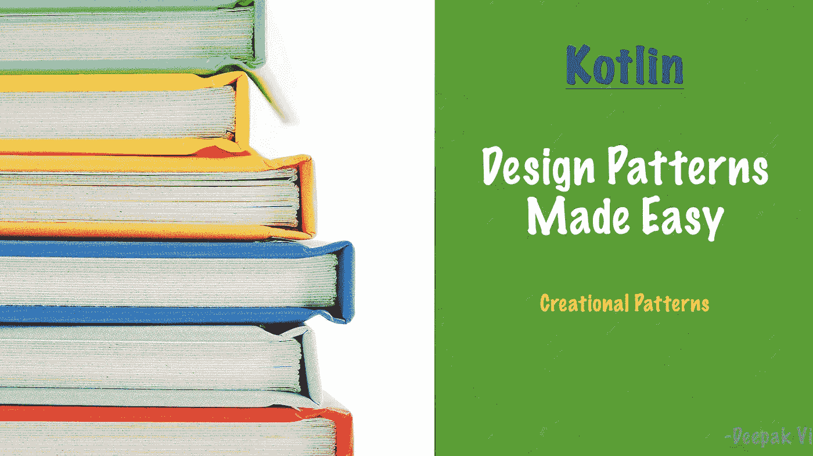

# 科特林设计模式变得简单|创造模式

> 原文：<https://levelup.gitconnected.com/kotlin-design-pattern-in-easy-way-creational-patterns-6d49d3809e03>



[https://www . ITL . cat/wall view/mrw jir _ education-壁纸-高清-学习-背景/](https://www.itl.cat/wallview/mRwJiR_education-wallpaper-hd-learning-backgrounds/)

提高编程语言总是具有挑战性的。你需要经验和技能来提高编程语言。学习数据结构及其设计模式是提高技能的许多方面中的一小部分。
我有科特林的先验知识。然而，最近我又开始用 Kotlin 编码了。所以我决定学习 Kotlin 中的设计模式，它可以帮助我提高我的编码水平。我阅读了多篇文章并观看了教程，提出了下面给出的一些设计模式。
**注:**本文不涉及设计模式的理论和优缺点。本文只讨论如何在实际的编码问题中使用这些设计模式。我试着列出几篇参考文章。欢迎在评论中添加更多内容。

## 介绍

设计模式是解决一些常见问题的可重用代码。这是我的定义。如果你注意到这里，我们谈论的是可重用的代码，可以一次又一次地用来解决一个常见的问题。添加这段代码看起来像是编写额外的代码。然而，从长远来看，它减少了项目代码和由重复冗余代码引起的错误。

## 分类

设计模式可以分为三个子类别。

1.  [创建模式](https://en.wikipedia.org/wiki/Creational_pattern):如何创建类的对象
2.  [结构模式](https://en.wikipedia.org/wiki/Structural_pattern):如何组合乐高建造一艘船(类比)
3.  [行为模式](https://en.wikipedia.org/wiki/Behavioral_pattern):如何与对象沟通

*每个子类中都有大量的设计模式。我们不会一一介绍。在这篇文章中，我将尝试涵盖 Kotlin 中的几个主要创作模式。*

## 1.构建器模式

**构建器模式**是构建**复杂对象**的另一种方式。我们用一个给定的例子来理解。让我们建立一个汽车经销商软件。

输出:

```
Car{type='Ford', model='Focus', color='red', speed=0}
Car{type='Toyota', model='Auris', color='blue', speed=0}
Car{type='Volkswagen', model='Golf', color='green', speed=0}
```

给出的例子是用 Java 编写的。在上面的例子中，有一个 Car 类，它公开了多种属性，如类型、型号、颜色和速度。如果我们想创建一辆默认速度(10)和颜色(“黑色”)的汽车呢？我们必须修改和添加多个[重载的构造函数](https://www.javatpoint.com/constructor-overloading-in-java)。这也被称为[伸缩构造器问题](http://www.javabyexamples.com/telescoping-constructor-in-java)。

如你所见，我们的工作代码有多个重载的构造函数。我们可以使用**构建器模式**来最小化这个问题。

如果您运行上面的代码，您将得到与构造函数重载代码相同的输出。这段代码可能看起来很冗长。然而，这段代码解决了多个问题，如**不变性**、**可读性**、**易用性**。

现在你可能会问，我以为这篇文章是从 Kotlin 的设计模式开始的。但是我在这里没有看到一行 Kotlin 代码。我的回答是请耐心等待。

如果我们必须用 Kotlin 写上面的代码。

输出:

```
CarKt(type='Ford', model='Focus', color='red', speed=100)
CarKt(type='Toyota', model='Auris', color='blue', speed=10)
CarKt(type='Volkswagen', model='Golf', color='black', speed=10)
```

只有几行代码和 Kotlin 中的[默认值，才能处理构造函数重载。在本例中，您不需要在**中创建一个构建器类。还可以使用命名值来避免传递给构造函数的参数的顺序。**](https://kotlin-quick-reference.com/102a-R-constructors-default-values.html)

## 2.单一模式

Singleton 模式确保在一个给定的应用程序中一个类只有一个实例。单体模式主要用于创建配置，如应用程序中的对象。我就不像构建器模式那样去详细解释了。此外，单例模式有许多变体。你可以在[singleton-design-pattern-in-Java/](https://howtodoinjava.com/design-patterns/creational/singleton-design-pattern-in-java/)阅读更多内容。下面是 Java 实现的示例代码

在上面的例子中，我们正在检查一个 LazySingleton 应用程序的实例。上面的代码也在基于线程的应用程序中处理和工作。

如果你必须用 Kotlin 实现同样的代码。代码将如下所示

Kotlin 没有**静态关键字**。要创建一个静态方法，你需要创建一个**伴随对象**。要阅读更多关于**伴随对象**的信息，请参考[对象声明. html #伴随对象](https://kotlinlang.org/docs/object-declarations.html#companion-objects)。

要创建一个 singleton 对象，你不必像在 Java 中那样在 Kotlin 中遵循相同的模式。Kotlin 为您提供了一种更简单的创建单例类的方法。它叫做**对象类**。

## 3.工厂模式

工厂模式处理基于因素/条件的子类的创建。你可以认为一个工厂类是一个提供**帮助器方法**来基于参数生成和排列一个对象并返回一个**具体子类对象**的类。让我们来看看 **CarFactory** 的 Java 实现。

**注:**示例代码摘自[implementing-factory-design-pattern-in-Java/](https://howtodoinjava.com/design-patterns/creational/implementing-factory-design-pattern-in-java/)

在上面的例子中，你可以看到 **CarFactory** 有一个帮助创建汽车的 helper 方法。工厂模式有更多的变化。您也可以使用*工厂模式作为构建器模式*的替代。在那里，您将使用工厂方法构建一个复杂的对象。

同样的代码可以用 Kotlin 编写如下。

## 4.抽象工厂模式

抽象工厂模式是工厂模式的另一个抽象层。抽象工厂模式允许代码基于一些外部配置或设置创建不同的工厂助手类。我就不细说了。你可以在这里阅读抽象工厂模式。

## 结论

正如我们所见，有许多模式和变化。每个模式对于不同的用例都是有用的。同时，很难在一篇文章中涵盖所有模式。所以我决定分成多篇文章。希望你喜欢这篇文章，并希望这将有助于你的日常编码。

**参考文献:**

1.  [https://howtodoinjava . com/gang-of-four-Java-design-patterns/](https://howtodoinjava.com/gang-of-four-java-design-patterns/)
2.  [https://en.wikipedia.org/wiki/Software_design_pattern](https://en.wikipedia.org/wiki/Software_design_pattern)
3.  [https://www.baeldung.com/java-classes-objects](https://www.baeldung.com/java-classes-objects)
4.  [https://www.javatpoint.com/constructor-overloading-in-java](https://www.javatpoint.com/constructor-overloading-in-java)
5.  [http://www . javaby examples . com/telescoping-constructor-in-Java](http://www.javabyexamples.com/telescoping-constructor-in-java)
6.  [https://kot Lin-quick-reference . com/102 a-R-constructors-default-values . html](https://kotlin-quick-reference.com/102a-R-constructors-default-values.html)
7.  [https://kot linlang . org/docs/object-declarations . html # companion-objects](https://kotlinlang.org/docs/object-declarations.html#companion-objects)