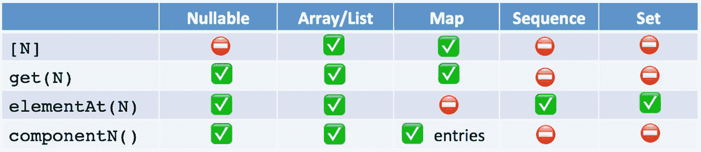

# Kotlin 有 4 种方法来访问集合元素！

> 原文：<https://levelup.gitconnected.com/kotlin-has-4-ways-to-access-the-collection-element-1cf20cfdd0ed>

## 学习 Kotlin 编程

## 你有`[ ]`、`get`、`elementAt`和`componentN`。用哪个？


图片由[丹妮卡坦尤科](https://unsplash.com/@danidums)在[喷溅](https://unsplash.com/photos/53rr-FWu2P8)

如果您必须使用 Kotlin 集合，您可能以前就访问过它的元素。你是怎么做到的？下面用哪个？

1.  `val value = myCollection[0]`
2.  `val value = myCollection.get(0)`
3.  `val value = myCollection.elementAt(0)`
4.  `val value = myCollection.component1()`

> 有 4 种方法？！他们有什么不同？

# 1.方括号[ ]方法

这是默认的推荐方法。它可用于列表、数组和映射。即

```
val listFirstItem = list[0]    // list = listOf(1)
val arrayFirstItem = array[0]  // array = arrayOf(1)
val mapWithKey0 = map[0]     // map = mapOf(0 to 1)
```

但是，它不能用于序列

```
// Compile Error!
val sequenceFirstElement = sequence[0]  // sequence = sequenceOf(1)
```

此外，它不能用于可空列表、数组或映射

```
// Compile error, as all of them are nullable.val listFirstItem = list[0]    // list: List<Int>? = listOf(1)
val arrayFirstItem = array[0]  // array: Array<Int>? = arrayOf(1)
val mapWithKey0 = map[0]  // map: Map<Int, Int>? = mapOf(0 to 1)// Neither can we do below. It also compile errorval listFirstItem = list?[0]    // list: List<Int>? = listOf(1)
val arrayFirstItem = array?[0]  // array: Array<Int>? = arrayOf(1)
val mapWithKey0 = map?[0]  // map: Map<Int, Int>? = mapOf(0 to 1)
```

# 2.get 方法

括号方法虽然简洁，但它不处理可空集合。

所以与其这样做

```
list?.let { val listFirstItem = it[0] }
```

我们可以

```
val listFirstItem = list?.get(0)
```

所以，下面的一切都会起作用。

```
val listFirstItem = list?.get(0)    // list: List<Int>?
val arrayFirstItem = array?.get(0)  // array: Array<Int>?
val mapWithKey0 = map?.get(0)       // map: Map<Int, Int>?
```

然而，这对于 Sequence 仍然不起作用

```
val sequence = sequenceOf(1)// Compile Error!
val sequenceFirstElement = sequence.get(0)
```

# 3.基本方法

序列有什么特别的？它类似于 List，但处理方式不同。详情请看下面。

[](https://medium.com/@elye.project/kotlin-slow-list-and-lazy-sequence-61691fc974c5) [## 科特林:慢列表和懒惰序列

### 从 Java 7 到 Kotlin，我们很高兴我们可以轻松地在列表中包含集合操作符并链接它们…

medium.com](https://medium.com/@elye.project/kotlin-slow-list-and-lazy-sequence-61691fc974c5) 

为了得到序列的一个元素，我们将使用`elementAt`

```
val sequence = sequenceOf(1)
val sequenceFirstElement = sequence.elementAt(0)
```

类似地，我们也可以对列表和数组使用`elementAt`。

```
val listFirstItem = list.elementAt(0)    // list = listOf(1)
val arrayFirstItem = array.elementAt(0)  // array = arrayOf(1)
```

> 虽然他们不是首选，因为本质上在引擎盖下，它是`get`。并且使用`[]`更加简洁。

然而，这对于 map 是不允许的，因为`elementAt`在语义上不是描述访问键值元素的正确方式。

```
// Compile error
val mapWithKey0 = map.elementAt[0]     // map = mapOf(0 to 1)
```

# 4.组件方法

如果你阅读 Kotlin [集合](https://kotlinlang.org/api/latest/jvm/stdlib/kotlin.collections/component1.html)文档，你会发现有`collection1()`、`collection2()`、`collection3()`、`collection3()`和`collection5()`。

似乎适用于列表和数组。

如果你看到引擎盖下的代码，本质上它只是`get(0)`、`get(1)`、`get(2)`、`get(3)`和`get(4)`。那是为了什么？

嗯，它不是用于正常的使用，而是用于列表/数组的析构。例如

```
val list = listOf(1, 2, 3, 4, 5)
val (a, b, c, d, e) = list// a=1, b=2, c=3, d=4, e=5
```

如果你尝试

```
// Error
val list = listOf(1, 2, 3, 4, 5, 6)
val (a, b, c, d, e, f) = list
```

它将错误说明`Destructuring declaration initializer of type List<Int> must have a 'component6()' function`

要修复它，只需创建如下的扩展函数`component6()`

```
private operator fun <E> List<E>.**component6**(): E {
    return get(5)
}
```

嗯，它似乎很有限，我们不太可能用它来析构一个列表或数组。

我们几乎没有意识到，实际上这种方法也被用来析构映射条目的键值。

[](https://kotlinlang.org/docs/reference/multi-declarations.html#example-destructuring-declarations-and-maps) [## 析构声明

### 有时，将一个对象析构成若干个变量是很方便的，例如:这种语法称为…

kotlinlang.org](https://kotlinlang.org/docs/reference/multi-declarations.html#example-destructuring-declarations-and-maps) 

当我们做的时候

```
for ((key, value) in map) {
 // do something with the key and the value
}
```

我们实际上使用了下面的底层扩展函数来进行析构。

```
operator fun <K, V> Map<K, V>.iterator(): Iterator<Map.Entry<K, V>> 
    = entrySet().iterator()
operator fun <K, V> Map.Entry<K, V>.**component1**() = getKey()
operator fun <K, V> Map.Entry<K, V>.**component2**() = getValue()
```

我们不太可能在日常生活中使用它，但很高兴知道这是什么。

> 感谢在这部分学习中提供的答案。

[](https://stackoverflow.com/a/61708884/3286489) [## Kotlin 系列的“组件 1”到“组件 5”有什么用？

### 这些允许析构声明。在问题链接的页面下方，它解释说…

stackoverflow.com](https://stackoverflow.com/a/61708884/3286489) 

总之，我提供一个简单的参考表。

**更新:添加** `**set**` **，因为** `**set**` **对元素的访问与** `**sequence**`相同



感谢阅读。你可以在这里查看我的其他话题[。](https://medium.com/@elye.project/)

关注我关于 [*中*](https://medium.com/@elye.project)*[*推特*](https://twitter.com/elye_project)*[*脸书*](https://www.facebook.com/elye.project/)*或 [*Reddit*](https://www.reddit.com/user/elyeproj/) 关于移动开发等相关话题的小技巧和学习。~Elye~***