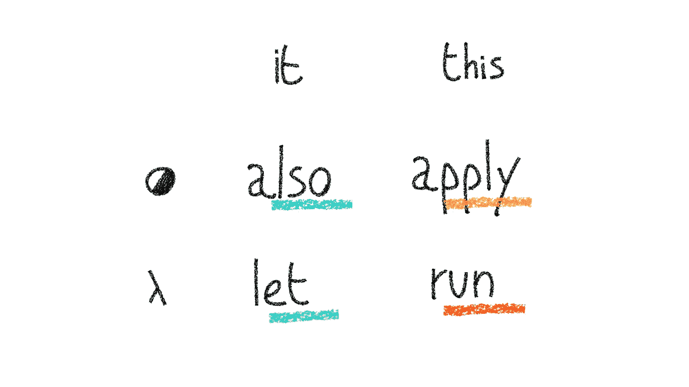

# 科特林示波器功能:天赐指南。

> 原文：<https://levelup.gitconnected.com/kotlin-scope-functions-the-god-sent-guide-4930533874de>

照片由[大卫·皮斯诺伊](https://unsplash.com/@davidpisnoy?utm_source=medium&utm_medium=referral)在 [Unsplash](https://unsplash.com?utm_source=medium&utm_medium=referral) 上拍摄

> **TL；DR；备忘单在这一页的末尾。**

> “我想，如果你唯一的工具是一把锤子，那么把一切都当成钉子是很有诱惑力的。”

正式名称为[金锤](https://en.wikipedia.org/wiki/Law_of_the_instrument)法则的美国心理学家亚伯拉罕·马斯洛创造了这个简单而真实的原则，它贬低了在解决问题的过程中对单一工具的过度依赖，支持一个人使用更多的工具来优雅而精确地解决问题。

JetBrains 在开发 Kotlin 的过程中发挥了最大的作用，为开发人员提供了几十把精密的瑞士刀，以正确而严格地处理各种情况。

一个很好的例子是语言标准库提供的广泛的[作用域函数](https://kotlinlang.org/docs/reference/scope-functions.html#:~:text=OSGi-,Scope%20Functions,it%20forms%20a%20temporary%20scope.)。很少有语言能够展示这一整套工具以及对动态范围和对象操作的控制。

但是，特别是，开发人员被提供了一堆不同的锐利工具，用于非常相似的用例。虽然你是一个强有力的盟友，但你需要负责任，确保正确理解范围函数并正确使用它们。

关于这个主题，网上有很多文档和代码。然而，对于选择哪一个函数最好，并没有官方明确的指导方针，这取决于你所处的环境。事实上，在语法语义正确性的范围内，一个作用域函数对另一个作用域函数的使用有点武断。因此，您必须了解如何充分利用它们，并根据您/您的团队的偏好来决定您的项目编码风格。

# 从什么开始作用域函数？

我们将暂时搁置严格的定义，我将这样说:使用范围函数实际上是一种强大、干净和简洁的编码方式。他们的能力是把重复的、多余的代码变成诗歌。

Kotlin 中的那些函数是`run`、`let`、`apply`、&、`also`。

他们允许你用物品变魔术。你可以在任何你喜欢的对象上调用*作用域函数，因为它们都是[扩展函数](https://kotlinlang.org/docs/reference/extensions.html)和[通用函数](https://kotlinlang.org/docs/reference/generics.html)。因为在科特林，一切都是物体，所以他们是完美的一对。*

另一个关键概念是，有时你可以用多种方式做同一件事。我们当然可以争辩说，run、`let`、`also`、&、`apply`都将在技术上为你完成这项工作，因为它们都解决了一个类似的问题，但方式略有不同。

# 代码示例。

考虑下面的语法，它应该创建一个窗口并用它做一些琐碎的操作。

让我们感到特别不安的是，我们有很多重复的代码。数一数`window`出现的次数。我们甚至不得不把`window.header.buttons`写了三遍。

那是令人难以忍受的多余和重复。让我们用范围函数来增加趣味。

这是一个很大的进步。我们现在可以开始看到作用域函数的影响:由于我们的`apply`块，`this`指向一个不同的作用域。我们现在有了一个主编辑块来*应用`window`对象内部的*变化。为了使`add`函数循环三次，我们还使用了`run`(我们使用了`run`而不是`apply`，因为我们不关心结果)。

仍有一些需要改进的地方:

*   在创建了`ApplicationWindow`之后，可以内联`apply`调用。
*   前缀`this`是多余的。
*   为了更好的语法，我们可以将`show()`函数移到`also`块中。

瞧。完全相同的结果，但代码结构却大不相同。

这是一个例子，通过将这些工具添加到您的腰带上，您可以为您的代码带来实质性的变化。

# 引擎盖下:让&申请。

我们现在将直接通过查看它们的源代码来分解`let`和`apply`(它们是最不同的扩展函数，就像`run`对于`also`)的行为，以充分理解使它们工作的机制和部件。然后我们可以整合`run`和`also`来区分基于那些变化部分的作用域功能，并找出哪一个应该用于什么。

## 让

(请注意，我删除了一些不感兴趣的代码，以便专注于 let 的内容)

1.  泛型类型声明`<T, R>`意味着`let`扩展的类型`T`可以不同于返回的类型`R`。
2.  `let`是一个扩展函数，适用于任何类型`T`。的确，`T.let`的意思是“`let`可以在任何类型上调用，我们就把你的 whatever 类型叫做`T`”。
3.  当`let`被调用时，一个 lambda 被传递给`let`，命名为`**block**`。的确，`let(**block**: (T) -> R)`。
4.  `**block**`是一个 lambda，因此接受一个类型为`T`的参数，并返回一个类型为`R`的值。(`T`代表*参数-****T****类型*，`R`代表***R****eturn-类型*)。的确，`let(**block**: (T) -> R)`。
5.  然后在`let`内部执行`**block**`，由`let`返回`*R*` *-Type* 结果。的确，`return **block**(this)`。

超级重要:`**block**`接受一个`*T*` *-Type* 作为它的参数。的确，`this`被送入`**block**()`，因为`let`内的`this`引用了被调用的对象`let`(因为`let`是一个扩展函数)。并且根据`let`的定义，该对象必须是一个`*T*`*-类型*。另外，由于`**block()** -> R`和`let`返回`**block**()`，所以`let -> R`是有意义的。

📌:`let`的 lambda 签名是`(T) -> R`，这意味着它接受一个类型为`T`、 *it* 的参数。

📌:`let`返回其`**block**()`函数返回的任何内容，作为一个`*R*`*-类型*，这可能与被调用的`*T*`*-类型* `T.let`不同。

`T`是`Person`,`**block**`是花括号之间的函数，它接受`it`并返回最后一条语句；准确地说，`R`，也就是`Unit`，因为`**block**`的最后一行没有返回任何东西(`println(it)`)

## 应用

(注意，我删除了一些不感兴趣的代码，以专注于 apply 的内容)

1.  泛型类型声明`<T>`意味着`apply`扩展的类型`T`在返回时必须匹配自身。
2.  `apply`是一个扩展函数，适用于任何`T`。的确，`T.apply`的意思是“`apply`可以在任何类型上调用，我们就把你的 whatever 类型叫做`T`”。
3.  当`apply`被调用时，一个λ被传递给`apply`，命名为`**block**`。的确，`apply(**block**: T.() -> Unit)`。
4.  `**block**`为无参数 lambda，扩展`T`并返回`Unit`。(而在`let`中我们有`(T)`，这意味着`**block**`是一个接受一个 T 类型参数的 lambda，带有`apply`，`**block**`的签名是`T.()`。这意味着`**block**`的作用域是`T`，因此我们将不再有`it`作为`*T*` *-Type* 对象。这次会是`this`。以下方法的巧妙之处在于，我们不需要在`**block**`函数中直接引用变量，因为我们的代码是在`T`之上执行的。
5.  `**block**`然后在`apply`里面执行。事实上，我们看到`**block()**`单独在一条线上。
6.  `*T*` *-Type* 结果由`apply`返回。的确，`return this`。

超级重要:在`**block()**`运行后，它的返回值被忽略。`this`被退回。如果`**block**`以某种方式改变了`this`，那么这些变化将反映功能输出。

📌:`apply`的 lambda 签名为`T.() -> Unit`，其`**block**`函数的作用域为`T`，由*引用此*。

📌:`apply`返回它被调用的对象。无论`**block**()`函数返回什么，都将被丢弃。`apply`不关心 lambda 返回什么。

`T`是`Person`，而`**block**`是花括号之间的函数，它在`T`之上执行并返回现在更新的基础对象(`alice`，也就是`Person`)。

# 差异分析。

也许作用域函数最令人沮丧的一点是，对于如何选择其中之一，没有一张魔表。当然，您可以描绘出它们的属性，但是选择归结于上下文，以及您认为适合您的代码的内容。你必须慢慢培养直觉和直觉，才能自信地从众多选择中选出一个，这需要练习和创造力。把它们混在一起，玩，测试，弄乱它们。这将帮助你变得舒适。阅读代码以获取模式，编写示例测试代码以学习。它会值`it`。

## 🟢让

> 你有麻烦了？让我来处理这件事。

当与安全调用`?.`操作符结合使用来处理可空性时，非常方便。更多关于它的[这里](https://medium.com/mobile-app-development-publication/kotlin-dont-just-use-let-7e91f544e27f)。

返回 lambda 块的最后一条语句。

## 🔴奔跑

> 我们要一起运行这一堆函数。

在一个对象内部执行一个特定的动作(可能涉及到访问对象内部深处)并返回其结果，或者*在基础对象上运行*一组通用的函数，特别是在大量重复的情况下，而不关心结果。其主要目的是削减冗余。

返回 lambda 块的最后一条语句。

## 🟠申请

> 我将把这个变化应用到这个对象上。yw。

这可以说是最有用的一个。总的来说，当您必须更改属性和调用某个对象的函数时，这是一个非常惯用的函数。它很酷，因为它让你可以直接在作用域中做任何你想做的事情，然后它返回对象的更新版本，从而使它在一连串的调用中也能很好地工作。它广泛应用于对象初始化。

执行 lambda 块后返回基对象。

## 🔵也

> 哦，我差点忘了，**还有**让我把**它**加到单子上。

深深被忽视，但珍贵而独特，当然是我最喜欢的范围函数。它被用来做你通常会写得很糟糕的事情，因为，顾名思义，它非常适合添加最后的润色和完成一项操作。这是做不相关的动作的完美地方，这些动作远离当前的环境:在你需要评论的地方，它会自己说话。

执行 lambda 块后返回基对象。

# 画沙线。

有些功能之间的界限很窄，为了做出正确的选择，尽可能清晰地划分界限非常重要。

## 🔴运行与🟠应用

`apply`在对象初始化&配置中广泛使用，因为我们关心函数的结果(更新的对象本身)，而`run`主要用于(因为没有更好的词)*运行*或者一个非常具体的任务并将其结果作为最后一条语句来评估，或者在同一对象上运行一堆函数，以减少冗余，因为我们不关心我们得到什么。

## 🟢让 **vs** 🔵也

`let`和`also`没有在对象初始化中使用，因为每次你想引用当前对象时键入`it`是多余的，而你可以用`this`将它用作当前上下文对象。

相反，它们在其他场景中很有用。众所周知，它们分别用于空检查和额外的操作，但是只要它们适合您的代码并且语法清晰易读，您就可以使用它们。

# 道具小抄。

最左边的符号行代表*返回值:*

*   圆圈象征着被返回给调用者的基础对象。这意味着具有这种属性的函数将有一个 lambda 返回`Unit`，因为它们的返回值将被忽略。
*   λ代表返回给调用者的 lambda 块的最后一条语句。因此，具有这种属性的函数的返回类型将是它们被传递的 lambda 的最后一个语句，并且可能不同于它们的基本调用类型。

最上面一行代表*上下文对象*:

*   `**it**`表示 lambda 用`T`参数化。
*   `**this**`表示 lambda 是无参数的，范围在`T`内。

📌:`**a**lso`和`**a**pply`都以`a`开头，都返回基对象。`let`和`run`不以相同的字符开头，它们返回 lambda 的最后一个语句。

# 不要。

在使用范围函数时，有一些非常精确的模式是出错的明显迹象。你必须能够捡起它们。

## 上下文对象返回。

那是一个大大的红色别。如果您选择使用`run`或`let`，那么您的返回值将始终是您传入的 lambda 的最后一个语句的*，并且强制它成为作用域对象以便它返回自身是完全错误的，因为对于这个唯一的目的，分别有`apply`和`also`。*

## 上下文冗余。

使用`let`(或`also`)是错误的选择。你一直重复`it`。与使用`run`(或`apply`)的情况相比。

如果您确定您将在目标对象上只调用函数*和*，那么在该对象范围内应用更改是有意义的，而不是通过参数。如果没有范围函数，看起来会更好。

## 跟踪。

在`paint.run`块内，`this`指向`wall.paint`(从外块`wall.run`引用)

`println(color)`将打印出`paint.color`，(因为我们在`paint`的范围内运行)，而不是外部 lambda 内的`color`变量。这是因为[变量遮蔽](https://stackoverflow.com/questions/53734399/what-is-variable-shadowing)。

你可能是无意中或故意这样做的。不管是哪种情况，都要纠正这个问题，因为这是一种偷偷摸摸且容易出错的代码。这肯定会从你的雷达上消失，尤其是在几个月或几年后你不再主动阅读这段代码。要明确，不要怀疑你在做什么。

# 双跑。

(请注意，我删除了一些不感兴趣的代码，以专注于 run 的内容)

运行实际上有 [2 个版本:`run`和`T.run`](https://kotlinlang.org/docs/reference/scope-functions.html#run)

第一个不是扩展函数，而是可以用来动态创建作用域，而不需要使用任何对象的上下文。这在一些场景中很方便，特别是像`T.run`一样，只有最后一条语句被作为块结果。

第二个是实际的`run`范围&扩展函数，可以在任何`*T*` *类型*对象上调用。

# 与。

我完全放弃了`with`，因为它是最没意思的一部。[和](https://kotlinlang.org/docs/reference/scope-functions.html#with) `[run](https://kotlinlang.org/docs/reference/scope-functions.html#with)`做的一样，只是把基础对象作为参数，而不是作为扩展函数。

尽管我会说，`with`比`run`更吸引人，至少从句法上来说是这样。

您可能应该避免在代码中混淆它们。

# 取如果&取除非。

除了我们在 [Standard.kt](https://github.com/JetBrains/kotlin/blob/1f17ff5d38bd1ceb8c30d641f09dbde2d9a7ffbd/libraries/stdlib/src/kotlin/util/Standard.kt) 中看到的，我们还可以找到`[takeIf](https://kotlinlang.org/docs/reference/scope-functions.html#takeif-and-takeunless)` [和](https://kotlinlang.org/docs/reference/scope-functions.html#takeif-and-takeunless) `[takeUnless](https://kotlinlang.org/docs/reference/scope-functions.html#takeif-and-takeunless)`，它们在调用链中起到了很好的粘合作用，并且与作用域函数和安全调用操作符配合得很好。

# 作用域函数的形式性质。

范围函数行为由两个属性设置:*返回值*和*上下文对象*。第一个定义了作用域函数`f`是返回它被调用的对象(`<T> T.f(): T`)还是返回块 lambda 产生的结果(`<T, R> T.f(): R`)。后者定义了作用域函数`f`的 lambda 块是参数化的(`block: (T)`，从而使用`it`指向`f`的调用对象，还是动态作用域(`block: T.()`，从而在`this`内执行。

# 科特林中 lambda 符号的旁注。

*   `() -> R`:不带参数，返回一个类型为`R`的对象。
*   `(T) -> R`:接受 1 个 T 类型的参数，返回一个`R`类型的对象。
*   `(T, U, V) -> R`:带 3 个参数，返回一个`R`类型的对象。
*   `T.() -> R`:不带参数，作用域在`T`内，返回`R`。
*   `T.(U, V) -> X<Y>`:接受两个类型为`U`和`V`的参数，作用域在`T`内部，返回一个类型为`X<Y>`的对象。

官方文档[中的更多细节请点击](https://kotlinlang.org/docs/reference/lambdas.html)。