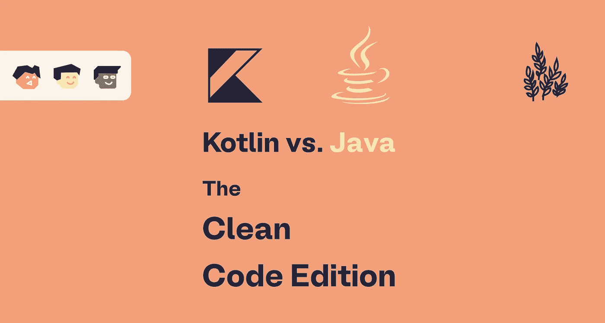
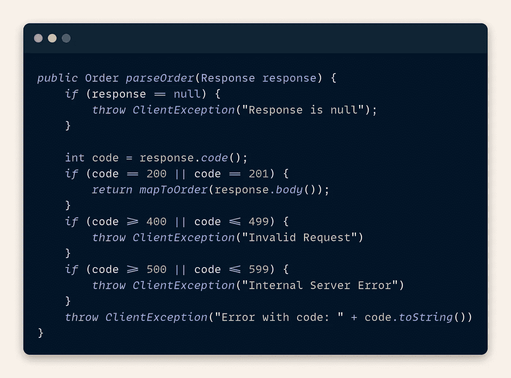
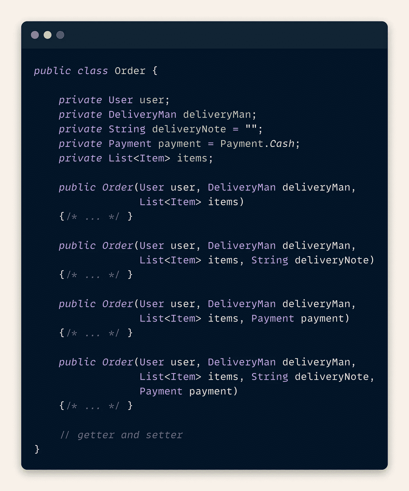
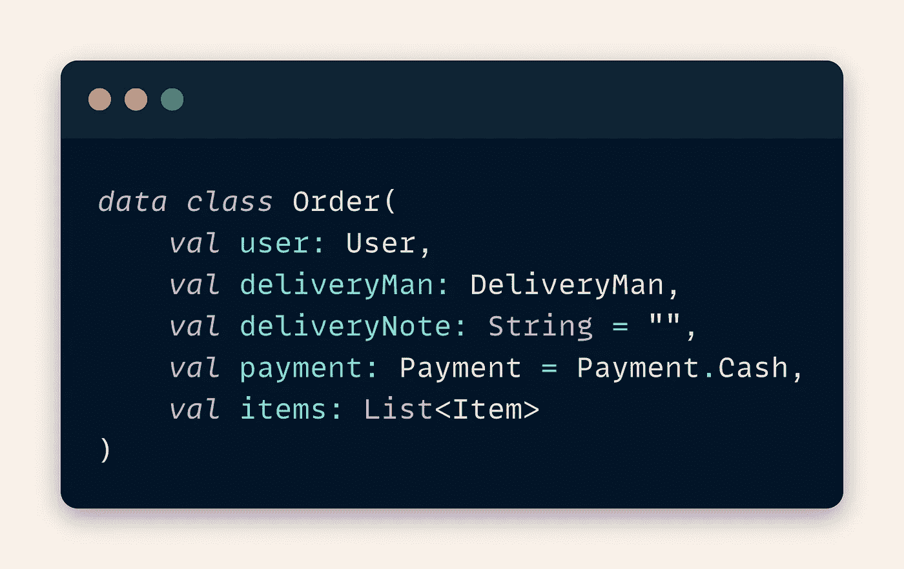
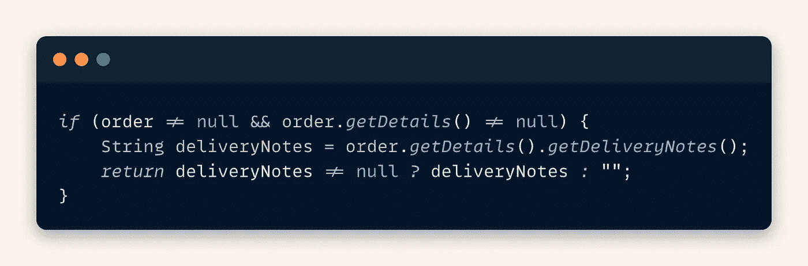
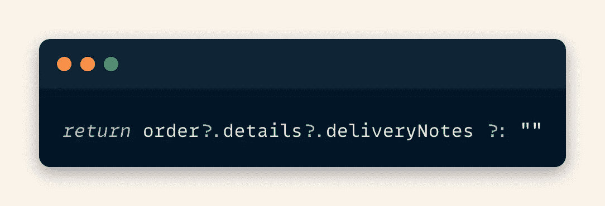
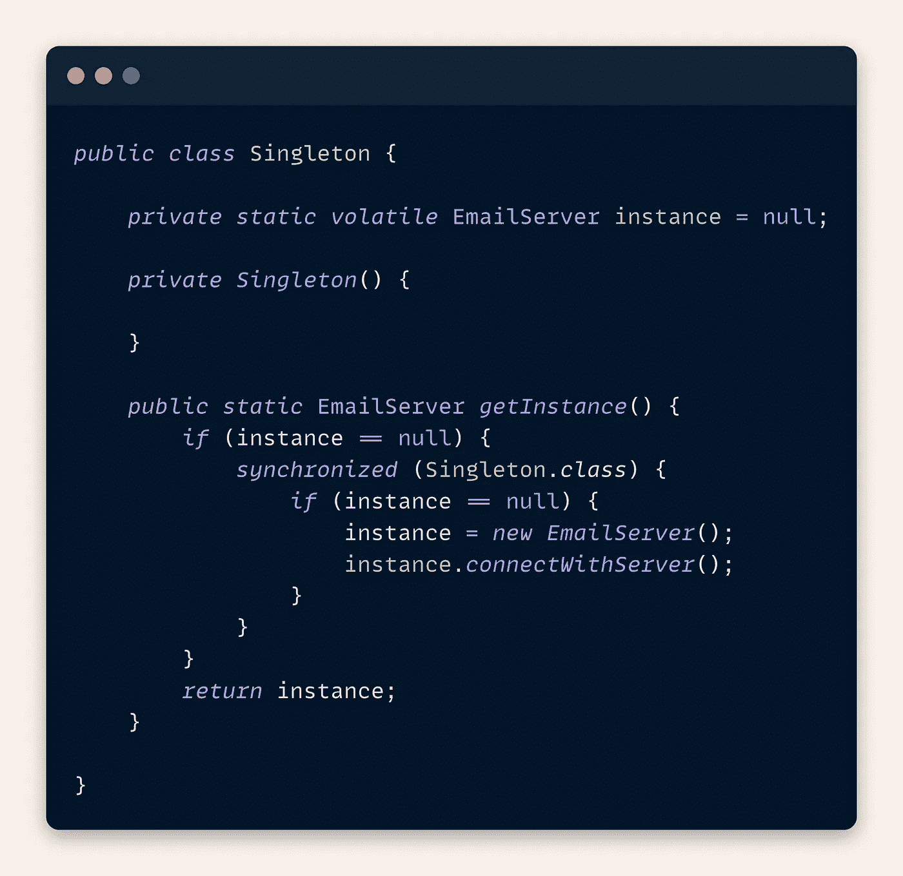
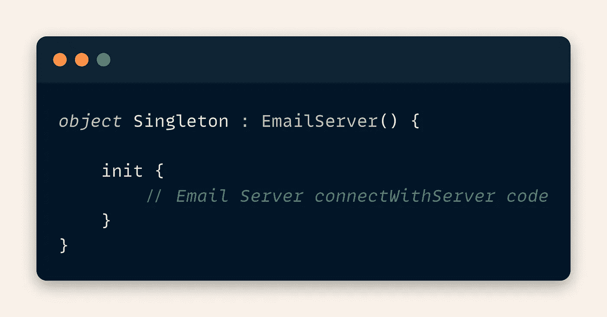
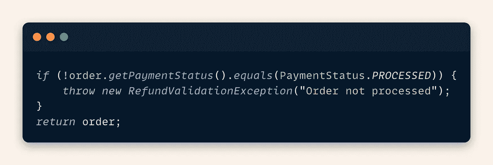
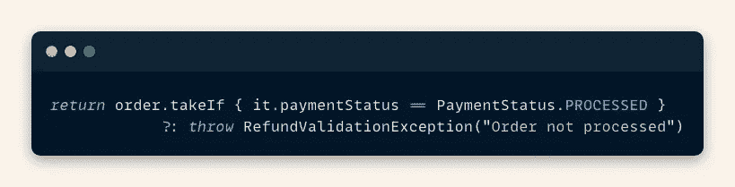

# Kotlin vs. Java:干净的代码版本

> 原文：<https://levelup.gitconnected.com/kotlin-vs-java-the-clean-code-edition-1ba01d10633d>

## Kotlin 和 Java 在代码可读性、可维护性和可重用性方面的区别。

> 仅仅让代码工作是不够的——罗伯特·马丁

# 介绍

随着更新的工具、编程语言和库的出现，不断增长的软件工程世界日益扩大。让我们这些开发者跟上这些趋势变得更具挑战性。其中一个例子是编程语言*科特林*。

Kotlin 正慢慢成为 Java 更理想的选择，因为它为开发人员提供了更合适的解决方案。许多文章讨论了 Kotlin 和 Java 之间的比较，但是这里我们主要关注干净代码方面。这意味着展示哪种语言拥有更易读、更易维护和更易重用的代码。

比方说，你正在寻找建立一个订单交付程序，如食品或包装。在接下来的段落中，我们将对用于订购系统的代码片段进行一些比较。

# 减少语法噪音

假设一个用户下了订单，而您现在负责验证对这样一个请求的响应。在古老的 Java 中，多个 if 语句是典型的方式。根据 HTTP 代码，您可以决定下一步做什么。

在下面的代码片段中，我们可以看到可读性受到许多 if 语句的影响。像这样一个简单的流量控制应该很容易理解。

在 Kotlin 中，所有的[流控制结构](https://kotlinlang.org/docs/control-flow.html)，像 if-then-else、when(switch)或 try-catch，也是表达式。也就是说，它们可以直接赋给任何变量。在下面的代码中，我们将 when 语句分配给函数`parseOrder`。此外，我们利用[范围特性](https://kotlinlang.org/docs/ranges.html)来清楚地分离条件。结果，我们有了可读的、立即理解的代码。

# 一种方法来统治他们

现在，您希望在代码中将订单映射为一个对象。为此，您创建一个简单的 POJO 类和多个重载构造函数来简化对象创建。此外，不经常使用的变量已经被赋予了初始值。

下面的代码片段展示了我们的方法。正如我们所看到的，即使没有 getter 和 setter 方法，也会创建许多样板代码。

> 注意:我们已经知道在 Java 17 中存在类似于 Kotlin 中数据类的[记录](https://docs.oracle.com/en/java/javase/17/language/records.html)。然而，我们在这里关注的是 Java 11，因为它是目前使用最多的 Java 版本之一。

另一方面，Kotlin 提供数据类来处理 getters 和 setters，并提供默认值来设置初始变量值。此外，使用命名参数，我们可以简化对象创建，而无需创建额外的构造函数。

对于开发人员来说，代码片段更简单、更简短。因此程序变得更加优雅。

# 将 NullPointerExceptions 变成一行程序

现在有了一个`Order`类，您想要提取可选的交货通知，以便在系统的其他地方显示它。但是要小心臭名昭著的`NullPointerExceptions`。我们必须假设任何值都可以是`null`。

下面的 Java 片段显示，在我们想要使用它之前，我们总是必须检查`null`。在底部，我们使用一个三元运算符来缩短代码。

多亏了 Kotlin 对空安全的更好的处理，我们可以将整个 Java 代码转换成一行代码。在[猫王算子](https://kotlinlang.org/docs/null-safety.html#elvis-operator) `[?:](https://kotlinlang.org/docs/null-safety.html#elvis-operator)`的帮助下，如果不是`null`，我们得到左侧。否则，返回右侧。

无需讨论，Kotlin 版本更易于阅读，减少了不必要的代码。

# 再也不用谷歌单身族了

作为项目中的典型，有时你需要寻找如何构建一个特定的软件设计模式。一个例子是 Singleton 模式，用于只创建/启动一次资源，并在运行时只使用该资源。

假设您想要连接到一个特定的电子邮件服务器，向客户发送有关其订单的确认/状态电子邮件。但是，您不希望无缘无故地多次重新创建连接。这就是单身族的用武之地！

如下面的代码片段所示，我们为电子邮件服务器创建了一个完整的`Singleton`管理类。此外，我们使连接部分互斥，不允许连接被创建两次。

在 Kotlin 版本中，我们简单地使用了[对象](https://kotlinlang.org/docs/object-declarations.html)表达式来创建一个`Singleton`对象，而没有添加任何额外的代码。它允许我们有一个更清晰的模式，而不需要添加更多的样板代码。

# 更清晰的验证

作为最后一项任务，您将被指派协助实施退款流程。你将负责支付状态的验证。可以在 Java 中使用 if 语句来查看支付状态是否匹配。否则，会发生异常。

下面的代码片段展示了一种典型的方法。解决方案已经很简单了，但是有了 Kotlin，我们可以更进一步。

让我们看看如何在 Kotlin 中解决这个问题:使用函数`[takeIf](https://kotlinlang.org/docs/scope-functions.html#takeif-and-takeunless)`，如果谓词为真，我们将得到值。否则，返回 null。此外，在这个代码片段中，我们使用 Elvis 操作符`?:`，如果它不为空，则返回左侧，否则返回右侧。

结合`takeIf`和`?:`，我们得到了一个解决方案，它不仅缩短了一行代码，还使代码比 Java 更具表现力。在我们看来，它使代码更具可读性，更容易理解。

# 结论

在开发订购系统的实现时，我们发现 Kotlin 中的代码片段比 Java 中的要干净得多。在我们看来，Kotlin 为代码清晰性、可读性和可重用性方面的典型问题提供了更通用的选项。

我们希望我们可以用不同的代码片段让你相信我们的观点。希望你能从我们关于你下一个项目的一两个想法中得到启发。

最后但同样重要的是，一如既往，我们非常欢迎大家提出意见和建议。

# 分级编码

感谢您成为我们社区的一员！在你离开之前:

*   👏为故事鼓掌，跟着作者走👉
*   📰查看更多内容请参见[升级编码刊物](https://levelup.gitconnected.com/?utm_source=pub&utm_medium=post)
*   🔔关注我们:[Twitter](https://twitter.com/gitconnected)|[LinkedIn](https://www.linkedin.com/company/gitconnected)|[时事通讯](https://newsletter.levelup.dev)

🚀👉 [**加入升级人才集体，找到一份神奇的工作**](https://jobs.levelup.dev/talent/welcome?referral=true)