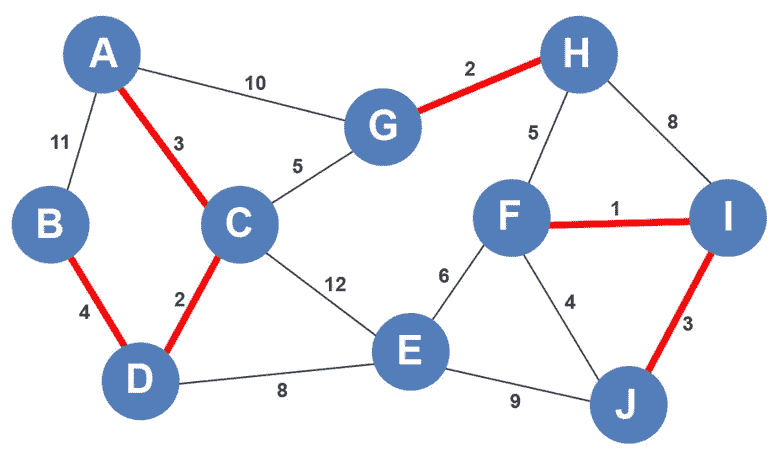

# 克鲁斯卡尔的算法形象地解释了

> 原文：<https://levelup.gitconnected.com/kruskals-algorithm-visually-explained-bd1adcd2d244>

K ruskal 的算法生成最小生成树。它的工作方式是不断选择代价最小的边，直到生成一棵最小生成树。唯一的限制是，一旦选择了成本最低的边，循环就不会出现。让我们看一个例子。

有 10 个顶点，每个顶点至少有一条边与之相连。我们将检查所有的边，直到找到成本最低的边。我们可以很快看到边 F-I 具有最小成本的边，所以我们将首先包含它。

接下来，有两条权重为 2 的边:C-D 和 G-H。它们都不构成一个循环，所以我们将选择其中的一条:C-D。

下一个代价最小的边是边 G-H。由于它没有形成一个循环，我们将把它包含在 MST 中。

下一个代价最小的权重是 3；有两条成本为 3 的边:边 A-C 和 I-J。我们将选择边 A-C，并将其包括在 MST 的形成中，因为它在词汇上排在下一个。

边 I-J 也包括在内，因为它不参与图中任何循环的构建。

下一个代价最小的边权重是 4。有两个权重为 4 的边:边 B-D 和 F-J。边 B-D 被添加到 MST 编队。

尽管边 F-J 确实有次低成本的边，但是它不能被添加到列表中，因为它创建了一个循环。如果我们加上边，这就是循环的样子。

我们将删除该边缘，并继续创建 MST。

接下来有两种可能。我们可以添加边 C-G 或 F-H。我们将添加边 C-G，因为它是按字母顺序排列的，没有形成一个循环。

Edge H-F 也可以添加，因为它不是循环的一部分。

只需要再添加一个顶点到 MST:顶点 e。下一个最低的边权重是 6。边 E-F 包含权重 6。一旦加入，就不形成循环。

Kruskal 算法结束，因为所有顶点都已添加到 MST。

*如果你喜欢你所读的，我的书，***算法的说明性介绍，涵盖了这个算法和更多。**

**

*迪诺·卡伊奇目前是 [LSBio(生命周期生物科学公司)](https://www.lsbio.com/)、[绝对抗体](https://absoluteantibody.com/)、 [Kerafast](https://www.kerafast.com/) 、[珠穆朗玛生物](https://everestbiotech.com/)、[北欧 MUbio](https://www.nordicmubio.com/) 和 [Exalpha](https://www.exalpha.com/) 的 IT 主管。他还担任我的自动系统的首席执行官。他有十多年的软件工程经验。他拥有计算机科学学士学位，辅修生物学。他的背景包括创建企业级电子商务应用程序、执行基于研究的软件开发，以及通过写作促进知识的传播。*

*你可以在 [LinkedIn](https://www.linkedin.com/in/dinocajic/) 上联系他，在 [Instagram](https://instagram.com/think.dino) 上关注他，或者[订阅他的媒体出版物](https://dinocajic.medium.com/subscribe)。*

*[*阅读迪诺·卡吉克(以及媒体上成千上万其他作家)的每一个故事。你的会员费直接支持迪诺·卡吉克和你阅读的其他作家。你也可以在媒体上看到所有的故事。*](https://dinocajic.medium.com/membership)*