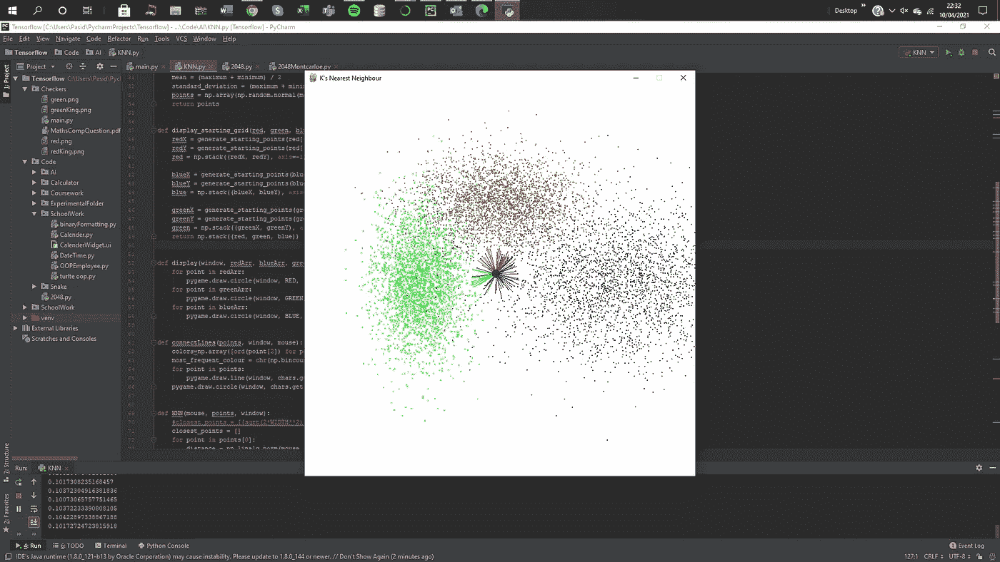
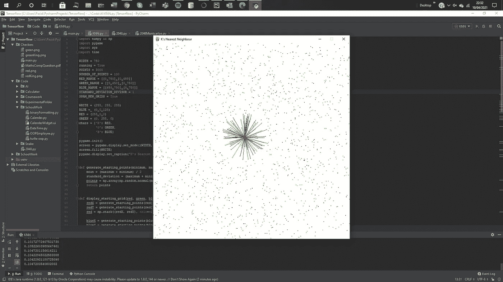

# k 的最近邻 Python

> 原文：<https://levelup.gitconnected.com/ks-nearest-neighbour-python-60b7bb9415d7>

# 简介:

我要感谢 Onel Harrison 对 KNN 的解释，以下解释摘自他的文章，如果你想深入了解 KNN，我推荐你阅读:

[](https://towardsdatascience.com/machine-learning-basics-with-the-k-nearest-neighbors-algorithm-6a6e71d01761) [## 基于 K-最近邻算法的机器学习基础

### k-最近邻(KNN)算法是一个简单，易于实现的监督机器学习算法，可以…

towardsdatascience.com](https://towardsdatascience.com/machine-learning-basics-with-the-k-nearest-neighbors-algorithm-6a6e71d01761) 

k-最近邻(KNN)算法是一种简单、易于实现的监督机器学习算法，可用于解决分类和回归问题



游戏的一个例子



标准偏差不同的另一个例子

```
import numpy as np
import pygame
import sys
import time

WIDTH = 750
running = True
POINTS = 3000
NUMBER_OF_POINTS = 100
RED_RANGE = [[0,750],[0,450]]
GREEN_RANGE = [[0,450],[0,750]]
BLUE_RANGE = [[450,750],[0,750]]
STANDARD_DEVIATION_DIVISOR = 1
SPAM_NEW_GRIDS = True

WHITE = (255, 255, 255)
BLUE =     (0,0,128)
RED = (255,0,0)
GREEN = (0, 255, 0)
chars = {'R': RED,
         'G': GREEN,
         'B': BLUE}

pygame.init()
screen = pygame.display.set_mode((WIDTH, WIDTH))
screen.fill(WHITE)
pygame.display.set_caption("K's Nearest Neighbour")

def generate_starting_points(minimum, maximum, number_of_points):
    mean = (maximum + minimum) / 2
    standard_deviation = (maximum + minimum) / STANDARD_DEVIATION_DIVISOR
    points = np.array(np.random.normal(mean, standard_deviation, number_of_points))
    return points

def display_starting_grid(red, green, blue, points):
    redX = generate_starting_points(red[0][0], red[0][1], points)
    redY = generate_starting_points(red[1][0], red[1][1], points)
    red = np.stack((redX, redY), axis=-1)

    blueX = generate_starting_points(blue[0][0], blue[0][1], points)
    blueY = generate_starting_points(blue[1][0], blue[1][1], points)
    blue = np.stack((blueX, blueY), axis=-1)

    greenX = generate_starting_points(green[0][0], green[0][1], points)
    greenY = generate_starting_points(green[1][0], green[1][1], points)
    green = np.stack((greenX, greenY), axis=-1)
    return np.stack((red, green, blue))

def display(window, redArr, blueArr, greenArr):
    for point in redArr:
        pygame.draw.circle(window, RED, (point[0], point[1]), 1)
    for point in greenArr:
        pygame.draw.circle(window, GREEN, (point[0], point[1]), 1)
    for point in blueArr:
        pygame.draw.circle(window, BLUE, (point[0], point[1]), 1)

def connectLines(points, window, mouse):
    colors=np.array([ord(point[2]) for point in points])
    most_frequent_colour = chr(np.bincount(colors).argmax())
    for point in points:
        pygame.draw.line(window, chars.get(point[2]), mouse, point[1], 1)
    pygame.draw.circle(window, chars.get(most_frequent_colour), mouse_position, 8)

def KNN(mouse, points, window):
    #closest_points = [[sqrt(2*WIDTH**2),'NULL'] for _ in range(10)]
    closest_points = []
    for point in points[0]:
        distance = np.linalg.norm(mouse - point)
        value = np.array([distance, point, 'R'], dtype=object)
        closest_points.append(value)
    for point in points[1]:
        distance = np.linalg.norm(mouse - point)
        value = np.array([distance, point, 'G'], dtype=object)
        closest_points.append(value)
    for point in points[2]:
        distance = np.linalg.norm(mouse - point)
        value = np.array([distance, point, 'B'], dtype=object)
        closest_points.append(value)
    closest_points = sorted(closest_points, reverse=False, key= lambda x:x[0])[:NUMBER_OF_POINTS]
    connectLines(closest_points, window, mouse)

points = display_starting_grid(RED_RANGE, GREEN_RANGE, BLUE_RANGE, POINTS)
while running:
    start= time.time()
    screen.fill(WHITE)
    red, green, blue = points[0], points[1], points[2]
    display(screen, red, blue, green)
    mouse_position = np.array(pygame.mouse.get_pos())
    KNN(mouse_position, points, screen)
    for event in pygame.event.get():
        if event.type == pygame.QUIT:
            running = False
            pygame.quit()
            sys.exit()
    if SPAM_NEW_GRIDS:
        points = display_starting_grid(RED_RANGE, GREEN_RANGE, BLUE_RANGE, POINTS)
        print(time.time()- start)
    pygame.display.flip()
```

**有监督的机器学习**算法(与无监督的机器学习算法相反)是一种依靠有标签的输入数据来学习一个函数的算法，当给定新的无标签数据时，该函数产生适当的输出。

监督机器学习算法用于解决分类或回归问题。

一个**分类问题**有一个离散值作为它的输出。例如，“喜欢比萨饼上的菠萝”和“不喜欢比萨饼上的菠萝”是不连续的。没有中间地带。上面教孩子识别猪的类比是分类问题的另一个例子。

一个**回归问题**的输出是一个实数(一个带小数点的数)。例如，我们可以使用下表中的数据，在给定身高的情况下估计某人的体重。

回归分析中使用的数据看起来与上图中显示的数据相似。我们有一个独立变量(或一组独立变量)和一个因变量(在给定独立变量的情况下，我们试图猜测的东西)。例如，我们可以说身高是自变量，体重是因变量。

此外，每行通常称为**示例、观察值或数据点**，而每列(不包括标签/因变量)通常称为**预测值、维度、自变量或特征。**

一个**无监督的机器学习**算法使用没有任何标签的输入数据——换句话说，没有老师(标签)告诉孩子(计算机)什么时候是正确的，什么时候它犯了错误，以便它可以自我纠正。

监督学习试图学习一个函数，该函数将允许我们在给定一些新的未标记数据的情况下进行预测，而非监督学习则不同，它试图学习数据的基本结构，以便让我们对数据有更多的了解。

# KNN:

KNN 算法假设相似的事物存在于附近。换句话说，相似的事物彼此靠近。因此，在示例代码中，我利用 np 的内置函数来尽可能快地获取代码。

看看代码，如果你有任何疑问，请评论！