# kubernetes Angular ASP.NET 核心微服务架构

> 原文：<https://levelup.gitconnected.com/kubernetes-angular-asp-net-core-microservice-architecture-c46fc66ede44>

## 如何使用 ASP.NET 核心 C# REST API 和 Angular 在 Docker 桌面上使用 K8S 和 Ingress 进行本地云开发。

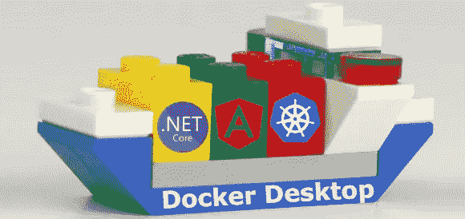

> Kubernetes **使用 docker 桌面在本地环境**中运行。它与云环境类似**。你可以用它来开发和测试。没有**额外费用**。您可以随时**轻松地将其部署到云**。**

在本指南中，您将创建一个**基于原始微服务的云架构**。它使用**。NET 核心，REST-API**在后端服务中，而 **Angular** 作为前端。所有的**组件都被分类**并且 **Kubernetes 编排**容器。应用程序通过入口控制器公开**。**

*部件概述图:*

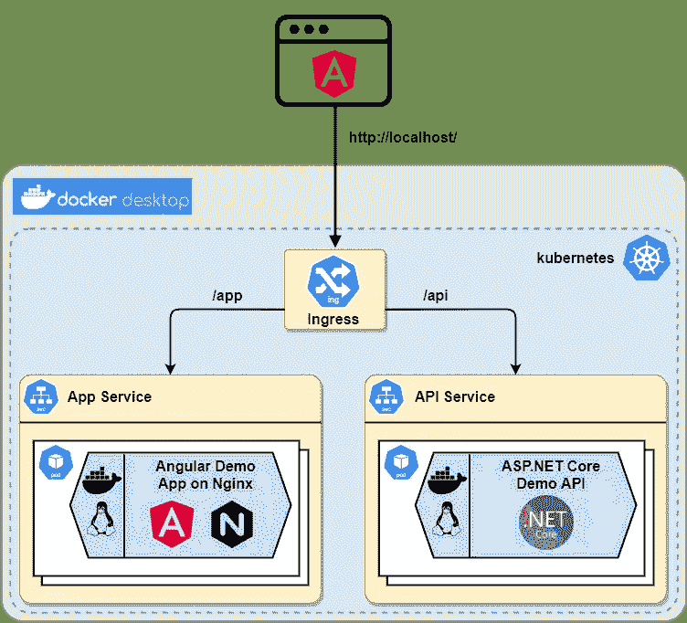

# 内容

1.  构建 ASP.NET 核心 REST-API 后端
2.  创建角度前端应用程序
3.  将。NET Core API 和 Angular App
4.  将容器部署到 Docker 桌面上的 Kubernetes
5.  最后的想法和展望

# 1.构建 ASP.NET 核心 REST-API 后端

**用 ASP.NET 和 web 开发工作量安装** [**Visual Studio 社区**](https://visualstudio.microsoft.com/en/vs/community/) (免费)。

创建一个 ASP.NET 核心 5.0 Web API 项目，并将其命名为“DemoApi”。激活 Docker，使用“Linux”设置。禁用 HTTPS:

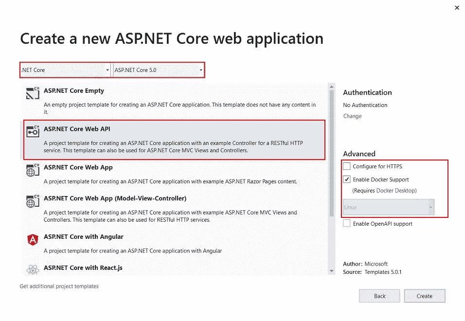

添加一个新的控制器“DemoController”。它只返回“Hello World”:

在端口 4200(开发)和 80 上为 Angular 应用程序启用 CORS:

编辑 launchsettings.json 并将“DemoApi”配置的 URL 更改为端口 80。然后选择 DemoApi 配置并启动它:

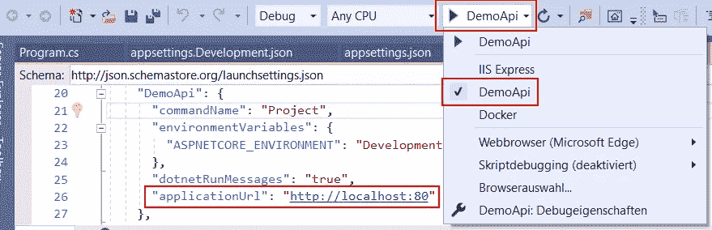

在浏览器中测试它:

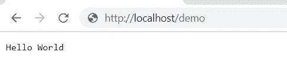

# 2.创建角度前端应用程序

**下载安装**[**Node.js/NPM**](https://nodejs.org/en/download/)**。**

**创建文件夹** `**C:\dev\demo**`并打开命令提示符。

**安装 Angular** (我在写这个指南的时候用了 Angular 9):

```
C:\dev\demo>npm install -g @angular/cli
```

**创建 app:**

```
C:\dev\demo>ng new DemoApp
```

*延伸阅读:* [*了解角度并创建您的第一个应用*](https://javascript.plainenglish.io/understanding-angular-and-creating-your-first-application-4b81b666f7b4) *由*

[*在 Docker 容器中构建并运行 Angular 应用*](https://medium.com/u/4a1da74ae506#)*[*Wojciech Krzywiec*](https://medium.com/u/8fb6f1a94f5b?source=post_page-----c46fc66ede44--------------------------------)*

## *测试两个容器*

*您可以列出您的容器(您的容器 id 和时间戳会有所不同):*

*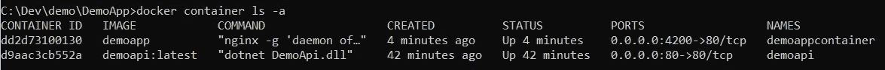*

***在浏览器中启动应用**:*

*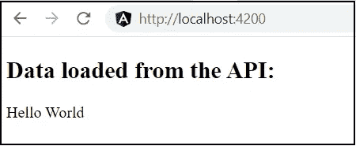*

***停止两个容器**以便在本指南的下一步不会阻塞端口:*

```
*C:\dev\demo\DemoApp>docker stop demoappcontainer
C:\dev\demo\DemoApp>docker stop demoapi*
```

# *4.部署到 Docker 桌面上的 Kubernetes*

***在 Docker 桌面启用 Kubernetes:***

*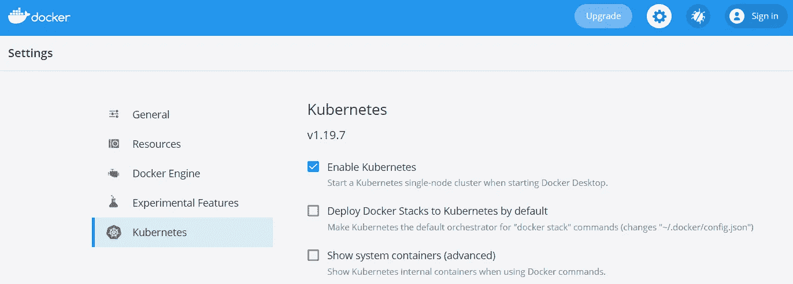*

***安装 NGINX 入口控制器**(在命令行的一行中):*

```
*C:\dev\demo>kubectl apply -f https://raw.githubusercontent.com/kubernetes/ingress-nginx/controller-v0.41.2/deploy/static/provider/cloud/deploy.yaml*
```

**详见* [*NGINX 入口安装指南*](https://kubernetes.github.io/ingress-nginx/deploy/)*

****创建****

****应用 yaml:****

```
**C:\dev\demo>kubectl apply -f kubernetes.yaml**
```

**这将创建两个 Kubernetes“部署”，并为每个部署创建一个“服务”。然后，这两种服务都通过端口 80 上的入口公开。**

***详见* [*Kubernetes 文档*](https://kubernetes.io/docs/home/)**

***第一个部署使用 DemoAPI 映像和两个副本来展示如何进行扩展。第二个部署使用 DemoApp 的单个副本。基于路径前缀的服务入口路由:***

***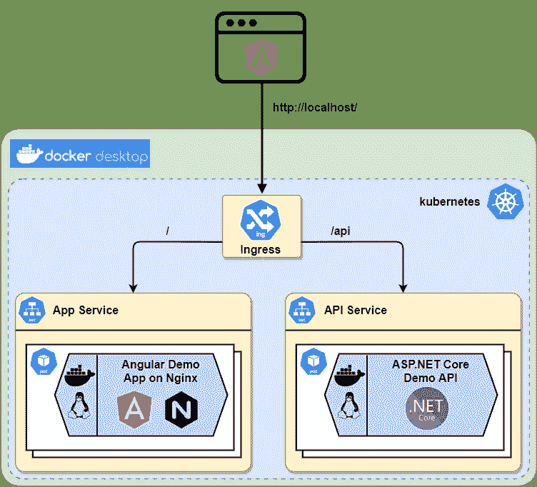***

## ***测试部署***

***“获取部署”显示部署和单元数量:***

***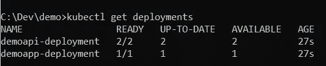***

***在 80 端口上打开您的浏览器。)并测试您的 Kubernetes 部署:***

***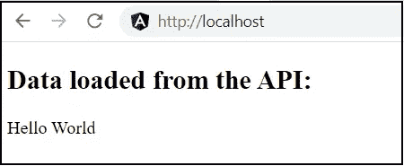***

****延伸阅读:* [*如何在 Kubernetes 集群中部署. NET 5 API*](https://faun.pub/how-to-deploy-a-net-5-api-in-a-kubernetes-cluster-53212af6a0e2)*by*[*Ivan Porta*](https://medium.com/u/f58cb680fdbf?source=post_page-----c46fc66ede44--------------------------------)***

# **5.最后的想法和展望**

**您为基于微服务的云架构创建了**工作基础。但是**还是少了很多**。****

**参见我的后续帖子 [**如何给你的架构添加一个 MySql 数据库和 MongoDB 副本集**](/databases-in-a-kubernetes-angular-net-core-microservice-arch-a0c0ae23dca9) 和 [**如何使用事件进行微服务间的通信**](https://itnext.io/how-to-build-an-event-driven-asp-net-core-microservice-architecture-e0ef2976f33f) 。**

**我将在接下来的文章中向你展示更多的内容:Kubernetes 的秘密，安全方面，如 SSL、日志、调试、CI/CD、导航图、(代码)质量、(自动)伸缩和自我修复等。**

****查看我的其他故事如何:****

*   **[在 Angular 中登录 Google 并使用基于 JWT 的。使用非对称(RSA)签名令牌进行 NET Core API 认证](/how-to-sign-in-with-google-in-angular-and-use-jwt-based-net-core-api-authentication-rsa-6635719fb86c)**
*   **[使用 NSwag 自动生成 TypeScript 客户端访问. NET 核心服务 API，使用 OpenAPI/Swagger 描述 API](/how-to-jwt-authenticate-with-angular-to-an-asp-net-4cfab5298d08)**

**如果您有任何问题、想法或建议，请联系我。**