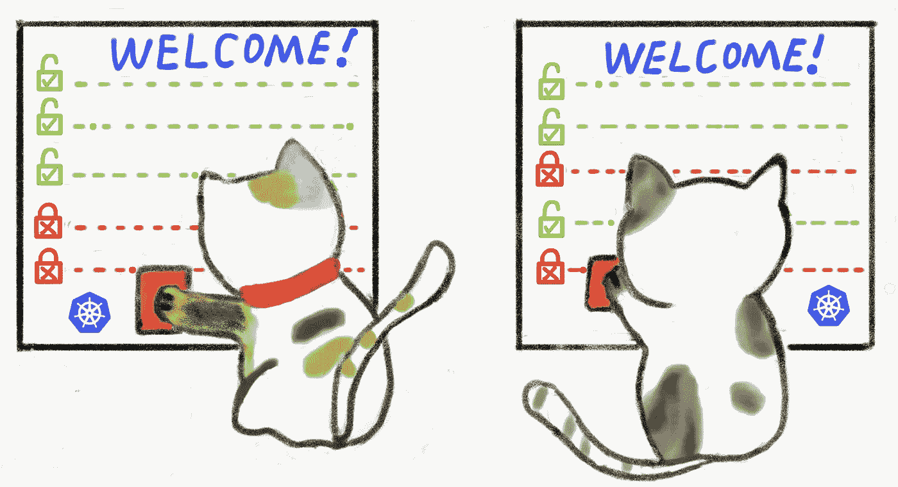
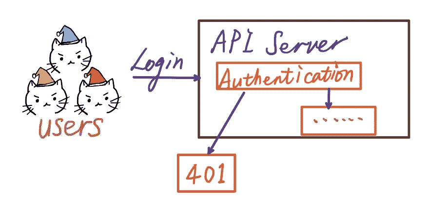
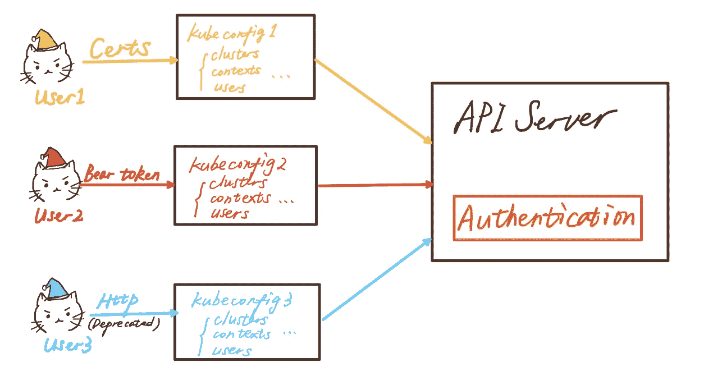
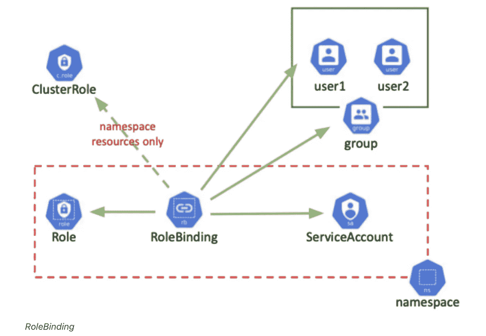
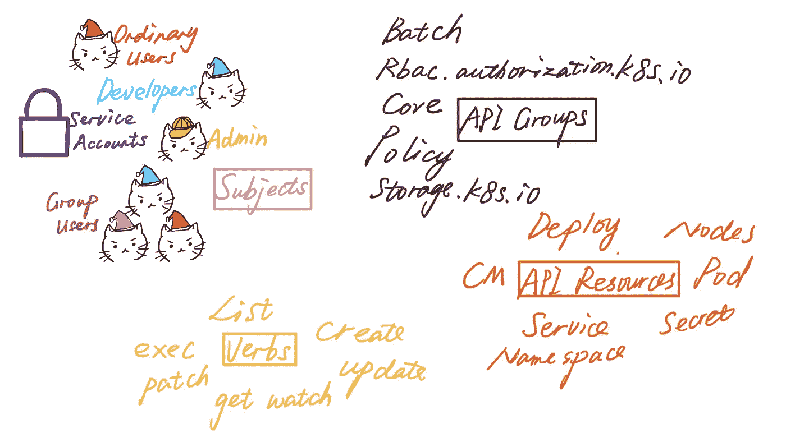
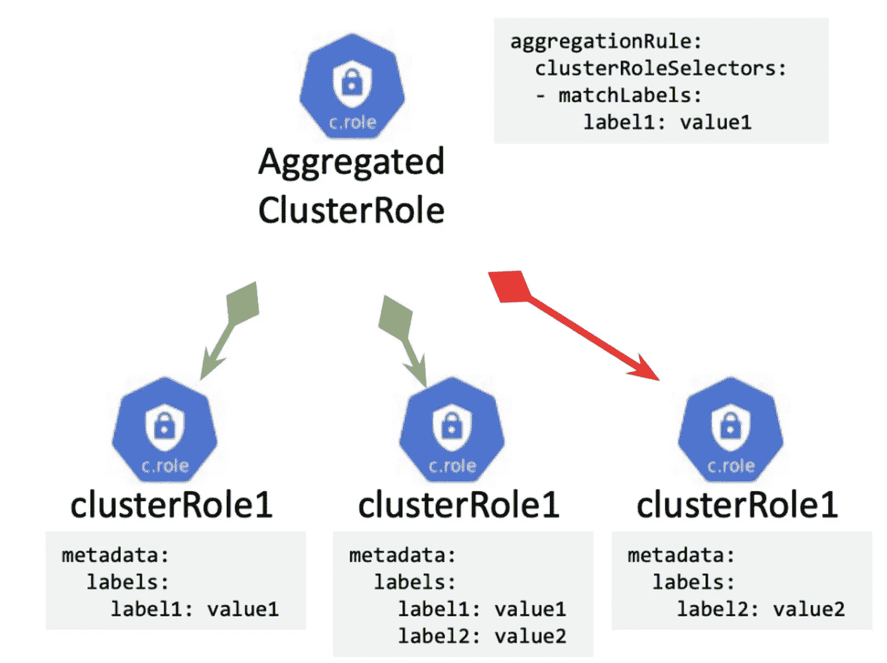
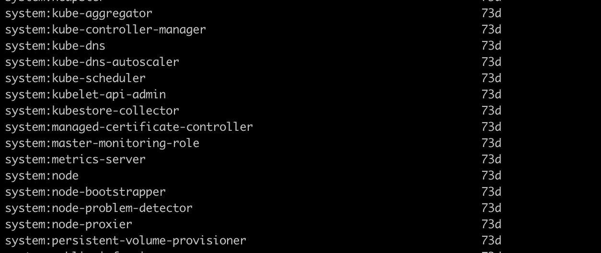

# Kubernetes 认证和授权 101

> 原文：<https://levelup.gitconnected.com/kubernetes-authentication-authorization-101-stefanie-lai-15080f64bcee>

## 如何登录 Kubernetes 集群？如何向您的应用授予权限？

如果我们想用用户模块构建一个系统，认证和授权是我们永远不能忽视的，尽管它们可能很难理解。



Kubernetes 验证和授权，按作者

> **认证**(来自[希腊文](https://en.wikipedia.org/wiki/Greek_language):αὐθεντικός*authenti KOS*， *authentes* ，【作者】)是[证明](https://en.wikipedia.org/wiki/Proof_(truth))一个[断言](https://en.wikipedia.org/wiki/Logical_assertion)的行为，如计算机系统用户的[身份](https://en.wikipedia.org/wiki/Digital_identity)—来自[维基](https://en.wikipedia.org/wiki/Authentication)
> 
> **授权**是指定对资源的访问权限/特权的功能，与一般的[信息安全](https://en.wikipedia.org/wiki/Information_security)和[计算机安全](https://en.wikipedia.org/wiki/Computer_security)有关，尤其与[访问控制](https://en.wikipedia.org/wiki/Access_control)有关。—来自[维基](https://en.wikipedia.org/wiki/Authorization)

你可以简单地归纳为两点。

*   你是谁？认证使用户能够正确登录系统。
*   你能做什么？授权授予用户适当的权限。

本文将解密 Kubernetes 的认证和授权，希望你不再被下面的问题所迷惑。

*   Kubernetes 上有哪些用户？
*   如何验证用户身份？
*   什么是 RBAC？
*   如何为用户设置 RBAC？

# Kubernetes 的用户

作为 Kubernetes 的网关，APIServer 是用户访问和管理资源对象的入口。每个访问请求都需要一个访问者合法性检查，包括身份验证和资源操作权限等。，然后在通过一系列验证后返回访问结果。



用户验证，按作者

用户可以通过 kubectl 命令、SDK 或者发送 REST 请求来访问 API。用户和服务帐户是访问 API 的两种不同方式。

## **普通用户**

Kubernetes 中没有内置的用户资源类型是用户不能像其他资源那样存储在`etcd,`中的。因此，Kubernetes 通过客户端证书或其他第三方用户管理系统(如 Google Account)来完成对普通用户的认证。

这里的关键是找到一种安全的方法来帮助普通用户使用 kubectl 或 rest API 访问 Kubernetes 资源。

有几种方法可以验证普通用户的身份:

*   客户端 X509 客户端证书
*   HTTP 请求
*   不记名令牌



三种方式，作者

**X509 客户端证书**

使用 [OpenSSL](https://www.openssl.org/) 设置客户端证书:

```
$ (umask 077;openssl genrsa -out testuser.key 2048)
Generating RSA private key, 2048 bit long modulus
………….+++
…+++
e is 65537 (0x10001)# generate key O:cluster name CN: username
$ openssl req -new -key testuser.key -out testuser.csr -subj “/0=testcluster/CN=testuser”# sign the cert
openssl x509 -req -in testuser.csr -CA ca.crt -CAkey ca.key -CAcreateserial -out testuser.crt -days 365
```

生成私钥后，我们现在需要在`kubeconfig`中设置密钥。

> PS:在这里，我使用 OpenSSL 来生成凭证。也可以使用 [cfssl](https://github.com/cloudflare/cfssl) 。[官方文件在此](https://kubernetes.io/docs/concepts/cluster-administration/certificates/)。

**什么是 kubeconfig？**

kubectl 命令支持上述所有身份验证方法。它使用一个`kubeconfig`配置文件，该文件通常(默认)存储在`~/.kube/config,`中，用于保存与 APIServer 的通信方法和认证所需的数据。

该文件主要包含以下内容。

*   **集群**。集群列表，包括访问 API 服务器的 URL 及其所属集群的名称。
*   **用户**。用户列表，包括访问 API 服务器时的用户名和验证信息。
*   **语境**。Kubelet 的可用上下文列表由用户列表中的特定用户名和集群列表中的特定集群名组成。
*   **Current-context**:kube let 当前使用的上下文名称是上下文列表中的一个特定项。

接下来，将创建的客户端证书添加到`kubeconfig`。

```
# set kube config
$ kubectl config set-cluster testcluster — kubeconfig=testuser — certificate-authority=ca.crt — embed-certs=true# view cluster config
$ kubectl config view — kubeconfig=testuser
```

`kubectl config set-cluster`命令在这里非常重要，我们也将在其他解决方案中使用它。这是[文件](https://jamesdefabia.github.io/docs/user-guide/kubectl/kubectl_config_set-cluster/)

下一步是设置客户端凭据。

```
$ kubectl config set-credentials testuser — client-certificate=testuser.crt — client-key=testuser.key — embed-certs=true — kubeconfig=testuser
```

`kubeconfig`的输出是这样的

最后一步是使用上下文。

```
$ kubectl config use-context testuser@testcluster — kubeconfig=testuser
```

直到现在，你仍然不能得到任何东西，因为授权还没有完成。在下一节中，我将向您展示如何向用户授予权限。

**不记名令牌**

承载令牌是一种静态令牌验证方法，要启用它，需要用`token-auth-file=authfile`启动 APIServer

`authfile`格式就像，`password,user,uid,"group1,group2".`每行代表一个用户。

有两种方式使用不记名令牌。

*   使用 HTTP 头集

```
curl -X "POST" "https://{kubernetes API IP}:{kubernetes API Port}/api/v1/namespaces/{namespace}/serviceaccounts/{name}/token" \
-H 'Authorization: Bearer {bearer token}' \
-H 'Content-Type: application/json; charset=utf-8' -d $'{}'
```

*   使用`kubeconfig`

```
# set your token in the kubeconfig
**$ kubectl config set-credentials NAME [-client-certificate=path/to/certfile] [-client-key=path/to/keyfile] [-token=bearer_token] [-username=basic_user] [-password=basic_password]**# use the context
$ kubectl config use-context NAME
```

有关不记名令牌的更多信息，请查看此处的。

**HTTP 登录**

基本上就是一个用户名和密码的登录方式。要启用它，您需要用`basic-auth-file=authfile.`启动 APIServer

这里的`authfile`和不记名令牌的一样。使用它需要 HTTP 客户端在头中添加`Authorization: Basic BASE64ENCODED(USER:PASSWORD)`来执行 HTTP 基本身份认证。`BASE64ENCODED(USER:PASSWORD) is USER:PASSWORD` base64 值。收到后，APIServer 会根据`authfile`判断用户名和密码是否正确。

由于 HTTP 登录方法在 1.16 中被放弃，在 [1.19](https://v1-19.docs.kubernetes.io/docs/setup/release/notes/) 中被移除，所以我在这里不展开。

通常，建议使用客户端证书作为管理员登录方法，其他用户通常通过云提供商身份验证方法登录以访问集群。

这到底是怎么发生的？

验证码在 kubectl 中。

*   第一步是找到 auth params 并构建一个 env exec。

*   然后 kubectl 使用 [client-go](https://github.com/kubernetes/client-go) API 针对集群验证所有的令牌/密钥，并确保用户拥有权限。

## 服务帐户

服务账户是 Kubernetes 管理的资源之一，不同于普通用户。它可以通过 API 创建，包含一组秘密，存储在`etcd`中，通常分配给一个名称空间。

*   服务帐户由 Kubernetes API 管理。
*   服务帐户适用于在群集内运行的应用程序(pod)。
*   服务帐户通过承载令牌身份验证访问 API。通过 YAML 很容易建立一个服务帐户。

服务帐户 YAML

# 批准

授权定义了您在登录后可以做什么。

在传统的 web 系统中，用户管理有三大部分，**用户，角色，权限，**存储在关系数据库中的，它们之间存在多对多的映射。

在 Kubernetes 也是一样的，只是术语不同。现在人们在云世界中使用`ServiceAccount`、`Role`、`Rolebinding`，这些都存储在`etcd`中。所以我相信可以肯定地说，Kubernetes 的授权并不难理解。

但如果你认为 Kubernetes 是“[打死马](https://en.wikipedia.org/wiki/Flogging_a_dead_horse#:~:text=Flogging%20a%20dead%20horse%20(alternatively,to%20do%20any%20useful%20work.)”，那你就错了。**RBAC(Role-Based Access Control)**是 Kubernetes 的授权机制，从它的名字就可以看出从面向用户到面向角色的转换。



来自 CNCF 的 RBAC

在 Kubernetes 架构中，最大的优势之一就是**不同资源的解耦**。每种资源类型都是独立的，它们只通过 APIServer 进行通信。所以针对不同资源的 [API 对象](https://kubernetes.io/docs/reference/access-authn-authz/rbac/#api-overview)比如`/pod/create, /service/create`已经成为了新的权限类型，这是真正的资产。

然后是开发人员的工作，组织所有的 API，将它们分配给不同的角色，最后使用`RoleBinding`将所有这些角色授予 `ServiceAccount(user)`。

人们认为 Kubernetes 的插件资源设计带来了显著的优势。

*   它为整个 Kubernetes 生态系统带来了灵活性，能够在不损害其原始授权机制的情况下添加新资源。
*   它**解耦了**权限和用户之间的碎片化关系，**集中**创建一个角色人物。

下面我们继续介绍 RBAC。

## RBAC

RBAC 属于`rbac.authorization.k8s.io` API 组，该组在 [1.6](https://coreos.com/blog/kubernetes-1-6.html) 成为 beta，在 1.8 成为 [GA，并在当时为 Kubernetes 带来了巨大的安全改进。](https://kubernetes.io/blog/2017/09/kubernetes-18-security-workloads-and/#spotlight-on-security)

您需要在 APIServer 配置中设置`-authorization-mode=Node,RBAC`来启用动态 RBAC 功能。

Kubernetes 使用名称空间来增加资源所有权的分离，集群范围的资源除外。所以 RBAC 也分成两个范围，**集群范围的**和**名称空间范围的**。此外，Kubernetes 中不支持名称空间的非资源只能在集群范围内设置，比如`/heathz`。

`ClusterRole`和`ClusterRolebinding`用于集群级资源。另一方面，`Role`和`Rolebinding`对应于名称空间中的资源。

`Rolebinding/ClusterRoleBinding`有四种主要成分

*   API 资源
*   API 组
*   学科
*   动词



角色绑定成分

Kubernetes 将粒度 API 资源放在一起，组成各种 API 组。比如`Deployment`属于`apps`，而`Cronjob`属于`batch`组。

您可以通过运行以下命令在其 YAML 中找到信息:

```
kubectl create namespace test --dry-run -o yaml | cat
```

输出:

让我们试着为`Pod`配置一个`Role`，为事件配置一个`ClusterRole`，两者都只有一些读权限。

很容易理解`Role`和`ClusterRole`都需要三大要素来构建一个`**rule**`、`ApiGroup`、`resources,`和`verbs`。这里我们只补充`Pod`作为例子。如果你想让不同的类型拥有相同的权限，你可以在同一个`rule`中添加不同的类型。当然，你可以把它们分成不同的规则。

在图中提到的多种类型的用户中，我推荐使用 ServiceAccount 方法，因此本文主要关注这种方法。然而，为了完整起见，本文简要描述了替代方法。

现在，我们定义一个`RoleBinding`来组合`ServiceAccount`和`Role`，对于`ClusterRole`，就是`ClusterRoleBinding`。这就决定了一个`ServiceAccount(user)`能做什么。

该示例将`test`名称空间中的`ServiceAccount`名称`default`和`testuser`(我们在用户部分使用客户端证书定义)绑定到`Role`和`ClusterRole`，因此`ServiceAccount`可以读取`test`名称空间中的 pod 信息和整个集群的事件。

## **聚合集群角色**

v1.9 中为**聚合集群角色**引入了一个新函数(v1.11 中的 GA)。



来自 CNCF[的 AggregatedClusterRole】](https://www.cncf.io/blog/2020/08/28/kubernetes-rbac-101-authorization/)

配置如下。

这基本上是一个简化的配置，允许用户将相似的`ClusterRoles`组合在一起，然后通过一个`Aggregated ClusterRole`将它们与其他`ServiceAccount`匹配。这真是一个“很好拥有”的功能！

## 嵌入集群角色

Kubernetes 已经有很多内置的`ClusterRoles`，你可以在你的`kube-system`名称空间中检查`ClusterRole`。

```
kubectl get clusterroles -namespace=kube-system
```



任何以`system:`开头的都是内置的`ClusterRole`。

## Webhook

还有一个特殊的用例。如果你使用 CRD，你可以定义一个[授权 webhook 扩展](https://kubernetes.io/docs/reference/access-authn-authz/webhook/)来验证它的权限。通过添加`--authorization-webhook-config-file=auth.yaml`标志，添加类似`auth.yaml`的`kubeconfig`格式。

如需更多信息，请参考 [Kubernetes RBAC 官方文档](https://kubernetes.io/docs/reference/access-authn-authz/rbac/)。

# 概括起来

Kubernetes 的认证和授权可能比我们想象的要复杂，尤其是涉及到普通用户的登录和授权。但是`ServiceAccount`是一个优秀的设计，它允许我们灵活安全地管理`Pod’s`运行程序的权限。

像`Pod`、`Deployment`、`ConfigMap`这样的资源，永远是 Kubernetes 的核心资产，一切都围绕着它们运转。学习 RBAC 时，我们更好地理解了各种资源操作和 APIServer 设计。

对于应用程序开发人员来说，了解如何使用 RBAC 至关重要，尤其是对于大多数通过各种云提供商(GKE、EKS)使用 Kubernetes 的用户来说。RBAC 和云提供商的 IAM 管理有相似之处。

关于 GCP IAM 和 RBAC Kubernetes 的特点和区别，请参考 [GCP IAM 认证&授权 101](https://medium.com/@laiyuanyuan-sg/gcp-iam-authentication-authorization-stefanie-lai-101-275f3c1fdfc5) 。

感谢阅读！