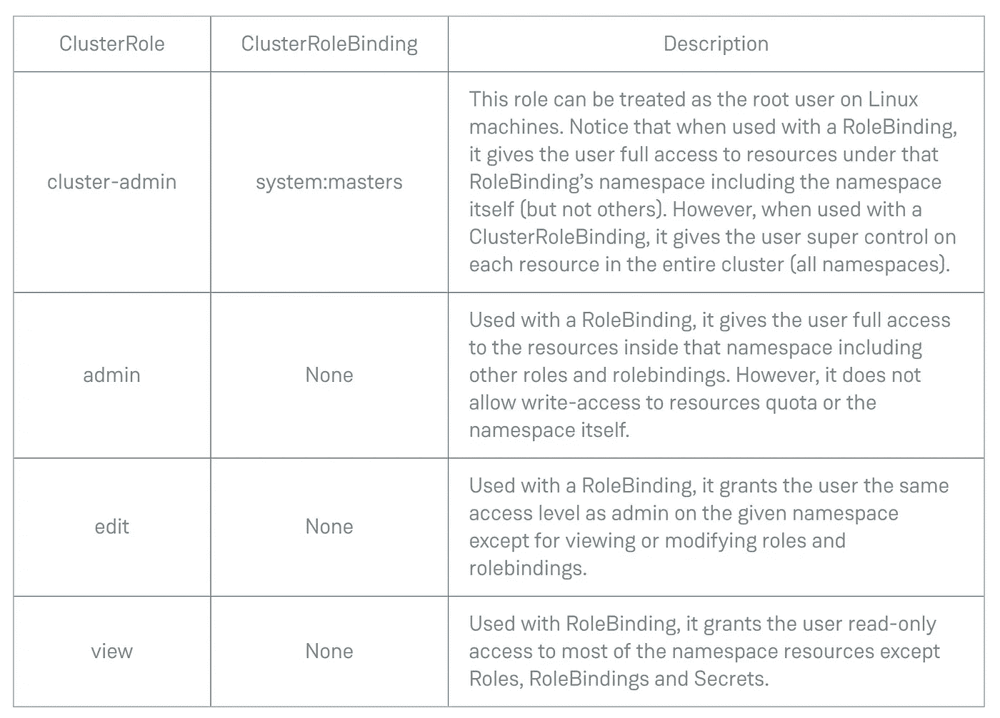

# Kubernetes 授权

> 原文：<https://levelup.gitconnected.com/kubernetes-authorization-f18d82eb1906>

*本文最初发表于 https://www.magalix.com/blog/kubernetes-authorization*

Kubernetes 授权的作用很重要。身份验证是指验证特定主体的身份，以决定是否授予其访问权限，而授权则处理访问权限之后的事情。使用授权机制，您可以微调谁可以访问 Kubernetes 集群上的哪些资源。在本文中，我们将讨论基于角色的访问控制( [RBAC](https://www.magalix.com/blog/kubernetes-rbac-101) )以及如何使用它来保护您的集群。

Kubernetes 使用 API 服务器根据一组策略授权请求。值得注意的是，授权是认证成功后的一个步骤。工作流程如下:

1.  API 服务器使用一种支持的身份验证方法对用户进行身份验证。关于这个过程的更多信息，请参考我们关于 [Kubernetes](https://www.magalix.com/blog/kubernetes-101-concepts-and-why-it-matters) 认证的文章。
2.  假设请求的目的是检索名称空间 Kube-system 中的 pod 列表(例如，使用 kubectl get pods -n Kube-system)。首先，在步骤 1 中对用户进行身份验证，然后将凭证与用户试图执行的*动词*、*资源*(以及其他方面)一起传递给授权模块。
3.  如果用户(通过*用户*我们指人类用户以及应用程序)被授权执行请求，它被传递给准入控制器。否则，API 服务器会回复一个 403 禁止的 HTTP 状态代码。

基于角色的访问控制(简称 RBAC)从 1.8 版本开始就是 Kubernetes 的一部分。强烈建议您甚至在非生产环境中使用它。在与 RBAC 打交道时，你应该知道一些重要的术语:

*   **实体:**这是一个需要访问集群上的*资源*的主体。该实体可以是您、您的一位同事、一个 pod 或您需要授予对集群的编程访问权限的外部程序。
*   **资源:**需要访问的对象。比如一个 pod，一个 [configMap](https://www.magalix.com/blog/the-configmap-pattern) ，一个 [Secret](https://www.magalix.com/blog/kubernetes-secrets-101) 等等。
*   **角色:**由于向每个用户授予一组特定的权限并可能将它们复制给需要相同访问级别的多个用户是低效的，因此最好创建一个具有该组权限的角色。多个角色可以属于一个用户，多个用户可以属于一个角色。因此，无需手动删除用户帐户的权限，只需从角色中删除即可。
*   **角色绑定:**这是在角色和属于这个角色的用户(RBAC 术语中的实体)之间建立实际链接的地方。

一旦创建了角色，就需要定义实体可以执行哪些操作。它们可以分为:

*   **只读:**此处实体不能修改资源。动词是 get 和 list
*   **读写:**其中实体可以修改资源。属于此类别的动词有创建、更新、删除和删除集合。

请注意，您应该区分角色和集群角色。一个角色被绑定到一个名称空间。例如，您可以创建一个角色来访问 kube-system 名称空间中的 pod。[默认名称空间或 kube-system 之外的任何其他名称空间中的 pod](https://www.magalix.com/blog/kubernetes-pods-101-the-cluster-sailors)将超出该角色的权限。另一方面，ClusterRole 在集群范围内应用。所有名称空间都遵守 ClusterRole 规则。有些资源本质上要求您授予其请求者集群角色，因为它们没有命名空间。这种资源的一个例子是节点。

API 服务器自动创建许多默认的 ClusterRoles 和 ClusterRoleBinding，集群上的不同资源需要它们才能正常工作。这些角色以 system:为前缀，表示它们是由基础设施本身创建和拥有的。例如，kubelet 使用 system:node。修改此角色可能会导致节点无法正常运行，从而导致整个群集停止运行。除了 system:前缀之外，系统角色和角色绑定还附加了 kubernetes.io/bootstrapping=rbac-defaults 标签。

Kubernetes 还创建了旨在授予用户的默认角色。这样的角色可以被认为是通用功能的预制模板。他们被称为面向用户的角色。

# 面向用户的角色



# 实验 01:创建管理员用户

**要求:**你有一位新同事加入了你的团队。通过试用期后，您需要授予她对群集的管理访问权限。您在创建时使用的身份验证方法是 X.509 证书。现在，第一步是为她创建一个帐户。

# 步骤 01:为爱丽丝创建一个用户帐户

1.你需要从这里下载并安装 CFSSL 工具[https://pkg.cfssl.org/](https://pkg.cfssl.org/)

2.创建证书签名请求 JSON 文件，如下所示:

```
{
    "CN": "alice",
    "key": {
        "algo": "rsa",
        "size": 4096
    },
    "names": [{
        "O": "alice",
        "email": "[alice@mycompany.com](mailto:alice@mycompany.com)"
    }]
}
```

从文件生成 CSR(证书签名请求),如下所示:cfssl genkey user . JSON | cfssljson-bare client。输出应该如下所示:

```
$ cfssl genkey user.json | cfssljson -bare client
2019/11/09 18:14:33 [INFO] generate received request
2019/11/09 18:14:33 [INFO] received CSR
2019/11/09 18:14:33 [INFO] generating key: rsa-4096
2019/11/09 18:14:34 [INFO] encoded CSR
```

3.应该为您创建了一个包含 csr 数据的 client.csr 文件。还有一个密钥文件 client-key.pem，它包含用于签署请求的私钥。

4.使用以下命令将请求转换为 Base64 编码:cat client.csr | base64 | tr -d '\n '。保留结果文本的副本，因为我们将在下一步中使用它。

5.通过创建 csr.yaml 文件并添加以下行来创建 CertificateSigningRequest 资源:

```
apiVersion: certificates.k8s.io/v1beta1
kind: CertificateSigningRequest
metadata:
 name: alice
spec:
 groups:
 - mycompany
 request: LS0tLS1CRUdJTiBDRVJUSUZJQ0F...
 usages:
 - digital signature
 - key encipherment
 - client auth
```

注意，请求的数据是我们在上一步中获得的 base64 编码的 CSR。

6.使用 kubectl 将请求发送到 API 服务器，如下所示:

```
$ kubectl apply -f request.yaml
certificatesigningrequest.certificates.k8s.io/alice created
```

7.作为群集管理员，您可以使用以下命令批准此证书请求:

```
$ kubectl certificate approve alice
certificatesigningrequest.certificates.k8s.io/alice approved
```

8.由于 csr 被批准，我们需要下载实际的证书(注意，输出已经是 base64 编码的。我们不需要解密它，因为我们稍后将在 kubeconfig 文件中以相同的形式再次使用它):

```
kubectl get csr alice -o jsonpath='{.status.certificate}'
LS0tLS1CRUdJTiBDRVJUSUZJQ0FURS0tLS0tCk1...
```

9.现在，爱丽丝的证书通过了。要使用它，除了 API 服务器的 API 之外，她还需要一个 kubeconfig 文件，该文件引用她的证书、私钥和用于签署该请求的集群 CA。我们已经有了私钥和证书，让我们从现有的 kubeconfig 文件中获取其他信息:

```
$ kubectl config view --flatten --minify
apiVersion: v1
clusters:
- cluster:
    certificate-authority-data: LS0tLS1CRUdJTiBDRVJUSUZJQ0FURS0t...
    server: [https://104.198.41.185](https://104.198.41.185)
--- the rest of the output was trimmed for brevity ---
```

10.给定我们现在拥有的所有信息，我们可以为 Alice 创建一个包含以下行的配置文件(确保在将客户端证书日期、客户端密钥数据和证书颁发机构数据添加到配置文件之前，它们是 base64 编码的):

```
apiVersion: v1
kind: Config
users:
- name: alice
  user:
    client-certificate-data: LS0tLS1CRUdJTiBDRVJUSUZJQ…
    client-key-data: LS0tLS1CRUdJTiBSU0EgUFJJVkFU...
clusters:
- cluster:
    certificate-authority-data: LS0tLS1CRUdJTiBDR...
    server: [https://104.198.41.185](https://104.198.41.185)
  name: gke
contexts:
- context:
    cluster: gke
    user: alice
  name: alice-context
current-context: alice-context
```

最后一步是把文件交给 Alice 添加到~/下。kube/配置。然而，我们可以通过传递我们刚刚创建的配置文件(假设我们将其命名为 alice_config)来验证她的凭证是否有效。让我们试着列出豆荚:

```
$ kubectl  get pods --kubeconfig ./alice_config 
Error from server (Forbidden): pods is forbidden: User "alice" cannot list resource "pods" in API group "" in the namespace "default"
```

我们收到的响应非常重要，因为它允许我们验证 API 服务器是否识别该证书。输出声明“禁止”，这意味着 API 服务器确认了名为 Alice 的用户的存在。但是，她没有权限查看默认命名空间上的窗格。有道理。让我们给她所需的权限。

# 步骤 02:授予 Alice 对群集的管理权限

因为我们需要向 Alice 授予集群范围的管理权限，所以我们可以使用现成的集群管理角色。因此，我们只需要一个 ClusterRoleBinding 资源。用下面几行创建一个 YAML 文件:

```
kind: ClusterRoleBinding
apiVersion: rbac.authorization.k8s.io/v1beta1
metadata:
 name: cluster-admin-binding
subjects:
- kind: User
 name: alice
 apiGroup: ""
roleRef:
 kind: ClusterRole
 name: cluster-admin
 apiGroup: ""
```

这里有两个有趣的地方:

1.  subjects(第 5 行)是一个数组。因此，我们可以使用相同的资源添加多个用户。
2.  在第 11 行中，我们引用已经为我们创建的 cluster-admin ClusterRole(如我们前面所讨论的)。因此，我们不必创建集群角色。

使用 kubectl 应用上面的 YAML 文件:

```
$ kubectl apply -f clusterrolebinding.yml
clusterrolebinding.rbac.authorization.k8s.io/cluser-admin-binding created
```

现在，让我们仔细检查 Alice 是否可以对群集执行命令:

```
$ kubectl  get pods --kubeconfig ./alice_config
NAME      READY   STATUS    RESTARTS   AGE
testpod   1/1     Running   105        29h
$ kubectl  get nodes --kubeconfig ./alice_config                                                                                                 
NAME                                          STATUS   ROLES    AGE   VERSION
gke-security-lab-default-pool-46f98c95-qsdj   Ready       46h   v1.13.11-gke.9
$ kubectl  get pods -n kube-system --kubeconfig ./alice_config
NAME                                                     READY   STATUS    RESTARTS   AGE
event-exporter-v0.2.4-5f88c66fb7-6l485                   2/2     Running   0          46h
fluentd-gcp-scaler-59b7b75cd7-858kx                      1/1     Running   0          46h
fluentd-gcp-v3.2.0-5xlw5                                 2/2     Running   0          46h
heapster-5cb64d955f-mvnhb                                3/3     Running   0          46h
kube-dns-79868f54c5-kv7tk                                4/4     Running   0          46h
kube-dns-autoscaler-bb58c6784-892sv                      1/1     Running   0          46h
kube-proxy-gke-security-lab-default-pool-46f98c95-qsdj   1/1     Running   0          46h
l7-default-backend-fd59995cd-gzvnj                       1/1     Running   0          46h
metrics-server-v0.3.1-57c75779f-dfjlj                    2/2     Running   0          46h
prometheus-to-sd-k6627                                   1/1     Running   0          46h
```

通过上面的几个命令，Alice 能够查看多个名称空间中的 pod，还可以获得关于集群节点的信息。

# 实验 Nginx 入口控制器 RBAC，一个真实的例子

Kubernetes 使用[入口资源](https://kubernetes.io/docs/concepts/services-networking/ingress/)作为将外部流量路由到集群内部一个或多个服务的手段。

但是，入口资源仅指定应该遵循的规则(例如，/example.com/users 应该转到 users-svc 服务，/example.com/auth 被路由到 auth-svc 服务，等等)。要将这些规则付诸实施，您需要一个控制器。Kubernetes 没有提供自己的入口控制器(至少在撰写本文时是这样)。它让您可以从许多入口控制器提供商中进行选择。在这个例子中，我们讨论的是 [Nginx 入口控制器](https://github.com/kubernetes/ingress-nginx)。为了使控制器正常工作，它需要通过服务帐户、角色、集群角色以及这些角色工作所需的绑定来操作。让我们看看如何为这种类型的访问配置我们的集群，并看看 [RBAC](https://www.magalix.com/blog/kubernetes-rbac-101) 如何工作。

**注意:**如果你真的需要部署 Nginx 入口控制器，我们下面讨论的 RBAC 步骤可能是自动部署方法的一部分，就像使用他们的 [Nginx 控制器导航图](https://github.com/helm/charts/tree/master/stable/nginx-ingress)。我们手动操作 RBAC 部分只是为了学习。

# 服务帐户

这是最简单的部分。您只需要创建一个服务帐户，该帐户将被入口控制器进一步使用。我们将创建的所有角色和绑定都将绑定到该服务帐户。创建一个名为 service-account.yaml 的新文件，并添加以下几行:

```
apiVersion: v1
kind: ServiceAccount
metadata:
  name: nginx-ingress-serviceaccount
```

应用文件:

```
$ kubectl apply -f service-account.yaml
serviceaccount/nginx-ingress-serviceaccount created
```

# 角色

角色看起来是这样的:

```
apiVersion: rbac.authorization.k8s.io/v1beta1
kind: Role
metadata:
  name: nginx-ingress-role
rules:
  - apiGroups:
      - ""
    resources:
      - configmaps
      - pods
      - secrets
      - namespaces
    verbs:
      - get
  - apiGroups:
      - ""
    resources:
      - configmaps
    resourceNames:
      - "ingress-controller-leader-nginx"
    verbs:
      - get
      - update
  - apiGroups:
      - ""
    resources:
      - configmaps
    verbs:
      - create
  - apiGroups:
      - ""
    resources:
      - endpoints
    verbs:
      - get
```

该角色有几个权限，让我们简单介绍一下:

*   **第 6 行到第 14 行:**给予控制器对[配置映射](https://www.magalix.com/blog/the-configmap-pattern)、pod、机密和名称空间的读访问(get)。
*   **第 15 到 23 行:**允许控制器对特定配置图进行读写访问:入口-控制器-领导者-nginx。这是作为控制器部署步骤的一部分创建的资源。写访问是通过更新谓词进行的。
*   **第 24 到 29 行:**通过向 configmap 资源授予创建动词，使控制器能够创建 config map。注意，这是一个角色，而不是集群角色，所以这些动作被绑定到一个特定的名称空间(ingress-nginx，我们将在后面看到)。
*   **第 30 到 35 行:**指定控制器还应该拥有对端点资源的读取权限。

# 集群角色

ClusterRole 包括适用于整个群集的权限。该文件如下所示:

```
apiVersion: rbac.authorization.k8s.io/v1beta1
kind: ClusterRole
metadata:
  name: nginx-ingress-clusterrole
  labels:
    app.kubernetes.io/name: ingress-nginx
    app.kubernetes.io/part-of: ingress-nginx
rules:
  - apiGroups:
      - ""
    resources:
      - configmaps
      - endpoints
      - nodes
      - pods
      - secrets
    verbs:
      - list
      - watch
  - apiGroups:
      - ""
    resources:
      - nodes
    verbs:
      - get
  - apiGroups:
      - ""
    resources:
      - services
    verbs:
      - get
      - list
      - watch
  - apiGroups:
      - ""
    resources:
      - events
    verbs:
      - create
      - patch
  - apiGroups:
      - "extensions"
      - "networking.k8s.io"
    resources:
      - ingresses
    verbs:
      - get
      - list
      - watch
  - apiGroups:
      - "extensions"
      - "networking.k8s.io"
    resources:
      - ingresses/status
    verbs:
      - update
```

请注意，因为需要小心处理群集范围的权限，所以群集角色只授予入口控制器对入口资源的写访问权限。这可以在第 39、40 行(创建和修补)和第 56 行(更新)中找到。这里可以创建/修改的资源分别是 Ingres 和 Ingres/status。角色的其余部分将只读谓词授予其他资源。

# RoleBinding 和 ClusterRoleBinding

最后一步是使用 ClusterRole 和 ClusterRoleBinding 绑定之前创建的服务帐户，如下所示:

```
apiVersion: rbac.authorization.k8s.io/v1beta1
kind: RoleBinding
metadata:
  name: nginx-ingress-role-nisa-binding
  namespace: ingress-nginx
  labels:
    app.kubernetes.io/name: ingress-nginx
    app.kubernetes.io/part-of: ingress-nginx
roleRef:
  apiGroup: rbac.authorization.k8s.io
  kind: Role
  name: nginx-ingress-role
subjects:
  - kind: ServiceAccount
    name: nginx-ingress-serviceaccount
    namespace: ingress-nginx---
apiVersion: rbac.authorization.k8s.io/v1beta1
kind: ClusterRoleBinding
metadata:
  name: nginx-ingress-clusterrole-nisa-binding
  labels:
    app.kubernetes.io/name: ingress-nginx
    app.kubernetes.io/part-of: ingress-nginx
roleRef:
  apiGroup: rbac.authorization.k8s.io
  kind: ClusterRole
  name: nginx-ingress-clusterrole
subjects:
  - kind: ServiceAccount
    name: nginx-ingress-serviceaccount
    namespace: ingress-nginx
```

注意，RoleBinding 限制了对 ingress-nginx 名称空间的权限(第 16 行)

将上述文件应用到集群使入口控制器能够正确地监视 API 服务器以寻找新的入口资源，解析它们以寻找规则，并基于这些规则创建将流量路由到适当服务的必要工作。

# TL；速度三角形定位法(dead reckoning)

*   Kubernetes 通过 RBAC(基于角色的访问控制)处理授权
*   RBAC 通过使用角色和集群角色来工作。角色在名称空间的上下文中操作，而集群角色在集群范围内工作。
*   要使实体(人类用户或程序)能够使用角色，您必须创建一个引用该角色和绑定到该角色的实体的绑定。对于角色，我们使用 RoleBinding 资源，而对于集群角色，我们使用 ClusterRoleBinding。
*   RBAC 使用动词来定义实体可以使用的访问类型。一些动词允许只读访问，而另一些动词需要写访问。
*   Kubernetes 提供了一些现成的预定义角色。其中一些是系统使用的，不应该由管理员更改，而其他的是用来作为快速模板，将权限应用到用户。例如，群集管理角色用于向用户授予群集范围的管理访问权限。
*   本文中我们有两个实验室。在第一个示例中，我们演示了如何使用 X.509 证书身份验证策略为新管理员创建用户帐户。然后，我们使用 cluster-admin 角色为用户提供管理权限，而无需创建角色和手动指定权限。
*   在第二个实验中，我们讨论了 Nginx-Ingress 控制器正常工作所需的必要 RBAC 权限的真实示例。

*原载于 2020 年 1 月 17 日 https://www.magalix.com*[](https://www.magalix.com/blog/kubernetes-authorization)**。**