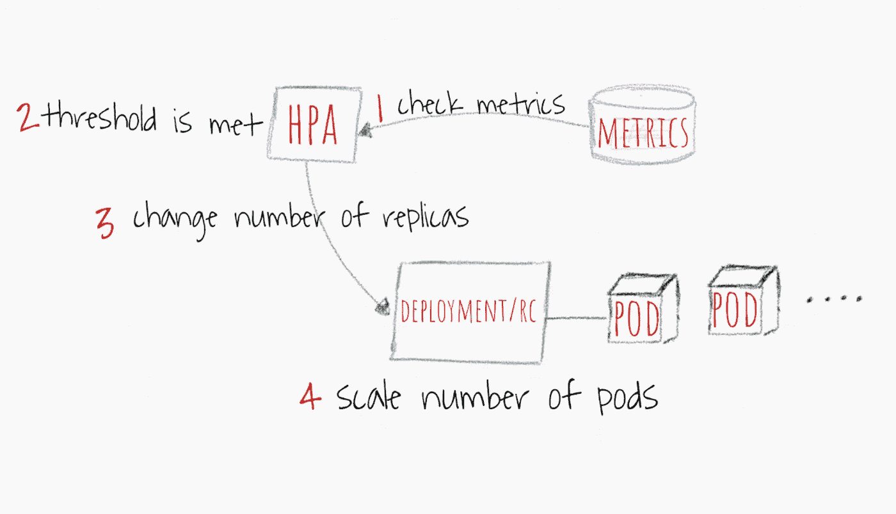
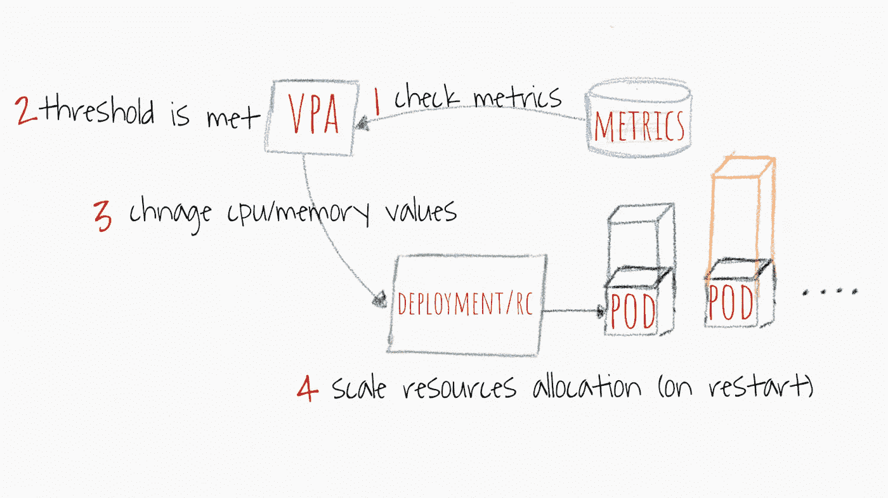
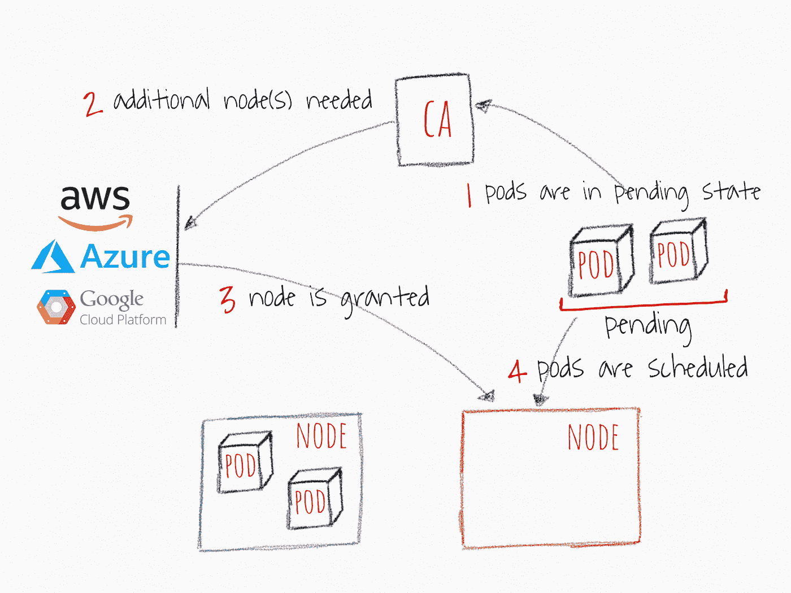
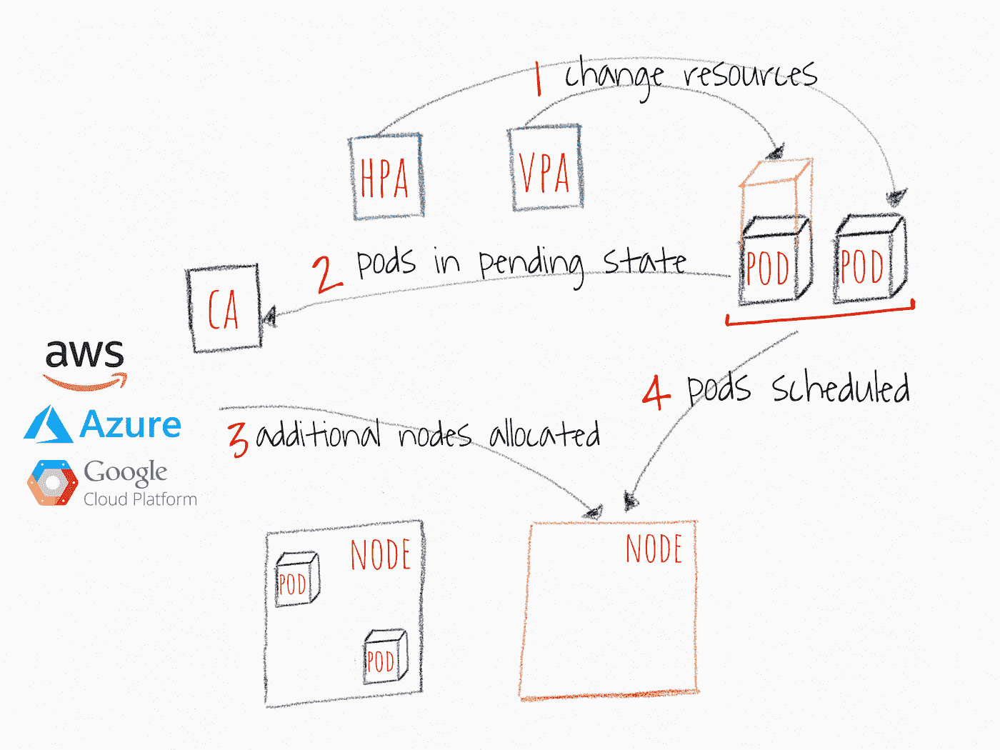

# Kubernetes 自动缩放 101:集群自动缩放、水平 Pod 自动缩放和垂直 Pod 自动缩放

> 原文：<https://levelup.gitconnected.com/kubernetes-autoscaling-101-cluster-autoscaler-horizontal-pod-autoscaler-and-vertical-pod-2a441d9ad231>

Kubernetes 的核心是一个资源管理和编排工具。专注于第一天的操作来探索和使用它的酷功能来部署、监控和控制你的吊舱是可以的。然而，你也需要考虑第二天的操作。你需要关注这样的问题:

*   我如何扩展 pod 和应用程序？
*   如何让容器保持健康的运行状态，高效的运行？
*   随着我的代码和用户工作负载的不断变化，我该如何跟上这些变化呢？

我在这篇文章中提供了 Kubernetes 内部不同可伸缩性机制的高层次概述，以及让它们满足您需求的最佳方式。请记住，要真正掌握 Kubernetes，您需要掌握不同的方法来管理集群资源的规模，这是 Kubernetes 的核心承诺。

> 配置 Kubernetes 集群以平衡资源和性能是一项挑战，需要 Kubernetes 内部工作的专业知识。仅仅因为你的应用或服务的工作负载不是恒定的，而是在一天中波动，如果不是一个小时的话。把它想象成一个旅程和持续的过程。

# Kubernetes 自动缩放构建模块

有效的 kubernetes 自动缩放需要两层可缩放性之间的协调:(1)Pod 层自动缩放器，这包括水平 Pod 自动缩放器(HPA)和垂直 Pod 自动缩放器(VPA)；两者都可以扩展容器的可用资源，以及(2)集群级可伸缩性，由集群自动缩放器(CA)管理；它可以增加或减少集群中的节点数量。

# 水平 Pod 自动缩放器(HPA)

顾名思义，HPA 缩放 pod 副本的数量。大多数 DevOps 使用 CPU 和内存作为触发器来扩展更多或更少的 pod 副本。但是，您可以将其配置为基于[自定义指标](https://pxlme.me/qtqOaC7W)、[多重指标](https://pxlme.me/G2b73WcG)，甚至[外部指标](https://pxlme.me/9hZPjDfF)来扩展您的 pod。

# 高级 HPA 工作流

HPA 高级工作流

1.  HPA 会以默认的 30 秒间隔持续检查您在设置过程中配置的指标值
2.  如果达到指定的阈值，HPA 会尝试增加机架的数量
3.  HPA 主要更新部署或复制控制器中的副本数量
4.  然后，部署/复制控制器将部署任何额外的所需单元

**在推广 HPA 时考虑这些因素:**

*   默认的 HPA 检查间隔是 30 秒。这可以通过 controller manager 的—horizontal-pod-auto scaler-sync-period 标志进行配置
*   默认 HPA 相对指标容差为 10%
*   HPA 在最后一次扩展事件后会等待 3 分钟，以便指标稳定下来。这也可以通过—水平-pod-自动缩放-上调-延迟标志进行配置
*   HPA 从最后一次缩小事件开始等待 5 分钟，以避免自动缩放抖动。可配置通过—水平-pod-自动缩放-向下缩放-延迟标志
*   HPA 最适合部署对象，而不是复制控制器。不支持使用复制控制器直接操作的滚动更新。进行部署时，管理底层副本集的大小取决于部署对象

# 自动缩放垂直豆荚

垂直单元自动缩放(VPA)为现有单元分配更多(或更少)的 cpu 或内存。可以把它想象成给 pods 一些生长激素:)它可以为有状态和无状态的 pods 工作，但是它主要是为有状态服务构建的。但是，如果您想对最初分配给您的 pod 的资源实现自动更正，您也可以将它用于无状态 pod。VPA 还可以对 OOM(内存不足)事件做出反应。VPA 当前要求重新启动 pod 以更改分配的 cpu 和内存。当 VPA 重启吊舱时，它会考虑[吊舱分配预算](https://kubernetes.io/docs/concepts/workloads/pods/disruptions/) (PDB)，以确保始终有所需的最小吊舱数量。您可以设置 VPA 可以分配给任何您的 pod 的最小和最大资源。例如，您可以将最大内存限制为不超过 8 GB。当您知道当前节点无法为每个容器分配超过 8 GB 的容量时，这一点尤其有用。阅读 [VPA 官方维基页面](https://github.com/kubernetes/community/blob/master/contributors/design-proposals/autoscaling/vertical-pod-autoscaler.md)了解详细的规格和设计。

VPA 还有一个有趣的功能，叫做 VPA 推荐。它监视所有 pod 的历史资源使用和 OOM 事件，以建议“请求”资源规范的新值。推荐器通常使用一些智能算法来根据历史指标计算内存和 cpu 值。它还提供了一个 API，该 API 接受 pod 描述符并提供建议的资源请求。

> 值得一提的是，VPA 推荐器并不致力于设置资源的“限制”。这可能会导致 pod 垄断节点内的资源。我建议您在名称空间级别设置一个“limit”值，以避免内存或 CPU 的疯狂消耗

# 高级 VPA 工作流

VPA 高级工作流

1.  VPA 会以默认的 10 秒间隔持续检查您在设置过程中配置的指标值
2.  如果达到阈值，VPA 会尝试更改分配的内存和/或 CPU
3.  VPA 主要更新部署或复制控制器规格中的资源
4.  当 pod 重新启动时，新的资源将全部应用于创建的实例。

**推广 VPA 时需要考虑的几点:**

*   如果不重新启动 pod，还无法更改资源。到目前为止，主要的合理解释是，这种变化可能会造成很多不稳定。因此，重新启动 pod 并根据新分配的资源进行调度的想法。
*   VPA 和 HPA 还不能互相兼容，不能在同一个 pod 上工作。如果在同一个集群中使用它们，请确保在设置中分隔它们的作用域。
*   VPA 仅根据观察到的过去和当前资源使用情况来调整集装箱的资源请求。它没有设置资源限制。这对于行为不当的应用程序来说是个问题，这些应用程序开始使用越来越多的资源，导致 pods 被 Kubernetes 杀死。
*   VPA 正处于早期阶段。它将在接下来的几个月里不断发展，请做好准备:)关于已知局限性的详细信息可以在[这里](https://github.com/kubernetes/autoscaler/tree/master/vertical-pod-autoscaler#known-limitations-of-the-alpha-version)找到，关于未来工作的详细信息[这里](https://github.com/kubernetes/community/blob/master/contributors/design-proposals/autoscaling/vertical-pod-autoscaler.md#future-work)找到

# 集群自动缩放器

Cluster Autoscaler (CA)基于挂起的 pod 来扩展集群节点。它定期检查是否有任何未决的 pod，如果需要更多的资源，并且如果按比例扩大的集群仍然在用户提供的约束内，则增加集群的大小。CA 与云提供商交互以请求更多节点或取消分配空闲节点。它与 GCP、AWS 和 Azure 兼容。kubernetes 1.8 发布了 1.0 版(GA)。

# **高级 CA 工作流**

1.  CA 以 10 秒的默认间隔检查处于挂起状态的 pod。
2.  如果由于群集上没有足够的可用资源来分配资源而导致一个或多个单元处于挂起状态，则它会尝试调配一个或多个额外的节点。
3.  当云提供商授予该节点时，该节点将加入集群，并准备好为 pods 提供服务。
4.  Kubernetes 调度程序将挂起的 pod 分配给新节点。如果一些 pod 仍处于挂起状态，则重复该过程，并将更多节点添加到集群中。

**在推广 CA 时考虑这些因素**

*   Cluster Autoscaler 确保集群中的所有单元都有一个运行的地方，无论是否有 CPU 负载。此外，它试图确保集群中没有不需要的节点。(来源)
*   CA 在大约 30 秒内实现了可伸缩性需求。
*   默认情况下，CA 会在节点变得不再需要后等待 10 分钟，然后再将其缩减。
*   CA 有扩展器的概念。扩展器提供不同的策略来选择要添加新节点的节点组。
*   负责任地使用" cluster-auto scaler . kubernetes . io/safe-to-evict ":" true "。如果您在所有节点上设置了许多或足够多的 pod，您将失去很大的伸缩灵活性。
*   使用 [PodDisruptionBudgets](https://kubernetes.io/docs/concepts/workloads/pods/disruptions/) 来防止 pod 被删除，并最终导致部分应用程序完全无法运行。

# Kubernetes 自动缩放器如何相互作用

如果您想达到 nirvana 自动缩放您的 Kubernetes 集群，您将需要使用 pod 层自动缩放器和 CA。如下图所示，它们之间的工作方式相对简单。

1.  HPA 或 VPA 更新分配给现有 pod 的 pod 副本或资源。
2.  如果没有足够的节点来运行 pods post 可伸缩性事件，CA 会发现一些或所有可伸缩的 pods 处于挂起状态。
3.  CA 分配新节点
4.  pod 在调配的节点上进行调度。

# 常见错误

我在不同的论坛上看到过，如 Kubernetes slack channels 和 StackOverflow 问题，这是由于许多开发者在使用自动秤时忽略了一些事实而导致的常见问题。

HPA 和 VPA 依赖于指标和一些历史数据。如果你没有分配足够的资源，你的 pods 将会被 OOM 杀死，并且永远没有机会生成指标。在这种情况下，你的音阶可能永远不会出现。

向上扩展通常是一项时间敏感的操作。您希望您的 pods 和集群能够在您的用户体验到应用程序的任何中断或崩溃之前快速伸缩。您应该考虑扩展您的 pod 和集群所需的平均时间。

**最佳情况——4 分钟**

1.  30 秒—目标指标值更新:30–60 秒
2.  30 秒— HPA 检查度量值:30 秒-->
3.  < 2 seconds — pods created and goes into pending state — 1 second
4.  < 2 seconds — CA sees the pending pods and fires up the calls to provision nodes — 1 second
5.  3 minutes — Cloud provider provision the nodes & K8 waits for them till they are ready: up to 10 minutes (depends on multiple factors)

**(合理的)最坏情况— 12 分钟**

1.  60 秒—目标指标值已更新
2.  30 秒— HPA 检查指标值
3.  < 2 秒—pod 已创建并进入挂起状态
4.  不到 2 秒— CA 看到挂起的 pod 并启动调用以配置节点
5.  10 分钟—云提供商调配节点，K8 等待节点准备就绪(取决于多种因素，如提供商延迟、操作系统延迟、引导工具等。)

不要将云提供商的可扩展性机制与 CA 混淆。CA 在您的集群内工作，而云提供商的可伸缩性机制(如 AWS 内的 ASG)基于节点分配工作。它不知道您的 pod 或应用程序发生了什么。一起使用它们会使您的集群不稳定，并且难以预测行为。

# TL；速度三角形定位法(dead reckoning)

*   Kubernetes 是一个资源管理和编排工具。第 2 天的运营管理您的 pod 和集群的资源是您掌握 Kubernetes 之旅中的一个重要里程碑。
*   记住正确的思维模式，重点关注使用 HPA 和 VPA 的 pods 可扩展性。
*   如果您非常了解您的 pod 和容器需求，建议使用 CA。
*   了解不同的自动缩放器如何协同工作将有助于您配置集群。
*   当谈到您的 pod 和集群需要多长时间来扩展或缩减时，请确保您计划了最坏和最好的情况。