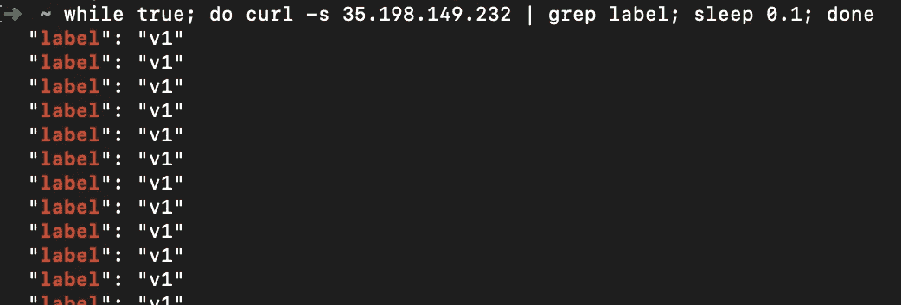

# Kubernetes 金丝雀部署#1 Gitlab CI

> 原文：<https://levelup.gitconnected.com/kubernetes-canary-deployment-1-gitlab-ci-518f9fdaa7ed>

## 我们使用 GitlabCI 和手动 GitOps 方法来实现和执行 Canary Kubernetes 部署


https://unsplash.com/photos/V41PulGL1z0

## 部件

1.  (本文)
2.  [用 ArgoCI 部署金丝雀](https://codeburst.io/kubernetes-canary-deployment-2-argo-rollouts-5e68e99b4fa3?source=friends_link&sk=58557d4fa81ff77382e59e1258c06d61)
3.  [使用 Istio 部署金丝雀](https://medium.com/@wuestkamp/kubernetes-istio-canary-deployment-5ecfd7920e1c?source=friends_link&sk=2be48393ac175a2199bf5d486cb91acf)
4.  [使用 Jenkins-X Istio Flagger 部署金丝雀](https://medium.com/@wuestkamp/jenkins-x-istio-flagger-canary-deployment-9d5e187c2334?source=friends_link&sk=fa0cf82c7051958b0a98e205375cba86)

我们将使用手动方法并更改/创建 core-Kubernetes 资源来执行 Canary 部署。**这主要是为了理解**Canary 部署是如何工作的，有更好的自动化方法，我们将在以后的文章中探讨。

# 金丝雀部署

在 Canary 部署中，新的变更首先被部署到用户的子集。通过监控、记录、手动测试或其他反馈渠道，在向所有用户推广之前对发布进行测试。


[https://www.norberteder.com/canary-deployment/](https://www.norberteder.com/canary-deployment/)

# Kubernetes 部署(滚动更新)

Kubernetes 部署的默认策略是滚动更新，即启动一定数量的带有新映像版本的 pod。如果创建时没有问题，旧映像版本的窗格将被终止，同时会创建新的窗格。

# GitOps

我们在本例中使用 GitOps 是因为我们:

*   使用 Git 作为事实的单一来源
*   使用 git 操作进行构建和部署(除了 Git 标记/合并之外，部署不需要任何操作)

# 例子

一个存储库用于应用程序代码，一个用于基础设施，这是很好的实践。

## 应用程序报告

[](https://gitlab.com/wuestkamp/k8s-deployment-example-app) [## Kim Wuestkamp/k8s-部署-示例-应用程序

### GitLab.com

gitlab.com](https://gitlab.com/wuestkamp/k8s-deployment-example-app) 

这是一个非常简单的 Python+Flask api，它返回一个 JSON 响应。我们使用 GitlabCI 构建包，并将结果推入 Gitlab 注册表。在注册表中发布了两个不同的版本:

*   `wuestkamp/k8s-deployment-example-app:v1`
*   `wuestkamp/k8s-deployment-example-app:v2`

两个版本之间唯一的区别是返回的 JSON 发生了变化。我们使用这个应用程序来非常简单地可视化我们正在谈论的版本。

## 基础设施回购

[](https://gitlab.com/wuestkamp/k8s-deployment-example-canary-infrastructure) [## Kim Wuestkamp/k8s-部署-示例-canary-基础设施

### GitLab.com

gitlab.com](https://gitlab.com/wuestkamp/k8s-deployment-example-canary-infrastructure) 

在这个报告中，我们使用 GitlabCI 进行 Kubernetes 部署，`.gitlab-ci.yml`看起来像:

```
**image**: traherom/kustomize-docker

**before_script**:
    - printenv
    - kubectl version

**stages**:
  - deploy

**deploy test**:
    **stage**: deploy
    **before_script**:
      - echo $KUBECONFIG
    **script**:
      - kubectl get all
      - kubectl apply -f i/k8s

    **only**:
      - master
```

要自己运行，首先需要一个集群，可以使用 Gcloud:

```
gcloud container clusters create canary --num-nodes 3 --zone europe-west3-bgcloud compute firewall-rules create incoming-80 --allow tcp:80
```

您需要派生[https://git lab . com/wuestkamp/k8s-deployment-example-canary-infra structure](https://gitlab.com/wuestkamp/k8s-deployment-example-canary-infrastructure)并创建一个名为`KUBECONFIG`(类型文件)的 GitlabCI 变量，该变量应该包含对集群的`kubectl`访问配置。

[阅读本](https://medium.com/faun/manually-connect-to-your-kubernetes-cluster-from-the-outside-d852346a7f0a)了解如何获得您的(Gcloud)集群证书。

## 基础设施 Yaml

在基础设施回购中，我们有一项服务:

```
**apiVersion**: v1
**kind**: Service
**metadata**:
  **labels**:
    **id**: app
  **name**: app
**spec**:
  **ports**:
  - **port**: 80
    **protocol**: TCP
    **targetPort**: 5000
  **selector**:
    **id**: app
  **type**: LoadBalancer
```

还有一个部署`deploy.yaml`:

```
apiVersion: apps/v1
kind: Deployment
metadata:
  name: app
spec:
 **replicas: 10**
  selector:
    matchLabels:
      id: app
 **type: main**
  template:
    metadata:
      labels:
        id: app
 **type: main**
    spec:
      containers:
 **- image: registry.gitlab.com/wuestkamp/k8s-deployment-example-app:v1**
        name: app
        resources:
          limits:
            cpu: 100m
            memory: 100Mi
```

还有另一个部署`deploy-canary.yaml`:

```
apiVersion: apps/v1
kind: Deployment
metadata:
  name: app-canary
spec:
 **replicas: 0**
  selector:
    matchLabels:
      id: app
 **type: canary**
  template:
    metadata:
      labels:
        id: app
 **type: canary**
    spec:
      containers:
 **- image: registry.gitlab.com/wuestkamp/k8s-deployment-example-app:v2**
        name: app
        resources:
          limits:
            cpu: 100m
            memory: 100Mi
```

注意到`app-deploy`到目前为止还没有定义副本。

# 执行初始部署

要执行初始部署，您可以为主分支手动运行 GitlabCI 管道。在此之后`kubectl`应该会导致:


我们看到`app`部署有 10 个副本，而`app-deployment`部署有 0 个副本。还有一个负载平衡器，我们可以在外部 IP 上`curl`:

```
while true; do curl -s 35.198.149.232 | grep label; sleep 0.1; done
```



我们看到我们的测试应用程序只返回“v1”。

# 执行金丝雀部署

## 步骤 1:向用户子集发布新版本

我们在文件`deploy-canary.yaml`中将副本数量设置为 1，并将映像设置为新版本:

```
apiVersion: apps/v1
kind: Deployment
metadata:
  name: app-canary
spec:
 **replicas: 1**
  selector:
    matchLabels:
      id: app
      type: canary
  template:
    metadata:
      labels:
        id: app
        type: canary
    spec:
      containers:
 **- image: registry.gitlab.com/wuestkamp/k8s-deployment-example-app:v2**
        name: app
        resources:
          limits:
            cpu: 100m
            memory: 100Mi
```

在`deploy.yaml`中，我们将副本更改为 9:

```
apiVersion: apps/v1
kind: Deployment
metadata:
  name: app
spec:
 **replicas: 9**
  selector:
    matchLabels:
      id: app
...
```

我们将这一变更推进到将部署(通过 GitlabCI)的 repo 中，结果是:


我们的服务将指向两个部署，因为只有一个选择器标签`id: app`。由于 Kubernetes 默认的随机请求分布，我们应该在大约 10%的请求中看到不同的响应:


我们的应用程序(GitOps，致力于将 Git 作为真实的单一来源)的当前状态是，我们有两个带有活动副本的部署，每个版本一个。

~10%的用户接触到新版本，不由自主地进行测试。现在是检查错误、日志和监控以查找问题的时候了。

## 步骤 2:向所有用户发布新版本

我们认为一切进展顺利，并将向所有用户部署新版本。为此，我们只需将`deploy.yaml`更新为新的镜像版本，并将副本设置为 10。在`deploy-canary.yaml`中，我们将副本设置回 0。部署后的结果是:


# 概述

对我来说，手动运行这种部署有助于理解使用 k8s 进行配置是多么容易。因为 Kubernetes 允许通过 API 更新一切，所以这些步骤也可以通过脚本自动化。

要实现的另一件事是一个测试入口点(LoadBalancer 或 via Ingress ),它只公开新版本。这可用于人工审查。

在接下来的文章中，我们将检查其他自动化解决方案，它们处理了我们所做的大部分工作。