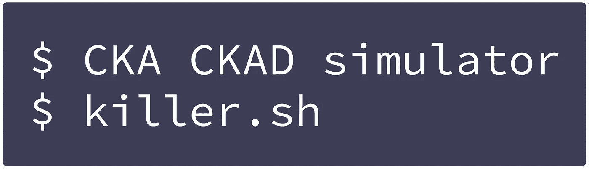

# Kubernetes:使用 Kustomize 更改不同环境生产/测试的基本 YAML 配置

> 原文：<https://levelup.gitconnected.com/kubernetes-change-base-yaml-config-for-different-environments-prod-test-6224bfb6cdd6>

我们希望有一个基本的配置 YAML 文件，然后我们希望根据环境的变化。我们将使用 *Kustomize* 作为工具来完成这项工作。


## 内容

*   第一部分:[将多个 YAML 文件合并成一个](/kubernetes-merge-multiple-yaml-into-one-e8844479a73a)
*   第 2 部分(本文):为不同环境更改基本 YAML 配置

## 安装 Kustomize

确保安装最新的`kubectl`，因为 *Kustomize* 已经包含在内(`kubectl kustomize`)。否则[手动安装](https://github.com/kubernetes-sigs/kustomize)。

## Kustomize 需要什么服务器端？

没什么。Kustomize 所做的只是将各种 YAML 文件合并成一个。然后你可以`kubectl apply -f merged.yaml`这个文件。无论您是手动创建`merged.yaml`还是使用 *Kustomize* 都没关系。

## 今天的场景

我们将有三种环境:

*   **base** :包含一套 YAML 配置，其他环境可以基于该配置
*   **测试**:扩展基地，会改变基地部署的图像
*   扩展基础，将改变形象，服务类型，并增加一个全新的资源

## Github 项目

整个例子在这个回购中完成:[https://github.com/wuestkamp/kubernetes-kustomize-example](https://github.com/wuestkamp/kubernetes-kustomize-example)

# **基础包络**


创建一个包含三个文件的文件夹`base`:

`deployment.yaml`:

```
**apiVersion:** apps/v1
**kind:** Deployment
**metadata:
  name:** app
**spec:
  replicas:** 1
  **selector:
    matchLabels:
      id:** app
  **template:
    metadata:
      labels:
        id:** app
    **spec:
      containers:** - **image:** XXX # needs to be overridden by environments
        **name:** nginx
```

`service.yaml`:

```
**apiVersion:** v1
**kind:** Service
**metadata:
  labels:
    app:** service
  **name:** service
**spec:
  ports:** - **name:** 80-80
    **port:** 80
    **protocol:** TCP
    **targetPort:** 80
    **nodePort:** 30080
  **selector:
    id:** app
  **type:** NodePort
```

`kustomize.yaml`:

```
**apiVersion:** kustomize.config.k8s.io/v1beta1
**kind:** Kustomization

**resources:** - deployment.yaml
  - service.yaml
```

现在，当我们运行`kubectl kustomize build base`时，它将输出一个包含服务和部署的多资源文件。但是部署它会非常失败，因为有一个错误的映像名称集:

编译的基本环境 yaml

# 测试环境


创建一个新文件夹`overlays`。在其中创建一个新的子文件夹`test`和两个文件:

> 使用名为`overlays`的文件夹似乎很常见，但是您可以根据自己的喜好命名和更改目录结构。

`deployment.yaml`:

```
apiVersion: apps/v1
kind: Deployment
metadata:
  **name: app # necessary for Kustomize identification**
spec:
  template:
    spec:
      containers:
      - **image: nginx:1.17.3**
        **name: nginx # necessary for Kustomize identification**
```

`kustomization.yaml`:

```
**apiVersion:** kustomize.config.k8s.io/v1beta1
**kind:** Kustomization

**bases:** - ../../base # relative path to the base folder

**patchesStrategicMerge:** - deployment.yaml
```

运行`kubectl kustomize build overlays/test`现在将使用**所有的**基础资源，并只替换部署到 nginx:1.17.3 的映像名称，结果应该是:

编译的测试环境 yaml

因为我们为部署定义了一个 **patchesStrategicMerge** 条目， *Kustomize* 将查找文件`deployment.yaml`并覆盖来自基础`deployment.yaml`的指定值。name 属性对于指定要被覆盖的资源标识非常重要。

# 产品环境


在生产方面，我们希望做得更多。我们希望替换映像名称、副本数量、服务类型并添加新资源。为此，我们创建了四个文件:

`deployment.yaml`:

```
apiVersion: apps/v1
kind: Deployment
metadata:
  name: app
spec:
  **replicas: 3**
  template:
    spec:
      containers:
      - **image: nginx:stable**
        name: nginx
```

`service.yaml`:

```
apiVersion: v1
kind: Service
metadata:
  name: service
spec:
  **type: LoadBalancer**
```

`storage.yaml:`

```
**apiVersion:** v1
**kind:** PersistentVolumeClaim
**metadata:
  name:** pvc
**spec:
  accessModes:** - ReadWriteOnce
  **resources:
    requests:
      storage:** 1Mi
```

`kustomization.yaml`:

```
**apiVersion:** kustomize.config.k8s.io/v1beta1
**kind:** Kustomization

**bases:** - ../../base

**resources:** - storage.yaml # a new resource

**patchesStrategicMerge:** - deployment.yaml
  - service.yaml
```

现在运行`kubectl kustomize build overlays/prod`将编译生产 yaml，看起来应该是这样的:

编译产品环境 yaml

# 部署

要部署环境配置，您可以运行:

```
kubectl kustomize build overlays/prod | kubectl apply -f -
```

或者

```
kubectl kustomize build overlays/prod > tmp_prod.yaml
kubectl apply -f tmp_prod.yaml
```

# 总是有更多的

我们只用了一个补丁策略(patchesStrategicMerge)，但是还有一个 [JSON 补丁一](https://github.com/kubernetes-sigs/kustomize/blob/master/docs/glossary.md#patchjson6902)。

# 模板化与库斯托米化

当使用 *Helm* 作为模板引擎时，YAML 文件很快会变得非常难看，看看这个例子。

使用 *Kustomize* 可以更容易地保持配置的整洁，当然这总是取决于用例。

# 结束了。

您是否在生产中使用 *Kustomize* ？

# 成为 Kubernetes 认证

[](https://killer.sh)

[https://killer.sh](https://killer.sh)