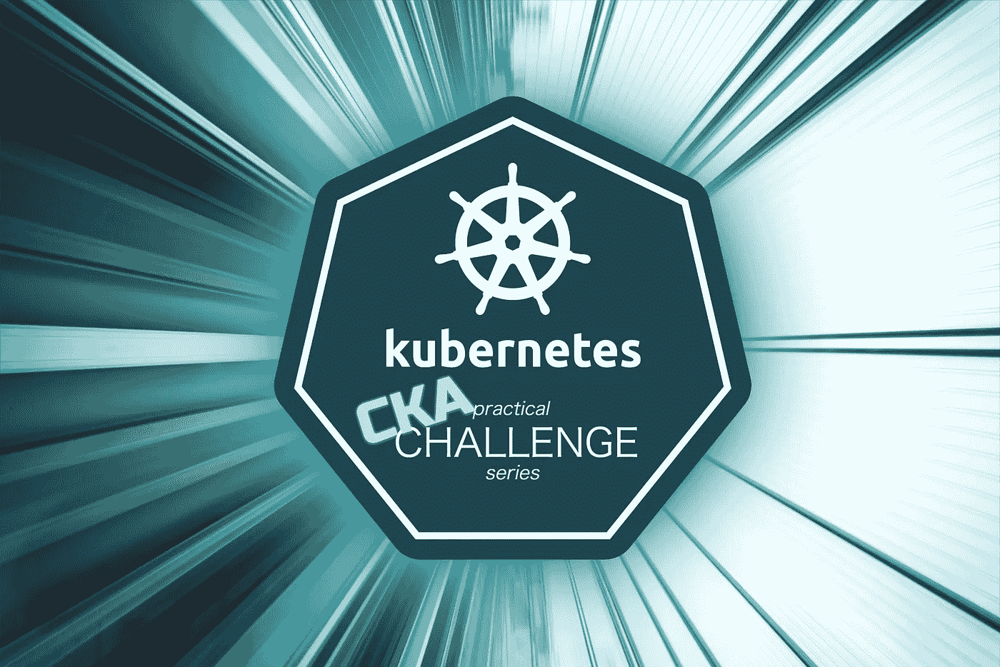
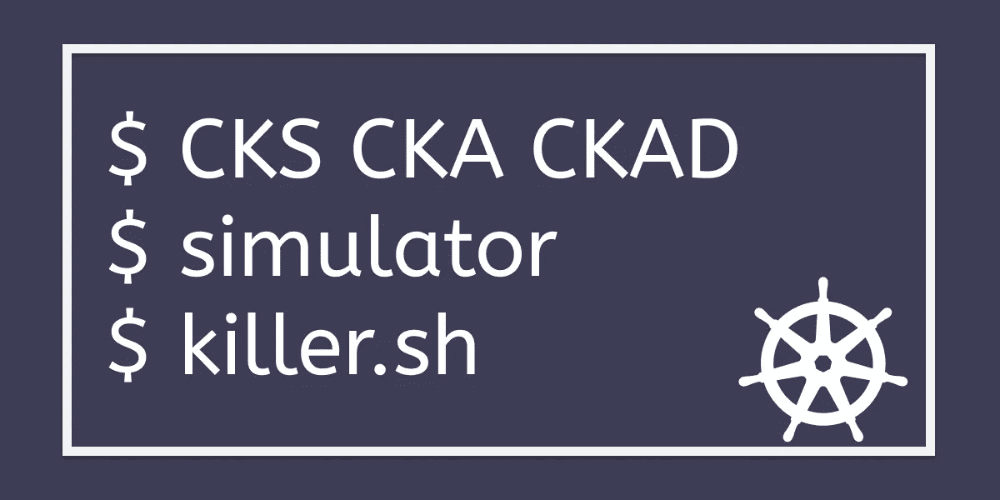

# Kubernetes CKA 示例试题实践挑战

> 原文：<https://levelup.gitconnected.com/kubernetes-cka-example-questions-practical-challenge-86318d85b4d>

> [CKS 考试系列](https://killer.sh/r?d=cks-series) | [CKA 考试系列](https://killer.sh/r?d=cka-series) | [CKAD 考试系列](https://killer.sh/r?d=ckad-series)

**## # # # # # # # # # # # # # # # # # # # ##**

**此挑战不会在此更新，将移至:**

[https://killercoda.com/killer-shell-cka](https://killercoda.com/killer-shell-cka)

**## # # # # # # # # # # # # # # # # # # # # # # ##**

**CKA 考试就是要获得足够的实践经验**

## 内容

[概述和提示](https://wuestkamp.medium.com/kubernetes-cka-example-questions-practical-challenge-86318d85b4d?source=friends_link&sk=cb63eb0edd1210851f01df24b2142db2)

1.  [多集装箱发货](https://medium.com/faun/kubernetes-cka-hands-on-challenge-1-multi-container-issue-5a8c007686ed?source=friends_link&sk=09c7599363ac101fb8ff88b4b63ac917)
2.  [调度操场](/kubernetes-cka-hands-on-challenge-2-scheduler-playground-f6c0ea7389ca?source=friends_link&sk=83a5765cd5e1dc4e82b0c63fe2ddcfbe)
3.  [高级调度](https://codeburst.io/kubernetes-cka-hands-on-challenge-3-advanced-scheduling-3fbeb67f2f2?source=friends_link&sk=afaf807f50d5719fdc7154fd9e8c88e6)
4.  [节点管理](https://medium.com/@wuestkamp/kubernetes-cka-hands-on-challenge-4-node-management-df7bf48897d3?source=friends_link&sk=68fe7bbbcb617cd07f8964e8e219ed70)
5.  [管理证书](https://medium.com/@wuestkamp/kubernetes-cka-hands-on-challenge-5-manage-certificates-8d756d842138?source=friends_link&sk=d203639188e4be533e3cd4a0e172ead4)
6.  [Pod 优先级](https://medium.com/@wuestkamp/kubernetes-cka-hands-on-challenge-6-pod-priority-1fe95f613ac5?source=friends_link&sk=7f9ea22abbe4b0c5c1758e756c3ff2cf)
7.  [RBAC](https://medium.com/@wuestkamp/kubernetes-cka-hands-on-challenge-7-rbac-ac1cf1684dd5?sk=3b83a0a1f4e2059f1176e3ab4f5f82d6)
8.  [>>><<<](https://killercoda.com/killer-shell-cka)

[**快于 Kubectl ≥ 1.18**](https://medium.com/@wuestkamp/be-fast-with-kubectl-1-18-ckad-cka-31be00acc443?source=friends_link&sk=a66ae3c7b7ee85cb9c43129e7cf406e6)

## 您将启动自己的集群

每个任务在开始时都有说明，解释如何使用 vagger 和 VirtualBox 设置测试环境。这是一个深入探索 Kubernetes 的好方法，因为您可以完全访问自己的主节点和工作节点。

您还可以将该环境用于不仅仅是所提供的场景，思考并解决您自己的问题！

## 为什么要跳 CKA？

CKA 很难，但却是一个有价值的认证。它的神奇之处在于它的动手性和实用性，也就是说不需要死记硬背和选择题。考试期间，你可以在[https://kubernetes.io/docs](https://kubernetes.io/docs)使用完整的文档。

您将体验 kubectl，掌握 Kubernetes 资源以及集群设置和故障排除等管理任务的知识。

你将获得一个浏览器终端和各种场景，你有 180 分钟的时间来解决。

## 更多挑战

如需完整的模拟 CKA 环境，请查看:

# 更多挑战

[https://killer.sh](https://killer.sh)