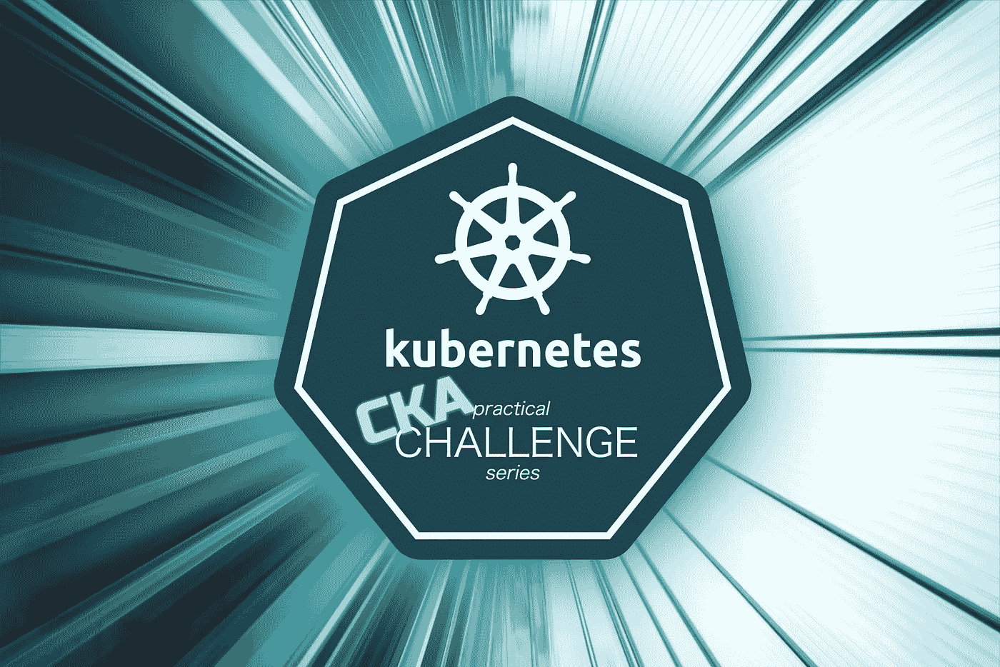

# Kubernetes CKA 动手挑战#2 调度操场

> 原文：<https://levelup.gitconnected.com/kubernetes-cka-hands-on-challenge-2-scheduler-playground-f6c0ea7389ca>



> [CKS 考试系列](https://killer.sh/r?d=cks-series) | [CKA 考试系列](https://killer.sh/r?d=cka-series) | [CKAD 考试系列](https://killer.sh/r?d=ckad-series)

**## # # # # # # # # # # # # # # # # # # # ##**

**此挑战不会在此更新，将移至:**

[https://killercoda.com/killer-shell-cka](https://killercoda.com/killer-shell-cka)

**## # # # # # # # # # # # # # # # # # # # # # # ##**

## 内容

[你应该连接成`root@cluster1-master1`。您可以使用 root 连接到其他工作节点，比如`ssh root@cluster1-worker1`](https://wuestkamp.medium.com/kubernetes-cka-example-questions-practical-challenge-86318d85b4d# kubectl get node</span></pre><p id=)

[如果你想再破坏环境就跑`./down.sh`。你应该在使用后破坏环境，这样就不会再有更多的资源被使用了！](https://wuestkamp.medium.com/kubernetes-cka-example-questions-practical-challenge-86318d85b4d# kubectl get node</span></pre><p id=)

# [今天的任务:日程安排游乐场](https://wuestkamp.medium.com/kubernetes-cka-example-questions-practical-challenge-86318d85b4d# kubectl get node</span></pre><p id=)

1.  [名称空间管理中有多少 pod 和服务？创建一个使用 jsonpath 输出数字的命令。](https://wuestkamp.medium.com/kubernetes-cka-example-questions-practical-challenge-86318d85b4d# kubectl get node</span></pre><p id=)
2.  [有多少调度程序正在运行？找出每个开始的参数。](https://wuestkamp.medium.com/kubernetes-cka-example-questions-practical-challenge-86318d85b4d# kubectl get node</span></pre><p id=)
3.  [在名称空间`development`中有一个名为`what-a-deployment`的现有部署。使用哪个调度程序来调度该部署的 pod？](https://wuestkamp.medium.com/kubernetes-cka-example-questions-practical-challenge-86318d85b4d# kubectl get node</span></pre><p id=)
4.  [使用调度器`kube-scheduler-amazing`在名称空间`development`中创建一个图像`nginx:1.16.1-alpine`的 pod，并检查它的运行以及它被分配到哪个节点。](https://wuestkamp.medium.com/kubernetes-cka-example-questions-practical-challenge-86318d85b4d# kubectl get node</span></pre><p id=)
5.  [使用调度器`kube-scheduler-none-existing`在名称空间`development`中创建另一个图像容器`nginx:1.16.1-alpine`。pod 处于什么状态，日志显示了什么？](https://wuestkamp.medium.com/kubernetes-cka-example-questions-practical-challenge-86318d85b4d# kubectl get node</span></pre><p id=)

# [解决办法](https://wuestkamp.medium.com/kubernetes-cka-example-questions-practical-challenge-86318d85b4d# kubectl get node</span></pre><p id=)

[以下命令将作为`root@cluster1-master1`执行:](https://wuestkamp.medium.com/kubernetes-cka-example-questions-practical-challenge-86318d85b4d# kubectl get node</span></pre><p id=)

```
alias k=kubectl
```

## [1.](https://wuestkamp.medium.com/kubernetes-cka-example-questions-practical-challenge-86318d85b4d# kubectl get node</span></pre><p id=)

```
k -n management get pod,svc # we can manually count
```

[但是要做一些 jsonpath 的魔术:](https://wuestkamp.medium.com/kubernetes-cka-example-questions-practical-challenge-86318d85b4d# kubectl get node</span></pre><p id=)

```
k -n management get pod,svc -o jsonpath="{range .items[*]}{.metadata.name}{'\n'}" | wc -l
```

[我们看到 13 个 pod 和服务。](https://wuestkamp.medium.com/kubernetes-cka-example-questions-practical-challenge-86318d85b4d# kubectl get node</span></pre><p id=)

## [2.](https://wuestkamp.medium.com/kubernetes-cka-example-questions-practical-challenge-86318d85b4d# kubectl get node</span></pre><p id=)

```
k -n kube-system get pod | grep scheduler
```

[我们看到两个豆荚，`kube-scheduler-amazing-cluster1-master1`和`kube-scheduler-cluster1-master1`。在后缀上，我们可以看到这些是静态 pod，因此:](https://wuestkamp.medium.com/kubernetes-cka-example-questions-practical-challenge-86318d85b4d# kubectl get node</span></pre><p id=)

```
/etc/kubernetes/manifests/kube-scheduler-amazing.yaml
/etc/kubernetes/manifests/kube-scheduler.yaml
```

[这些文件包含调度程序所需的参数。注意，这是 kubelet 查找静态窗格的默认清单目录，可以通过向 kubelet 传递一个参数来更改。](https://wuestkamp.medium.com/kubernetes-cka-example-questions-practical-challenge-86318d85b4d# kubectl get node</span></pre><p id=)

## [3.](https://wuestkamp.medium.com/kubernetes-cka-example-questions-practical-challenge-86318d85b4d# kubectl get node</span></pre><p id=)

```
k -n development get deploy what-a-deployment -o yamlk -n development get deploy what-a-deployment -o yaml | grep scheduler
```

[= >默认-调度程序](https://wuestkamp.medium.com/kubernetes-cka-example-questions-practical-challenge-86318d85b4d# kubectl get node</span></pre><p id=)

## [4.](https://wuestkamp.medium.com/kubernetes-cka-example-questions-practical-challenge-86318d85b4d# kubectl get node</span></pre><p id=)

```
k run pod --image=nginx:1.16.1-alpine --dry-run=client -o yaml > pod.yamlvim pod.yaml
```

[将 yaml 更改为:](https://wuestkamp.medium.com/kubernetes-cka-example-questions-practical-challenge-86318d85b4d# kubectl get node</span></pre><p id=)

```
apiVersion: v1
kind: Pod
metadata:
  creationTimestamp: null
  labels:
    run: pod
  name: pod
 **namespace: development** spec:
 **schedulerName: kube-scheduler-amazing**  containers:
  - image: nginx:1.16.1-alpine
    name: pod
    resources: {}
  dnsPolicy: ClusterFirst
  restartPolicy: Always
status: {}
```

[然后创建并检查分配的节点:](https://wuestkamp.medium.com/kubernetes-cka-example-questions-practical-challenge-86318d85b4d# kubectl get node</span></pre><p id=)

```
k -f pod.yaml create
k -n development get pod -o wide # show assigned node
k -n development get pod pod -o yaml | grep scheduler
```

[= > kube-scheduler-太棒了](https://wuestkamp.medium.com/kubernetes-cka-example-questions-practical-challenge-86318d85b4d# kubectl get node</span></pre><p id=)

[太好了，时间表起作用了。](https://wuestkamp.medium.com/kubernetes-cka-example-questions-practical-challenge-86318d85b4d# kubectl get node</span></pre><p id=)

## [5.](https://wuestkamp.medium.com/kubernetes-cka-example-questions-practical-challenge-86318d85b4d# kubectl get node</span></pre><p id=)

```
k run pod2 --image=nginx:1.16.1-alpine --dry-run=client -o yaml > pod2.yaml
```

[更改 yaml 以使用`kube-scheduler-none-existing`和正确的名称空间。然后运行它并检查状态和日志:](https://wuestkamp.medium.com/kubernetes-cka-example-questions-practical-challenge-86318d85b4d# kubectl get node</span></pre><p id=)

```
k -f pod2.yaml create
k -n development get pod pod2 -o wide # no node assigned
k -n development describe pod pod2
```

[日志不可用，因为容器甚至没有启动。Describe 实际上没有显示任何关于缺少的调度程序的信息。如果我们发现一个未决的 pod 并必须进行调查，我们将需要深入 yaml。](https://wuestkamp.medium.com/kubernetes-cka-example-questions-practical-challenge-86318d85b4d# kubectl get node</span></pre><p id=)

## [打扫](https://wuestkamp.medium.com/kubernetes-cka-example-questions-practical-challenge-86318d85b4d# kubectl get node</span></pre><p id=)

[运行:`./down.sh`。](https://wuestkamp.medium.com/kubernetes-cka-example-questions-practical-challenge-86318d85b4d# kubectl get node</span></pre><p id=)

[**全 CKA 挑战**](https://medium.com/@wuestkamp/kubernetes-cka-example-questions-practical-challenge-86318d85b4d?source=friends_link&sk=cb63eb0edd1210851f01df24b2142db2)

# 更多挑战

[](https://killer.sh)

[https://killer.sh](https://killer.sh)