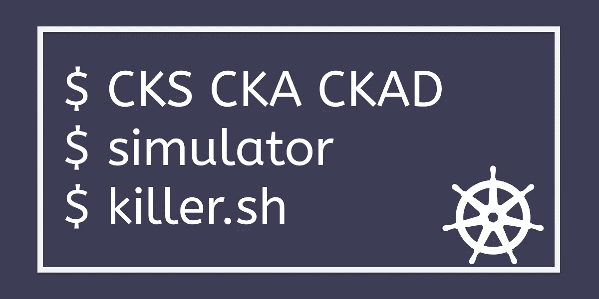

# Kubernetes CKAD 实践挑战#12 各种环境变量

> 原文：<https://levelup.gitconnected.com/kubernetes-ckad-hands-on-challenge-12-various-env-variables-463945052721>


> [CKS 考试系列](https://killer.sh/r?d=cks-series) | [CKA 考试系列](https://killer.sh/r?d=cka-series) | [CKAD 考试系列](https://killer.sh/r?d=ckad-series)

**## # # # # # # # # # # # # # # # # # # # ##**

**此挑战不会在此更新，将移至:**

[https://killercoda.com/killer-shell-ckad](https://killercoda.com/killer-shell-ckad)

**## # # # # # # # # # # # # # # # # # # # # # # ##**

## 挑战:

CREDENTIAL_004=QlIc3$5*+SKsw==9=p{
CREDENTIAL_005=C_2\a{]XD}1#9BpE[k?
CREDENTIAL_006=9*KD8_w<);ozb:ns;JC
CREDENTIAL_007=C[V$Eb5yQ)c~!..{LRT
SETTING_USE_SEC=true
SETTING_ALLOW_ANON=true
SETTING_PREVENT_ADMIN_LOGIN=true

# 今天的任务:在一个窗格中显示所有的键/值

1.  创建一个包含该文件中所有环境变量的密码
2.  创建一个图像包 nginx，使所有秘密条目都可以作为环境变量使用。例如可由`echo $CREDENTIAL_001`等使用…

# 解决办法

## # 1 创造秘密

```
**use kubectl >= 1.18**alias k=kubectlk create secret -h
k create secret generic -h
k create secret generic my-secret --from-env-file=env_file
```

这将创建一个类似如下的秘密 yaml:

```
**apiVersion:** v1
**data:
  CREDENTIAL_001:** LWJRKEVUTFBHRVt1VD82QztlZA==
  **CREDENTIAL_002:** Q187U1VAZXY3eWcuOG02aE5xUw==
  **CREDENTIAL_003:** WkEjJCQtTWw2ZXQmND9wS2R2eQ==
  **CREDENTIAL_004:** UWxJYzMkNSorU0tzdz09OT1wew==
  **CREDENTIAL_005:** Q18yXGF7XVhEfTEjOUJwRVtrPw==
  **CREDENTIAL_006:** OSpLRDhfdzwpO296YjpucztKQw==
  **CREDENTIAL_007:** Q1tWJEViNXlRKWN+IS4ue0xSVA==
  **SETTING_ALLOW_ANON:** dHJ1ZQ==
  **SETTING_PREVENT_ADMIN_LOGIN:** dHJ1ZQ==
  **SETTING_USE_SEC:** dHJ1ZQ==
**kind:** Secret
**metadata:
**  **name:** my-secret
  **namespace:** default
  **resourceVersion:** "7572"
**type:** Opaque
```

## # 2 创建一个 pod，它将每个秘密条目创建为一个 env 变量

```
k run nginx --image=nginx -oyaml --dry-run=client > nginx.yaml
```

这里的诀窍是使用`envFrom`而不是`env`来使用它们:

```
**apiVersion:** v1
**kind:** Pod
**metadata:
  creationTimestamp:** null
  **labels:
    run:** nginx
  **name:** nginx
**spec:
  containers:** - **image: nginx**
    **envFrom:**                # envFrom- **secretRef:
        name:** my-secret
    **name:** nginx
    **resources:** {}
  **dnsPolicy:** ClusterFirst
  **restartPolicy:** Always
**status:** {}
```

然后运行并测试:

```
k -f nginx.yaml createk exec nginx -- env
```


[**所有挑战和提示**](https://codeburst.io/kubernetes-ckad-weekly-challenges-overview-and-tips-7282b36a2681?source=friends_link&sk=5a98f575b6b438d5c022f94df2cd9d9b)

# 更多挑战

[](https://killer.sh)

[https://killer.sh](https://killer.sh)