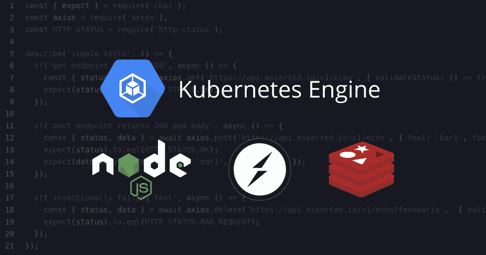
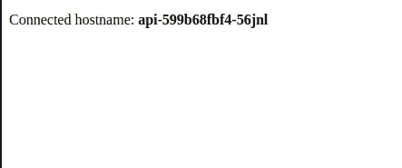

# 带有 Socket.io 和自动 SSL 的 Kubernetes 节点 API 集群

> 原文：<https://levelup.gitconnected.com/kubernetes-cluster-for-node-api-with-socket-io-and-automatic-ssl-3aa6e2310a6f>



完整的节点 API 示例，包含创建一个支持 socket.io/websockets 和自动 SSL 的廉价 Kubernetes 集群所需的所有配置文件。

> *所有代码和配置在* [*GitHub*](https://github.com/ehacke/node-gke-cluster) 上可用

作为免责声明，我不是说这是一个完美的适合每个人。不同的应用程序有不同的技术要求，以及不同的正常运行时间或可用性标准。

但是我的目标是概述廉价的 GKE 集群的基础知识，并考虑节点微服务。 [Asserted](https://asserted.io) 使用与此类似的配置来运行其所有微服务。

# 集群功能

*   [可抢占节点](https://cloud.google.com/kubernetes-engine/docs/how-to/preemptible-vms)降低成本(可选)
*   使用[谷歌托管证书](https://cloud.google.com/kubernetes-engine/docs/how-to/managed-certs) ‍的自动 SSL 管理
*   入口 websocket 粘性

## 为什么是集群？为什么不只是一个虚拟机呢？

如果你唯一考虑的是价格，那么使用虚拟机可能更便宜。然而，部署到一个集群中提供了许多优势，而不需要花费太多的钱。

GKE 集群为你提供了大量免费的东西，否则你将不得不自己动手或改造。

*   Dockerized 应用程序确保可移植和可复制的构建
*   部署在推出时会自动进行运行状况检查，如果出现问题，部署会停止
*   失败的实例会自动从负载平衡器中移除并重新启动
*   入口控制器可以自动提供和更新您的 SSL 证书
*   资源管理变得更加容易，因为单个应用程序可能会受到 CPU 或内存的限制，并在机器上进行优化分配
*   可以以最低的复杂性部署新的应用程序
*   高可用性变成了你愿意支付多少钱的问题，而不是一个工程问题

在我看来，反对这一切的唯一真正理由就是集群的成本。但是经过适当的配置，可以以最低的成本部署一个简单的集群。

## 高可用性

在这种情况下，我需要我的集群能够在不停机的情况下执行部署和节点更新，因为这两个事件可能相对频繁。

也就是说，我不需要也负担不起 100%的正常运行时间。我不需要多区冗余，也绝对不需要多云故障转移。如果能显著降低我的成本，我可以忍受大约一个月一次长达一分钟左右的意外停机风险。

如果您将所有服务设计为无状态，并利用 Cloud PubSub 对工作进行排队，而不是通过 HTTP 直接调用其他服务，则有可能让整个微服务的 pods 在一两分钟内变得不可用，而不会产生任何持久的(或者甚至是明显的)影响。

## 可抢占的节点

这是一个可选步骤，但却是节省大量成本的来源。可抢占的 e2-small 的成本是标准虚拟机的 30%。但是伴随而来的是一些警告:

*   **可抢占的节点可以随时被杀死。**甚至在开始的几分钟内(虽然在我的经验中很少见)。‍
*   **谷歌声称他们总是在 24 小时内重启实例**，尽管我发现这并不总是 case‍
*   可抢占的节点可能并不总是可用的。对于较大的虚拟机来说，这似乎是一个更大的问题，我从未见过较小的虚拟机出现这种问题。

如果您的服务是无状态的，这应该不是什么大问题。唯一真正的问题是，如果节点的生命周期是同步的，而谷歌决定同时杀死所有节点。这种风险可以通过运行类似于[preemptable-killer](https://github.com/estafette/estafette-gke-preemptible-killer)的东西来最小化，但是我还没有发现这是必要的。

# 创建集群

## 集群详细信息

集群是用一个单独的 **gcloud** 命令创建的。如果集群已经存在，您可以使用类似的参数创建一个新的节点池。

运行此命令后，需要几分钟才能完成。

## API 实现

示例 API 只有几行代码，但是有相当多的代码演示了各种集群特性。

## 命名空间

首先创建名称空间。

```
kubectl apply -f cluster/namespace.yml
```

## 部署 Redis

Redis 仅作为集群内部署包含在本例中。在生产环境中，如果需要 Redis，您可能不希望它出现在可抢占的实例中。

更好的选择是使用节点选择器或节点亲缘关系将其部署到不可抢占的 VM 上，如果预算允许，甚至可以用 Redis Memorystore 来代替。一个最小的 Redis Memorystore 实例有点昂贵，但我认为值得。

也就是说，如果您设计您的微服务，将 Redis 视为一个短暂的美好的全局缓存，并在它消失时让连接优雅地失败，您可以在 preemptible 上的集群中运行它。同样，这取决于您的应用、成本敏感度和正常运行时间要求。

```
kubectl apply -f cluster/redis
```

## 创建 API IP 地址

创建一个公共外部 API IP 来绑定到入口。

```
gcloud compute addresses create test-api-ip — global
```

将您的 DNS 提供商配置为指向 IP。

## 配置图和 API 部署

配置图和部署大部分都很标准，但是我将强调重要的细节。

**deploy.yml** 指定了 pod 反亲缘关系，以便在节点间尽可能广泛地传播 API pods。 [**拓扑关键字**](https://kubernetes.io/docs/concepts/scheduling-eviction/assign-pod-node/#built-in-node-labels) 允许部署确定给定的 pod 是否与另一个 pod 位于同一资源上。

应用配置图和 API 部署，并等待它们启动。

```
kubectl apply -f cluster/api/configMap.yml
kubectl apply -f cluster/api/deploy.yml
```

## BackendConfig

在 GKE，BackendConfig 是一个不太广为人知的配置选项，但是它对于使 websockets 在多个节点上正确地实现负载平衡是必不可少的。

后端配置本身如下所示:

这将负载平衡器配置为具有基于 IP 的会话粘性，以便连接不会不断地循环到每个 API pod。否则，socket.io 将无法在轮询时保持连接。

*连接排放*选项只是增加了允许排放连接的时间，因为旧的 API 容器被新的替换了。默认值为 0，这会导致连接提前中断。

```
kubectl apply -f cluster/api/backend.yml
```

然后这个 BackendConfig 被 **service.yml** 和 **ingress.yml** 引用。

## API 服务

该服务创建一个连接到每个 API pod 的外部负载平衡器。

在这种情况下，重要的额外细节是规范中的注释和 sessionAffinity。

```
kubectl apply -f cluster/api/service.yml
```

## 受管证书和入口

入口端接 SSL，并将服务和负载平衡器连接到固定的外部 IP。

这里重要的额外细节还是注释。它们将入口链接到正确的证书、IP 和后端。并且在 nginx 中启用 websocket 负载平衡，没有它 websocket 连接将无法工作。

受管证书尝试为其配置中指定的域创建 SSL 证书。它要求在托管证书切换到活动状态之前，部署并运行之前的所有内容。

创建证书和入口。

```
kubectl apply -f cluster/api/managedCert.yml
kubectl apply -f cluster/api/ingress.yml
```

创建托管证书最多需要 20 分钟。您可以通过分别运行以下命令来监控证书创建和入口创建:

```
watch kubectl describe managedcertificate
watch kubectl get ingress
```

# 成功！

一旦一切就绪，您应该能够导航到您绑定到外部 IP 的 URL，并看到以下内容:



刷新时，连接的主机名不应改变，这表明 socket.io 和会话亲缘关系正在工作。

现在，您已经拥有了使用自动 SSL 和 websocket/socket.io 支持的 Kubernetes 集群所需的所有基本配置！