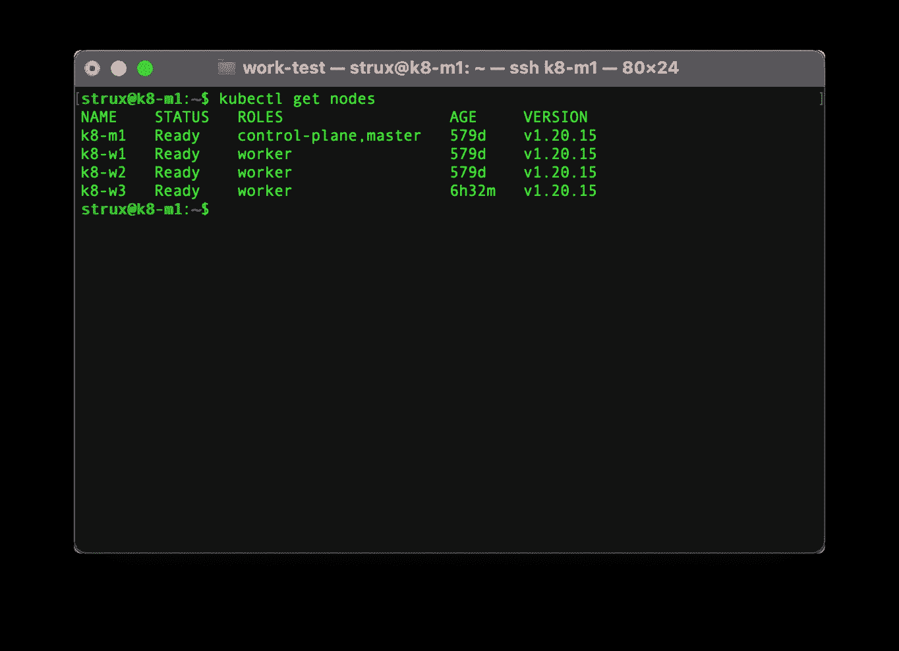

# Kubernetes 集群升级—慢速指南

> 原文：<https://levelup.gitconnected.com/kubernetes-cluster-upgrade-slow-guide-b3e76c5f082a>

详细介绍如何更新到最新的 Kubernetes 版本 1.25.0 的简单指南


照片由[迭戈·费尔南德斯](https://unsplash.com/@diegitane?utm_source=medium&utm_medium=referral)在 [Unsplash](https://unsplash.com?utm_source=medium&utm_medium=referral) 拍摄

升级 Kubernetes 集群比使用包管理器进行典型的更新需要更多的工作，但是它非常简单，可以很快完成。在本指南中，我将详细介绍所需的步骤，并附有每个步骤的截图。

注意:和往常一样，在继续之前，请确保您有一个备份，事情总是有可能因为各种原因而偏离正轨。

我最近注意到有一个新版本的 Kubernetes v1.25.0 可用，是时候从我当前的版本 v1.20.2 获得最新和最棒的版本并进行升级了。我想利用这个机会详细描述升级所需的步骤。


有新的更新

首先让我们运行`sudo apt list --upgradable`看看还有什么可以更新。


可用于更新的所有软件包的列表

我们可以更新除 Kubernetes 之外的所有内容，因此为了阻止 Kubernetes 包，我们将运行:

```
sudo apt-mark hold kubeadm kubectl kubelet
```

现在，我们可以通过运行以下命令来更新所有其他内容:

```
sudo apt update
sudo apt upgrade
```

你会注意到 Kubernetes 包，已被扣留，他们将被排除在升级。


Kubernetes 软件包被保留

现在，随着其他包的方式，我们可以专注于 Kubernetes。在这个特定的示例中，我们将 Kubernetes 从 1.20.2 版升级到 1.25.0 版。为了查看我们需要做什么，我们可以运行:

```
sudo kubeadm upgrade plan
```


“kubeadm 升级计划”命令的结果

根据前面命令的输出，我们需要首先将 kubeadm 升级到 v.1.20.15。因为最新版本比当前版本更新，我们需要首先升级到 1.20.15。

要确认这是可用于更新的最新版本，让我们运行:

```
apt-cache madison kubeadm | head
```


repo 中可用的 kubeadm 最新版本列表

最新版本确实是 1.25.0，但我们需要先升级到 1.20.15，所以我们先用以下命令清空主节点:

```
kubectl drain k8-m1 --ignore-daemonsets
```

我们现在可以指定我们想要升级到的 kubeadm 版本，并使用`--allow-change-held-packages`标志升级我们持有的包。

```
sudo apt-get update
sudo apt-get install --allow-change-held-packages kubeadm=1.20.15-00
```

当我们运行`sudo kubeadm upgrade plan`时，我们得到的下一步是用 kubeadm 工具应用升级:

```
sudo kubeadm upgrade apply v1.20.15
```

这一步将持续几分钟，一旦完成，您将看到成功的升级状态。


Kubernetes 集群更新成功的结果

如果您有额外的主节点，您可以按照第一个主节点的步骤进行，但是用`kubeadm upgrade apply`升级它们，您应该运行:

```
sudo kubeadm upgrade node
```

接下来要做的是更新 kubelet 和 kubectl。我们可以通过以下方式做到这一点:

```
sudo apt-get update
sudo apt-get install --allow-change-held-packages kubectl=1.20.15-00 kubelet=1.20.15-00
```

为了确认我们的主节点工作正常，让我们运行:

```
kubelet --version
kubectl get nodes
```


我们集群中的 Kubernetes 版本

一切看起来都很好。我们的主节点运行的是最新版本。你可能已经注意到我没有重启 kubelet 服务，因为这是不必要的。如果你需要这样做，你可以运行:

```
sudo systemctl restart kubelet.service
```

让我们再次启用主节点并运行:

```
kubectl uncordon k8-m1
```

这样，我们的主节点就完成了，我们可以切换到工作节点。我们将一个接一个地做。首先，我们将使用以下命令清空节点:

```
kubectl drain k8-w1 --ignore-daemonsets
```


排水工人节点 k8-w1

现在，与主节点相比，我们将同时更新 kubeadm、kubectl 和 kubelet:

```
sudo apt-get update
sudo apt-get install --allow-change-held-packages kubeadm=1.20.15-00 kubectl=1.20.15-00 kubelet=1.20.15-00
```

完成后，我们现在可以将我们的工作节点放回集群:

```
kubectl uncordon k8-w1
```

我们将对剩余的工作节点重复这个过程。最后，让我们通过运行以下命令来确保一切正常:

```
kubectl get nodes
```



所有 Kubernetes 节点都升级到版本 1.20.15

我们完了。我们所有的节点都运行最新最好的 Kubernetes v1.20.15。现在我们需要升级一个主要版本。下一个是 is 1.21。我们将升级到可以通过运行找到的最大子版本

```
apt-cache madison kubeadm | grep 1.21.
```

现在是冲洗和重复前面的步骤，一直到 1.25。

只剩下一件事要做了。在我们用`--allow-change-held-packages`更新 Kubernetes 包的过程中，我们的 kubeadm、kubectl 和 kubelet 被从保留列表中删除。

要确认我们可以运行:

```
apt-mark showheld
```

为了让它们在未来保持不变并避免意外更新，我们应该运行:

```
sudo apt-mark hold kubeadm kubectl kubelet
```


软件包 kubeadm kubectl kubelet 在将来不会更新

至此，我们完成了升级指南。如果您想了解有关设置我的 Raspberry Pi Kubernetes 集群的更多信息，请访问:

[](https://medium.com/@astrujic/step-by-step-slow-guide-kubernetes-cluster-on-raspberry-pi-4b-part-1-6e4179c89cbc) [## 循序渐进指南—树莓 Pi 4B 上的 Kubernetes 集群—第 1 部分

### 基于 RaspberryPi 4B、Containerd、Project Calico、MetalLB 和 Ubuntu Server 的 Kubernetes 集群

medium.com](https://medium.com/@astrujic/step-by-step-slow-guide-kubernetes-cluster-on-raspberry-pi-4b-part-1-6e4179c89cbc) 

或者如何为夏季做好准备并监测 RaspberryPi Kubernetes 集群的温度:

[](https://medium.com/@astrujic/raspberry-pi-4b-kubernetes-cluster-temperature-monitoring-with-daemonsets-slow-guide-b648da771d3e) [## Raspberry Pi 4B —使用 DaemonSets 监控 Kubernetes 集群温度—慢速指南

### 监控 Kubernetes 集群温度的简单方法。

medium.com](https://medium.com/@astrujic/raspberry-pi-4b-kubernetes-cluster-temperature-monitoring-with-daemonsets-slow-guide-b648da771d3e)