# Kubernetes:使用 YAML 文件创建部署

> 原文：<https://levelup.gitconnected.com/kubernetes-create-deployments-using-yaml-files-e31d2aa4872f>


照片由[阿朗索·雷耶斯](https://unsplash.com/@alonsoreyes?utm_source=unsplash&utm_medium=referral&utm_content=creditCopyText)在 [Unsplash](https://unsplash.com/s/photos/pirate?utm_source=unsplash&utm_medium=referral&utm_content=creditCopyText) 上拍摄

Kubernetes 是一个容器编排平台。它允许您通过自动化来部署、管理和扩展容器化的应用程序。在本文中，我将指导您创建部署，向部署添加服务，以及使用 YAML 配置文件更新部署。这个方法是 Kubernetes 对象的声明式管理，最适合生产和自动化。

## 先决条件

*   首选 IDE，我会用 Visual Studio 代码。
*   在*设置*中启用 Kubernetes 的 Docker 桌面。

## 部署

在 Kubernetes 中，部署是一个对象，您可以用它来扩展、推出和回滚应用程序的各个版本。我们将使用 YAML 文件创建我们的部署。这将创建我们指定的任意数量的相同 pod。首先，打开 VSCode 并创建一个新的工作目录。然后创建一个新文件。我将我的命名为 *nginx-deploy.yaml* 。

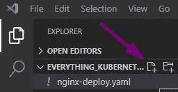

在这里，我们将创建我们的 YAML 文件，它是 Kubernetes API 创建部署的模板。YAML 文件提供了具有 4 个必填字段的对象规范。

*   API version——您正在使用的 Kubernetes API 的版本。
*   种类-您想要创建的对象的种类。
*   元数据-标识对象的数据，如名称。
*   规格-你想要的对象状态，更多选项参考`kubectl explain services`。

对于这一步，你可以复制以下要点。

这个对象告诉 Kubernetes API 在端口 80 上部署一个带有 nginx 映像的复制 pod。要使用该文件，在 VSCode 的*终端*中输入以下命令。表示您的文件名。

```
kubectl apply -f nginx-deploy.yaml
```

输出将显示部署已创建。

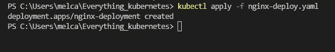

既然创建好了，那就来看看吧！输入`kubectl get deployment`。

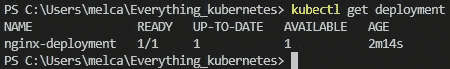

这表明我们有 1 个副本在运行，这是我们在 YAML 文件中指出的。

## 服务

接下来，我们将添加一个*服务*到我们的 pod 中。服务用于允许对 pod 的网络访问。我们将再次创建一个 YAML 文件来添加服务。我将文件命名为 *nginx-service.yaml* 。将以下要点复制并粘贴到 VSCode 中。

注意*种类*是*服务*，这将适用于所有标签为 *nginx* 的应用。*规范*部分包括一个*节点端口*，它是集群中每个节点上的开放端口，将在*节点端口* 30007 上路由流量。节点端口的范围是 30000–32768。现在，保存文件后，运行命令:

```
kubectl apply -f nginx-service.yaml
```

输出显示服务已创建！

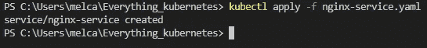

在命令`kubectl get service`中检查服务类型。*节点端口*将被添加到包含*集群 IP* 的列表中。

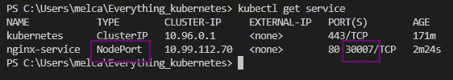

要检查我们是否可以访问互联网，您可以滚动本地主机或在浏览器中输入本地主机。

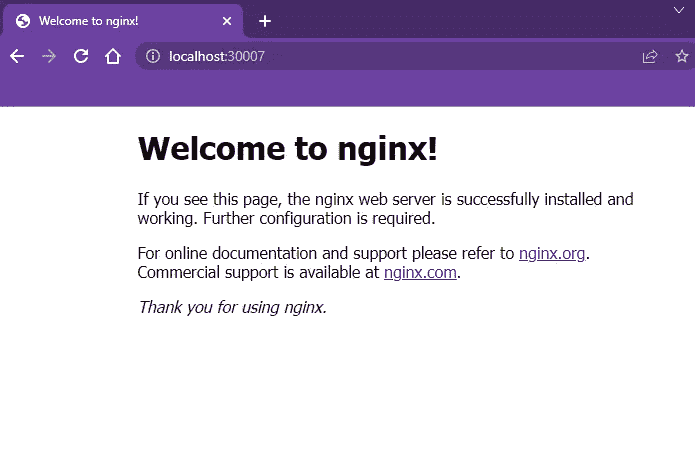

http://localhost:30007

## 更新

最后，我将更新部署以包括 4 个副本。为此，我们只需要更新 YAML 文件 *nginx-deploy.yaml* 。首先输入以下命令:

```
kubectl get pods -w
```

`-w`使我们能够在更新集群时进行观察。所以现在你应该只能看到一个 pod 在运行。接下来，我想拆分终端，以便更好地可视化所发生的变化。在您的终端上右击终端名称并选择*分割终端*。

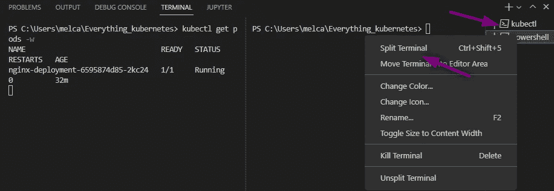

接下来，更新您的部署 YAML 文件，以指示 4 个副本。

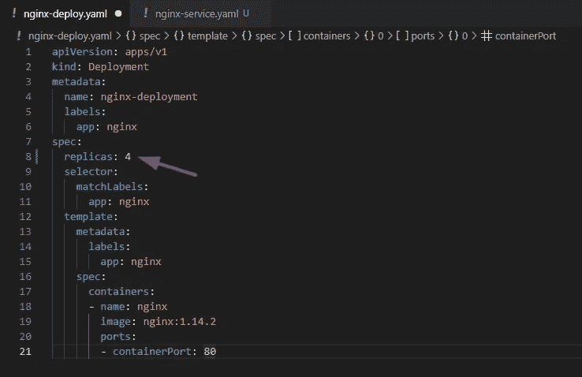

保存它并再次运行该命令。

```
kubectl apply -f nginx-deploy.yaml
```

随着更改的进行，您会看到又添加了 3 个副本。此外，输出将显示部署已配置。

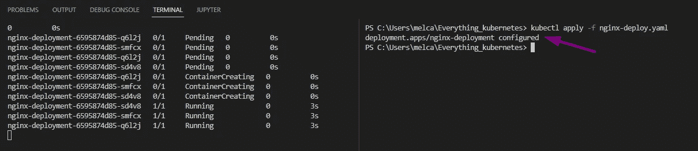

进入`kubectl get deployment`查看部署信息。

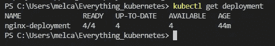

4 个吊舱正在运行！正如所料。

Kubernetes 做的另一件事是自动缩放。我将通过删除我的一个 pod 来演示这一点，并查看它是否可以横向扩展。第一次输入`kubectl get pods`。复制一个 pod 名称。

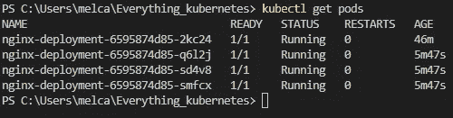

然后运行以下命令删除 pod。请务必输入您的 pods 名称。

```
kubectl delete pod/nginx-deployment-6595874d85-2kc24
```

它会很快旋转出一个新的吊舱来代替它。

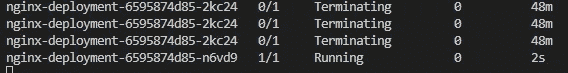

您可以再次检查部署，以确保仍有 4 个在运行。

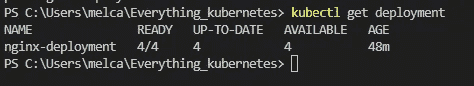

我们做到了！

要清理:

```
kubectl delete -f nginx-deploy.yaml
kubectl delete -f nginx-service.yaml
```

现在，您可以将服务和部署文件合并到一个文件中，并应用它。或者您可以应用整个目录。本文只是向初学者展示了理解 YAML 配置文件的指南。

# 分级编码

感谢您成为我们社区的一员！在你离开之前:

*   👏为故事鼓掌，跟着作者走👉
*   📰查看[升级编码出版物](https://levelup.gitconnected.com/?utm_source=pub&utm_medium=post)中的更多内容
*   🔔关注我们:[Twitter](https://twitter.com/gitconnected)|[LinkedIn](https://www.linkedin.com/company/gitconnected)|[时事通讯](https://newsletter.levelup.dev)

🚀👉 [**加入升级达人集体，找到一份惊艳的工作**](https://jobs.levelup.dev/talent/welcome?referral=true)