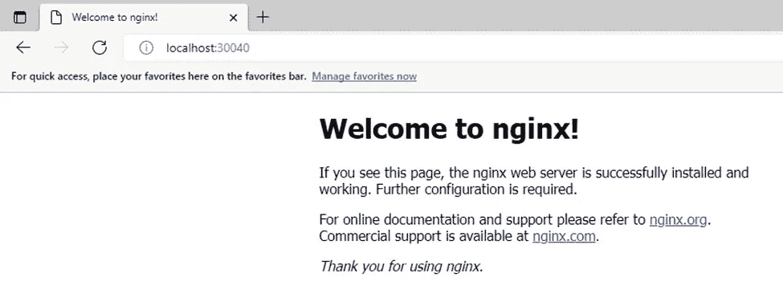

# Kubernetes:使用 CLI 和 YAML 创建部署

> 原文：<https://levelup.gitconnected.com/kubernetes-creating-deployments-using-cli-and-yaml-f50c6e84c625>


图片来自[https://www . a10 networks . com/glossary/what-is-kubernetes-k8s-and-container-management/](https://www.a10networks.com/glossary/what-is-kubernetes-k8s-and-container-management/)

我们将从一些关键术语的简要解释开始

***Kubernetes:*** *是一个用于自动化部署、扩展和管理容器化应用程序的开源系统* [***参见*** *D* ***文档***](https://kubernetes.io/)

***pod:****一个或多个容器在一个节点上一起运行。它是部署的基本单位*

***节点:*** *一个 Pod 总是运行在一个* ***节点*** *上。在 Kubernetes 中，节点是一个工作机，可以是虚拟机，也可以是物理机，这取决于集群。每个节点都由控制平面管理。一个节点可以有多个 pod，Kubernetes 控制平面自动处理跨集群中节点的 pod 调度* [***参见文档***](https://kubernetes.io/docs/tutorials/kubernetes-basics/explore/explore-intro/)

***部署:****Kubernetes 部署告诉 Kubernetes 如何创建或修改包含容器化应用程序的 pod 实例。部署有助于有效地扩展副本单元的数量，以可控的方式部署更新的代码，或者在必要时回滚到早期的部署版本。* [***参见文档***](https://www.vmware.com/topics/glossary/content/kubernetes-deployment.html)

在本演练中，我们将使用命令行和一个 Yaml 文件创建一个部署。

**使用命令行**

**步骤 1:创建运行 Nginx 映像的部署**

为了创建部署，我们将使用下面的命令

```
kubectl create deployment **<deployment name>** --image **<name>**
```


**第二步:显示部署的详细信息**

为了获得细节我们将使用 ***获取和描述*** 函数

```
kubectl get deploymentkubectl describe deployments
```


请注意，部署时创建了一个 pod

**步骤 3:从部署中获取事件日志**

为了获取事件日志，我们将使用下面的命令

```
kubectl logs deployment/**<deployment name>**
```


**第四步:删除部署**

以下命令删除部署

```
kubectl delete deployment **<deployment name>**
```


现在它被删除了，我们可以看到部署不能被再次调用

**使用 YAML 文件**

**步骤 5:使用 yaml 文件创建相同的部署**

我们将首先在 GitHub 中创建一个存储库(***【ienabs _ K8)***)，并将其克隆到 Visual studio 代码中。现在创建 Yaml 文件***(ng _ depl . yml)***并存储在存储库中


> *从 Yaml 文件中，我们将创建一个* **服务** ( *)在规范>下，类型:* ***节点端口，端口:80 和节点端口:30040。根据下面的文档，我将节点端口指定为 30040***
> 
> [**如果将**](https://kubernetes.io/docs/concepts/services-networking/service/) `[**type**](https://kubernetes.io/docs/concepts/services-networking/service/)` [**字段设置为**](https://kubernetes.io/docs/concepts/services-networking/service/) `[**NodePort**](https://kubernetes.io/docs/concepts/services-networking/service/)` [**，Kubernetes 控制平面将从**](https://kubernetes.io/docs/concepts/services-networking/service/) `[**--service-node-port-range**](https://kubernetes.io/docs/concepts/services-networking/service/)` [**标志指定的范围内分配一个端口(默认:30000-32767)**](https://kubernetes.io/docs/concepts/services-networking/service/)

同样在 ***部署*** 下，指定了**副本**的数量以及**规格**。这些部分非常重要

为了立即创建这些资源，我们将使用下面的代码

```
kubectl apply -f <name.yml>
```


现在我们可以进入浏览器，确认 nginx webserver 正在运行



太好了。我们让它旋转起来。

**步骤 6:更新 yaml 文件，将部署扩展到 4 个 nginx 容器**

为了扩大 nginx 容器，我们将转到 yaml 文件，将副本更改为 4，并再次运行命令 ***kubectl apply*** 命令


在尝试运行该命令时，我遇到了障碍，出现了如下所示的错误。我检查了 yaml 文件中的任何缩进错误，但没有发现任何错误


我决定运行下面的命令来显示基于对 yaml 文件中的副本所做的更改的差异

```
kubectl diff -f ng_depl.yml
```

我仍然得到上面显示的同样的错误。通过一些研究，我找到了这个网站[http://www.yamllint.com/](http://www.yamllint.com/)，在这里我确认了我的 yaml 文件是否有效，并定位了缩进错误

再次运行上面的代码，我们可以看到要做的更改


现在，我们将继续创建上面指定的资源。


我使用命令 ***打开了另一个终端来监控容器的创建***

**步骤 7:验证变更**


太棒了，我们的变化反映了

最后，我们不要忘记清理资源

```
[kubectl delete **<deployment name>**
kubectl delete **<service name>**](deployment.apps/ienabs-nginx-depl3)
```

感谢您的阅读。