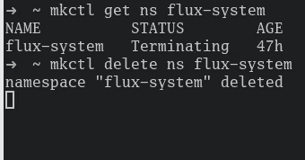
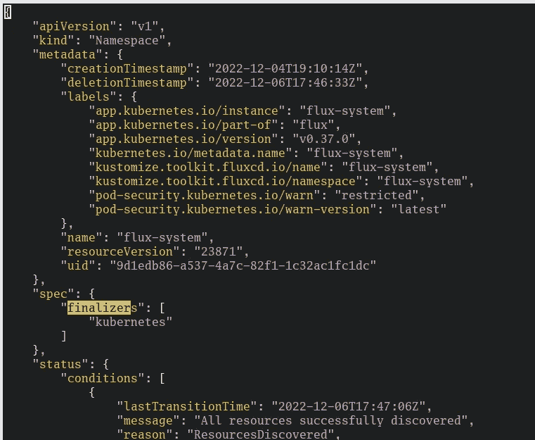
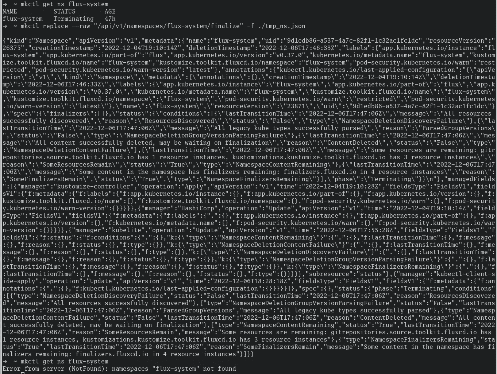
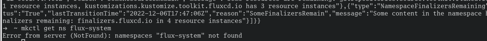

# Kubernetes:修复陷入终止状态的名称空间

> 原文：<https://levelup.gitconnected.com/kubernetes-fixing-namespace-stuck-in-termination-state-2e0129ebddab>

这篇简明教程将向您展示如何在 Kubernetes 集群上移除处于终止状态的名称空间资源。


虽然我不会详细说明为什么会出现这些问题，但我会向您展示一个快速解决它们的方法。

# 问题

也许你已经有过几次这样的经历，然后就疯了。您删除了一个资源，Kubernetes 将它转移到终止状态。

但是，即使在等待几分钟或几小时后，也没有任何事情发生，资源仍然在那里。

在下面的截图中，你可以看到这样的资源。在我的例子中，`flux-system`名称空间。即使当我显式地使用`delete ns`命令时，它也永远不会完成，只是被卡住了。



顺便说一下，不要惊讶你在截图中看到的是`mkctl`而不是`kubectl`。这只是我用来访问我的本地 [MicroK8s](/kubernetes-installing-microk8s-on-your-local-machine-in-5-minutes-30f9a7b48795) 集群的别名。它正在引擎盖下使用`kubectl`。

# 营救

幸运的是，有一个简单的方法可以快速摆脱卡住的资源。

首先，应该将资源定义转储到本地系统上的一个文件中:

```
kubectl get ns flux-system -o json > tmp_ns.json
```

接下来，您可以使用您选择的编辑器(在本例中是 Vim)并从`spec.finalizers`数组中移除`kubernetes`条目。



接下来，您必须告诉 Kubernetes 以一种`replace`方式应用修改后的 JSON 配置:

```
kubectl replace --raw "/api/v1/namespaces/flux-system/finalize" -f ./tmp_ns.json
```

但是请确保不要错过替换资源路径。您不太可能还想从系统中删除`flux-system`名称空间。；-)

在下一个截图中，您可以看到`replace`命令在运行。终端里有一大堆文字。



让我们把终端底部放大一点。正如您在下面的截图中看到的，我再次尝试从 Kubernetes 集群中获取名称空间`flux-system`,但是再也找不到该资源了。删除了...万岁！！！



## 你想联系吗？

如果你想联系我，请在 LinkedIn 上给我打电话。

另外，请随意查看我的书籍推荐📚。

[](https://mr-pascal.medium.com/my-book-recommendations-4b9f73bf961b) [## 我的书籍推荐

### 在接下来的章节中，你可以找到我对所有日常生活话题的书籍推荐，它们对我帮助很大。

mr-pascal.medium.com](https://mr-pascal.medium.com/my-book-recommendations-4b9f73bf961b) [](https://mr-pascal.medium.com/membership) [## 通过我的推荐链接加入 Medium—Pascal Zwikirsch

### 作为一个媒体会员，你的会员费的一部分会给你阅读的作家，你可以完全接触到每一个故事…

mr-pascal.medium.com](https://mr-pascal.medium.com/membership)