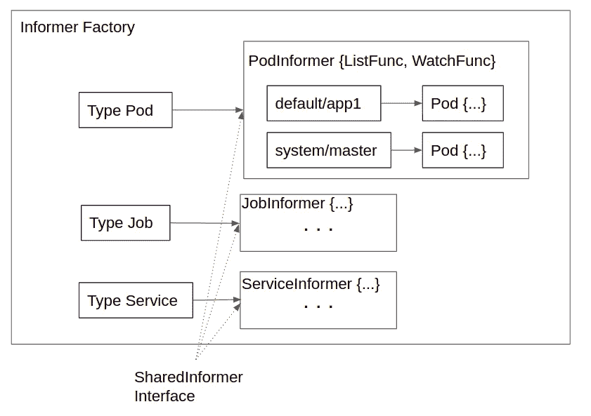
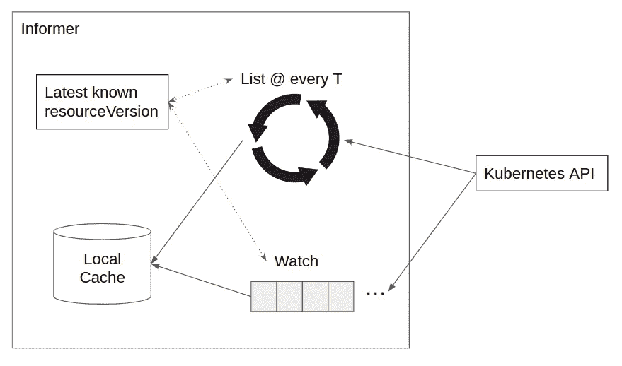

# Kubernetes 内部消息

> 原文：<https://levelup.gitconnected.com/kubernetes-informer-internals-dfa948df8670>

对其实现的直观和深入的解释，适合听说过 Kubernetes Informer 并希望研究其内部机制的读者。

资料来源:maritime-executive.com

最近我在官方客户端 go 库中挖掘了 Kubernetes Informer 实现( [release-1.26](https://github.com/kubernetes/client-go/tree/release-1.26) )。我想我应该写一篇简短的博客来记录这些学习，因为 Kubernetes Informer 确实有一些有趣的设计模式。如果你希望获得一个简单但更具体和直观的感觉，了解它在幕后是如何工作的，这篇博文值得一读，我发现在我能找到的大多数其他在线资料中缺乏这一点。

Kubernetes Informer 本质上是客户感兴趣的 Kubernetes 资源的本地缓存副本。本地缓存将通过两种机制刷新:List 和 Watch，我们将在后面解释。但是所有这些都是异步运行的，对客户端是隐藏的。客户只需要做三件事:

1.  创建一个可以调用 Kubernetes API 的客户机对象。
2.  使用 client 对象实例化一个 informer 工厂。经过适当的配置后，informer factor 实际上只是一组 informer 实例，每种感兴趣的资源类型一个。
3.  通过 informer 列出并获取，它只能返回本地缓存中可用的内容。

在某些情况下，上面的第三条可能是对告密者的警告。如果 Informer 没有跟上 Kubernetes API 中的最新修改，本地缓存将会过时。Kubernetes API 中发生的新创建、更新和/或删除可能没有被同步到本地缓存，从而导致丢失的、过时的和僵死的资源被返回给客户端。因此，您需要在设计客户端时考虑最终的一致性。

另一个注意事项是，由于 List 和 Get 仅由本地缓存提供，因此 List 和 Get 期间的附加选择标准仅作为本地缓存资源上的内存过滤器来实现。因此，如果您用窄选择器初始化 Informer，那么在后续的 List 和 Get 中任何更宽的选择都不会产生更多的资源。一个推论是，如果您计划用各种选择标准列出资源，那么您的 informer 需要用这些标准的超集进行初始化。

需要注意的一点是，本地缓存受到互斥锁的保护，因此是线程安全的。因此您可以在并发设置中使用它。事实上，建议我们使用`SharedInformerFactory`，它具有额外的线程安全控制，以便多个线程可以使用同一个工厂和 informer 实例，这消除了重复 Kubernetes API 调用和数据存储的需要。

从视觉上看，不同数据结构之间的关系如下所示。

Kubernetes Informer 数据结构

对于客户关心的每种资源类型(Pod、Job、Service 等),都有一个创建并存储在工厂中的 singleton informer 实例。那么在每个 informer 实例中，都有一个`map<namespace/resource_name, resource>`存储。所有的通知器实现相同的`SharedIndexInformer`接口，以便工厂可以统一处理它们。单个 informer 实例由两个函数初始化:`ListFunc`和`WatchFunc`，由客户端提供。informer 实例将启动异步列表，并使用提供的`ListFunc`和`WatchFunc`在后台观察。

现在我们已经清楚了客户端工作流和数据结构，最重要的问题是 informer 如何使用提供的`ListFunc`和`WatchFunc`来保持本地缓存的新鲜。

一切都存在于 informer 的`Run`函数中，当客户在工厂中设置 informer 时，该函数被异步调用。在`Run`函数中，通知器在每个`resync`时间间隔调度一个列表动作。间隔持续时间可以由客户提供。推荐的`resync`间隔是 O(分钟),以避免发送垃圾 Kubernetes API。列表的结果用于填充/刷新缓存中的资源。

列表动作中有两个有趣的部分。首先，当 Kubernetes API 在多个页面中返回资源时，informer 有一个内置的机制来对资源进行分页。因此，每个列表动作都可以是对客户端提供的`ListFunc`(通常是标准的 Kubernetes 列表 API)的一系列调用，每个调用都使用从上一个调用中获得的延续标记。其次，Kubernetes API 将在响应中提供一个`resourceVersion`。这是一个不透明的字符串，但是它有效地编码了 Kubernetes API 中的时间戳。通知者记住了这个`resourceVersion`，并在下一个`resync`将其用作`ListFunc`调用的参数。Kubernetes API 支持获取不早于给定`resourceVersion`的结果的列表语义。通过这种方式，告密者可以确保每次都能得到更新的结果。

拥有重复列表允许缓存在每个重新同步间隔刷新，但是客户端如何获得更及时的更新呢？这就是手表的用处。客户端通过指定`WatchFunc`告诉通知者看什么以及如何看，这也是典型的标准 Kubernetes Watch API。Watch 是 Kubernetes API 本身支持的一种功能，客户可以“订阅”创建、更新和删除某个资源集合的事件。informer 使用收到的通知来更新缓存中的资源。

在 Watch API 调用中，应该指定一个`resourceVersion`参数来指示 Kubernetes API 返回自那个`resourceVersion`(也就是时间戳)以来对集合所做的修改。从机械上来说，Watch API 发出 Get 请求，Kubernetes API 用一系列自指定的`resourceVersion`以来发生的单个事件来响应。informer 使用它从初始列表中获得的`resourceVersion`，然后不断更新它从更新的 API 调用中获得的`resourceVersion`。

请参见下图中的直观图示。

Kubernetes 内部消息

请注意，Kubernetes API 只在有限的时间/修改次数内保留过去的资源版本。因此，如果 Kubernetes API 认为请求的`resourceVersion`过期，它可能会响应 410(消失)。在这种情况下，举报人可以发布新的新鲜列表，并使用新获得的`resourceVersion`进行后续列表和观察。

这就把我们带到了这篇博文的最后一个主题:错误处理。告密者很健壮。除非程序崩溃或通知程序被客户端停止，否则通知程序会不断重试失败的列表和观察。每隔`resync`间隔，列表会自动重试一次。观察器打开一个持久连接来接收通知。如果失败，告密者会发现错误并立即开始新的监视。列表和/或观察的失败不会导致不一致的结果，因为在下一个列表/观察调用中使用了最新的已知`resourceVersion`来确保结果不会比先前调用的结果旧。List 和 Watch 在单独的 Goroutines 中运行，以避免阻塞。因此，如果单个实例中的 List 和/或 Watch 由于某种原因而失败，客户端将观察到的最糟糕的情况是缓存需要更长时间来刷新。