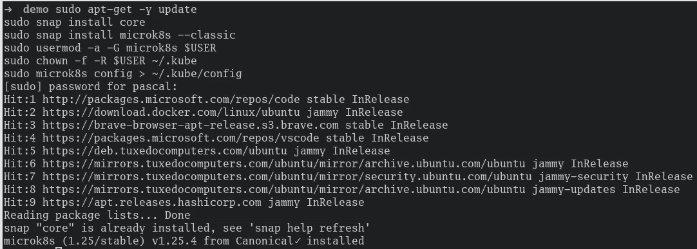
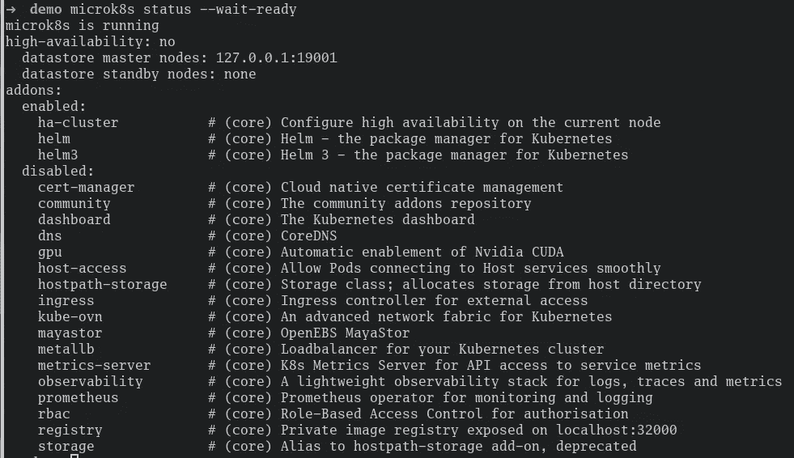
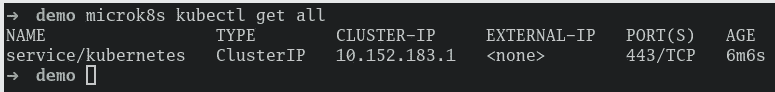
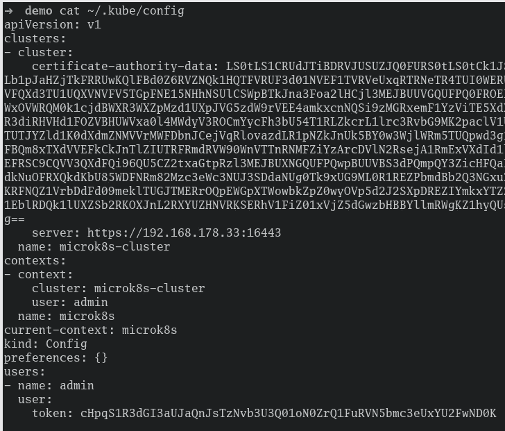
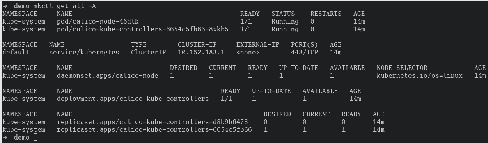
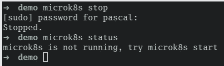

# kubernetes:5 分钟内在本地机器上安装 MicroK8s

> 原文：<https://levelup.gitconnected.com/kubernetes-installing-microk8s-on-your-local-machine-in-5-minutes-30f9a7b48795>

这篇简明的教程将向您展示如何在您的本地机器上使用 MicroK8s，只需 5 分钟。


# 什么是 MicroK8s？

MicroK8s 是一个最小的、CNCF 认证的 Kubernetes 发行版。MicroK8s 足够轻量，可以在边缘运行 Kubernetes，占用的 CPU 和内存非常少。此外，由于其重量轻，它启动非常快，特别是与相对较重(尽管也很强大)的 Minikube 相比。

虽然 MicroK8s 拥有 Kubernetes 的所有核心组件，但它也坚持使用典型的 Kubernetes 插件，如 DNS、Helm、registry、storage 等。如果需要，可以用一个命令添加。

总的来说，MicroK8s 是本地 Kubernetes 开发的一个很好的选择，因为它占用的资源少，安装和启动时间也快且简单。

# 装置

在 macOS 上运行时，MicroK8s 只需要两个命令。

```
brew install ubuntu/microk8s/microk8s
microk8s install
```

在 Linux 上也很容易，但是根据您已经存在的设置，您可能需要添加一些步骤。下面，我列出了所有必要的和可能必要的步骤。

```
sudo apt-get -y update
sudo snap install core
sudo snap install microk8s --classic
sudo usermod -a -G microk8s $USER
sudo chown -f -R $USER ~/.kube
sudo microk8s config > ~/.kube/config
```



microk8s 安装

安装完成后，MicroK8s 会自动启动。总的来说，安装 MicroK8s 并等待集群就绪只需要几分钟时间。

使用`microk8s status --wait-ready`您可以检查您的 MicroK8s 集群的状态，只有当集群启动并运行时才结束。



`microk8s status --wait-ready`

如果需要，你可以很容易地从上面的截图中添加任何当前“禁用”的插件。

您可以使用以下命令来设置您的集群的 Kubernetes Dashboard、CoreDNS、Istio 或任何其他支持的插件。

```
microk8s enable dashboard dns istio
```

MicroK8s 安装的一个非常好的额外好处是`kubectl`安装在引擎盖下。尽管不是直接通过`kubectl`而是通过`microk8s kubectl`获得。您可以像在任何其他集群上一样在 MicroK8s 集群上运行任何命令。在下面的截图中，您可以看到该命令是如何工作的。



microk8s kubectl get all

因为总是键入`microk8s kubectl`非常麻烦(kubectl 本身已经很长了)，所以官方建议创建一个别名。

你选择什么取决于你自己，但总的来说,`alias mkctl="microk8s kubectl"`是一种很好且容易理解的方式。

如果您使用了上述所有命令来设置您的 MicoK8s 集群，那么在您的`~/.kube/config`文件中也应该有一个条目。



猫~/。kube/配置

如果没有，有两种简单的方法可以获得 MicroK8s 集群的配置:

```
# The "kubectl"-way
mkctl config view --minify --raw

# The direct microk8s way
microk8s config
```

为了确保一切正常运行，可以使用下面的命令获取所有名称空间的所有资源。

```
# Get all resources for all namespaces
mkctl get all --all-namespaces

# Shorthand
mkctl get all -A
```



得到全 A

## 停止集群

当然，只有当您正在本地机器上工作时，您才希望集群在本地机器上运行。因此，您需要不时地停止集群。另外，请注意，如果在关机时集群正在运行，那么在启动机器时集群会自动启动。因此，在关闭之前停止群集不会在重新启动时自动启动。

MicroK8s 可以用一个命令停止，只需要几秒钟就可以完成。

```
microk8s stop
```



microk8s 停止

# 清除

如果您对 MicroK8s 不满意，或者只是为了做一些实验才安装它，那么用一个简单的命令就可以把它从您的机器上删除。

```
sudo snap remove microk8s
```

## 你想联系吗？

如果你想联系我，请在 LinkedIn 上联系我。

另外，可以随意查看[我的书籍推荐](https://medium.com/@mr-pascal/my-book-recommendations-4b9f73bf961b)📚。

[](https://mr-pascal.medium.com/my-book-recommendations-4b9f73bf961b) [## 我的书籍推荐

### 在接下来的章节中，你可以找到我对所有日常生活话题的书籍推荐，它们对我帮助很大。

mr-pascal.medium.com](https://mr-pascal.medium.com/my-book-recommendations-4b9f73bf961b) [](https://mr-pascal.medium.com/membership) [## 通过我的推荐链接加入 Medium—Pascal Zwikirsch

### 作为一个媒体会员，你的会员费的一部分会给你阅读的作家，你可以完全接触到每一个故事…

mr-pascal.medium.com](https://mr-pascal.medium.com/membership)