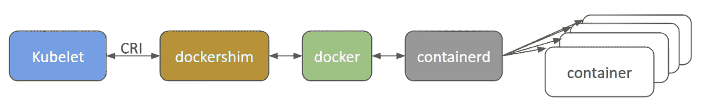

# Kubernetes 在 2021 年贬低 Docker

> 原文：<https://levelup.gitconnected.com/kubernetes-is-deprecating-docker-in-2021-fa8317f9f070>

## Docker 的结尾是？

乌斯曼·尤萨夫在 [Unsplash](https://unsplash.com/s/photos/panic?utm_source=unsplash&utm_medium=referral&utm_content=creditCopyText) 上的照片

在版本 [1.20](https://github.com/kubernetes/kubernetes/blob/master/CHANGELOG/CHANGELOG-1.20.md#deprecation) 之后，Kubernetes 不再将 Docker 作为容器运行时。

Docker 作为一个底层运行时正在被弃用，取而代之的是使用为 Kubernetes 创建的[容器运行时接口(CRI)](https://kubernetes.io/blog/2016/12/container-runtime-interface-cri-in-kubernetes/) 的运行时。

如果你是 Kubernetes 的终端用户，并不会给你带来太大的改变。这并不意味着 Docker 的消亡，也不意味着你不能或者不应该再使用 Docker 作为开发工具。Docker 仍然是构建容器的有用工具，运行 docker build 生成的映像仍然可以在您的 Kubernetes 集群中运行。

如果您使用的是托管的 Kubernetes 服务，比如 GKE、EKS 或 AKS(默认情况下是容器化的)，那么在未来的 Kubernetes 版本中移除 Docker 支持之前，您需要确保您的工作节点使用的是受支持的容器运行时。如果您有节点定制，您可能需要根据您的环境和运行时需求来更新它们。

如果您想要推出自己的集群，您还需要进行更改以避免集群崩溃。在 1.20 版中，您将收到 Docker 弃用警告。如果在未来的 Kubernetes 版本中删除了 docker 运行时支持(**目前计划在 2021 年**下半年成为 1.22 版本)，将不再支持它，您需要切换到其他兼容的容器运行时，如 containerd 或 CRI -O。只要确保您选择的运行时支持当前使用的 Docker 守护进程的配置(如日志记录)。

## 那么，为什么人们看到这个公告时会感到恐慌呢？

两种环境正在被讨论，这造成了混乱。在 Kubernetes 集群中，有一个叫做容器运行时的东西，它负责获取和运行容器映像。Docker 是该运行时的一个流行选择，但是 Docker 没有被设计成嵌入到 Kubernetes 中，这就导致了问题。

Docker 是一个完整的技术堆栈，其中一部分是一个名为“containerd”的东西，它本身就是一个高级容器运行时。Docker 很酷也很有用，因为它有许多 UX 增强功能，使得在进行开发工作时与人交互变得非常容易，但对于 Kubernetes 来说，这些 UX 增强功能是不必要的，因为它不是人类。

因为这个用户友好的抽象层，Kubernetes 必须使用另一个叫做 Dockershim 的工具来获得它真正需要的东西，这个工具就是 containerd。这并不伟大，因为它提供了另一个必须维护并且可能被损坏的东西。事实上，这里发生的事情是，Dockershim 最早将在 1.23 版本中从 Kubelet 中移除，从而移除对 Docker 作为容器运行时的支持。

## 为什么需要 Dockershim？

Docker 与 CRI 不兼容，[容器运行时接口](https://kubernetes.io/blog/2016/12/container-runtime-interface-cri-in-kubernetes/)。如果是的话，我们就不需要垫片了，这就不是一件事了。

Dockershim 是由 Kubernetes 社区提出的一个临时解决方案(因此得名:shim ),目的是增加对 Docker 的支持，以便它可以用作其容器运行时。Dockershim 的弃用，只是意味着将停止 Dockershim 在 Kubernetes 代码库中的代码维护。

这是因为 Dockershim 已经成为 Kubernetes 维护者的沉重负担。随着这一变化，Kubernetes 社区将只能维护 Kubernetes 容器运行时接口(CRI)。

## 我们继续使用 Dockerfiles 吗？

这一变化针对的是一个不同于大多数开发人员用来与 Docker 交互的环境。开发中使用的 Docker 安装与 Kubernetes 集群中的 Docker 运行时无关。

作为一名开发人员，Docker 在所有方面仍然是有用的，就像这个变化宣布之前一样。Docker 产生的形象并不是 Docker 特有的形象——它是 OCI ( [开放集装箱倡议](https://opencontainers.org/))的形象。任何符合 OCI 标准的图像，不管你用什么工具构建，在 Kubernetes 看来都是一样的。containerd 和 CRI-O 都知道如何提取和运行这些图像。

## **更改 CRI 实施时，我们应该验证什么？**

尽管 Docker 和大多数 CRI 之间的底层容器化代码是相同的，但在边缘处还是有一些差异。迁移时要考虑的一些常见事项有:

*   日志记录配置
*   运行时资源限制
*   通过 docker 的控制套接字调用或使用 docker 的节点配置脚本
*   需要 docker CLI 或控制套接字的 Kubectl 插件
*   需要直接访问 Docker 的 Kubernetes 工具(例如 kube-imagepuller)
*   像`registry-mirrors`和不安全注册中心这样的功能配置
*   其他支持脚本或守护进程期望 Docker 可用，并在 Kubernetes 之外运行(例如监控或安全代理)
*   GPU 或特殊硬件，以及它们如何与您的运行时和 Kubernetes 集成

## 结论

所以，这种改变正在到来。它会给一些人带来问题，但不是灾难性的，一般来说，这是一件好事。取决于你如何与 Kubernetes 互动，这可能对你没有任何意义，或者它可能意味着一些工作。从长远来看，这将使事情变得更容易。