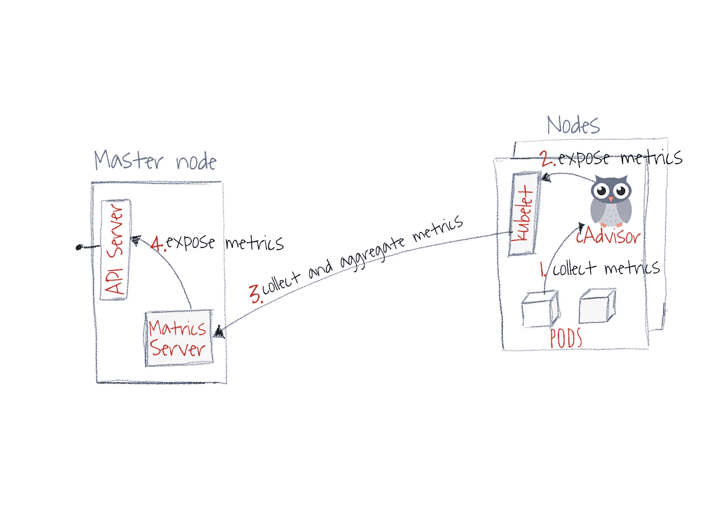
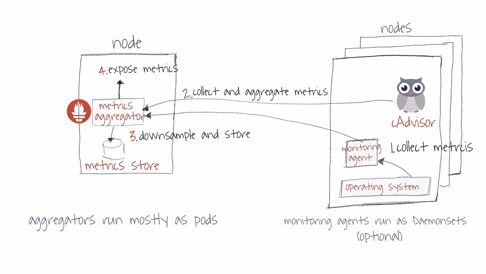

# Kubernetes 监控 101 —核心管道和服务管道

> 原文：<https://levelup.gitconnected.com/kubernetes-monitoring-101-core-pipeline-services-pipeline-a34cd4cc9627>

了解 Kubernetes 监控管道对于帮助您诊断运行时问题以及管理[pod](https://pxlme.me/nboBkliX)和集群的规模至关重要。监控是 Kubernetes 内部发展非常迅速的领域之一。它有许多作品仍然在流入，因此有些混乱。我希望在这篇文章中，我的目标是澄清这一点，并给你一个良好的开端。

Kubernetes 有两个监控管道:(1) **核心指标管道**，它是 Kubernetes 不可或缺的一部分，并且总是与所有发行版一起安装，以及(2) **服务监控(非核心)管道**，它是一个独立的管道，Kubernetes 对其没有依赖或依赖有限。继续阅读了解原因:)

# 核心监控管道

有时被称为[资源度量管道](https://pxlme.me/6GomlbWB)。每个发行版都安装了核心监视管道。它为 Kubernetes 集群中的其他组件提供了足够的细节，以便按预期运行，例如分配 pod 和容器的调度程序、HPA 和 VPA，以便做出适当的决定来扩展 pod。

核心监控管道的工作流程

它的工作方式相对简单:

1.  CAdvisor 收集关于安装它的容器和节点的指标。注意:默认情况下，CAdvisor 安装在所有集群节点上
2.  Kubelet 通过 Kubelet APIs 公开这些指标(默认为一分钟的分辨率)。
3.  Metrics Server 发现所有可用的节点，并调用 Kubelet API 来获取容器和节点资源的使用情况。
4.  度量服务器通过 Kubernetes 聚合 API 公开这些度量。

**几个有用的点**

*   库伯莱不能在没有护卫的情况下跑步。如果您尝试卸载或停止它，群集的行为将变得不可预测。
*   尽管 Heapster“即将被弃用”目前依赖于 CAdvisor，但 CAdvisor 不会很快消失。

# 服务监控渠道

抽象的服务管道相对简单。混乱通常来自于过多的服务和代理，您可以混合和匹配它们来启动和运行您的管道。同样，你可以责怪 Heapster:)

服务监视管道由三个主要组件组成:(1)收集代理，(2)度量服务器，以及(3)仪表板。我不会谈论警报，因为它有许多有趣的变化:)我计划在另一篇文章中讨论警报。

服务监控管道的典型工作流

下面是典型的工作流程，包括最常见的组件

1.  监控代理收集节点指标。cAdvisor 收集容器和 pod 指标。
2.  监控聚合服务从其自己的代理和 cAdvisor 收集数据。
3.  数据存储在监控系统的存储器中。
4.  监控聚合服务通过 API 和仪表板公开指标。

**几个注意事项:**

*   [普罗米修斯](https://pxlme.me/Cr_NFw-N)是由 CNCF 发起并孵化的官方监控服务器。它[直接与 cAdvisor](https://pxlme.me/D4f1AwHn) 集成。您不需要安装第三方代理来检索有关容器的其他指标。但是，如果您需要更深入地了解每个节点，您需要安装自己选择的代理——参见 [Prometheus 集成和第三方出口商页面。](https://pxlme.me/OX7__rQz)
*   几乎所有的监控系统都依赖于 Kubernetes 的调度和编排。例如，它们的代理作为 DeomonSets 安装，并依赖 Kubernetes scheduler 在每个节点上调度一个实例。
*   大多数监控代理依靠 Kubelet 来收集与容器相关的指标，而这些指标又依赖于 cAdvisor。很少有代理商独立收集集装箱相关的详细信息。
*   大多数监控聚合服务依赖于代理向它们推送指标。普罗米修斯是个例外。它从已安装的代理中提取指标。

# 在 Kubernetes 服务渠道中，您应该考虑什么？

理想的服务管道取决于两个主要因素:(1)收集相关指标，(2)了解 kubernetes 集群内部的持续变化。

一个好的管道应该专注于收集相关的指标。有很多代理可以收集操作系统和流程级的指标。但是您会发现很少有人能够收集在给定节点上运行的容器的详细信息，比如运行容器的数量、容器状态、docker 引擎指标等。到目前为止，cAdvisor 是这项工作的最佳代理人。

对连续变化的感知意味着监控管道知道不同的 pod、容器实例，并且可以将它们与它们的父实体相关联，即部署、状态集、名称空间等。这还意味着指标服务器知道用户应该可以看到的系统范围的指标，例如待定 pod 的数量、节点状态等。

# 度量可视化怎么样？

您可以用许多不同的方式来可视化指标。最容易与 Prometheus 集成的开源工具是 [Grafana](https://prometheus.io/docs/visualization/grafana/) 。然而，您将面临的挑战是构建合适的仪表板来监控正确的指标。也就是说，您应该让仪表板监控以下内容:

*   **集群级容量利用率**，这显示了整个集群和每个节点有多少 CPU 内存。
*   **Kubernetes Orchestration Metrics**，它跟踪集群中的 pod 和容器的状态。这包括 pod 在节点之间的分布。
*   **Kubernetes 核心服务**，可视化关键服务的状态，如 CoreDNS、Calico 和任何其他对网络、存储和 pod 调度重要的服务。
*   特定于应用程序的指标，用于跟踪应用程序的状态。它们应该反映用户的体验和业务关键指标。

**注意**:你可以从[这个用于 Kubernetes 的 Grafana 模板仪表盘](https://pxlme.me/9wR_GkOT)开始。

> 格拉夫纳不太适合警戒。我看到许多团队依靠它来创建警报规则。但是，它不如普罗米修斯警报管理器可靠和全面。

# 要注意的变化

## 希普斯特要走了

Heapster 目前引起了一些混乱，因为它同时用于显示核心管道指标和服务指标。实际上，您可以删除 Heapster，核心的 Kubernetes 调度和编排场景不会出现任何问题。它是默认的监控管道，我猜它仍然是许多发行版的默认管道。但是你根本不用。

因此，Kubernetes 社区希望让核心和服务监控管道之间的分离更加清晰。因此，Heapster 将被弃用，并被 Metrics Server (MS)取代，成为聚合核心指标的主要来源。可以把 MS 看作是 Heapster 的精简版。主要的直接变化是:(1)没有历史数据或查询，(2)消除了许多特定于容器的指标，只有 pod 焦点指标。Metrics Server 旨在提供核心 Kubernetes 场景所需的核心指标，如自动缩放、调度等。，可能会在 2019 年发布。

## 度量服务器将获得更多的酷功能

Infrastore 将存储 Metric Server 历史数据，并支持简单的类似 SQL 的查询。它最初将支持由指标服务器收集的指标。我猜，因为 Kubernetes 社区喜欢可扩展性，他们将使其可扩展，并允许将自定义指标添加到指标服务器及其存储中。

# TL；速度三角形定位法(dead reckoning)

*   您需要区分核心度量管道和服务管道。
*   Heapster 将被弃用。您应该选择最适合您需求的管道。
*   社区官方工具是普罗米修斯。您可以使用各种其他开源或商业工具，但是我建议您在决定使用其他可能会让您付出很大代价的工具之前，先开始使用 Prometheus。
*   使用 [Grafana 进行指标可视化](https://pxlme.me/dRJpGP5G)。但我不建议用它来报警。