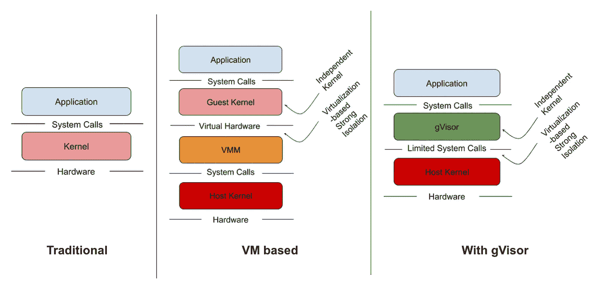

# 我只需要一个 Kubernetes 名称空间

> 原文：<https://levelup.gitconnected.com/kubernetes-tips-all-i-need-is-a-namespace-c81dec026294>

## 让我们从 K8Spin 获取一个来运行我的应用程序


K8Spin 提供名称空间来运行您的工作负载

# TL；速度三角形定位法(dead reckoning)

您已经开发了一个很棒的应用程序，并准备部署到 Kubernetes 集群上。您正在寻找一个云提供商来运行一个新的集群，但是…等等…当您需要的只是一个名称空间时，为什么您要使用整个集群呢？在本文中，我们将展示如何从 K8Spin 获取 Kubernetes 名称空间，并在其中部署应用程序。

# 关于 K8Spin

K8Spin 是一家位于西班牙的公司，它有一个很好的方法，允许用户创建 Kubernetes 名称空间来部署他们的应用程序。K8Spin 为您管理所有底层组件。


托管 Kubernetes 解决方案与 K8Spin 云

命名空间通过使用以下各项相互隔离:

*   [网络策略](https://kubernetes.io/docs/concepts/services-networking/network-policies/)因此 pod 不能跨名称空间通信
*   [资源配额](https://kubernetes.io/docs/concepts/policy/resource-quotas/)因此一个名称空间中的所有 pod 不能消耗超过授权的资源

在引擎盖下，K8Spin 使用 GKE (Google Kubernetes 引擎)作为其沙盒风格，意思是用 gVisor 作为容器运行时。简而言之，gVisor 使用一种新的 Linux 内核实现来运行容器，这种实现是用 Go 编写的，在用户空间中运行。gVisor 拦截应用程序的系统调用，从而为主机内核漏洞提供额外的保护，它专注于安全性、效率和易用性。



管理应用程序系统调用的几种方法

gVisor 不是这篇文章的主题，但绝对是一个值得密切关注的话题。你可以在谷歌云网站上找到更多信息:【https://cloud.google.com/kubernetes-engine/sandbox 

# 设置

让我们仔细看看 K8Spin，从在 [https://k8spin.cloud](https://k8spin.cloud) 上创建一个帐户开始


在 K8Spin 上创建一个帐户并访问仪表板

从仪表板中，我们可以创建名称空间。让我们创建一个名为**的演示。**


在自由层中，用户可以创建一个命名空间，受限于以下资源边界:

*   中央处理器:100 兆赫兹
*   内存:128 兆字节

一旦创建了名称空间，我们就可以下载 kubeconfig 文件。它是根据名称空间的名字命名的(在这个例子中是 **demo.config** )。它包含以下信息(为便于查看，CA 和令牌数据被剪切):

```
apiVersion: v1
kind: Config
clusters:
- cluster:
    certificate-authority-data: LS0tLS1CRUdJTiBDRVJUS...EUtLS0tLQo=
    server: [https://35.223.187.135](https://35.242.197.145)
  name: luc-juggery-gmail-com-demousers:
- name: luc-juggery-gmail-com-demo
  user:
    token: eyJhbGciOiJ...Lud9rToUQAOIQcontexts:
- context:
    cluster: luc-juggery-gmail-com-demo
 **namespace: luc-juggery-gmail-com-vote**    user: luc-juggery-gmail-com-demo
  name: luc-juggery-gmail-com-democurrent-context: luc-juggery-gmail-com-demo
```

与任何 kubeconfig 文件一样，我们有:

*   集群信息(认证机构和 API 服务器端点)
*   用户凭证(此处为令牌)
*   链接集群和用户的上下文。这里需要注意的重要一点是上下文中指定的名称空间键，这个键确保使用这个 kubeconfig 运行的所有 **kubectl** 命令都将在这个名称空间中执行！

*注意*:我已经创建了一个名为 **demo** 的名称空间，但是在内部它已经以我的电子邮件地址为前缀。

然后我们可以配置我们的本地 **kubectl** ，这样它就可以使用上面的 kubeconfig:

```
export KUBECONFIG=$PWD/demo.config
```

我们现在可以在我们的专用命名空间上部署任何工作负载。让我们用投票应用程序来测试一下。

# 投票应用程序

我在以前的许多文章中使用过投票应用程序。这个应用程序由 Docker 维护，用于演示 Docker Compose、Docker Swarm 的新功能……现在演示 Kubernetes 相关的东西也非常方便。这个应用程序遵循微服务架构。它由五个服务组成，如下图所示。


Docker 的投票应用架构

*   **投票**:前端显示 2 个项目，用户可以从中选择
*   **redis** :存储选票的数据库。
*   **worker** :从 Redis 获取投票的服务，将结果整合并存储在 Postgres 数据库中。
*   **db** :存储结果的 Postgres 数据库
*   **结果**:前端显示投票结果。

# 在 k8Spin 上部署投票应用程序

由于投票应用程序的一些组件在启动时非常贪婪，K8Spin 免费升级了我的名称空间上的配额集，因此整个应用程序可以部署。(谢谢伙计们！)

下面是我们将要部署的投票应用程序的整体规范，每个微服务都有一个部署和一个服务资源。 **worker** 微服务是唯一不需要服务资源的微服务，因为它没有被任何其他微服务调用。

```
apiVersion: apps/v1
kind: Deployment
metadata:
  labels:
    app: vote
  name: vote
spec:
  selector:
    matchLabels:
      app: vote
  template:
    metadata:
      labels:
        app: vote
    spec:
      containers:
      - image: dockersamples/examplevotingapp_vote:before
        name: vote
        ports:
        - containerPort: 80
          name: vote
        resources:
          limits:
            cpu: 80m
            memory: 256Mi
          requests:
            cpu: 80m
            memory: 256Mi
---
apiVersion: v1
kind: Service
metadata:
  labels:
    app: vote
  name: vote
spec:
  ports:
  - name: "vote-service"
    port: 5000
    targetPort: 80
  selector:
    app: vote
---
apiVersion: apps/v1
kind: Deployment
metadata:
  labels:
    app: redis
  name: redis
spec:
  selector:
    matchLabels:
      app: redis
  template:
    metadata:
      labels:
        app: redis
    spec:
      containers:
      - image: redis
        name: redis
        ports:
        - containerPort: 6379
          name: redis
        volumeMounts:
        - mountPath: /data
          name: redis-data
        resources:
          limits:
            cpu: 80m
            memory: 64Mi
          requests:
            cpu: 80m
            memory: 64Mi
      volumes:
      - name: redis-data
        emptyDir: {}
---
apiVersion: v1
kind: Service
metadata:
  labels:
    app: redis
  name: redis
spec:
  ports:
  - name: "redis-service"
    port: 6379
    targetPort: 6379
  selector:
    app: redis
---
apiVersion: apps/v1
kind: Deployment
metadata:
  labels:
    app: worker
  name: worker
spec:
  selector:
    matchLabels:
      app: worker
  template:
    metadata:
      labels:
        app: worker
    spec:
      containers:
      - image: lucj/examplevotingapp_worker:java
        name: worker
        resources:
          limits:
            cpu: 80m
            memory: 128Mi
          requests:
            cpu: 80m
            memory: 128Mi
---
apiVersion: apps/v1
kind: Deployment
metadata:
  labels:
    app: db
  name: db
spec:
  selector:
    matchLabels:
      app: db
  template:
    metadata:
      labels:
        app: db
    spec:
      containers:
      - image: postgres:9.4
        name: postgres
        ports:
        - containerPort: 5432
          name: postgres
        volumeMounts:
        - mountPath: /var/lib/postgresql/data
          name: db-data
        resources:
          limits:
            cpu: 80m
            memory: 64Mi
          requests:
            cpu: 80m
            memory: 64Mi
      volumes:
      - name: db-data
        emptyDir: {}
---
apiVersion: v1
kind: Service
metadata:
  labels:
    app: db
  name: db
spec:
  type: ClusterIP
  ports:
  - name: "db-service"
    port: 5432
    targetPort: 5432
  selector:
    app: db
---
apiVersion: apps/v1
kind: Deployment
metadata:
  labels:
    app: result
  name: result
spec:
  selector:
    matchLabels:
      app: result
  template:
    metadata:
      labels:
        app: result
    spec:
      containers:
      - image: dockersamples/examplevotingapp_result:before
        name: result
        ports:
        - containerPort: 80
          name: result
        resources:
          limits:
            cpu: 80m
            memory: 64Mi
          requests:
            cpu: 80m
            memory: 64Mi
---
apiVersion: v1
kind: Service
metadata:
  labels:
    app: result
  name: result
spec:
  ports:
  - name: "result-service"
    port: 5001
    targetPort: 80
  selector:
    app: result
```

注意:

*   我们为每个容器指定了资源限制和请求，否则将默认为 30m CPU 和 64Mi RAM，这对于**投票**和**工人**微服务来说是不够的
*   默认情况下，worker 使用的图像是 java 版本。由于一个问题(可能与[https://github.com/dotnet/coreclr/issues/4132](https://github.com/dotnet/coreclr/issues/4132)有关)，网络版无法运行

以上规格在[https://files.techwhale.io/votingapp-k8spin.yaml,](https://files.techwhale.io/votingapp-k8spin.yaml,)上有，我们来部署一下:

```
$ kubectl apply -f [https://files.techwhale.io/votingapp-k8spin.yaml](https://files.techwhale.io/votingapp-k8spin.yaml)
deployment.apps/vote created
service/vote created
deployment.apps/redis created
service/redis created
deployment.apps/worker created
deployment.apps/db created
service/db created
deployment.apps/result created
service/result created
```

让我们检查所有的豆荚都运行良好

```
$ **kubectl get pods**
NAME                      READY   STATUS    RESTARTS   AGE
db-5cfb55b76f-8z4tf       1/1     Running   0          9s
redis-689486ff99-jdmk6    1/1     Running   0          9s
result-7cc85c55cf-5bfpf   1/1     Running   0          8s
vote-5569b9d94f-6wnmd     1/1     Running   0          9s
worker-547d9d9c4d-k5x9r   1/1     Running   0          9s
```

K8Spin 控制台也证实了这一点，我们可以看到:

*   Pods running(投票应用程序的每个微服务一个)
*   服务已创建(每个微服务一个，工作服务除外)
*   已创建配置映射(本例中没有)
*   创建了永久卷(本例中没有)


应用程序运行在我们的**演示**名称空间中，微服务通过 ClusterIP Kubernetes 服务在内部公开。我们现在将向外界公开**投票**和**结果** web 接口。

# 向外界公开投票应用程序

为了展示应用程序，我们只需要定义一个入口资源，指定附属于用户帐户的入口域内的子域。


我们只想确定:

*   针对[http://vote . Luc . apps . k8 spin . cloud](http://vote.luc.apps.k8spin.cloud)的请求被转发给 **vote** 服务
*   目标为[http://result . Luc . apps . k8 spin . cloud](http://result.luc.apps.k8spin.cloud)的被转发到**结果**服务

我们根据以下规范创建入口资源:

```
apiVersion: extensions/v1beta1
kind: Ingress
metadata:
  name: votingapp
spec:
  rules:
  - host: vote.luc.apps.k8spin.cloud
    http:
      paths:
      - path: /
        backend:
          serviceName: vote
          servicePort: 5000
  - host: result.luc.apps.k8spin.cloud
    http:
      paths:
      - path: /
        backend:
          serviceName: result
          servicePort: 5001
```

创建完成后，我们可以验证两个 web 界面都可用。从投票界面选择一个项目反映在结果界面上，整个应用程序运行良好。


K8Spin 上的投票应用

# 将 TLS 证书添加到图片

即使对于一个简单的网站，设置 TLS 证书也是必须的。K8Spin 让这一步变得非常简单，因为它为每个帐户创建了一个发行者。

```
**$ kubectl get issuer** NAME                    READY   AGE
luc-juggery-gmail-com   True    20m
```

当创建证书登录请求(CSR)时，此颁发者可用于生成证书。在引擎盖下，它将调用“让我们加密认证机构”。

让我们使用以下规范来修改入口资源。

```
apiVersion: extensions/v1beta1
kind: Ingress
metadata:
  name: votingapp
  **annotations:
    ingress.kubernetes.io/ssl-redirect: "true"
    cert-manager.io/issuer:** **luc-juggery-gmail-com**
spec:
  **tls:
  - hosts:
    -** **vote.luc.apps.k8spin.cloud
    - result.luc.apps.k8spin.cloud
** **secretName: votingapp-certificate**
  rules:
  - host: vote.luc.apps.k8spin.cloud
    http:
      paths:
      - path: /
        backend:
          serviceName: vote
          servicePort: 5000
  - host: result.luc.apps.k8spin.cloud
    http:
      paths:
      - path: /
        backend:
          serviceName: result
          servicePort: 5001
```

这里需要注意几件事:

*   添加了 2 个**注释**:第一个注释确保每个 http 请求都被重定向到 https 端点；第二个指定应该用来生成证书的颁发者
*   在**规格**下添加了新的 **tls** 键。这个定义了需要 TLS 证书的主机。将创建一个秘密来存储证书，该秘密的名称在 **secretName** 字段中指定。

使用上述规范更新入口资源会触发 CSR(证书登录请求)的生成，大约一分钟后，证书创建完成，我们可以验证:

```
**$ kubectl get certificate** NAME                    READY   SECRET                  AGE
votingapp-certificate   True    votingapp-certificate   97s
```

我们还可以看到已经创建了 **votingapp-certificate** 秘密

```
**$ kubectl get secret** NAME                    TYPE                 DATA   AGE
votingapp-certificate   kubernetes.io/tls    3      2m
```

如果我们用下面的命令检查它的内容，我们可以看到与证书相关联的私钥和公钥

```
$ kubectl get secret votingapp-certificate -o yaml
```

现在让我们再次访问投票应用程序，并确保它使用 https。


通过 TLS 访问投票应用程序(为我们的域创建了一个新的 Let's Encrypt 证书)

# 摘要

提供 Kubernetes 名称空间无疑是一个很好的方法。这样做 K8Spin 设法隐藏了集群的底层复杂性。选择 gVisor 作为容器运行时可能很有挑战性，因为它仍然很新，但它也绝对是增强安全性的一大举措。