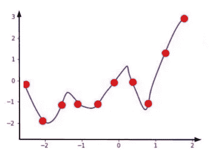
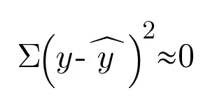
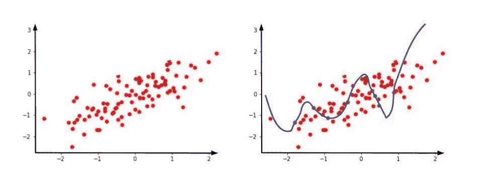
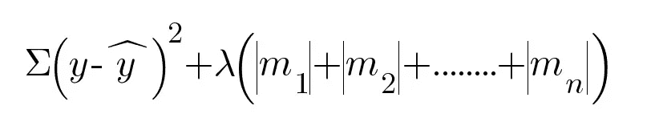
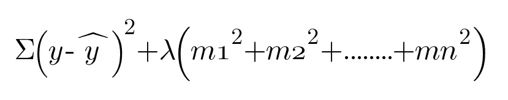

# L1 vs L2 正规化，何时使用哪个？

> 原文：<https://levelup.gitconnected.com/l1-vs-l2-regularization-and-when-to-use-which-cd3382008774>

我已经阅读了许多关于这个主题的文章，以找出两者中哪一个更好，以及我应该在我的模型中使用什么。我对它们都不满意，这让我的大脑很困惑，我应该使用哪一个？做了这么多实验后，我终于找到了 ***的所有答案，该使用哪种正则化技术，何时使用？*** *让我们用一个回归的例子来说明。*

假设我们有一个基于 x 轴值预测 y 轴值的回归模型。

训练数据

价值函数

在训练模型时，我们总是试图找到成本函数。这里，y 是实际输出变量， **ŷ** 是预测输出。因此，对于训练数据，我们的成本函数几乎为零，因为我们的预测线完全从数据点通过。

现在，假设我们的测试数据集如下所示

测试数据集上的模型

这里，很明显我们的预测是在别的地方，预测线指向别的地方。这导致过度拟合。**过度拟合表示，对于训练数据集，您得到的误差较低，但是对于测试数据集，您得到的误差较高。**

> 请记住，当我们需要创建任何模型时，让它回归，分类等。应该是广义的。

我们可以使用 L1 和 L2 正则化使这个过拟合条件基本上是高方差到低方差。一个一般化的模型应该总是具有低偏差和低方差。

现在让我们试着理解 L1 和 L2 正则化是如何帮助减少这种情况的。

> 我们知道直线的方程是 **y=mx+c.**
> 
> 对于多个变量，这条线将转换为 **y = m1x1 + m2x2 + ……..+ mn xn。**

其中 m1，m2，…，mn 是各个变量的斜率，x1，x2，....，xn 是变量。

当变量的系数(即斜率)很大时，任何模型都会进入过拟合状态。为什么会这样？原因很简单，系数越高，该特定变量在预测模型中的权重越高。我们知道不是每个变量都有显著的贡献。规则化的工作原理是惩罚大权重。从而使得高度相关的变量具有高权重，而不太相关的变量具有较低的权重。

正则化方法也是一个超参数，这意味着它可以通过交叉验证进行调整。

## L1 正则化或套索回归

使用 L1 正则化技术的回归模型被称为 ***套索回归***

L1 正则化通过使用如下误差函数来工作—

L1 正则化的误差函数

为了调整我们的模型，我们总是想减少这个误差函数。参数λ会告诉我们我们想要惩罚多少系数。

## 0< **λ<T3*∞***

如果 **λ** 大，我们罚很多。如果 **λ** 小，我们罚的就少。使用交叉验证**选择 **λ** 。**

**这个误差函数是如何调整我们的模型的？**

早先我们的误差函数(或成本函数 ***∑ (y -ŷ )*** )完全基于我们的预测变量 ŷ.但是现在我们有了 **λ(|m1|+|m2|+。。。**+| Mn |)作为附加名词。

早先的成本函数***∑(y-ŷ)***)**= 0**，因为我们的线完美地穿过训练数据点。

> 设λ = 1 且|m1|+|m2|+。。。。+ |mn| = 2.8
> 
> ***误差函数=∑(y-ŷ)***)**+****λ(| m1 |+| m2 |+。。。。+ |mn|) = 0 + 1*2.8 = 2.8**

在调整时，我们的模型现在将尝试减少这个 2.8 的误差。假设现在的值为 *∑ (y -ŷ )* ) = 0.6，λ = 1 并且|m1|+|m2|+。。。+ |mn| = 1.1

现在，误差函数的新值将是

> ***误差函数=∑(y-ŷ)***)**+****λ(| m1 |+| m2 |+。。。。+ |mn|) = 0.6 + 1*1.1 = 1.7**

这将迭代多次。为了减小误差函数，我们的斜率将同时减小。在这里我们会看到斜坡会变得越来越不陡。

随着λ值变得更高，它将更多地惩罚系数，并且线的斜率将更趋向于零。

在由于在公式中取|slope|而导致 L1 正则化的情况下， ***较小的权重将最终消失并变为 0。这意味着 L1 正则化有助于选择重要的特征，并将其余的特征化为零。它将创建稀疏的权重向量，结果类似于(0，1，1，0，1)。因此，如果我们有大量的特征，这对于特征选择很有用。***

## L2 正则化或岭回归

使用 L2 正则化技术的回归模型被称为**岭回归。**

L2 正则化通过使用以下误差函数来工作

L2 正则化的误差函数

L2 正则化的工作方式类似于上面解释的 L1 的工作方式。唯一不同的是坡度。在 L1 正则化中，我们采用 **|slope|** ，而在这里我们采用 **slope** 。

这将类似地工作，它将惩罚系数，线的 ***斜率将更趋向于零，但永远不会等于零。***

**为什么会这样？**

这是因为我们在公式中使用了斜率。该方法将以(0.5，0.3，-0.2，0.4，0.1) 的形式创建**权重的稀疏度。让我们通过一个例子来理解这种稀疏性。**

考虑权重(0，1)和(0.5，0.5)

> 对于权重(0，1) L2 : 0 + 1 = 1
> 
> 对于权重(0.5，0.5) L2 : 0.5 + 0.5 = 0.5

因此，L2 正则化将优选向量点(0.5，0.5)而不是向量(1，1)，因为这产生更小的平方和，进而产生更小的误差函数。

*我们连线上*[*LinkedIn*](https://www.linkedin.com/in/ankita-prasad-5a0156137/)*。你也可以通过 ankita2108prasad@gmail.com 联系我。*