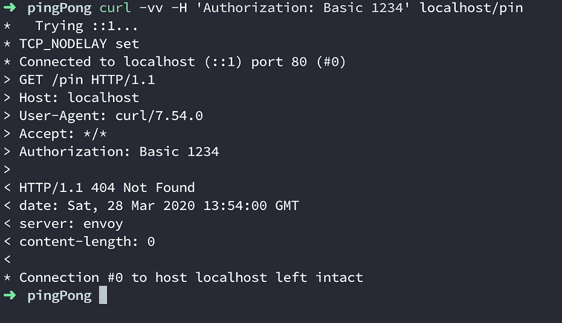

# L4 与 L7 负载平衡

> 原文：<https://levelup.gitconnected.com/l4-vs-l7-load-balancing-d2012e271f56>

负载平衡是代理的主要特性之一。负载平衡器在其上运行的层为它提供了不同的功能。L4/L7 负载平衡器的这些功能和内部机制将是本文的重点。

# 第 4 层负载平衡器


TCP/UDP 直通 L4 负载平衡器

顾名思义，L4 工作在 OSI 模型的第 4 层(和第 3 层)。当客户端发出请求时，它会创建一个与负载平衡器的 TCP 连接。然后，负载平衡器使用客户机用它创建的同一 TCP 连接来连接一个上游服务器。


> 传输层添加源端口和目的端口。网络层添加源 IP 和目的 IP(这些层做的远不止这些)

但是，还是有区别的。负载平衡器使用 NAT(网络地址转换)更改每个数据包的源和目的 IP。

```
Source                 Dest         Source              Dest
 ----------- ---------- -------        ------- --------  --------
| Client IP | Segment  | LB IP |  --> | LB IP | Segment | Server |  
 ----------- ---------- -------        ------- --------  --------
    Changing source an destination IP for every request packet
```

当收到来自服务器的响应时，负载平衡器会再次执行相同的转换。

```
Source                 Dest         Source              Dest
 ----------- ---------- -------        ------- --------  ---------
| Server IP | Segment  | LB IP |  --> | LB IP | Segment | ClientIP |  
 ----------- ---------- -------        ------- --------  ---------
    Changing source an destination IP for every response packet
```

> 这里是另一种类型的 L4 负载平衡器，称为 TCP/UDP 终端负载平衡器，其中有两个不同的 TCP 连接。

使用 L4 负载平衡器时，我们不知道数据。这意味着我们不能根据请求中的数据做出任何决定。我们唯一拥有的是 IP(源和目的地)和端口。

考虑下面的请求

```
curl -X GET [http://apis.pay.com/v1/payments/](https://integration.gopayapi.com/merchants/v1/payments/S12020030308345Q6MKM1R46RJJB9DU1LIS0MPPR)${paymentId} -H 'Authorization:Basic fdklakglkadskl='
```

假设您希望在授权头为空的情况下返回 401，或者您希望将调用路由到基于`path`的服务。对于 L4 负载平衡器，这是不可能的，因为您无权访问请求数据。


保持活动连接

此外，负载平衡*多路复用(HTTP2 流)*、*保持活动状态*协议也是一个问题。(多路复用是通过单个连接发送多个请求，保持活动状态是在一段时间内不关闭连接)。考虑这样一种情况，两个客户端`A`和`B`向具有两个上游服务器`C`和`D`的负载均衡器发出请求(假设保持活动连接)。假设`A`连接到服务器`C`，而`B`连接到服务器`D`。如果`A`产生 1 个 RPS 而`B`产生 50 个 RPS，那么`D`比服务器`C`多处理 50 倍的请求，这实际上违背了负载平衡的目的。

## 骗局

1.  没有智能负载平衡
2.  不适用于流式/保持活动连接
3.  没有 TLS 终止(*好坏你决定！*)

> L4 负载平衡器实际上并不是 L4，它们是 L3 和 L4 的组合，因此您实际上可以称之为 L3/L4 负载平衡器。

# 第 7 层负载平衡器


L7 负载平衡器

顾名思义，L7 工作在 OSI 模型的第 7 层(第 6 层和第 5 层)。当客户端发出请求时，它会创建一个与负载平衡器的 TCP 连接。然后，负载平衡器创建一个与上游服务器之一的新 TCP 连接。因此，与 TCP/UDP 直通 L4 负载平衡器中的 1 个连接相比，有 2 个 TCP 连接。

因为我们在第 7 层，所以我们知道请求中的数据。这允许我们执行各种操作，例如

1.  身份验证— 401，如果某个报头不存在
2.  智能路由—将支付呼叫路由到特定的上游
3.  TLS 终止


保持活动连接

在多路复用/保持活动协议的情况下，L7 负载均衡器工作起来很有魅力。L7 负载平衡器为单个客户端连接创建与每个上游的 TCP 连接，而不是选择单个上游。这意味着当`A`创建与负载平衡器的连接时，负载平衡器创建两个连接，一个与`C`连接，一个与`D`连接。

> L7 负载平衡器实际上不是 L7，它们是 L5、L6 和 L7 的组合，因此您实际上可以称它们为 L5 到 L7 负载平衡器。

# 演示

对于演示，我将使用[特使代理](https://www.envoyproxy.io/)来演示一个简单的例子。

> 如果请求中没有授权头，则返回 401。如果请求路径匹配/ping，则获得 Pong 响应。应该忽略所有其他路径。401 应该在到达服务之前返回。

为了在本地运行 envoy，我们将使用 docker。下面是 Dockerfile 和 envoy 配置的样子。

Dockerfile 文件

特使. yaml

现在让我们创建一个基本的乒乓应用程序

乒乓球应用程序

> 您可以使用 docker 文件在本地构建 docker 映像，也可以使用我已经在 docker hub 上推送的映像

```
Now let's run the docker container using the following commanddocker run -p 80:80 mohak1712/envoy
```

一旦应用程序和特使运行，我们可以做一个基本的 curl 请求


200 和 401 响应代码



404 和 401 响应代码

所有输出中有一个有趣的日志是`Connection #0 to the host localhost left intact.`,它使客户端能够对其他请求使用相同的连接。

> 请记住，您的连接是与特使，而不是与您的后端服务器。

为了测试保活连接，我将在两个不同的端口上启动 java 服务器，更新 envoy.yaml 以将两个服务器都包含在集群中，并返回端口作为响应。

```
clusters:
- name: ping_pong_service
  connect_timeout: 0.25s
  type: strict_dns
  lb_policy: round_robin
  hosts: [{ socket_address: { address: host.docker.internal,  port_value: 8080 }},{ socket_address: { address: host.docker.internal, port_value: 8181 }}]
```


保持活动连接

如果你注意到我们从两个不同的服务器得到响应[响应-> 8080，8081]。因此，即使在保活连接上，请求也分布在上游服务中。(后端服务器)。

差不多就是这样！感谢您的阅读，我希望您喜欢这篇文章。如果你真的为它鼓掌了:)

另外，我强烈推荐阅读这篇[文章](https://blog.envoyproxy.io/introduction-to-modern-network-load-balancing-and-proxying-a57f6ff80236)

也可以在[中](https://medium.com/@mohak1712)和 [Github](https://github.com/mohak1712) 上关注我。🙂