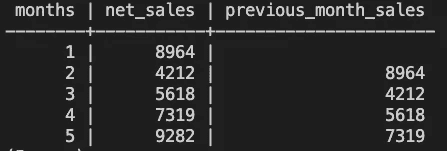

# SQL 数据的滞后功能

> 原文：<https://levelup.gitconnected.com/lag-functionality-on-sql-data-d58027631d8a>

## SQL 与宇宙的中间话题


图片来源:美国宇航局

*“火星就在那里，等着被到达。”—巴兹·奥尔德林*

在火星上旅行和度假——这是科幻小说的内容。火星是地球的近邻，有深谷和高山。一座山是奥林匹斯山，惊人的高度为 72000 英尺(是珠穆朗玛峰海拔的两倍半)。这是一座盾状火山，很像构成夏威夷群岛的大型火山。

尽管火星的环境对人类不利(其中一个特点是在火星表面受到的辐射量可能会对健康造成危害)，我还是要创造一个场景，让我们想象在这个红色星球上度假。假设我们花了 4 年时间乘坐宇宙飞船去那个星球旅行。在这个星球的众多景点中，我们本周将参观奥林匹斯山。在山区基地，一个食品摊正在出售宇航员冰淇淋和其他冻干食品。

今天的 SQL 帖子使用假数据来展示`LAG`窗口函数。*我们开始吧。*

# 创建数据

因为这是一个假设的场景，所以我将为食品摊创建一个月销售假想数据。

在这里，我创建了名为`sales`的表:

```
CREATE TABLE sales (
  months INT,
  net_sales FLOAT
);
```

然后，我将数据插入表中:

```
INSERT INTO sales(months, net_sales)
  VALUES (1, 8964),
  (2, 4212),
  (3, 5618),
  (4, 7319),
  (5, 9282);
```

我最后用一句`SELECT`的话来看待我的作品:


因此，有 5 条`net_sales`记录，每条记录对应于小吃摊开放的一个月。

# 滞后窗口函数

假设我想查看上个月的净销售额，同时查看本月。这可以通过`LAG`窗口功能实现。这允许我们访问当前行之前特定偏移量处的行。就我们的例子而言，如果当前行是第 4 个`month`并且`net_sales`值是 7319，那么在偏移量为 1 的情况下，我期望在该行的下一列中看到 5618。类似地，对于其他记录，我们可以预期如下。


编码如下:

```
SELECT *
  , LAG(net_sales, 1) OVER (ORDER BY months) "previous_month_sales"
FROM sales;
```

对此有两点评论:

*   `LAG`函数参数是返回值(这里是`net_sales`)和偏移量(这里是 1)。
*   `OVER`功能表示应用了`LAG`功能的数据窗口。这里，我们在整个数据集上应用这个函数，时间大约是几个月。

查看查询的结果:



真好。但是，让我们更进一步。假设我们要比较两个月销售额的百分比变化。这也可以做到:

```
WITH comparison AS (
  SELECT *
   , LAG(net_sales, 1) OVER (ORDER BY months) "previous_month_sales"
  FROM sales
)SELECT *
  , CAST ((net_sales - previous_month_sales)  / previous_month_sales   
           * 100 AS INT) "vs_previous_month"
FROM comparison;
```

这个查询稍微复杂一点，它从表中计算一个值。我们来分解一下。

*   首先，我需要为一个查询定义一个临时表(名为`comparison`)。该表允许将`previous_month_sales`定义为我们可以查询的列。(否则，它只会出现在表格视图中。)
*   在下一个查询中，我计算百分比变化，但是`CAST`将其作为一个`INT`，这样我在最终的表视图中就有了一个简洁明了的百分比。

结果:


阅读和解释这张表，第二个月的销售额与前一个月相比下降了 53%。第 3 个月的净销售额增长了 33%，以此类推。

各位，这些假数据到此为止！SQL 工具箱的另一个主题。

作为参考，我有一系列 SQL 教程，涵盖了基本查询和中间查询。看一看！

*   [黑洞、行星和 SQL](/black-holes-planets-and-sql-5667e74b272a?source=friends_link&sk=82cfce28709cee06c56254ede9cfc2bb)
*   [用 SQL 漫游太阳系](https://medium.com/swlh/touring-the-solar-system-with-sql-b2a9d167b829?source=friends_link&sk=b77b267ffa08a803232c06afd85816b8)
*   [用 SQL 搜索卫星](https://medium.com/swlh/searching-for-moons-with-sql-4d803738347c?source=friends_link&sk=8e9af00e337fc5551e3ffe28cd7a2a46)
*   [用 SQL 对黑洞进行分类](https://medium.com/swlh/classifying-black-holes-with-sql-88bd07b54e64?source=friends_link&sk=5b4594dcf3d82881f1d316a90d118f3e)
*   [用 SQL 连接星座图](https://medium.com/@kwarmbein/joining-constellations-with-sql-af40f1255562?source=friends_link&sk=0c5a75976efa60006cb3b2889120e1f2)
*   [用 SQL 进行太阳系分类](https://medium.com/swlh/solar-system-classifications-with-sql-f1a3a5e4730a?source=friends_link&sk=6a9eafa2c412523f5243f708a4f8e279)
*   [星星之间的多(对多)关系](https://medium.com/swlh/many-to-many-relations-among-the-stars-1728ba18a2d0?source=friends_link&sk=520341a6b29b886a2f71e13925559bf5)
*   [在 SQL 中创建表格](https://medium.com/swlh/creating-tables-in-sql-a3c5995da5f7?source=friends_link&sk=46f6eed6a011ef5c1959bb7e1d7c48bb)
*   [通往太阳系的窗口](https://medium.com/swlh/a-window-to-the-solar-system-d4e882031964?source=friends_link&sk=f421d2e0c4758d29efb1a13a53b0799d)

*喜欢这些 SQL 帖子？有问题吗？大家在评论里聊聊吧！*