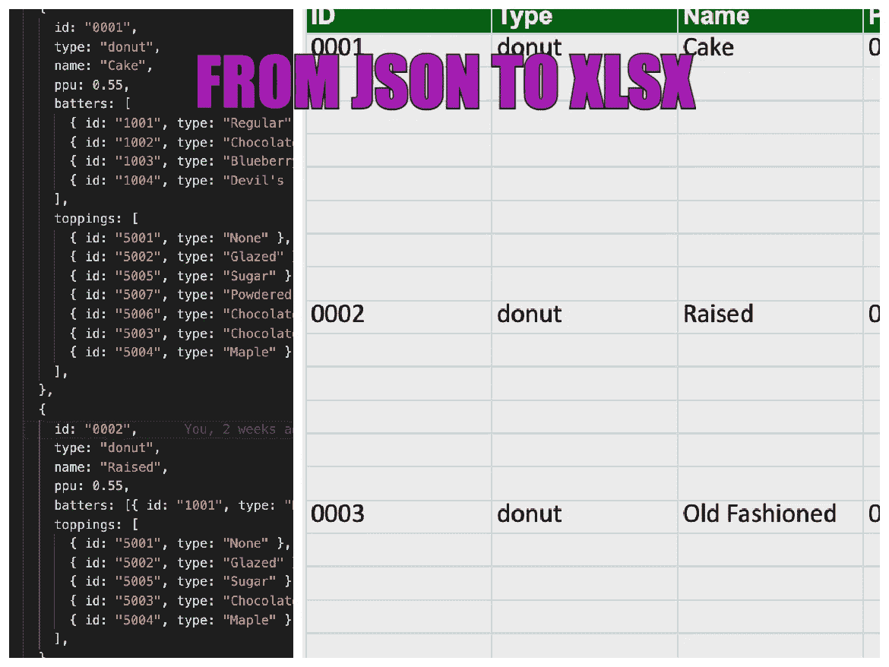
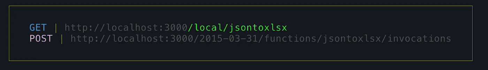

# Lambda 函数使用 NodeJS/typescript 从 JSON 数据创建 xlsx 文件并存储在 s3 上

> 原文：<https://levelup.gitconnected.com/lambd-function-to-create-xlsx-file-from-json-data-ff9da3d19625>

> 演示地点:[https://tools.meta-collective.co.uk/jsontoxlsx](https://tools.meta-collective.co.uk/jsontoxlsx)

在本文中，我将向您展示如何使用 NodeJS 和 Typescript 编写 lambda 函数，将 JSON 数据转换成. xlsx 文件。

该功能是使用无服务器框架构建的。你可以在这里找到更多关于那里的信息-【https://www.serverless.com/ 

> 全局安装无服务器

全局安装无服务器

> 创建 typescript 模板项目

从模板创建基于 typescript 的无服务器项目

> 安装所需的 npm 软件包

安装节点包

1.  [excelJS](https://www.npmjs.com/package/exceljs) 用于创建电子表格
2.  [无服务器-离线](https://www.npmjs.com/package/serverless-offline)用于本地运行 lambda 功能
3.  [aws-sdk](https://www.npmjs.com/package/aws-sdk) 与 aws 服务交互

> 我们将把这个样本 JSON 转换成 XLSX

样本 JSON

> 定义无服务器功能并将离线软件包添加到无服务器. ts

> 使用 excel 节点包将 JSON 数据转换成 excel 格式

函数来处理样本 json 数据。xlsx

> excel 类实现

exceljs 实现

> 本地测试

使用无服务器离线插件在本地运行 lambda

无服务器本地端点

> 将 excel 表上传到 s3

> AWS 包装函数——注意:在您的环境中，您需要有您的 AWS 访问密钥和 AWS 秘密

AWS 包装函数

> 部署到 AWS

你可以克隆这个[回购](https://github.com/appletreeat56/json-to-xlsx)来看看一个工作示例

> git 克隆[https://github.com/appletreeat56/json-to-xlsx.git](https://github.com/appletreeat56/json-to-xlsx.git)
> 
> 演示地点:[https://tools.meta-collective.co.uk/jsontoxlsx](https://tools.meta-collective.co.uk/jsontoxlsx)

感谢您的阅读，如果您想支持我，请关注我，成为会员，支持更广泛的社区。

 [## 通过我的推荐链接加入媒体 Meta Collective

### 作为一个媒体会员，你的会员费的一部分会给你阅读的作家，你可以完全接触到每一个故事…

medium.com](https://medium.com/@metacollective/membership)