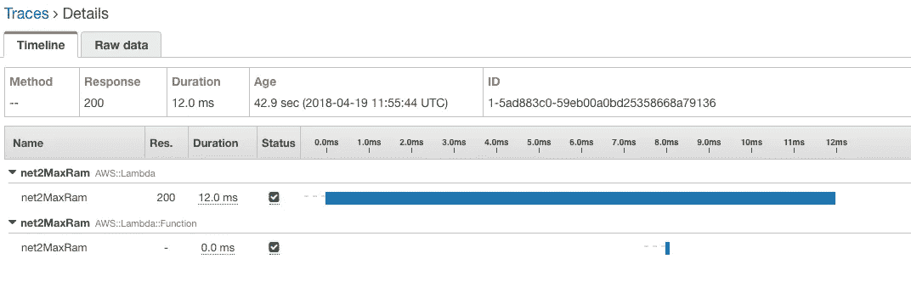
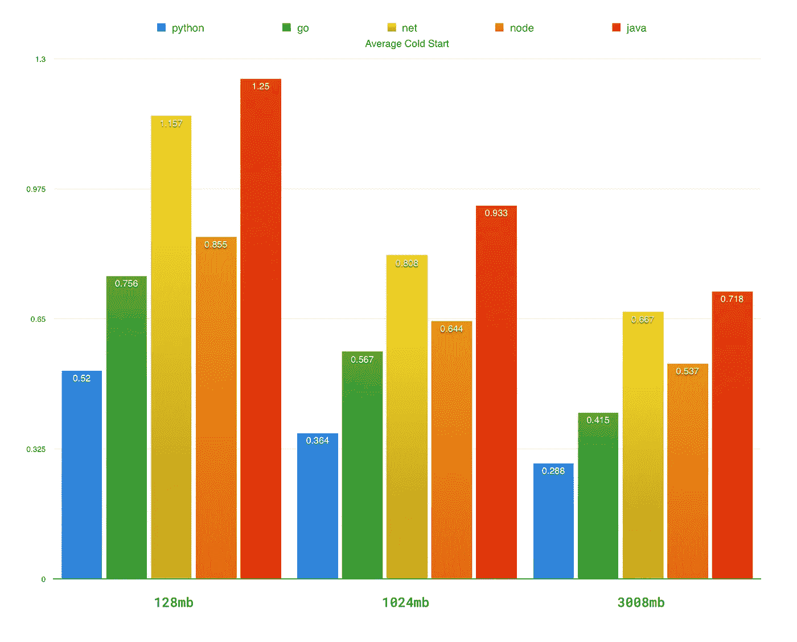
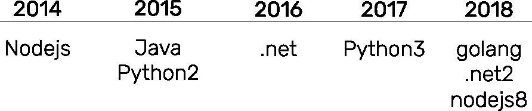
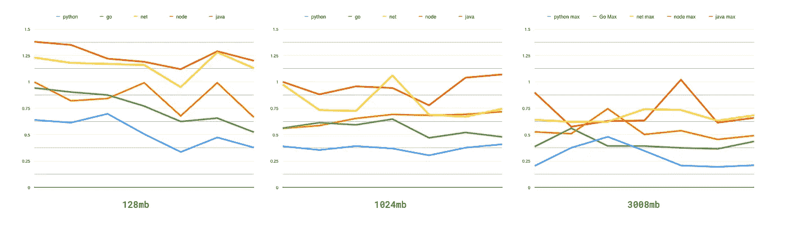
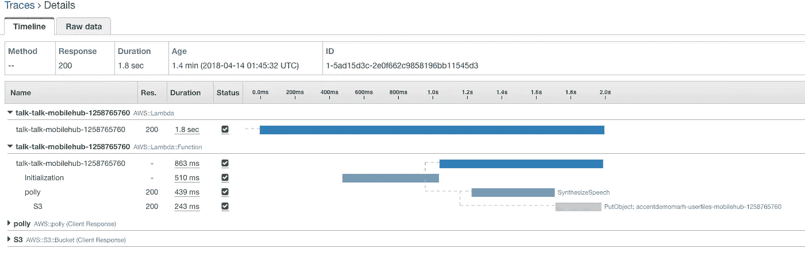
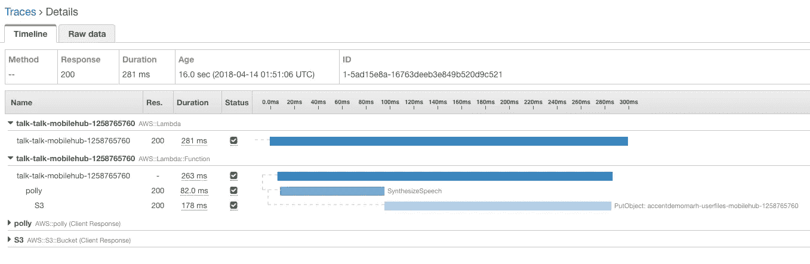

# 拉姆达冷启动，语言对比🕵 ❄️ (2018)

> 原文：<https://levelup.gitconnected.com/lambda-cold-starts-language-comparison-%EF%B8%8F-a4f4b5f16a62>

由[约书亚·厄尔](https://unsplash.com/photos/-87JyMb9ZfU?utm_source=unsplash&utm_medium=referral&utm_content=creditCopyText)在 [Unsplash](https://unsplash.com/search/photos/comparison?utm_source=unsplash&utm_medium=referral&utm_content=creditCopyText) 上拍摄的照片

*自从写了这篇文章我还写了* [*一篇 2019 更新*](/aws-lambda-cold-start-language-comparisons-2019-edition-️-1946d32a0244) *！*

走向无服务器比以往任何时候都更有利可图，但无服务器的警告总是越来越多。避免冷启动是拥有敏捷用户体验的一个重要部分，选择一种语言来帮助你实现这一点很重要！

## 冷启动？

在无服务器世界中的“冷启动”,是在某个设定的时间段内第一次有请求要求执行您的代码。因为你在一个没有服务器的世界里，不需要为服务器时间付费，你的函数或“lambda 代码”只在每个请求的基础上执行。

但事实并非如此，事实上你的 lambda 函数实际上是为你部署到一个容器中的，并且有一定的生存时间。虽然此代码是“活动的”,但它不需要重新初始化，并且响应速度快得多，因此被认为是“热的”。这是无服务器的，AWS 处理管理服务器、容器和扩展的抽象。通常你的代码有 30-45 分钟的寿命！

下面是完全相同的 lambda 函数运行两次的请求跟踪。

请求跟踪从自动气象站 X 射线捕获的“冷”启动

您可以在跟踪中看到，在外部函数`AWS::Lambda`将代码移交给我的函数代码`AWS::Lambda::Function`之前，大约需要 650ms，除此之外，还需要一段初始化时间。这就是我们所说的冷启动！

请求跟踪“热”lambda 函数

“冷”功能比“热”功能慢 50 倍以上。更重要的是，这些是简单地返回“hello world”的测试函数，具有依赖性或实际执行有用计算的函数可能更糟。

## **方法论**

我决定测试所有最新的语言，Nodejs8，c#.net2，Java8，Go1.x & Python3。我从控制台创建了每个 lambda 函数，保留了默认的“hello world”日志。我分别使用了 128mb、1024mb 和 3008mb 的内存。然后我创建了三个[步骤函数](https://aws.amazon.com/step-functions/)来触发每个内存组的所有作业，并配置了一个 cloudwatch 调度来每小时触发一次。我每隔至少 7 个小时回到 [AWS X 射线](https://aws.amazon.com/xray/)，记录它在过去 6 个小时观察到的平均值。

## **结果**

> 内存分割在这里很重要，因为分配给 lambda 函数的内存增加，所以它的 [CPU 时间也线性增加。](https://forums.aws.amazon.com/message.jspa?messageID=588722)

很明显，python 是这里最强的玩家，它以 128mb 的内存在各个领域击败了大多数语言。

迁移到 1024mb 内存使 golang、nodejs & java 减少了 25%，而 python 和。净利润下降了 30%。与 128mb 的基数相比，3008mb 在 python、go、node 和 java 中减少了约 42–45 %,而 node 仅减少了 37%。

Lambda 的语言时间轴

我很惊讶地看到 golang 的冷启动时间，与 nodejs 相似。我的最佳猜测是平台上的语言成熟度开始发挥作用。由于它最近于 2018 年 1 月发布，你可以推测会看到更多的改进。

并列比较

## **关于定价的一句话**

Lambda 的定价完全在 GB/s 左右，所以它是运行时间和资源最小化的平衡。

以 **70 rps** 或**每天 100，000** 次，或**每月 300 万**个请求运行 lambda 函数，平均每个请求运行 **0.5** 秒。等同于:

AWS 定价是线性的。1024 比 128 贵 8 倍。3008 比 128 贵 24 倍。

对此要有所保留，因为根据您的工作负载增加内存和可用 CPU，可以显著减少运行时间。正如吉姆·康宁雄辩地说的那样[‘越快越便宜’](https://medium.com/@jconning/aws-lambda-faster-is-cheaper-6bf32f58d741)！

## 现实世界

用 lambda 函数构建时，冷启动是一个关键考虑因素的真实例子。下面是我在[上一篇博文](https://medium.com/@nathan.malishev/going-serverless-on-aws-b6d78b43e691)中的[演示](http://accents.nathanmalishev.com)，在那里我使用配置了 512mb 的 nodejs 函数构建了一个无服务器应用。

真实世界“冷”请求跟踪

冷请求需要 1.8 秒，而热请求需要 281 毫秒，增加了 6 倍。想象一下，让你的服务在 lambda 函数上高度分解，等待 2-3 秒的响应并不好玩。幸好[崔琰](https://medium.com/u/d00f1e6b06a2?source=post_page-----a4f4b5f16a62--------------------------------)有一篇[关于暖 lambda 功能的大文章](https://hackernoon.com/im-afraid-you-re-thinking-about-aws-lambda-cold-starts-all-wrong-7d907f278a4f)。

真实世界“热”请求跟踪

感谢阅读我的文章，如果你喜欢它，请一定要鼓掌！

## 参考

 [## 如何使用 AWS Lambda 提高无服务器性能

### 自从我们上一次在 Amazon Web Services Lambda 上发布帖子以来，无服务器计算服务的使用持续增长…

blog.newrelic.com](https://blog.newrelic.com/2017/06/20/lambda-functions-xray-traces-custom-serverless-metrics/)  [## AWS Lambda:更快更便宜

### 随着 CPU 能力的提高，CPU 相关的功能执行速度更快，成本更低

medium.com](https://medium.com/@jconning/aws-lambda-faster-is-cheaper-6bf32f58d741)  [## 恐怕你对 AWS Lambda 冷启动的想法完全错了

### 当我在 API Gateway 的上下文中与人们讨论 AWS Lambda 冷启动时，我经常得到这样的回答…

hackernoon.com](https://hackernoon.com/im-afraid-you-re-thinking-about-aws-lambda-cold-starts-all-wrong-7d907f278a4f)