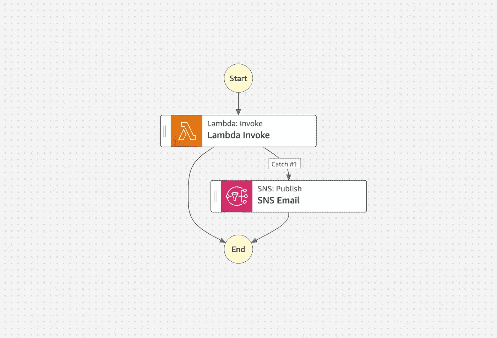
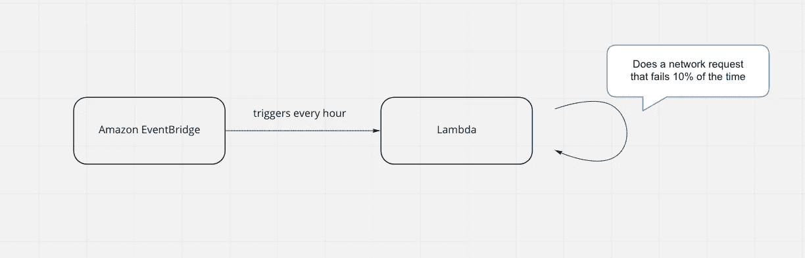
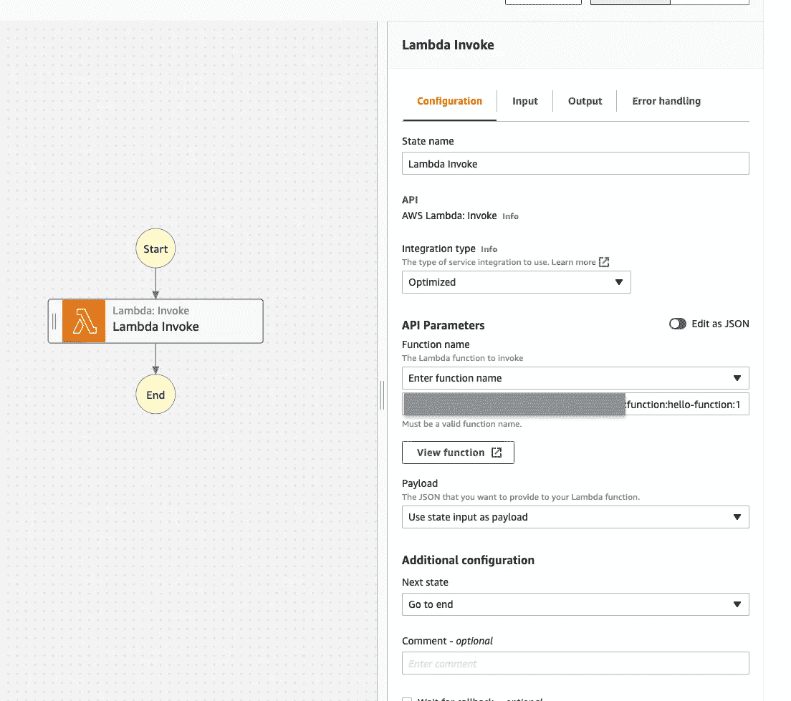
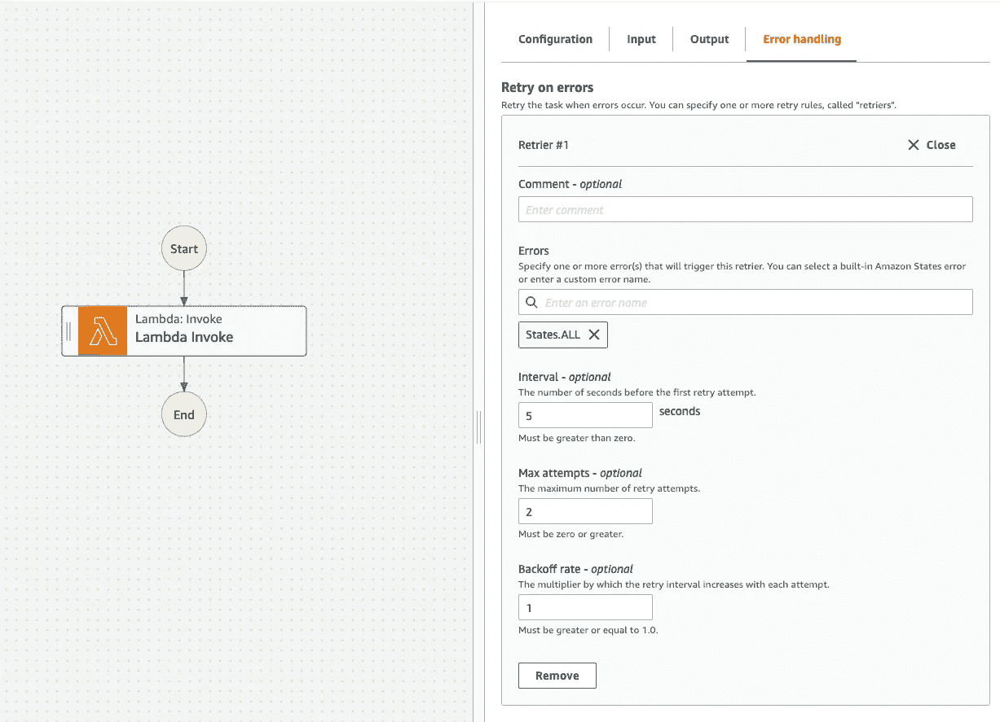
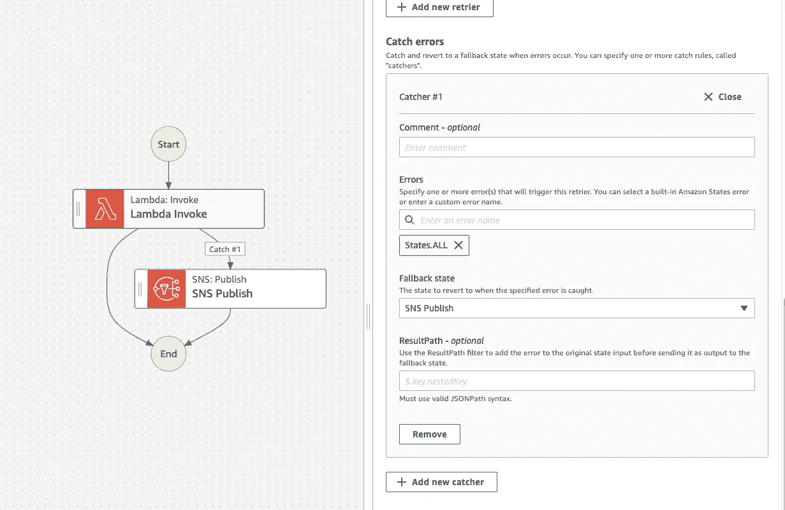
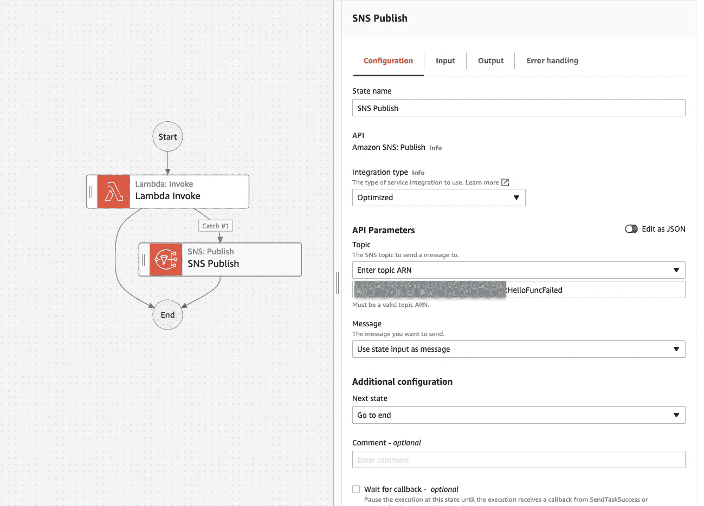

# 具有 AWS 步进功能的 Lambda 重试和错误通知

> 原文：<https://levelup.gitconnected.com/lambda-retry-and-error-notification-with-aws-step-function-bce84b48b042>

# 问题是

我的团队有一个 lambda 函数，计划每小时运行一次。由于网络错误，它有 90%的成功几率，但有 10%的失败几率。

当它失败时，它默默地这样做。我们必须定期检查其日志，并手动弥补缺失的内容。这是相当不方便的。

我们想要一个更好的方法来做这件事。我们希望 lambda 在失败后自动重试几次。如果在所有尝试后仍然失败，我们希望通过电子邮件得到通知。

我们使用 **AWS 步进函数**实现了这一点。它节省了我们大量的时间，我们喜欢它简化了逻辑并减少了我们必须编写的代码量(和 bug)。

这篇文章将告诉你如何做到这一点。

我们将首先看到如何在 AWS 控制台中创建一个 step 函数，然后如何通过一个基础设施即代码工具(如**无服务器**)来实现。

# 在 AWS 控制台中创建步骤功能

## **1。添加λ**

转到 **AWS 控制台>步骤功能>点击**创建状态机。****

选择**可视化设计您的工作流程**，选择**标准型**，点击**下一步**。

在 Workflow Studio 中，将一个 **Lambda: Invoke** 块拖入第一个状态。

在**配置下** > **API 参数** > **函数名**，在下拉列表中选择目标 lambda。

在**配置下** > **追加配置>下一个状态，**选择**转到结束。**

Lambda 调用配置

## **2。添加一个检索器**

**重试器**定义了一组重试规则，如最大重试次数和重试间隔。retrier 在 lambda 因某个错误而失败后重新运行它。

阶跃函数允许您添加多个重试器来处理不同的错误。为了简单起见，我们将添加一个针对所有错误运行的 retrier。

在**错误处理>错误重试下，**点击**添加新重试。**

在 **Retrier # 1** > **错误**下，选择 **States.ALL.** 这意味着该 Retrier 将应用于所有错误。

将**间隔**设置为 5 秒，**最大尝试次数**设置为 2，**回退速率**设置为 1。

间隔和最大尝试次数很容易理解，补偿率决定了重试间隔的增加。例如，如果间隔为 5 秒，回退率为 2，则 lambda 将在第一次失败后等待 5 秒后重试，第二次失败后等待 10 秒，第三次失败后等待 20 秒，依此类推。

Lambda 调用>错误处理>错误重试

## **3。添加一个捕捉器**

一个**捕捉器**定义了一组错误处理规则，如果 lambda 在所有重试后失败。

如果所有重试失败，我想发送一封带有 [AWS 简单通知服务](https://docs.aws.amazon.com/sns/latest/dg/sns-email-notifications.html)的电子邮件。

在**错误处理下** > **捕捉错误，**点击**添加新的捕捉器。**

在**捕捉器# 1** > **错误**下，选择 **States.ALL.** 这意味着捕捉器可以被所有错误触发。

在**捕手# 1 >回退状态下，**点击**添加新状态。**这将在工作流中创建一个新的错误处理分支。

在左侧搜索栏搜索 SNS，拖动一个**亚马逊 SNS 发布块**进入回退状态。

Lambda 调用>错误处理>捕获错误

接下来，点击 **SNS: Publish** 块进行编辑。

在**配置** > **API 参数** > **主题**下，选择一个主题。比如这里的 HelloFuncFailed 话题会发邮件给我。参见此[文档](https://docs.aws.amazon.com/sns/latest/dg/sns-email-notifications.html)了解如何设置社交网络来发送电子邮件。

既然我们已经添加了 Lambda，在 step 函数中定义了 retry 和 catch 规则，您可以单击下一个的**来查看定义，然后创建状态机。**

# 使用无服务器部署分步功能

为了更容易地共享和维护 step 函数配置，您还可以使用基础设施即代码工具来部署相同的 step 函数。下面是我们上面创建的 step 函数的****定义。****

****上面的模板假设 lambda 代码是在同一目录下的 hello.js 文件中定义的。还可以通过 Amazon 资源名(Arn)引用现有的 Lambda。参见[无服务器文档](https://www.serverless.com/plugins/serverless-step-functions)了解更多详情。****

# ****结论****

****这就是如何使用 **AWS 步骤函数**向 lambda 函数添加错误重试和通知逻辑。您可以通过 AWS 控制台创建一个 step 函数，或者使用基础设施代码工具(如 Serverless)创建一个。****

****阶跃函数为我的团队节省了大量时间。它简化了我们的错误处理逻辑，并允许我们用几行代码实现一组相当复杂的规则。希望有一些东西你可以带走并应用到你的项目中。如果你有任何问题，请告诉我。🙂****