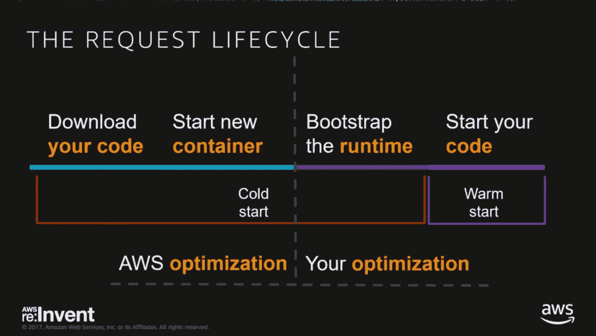
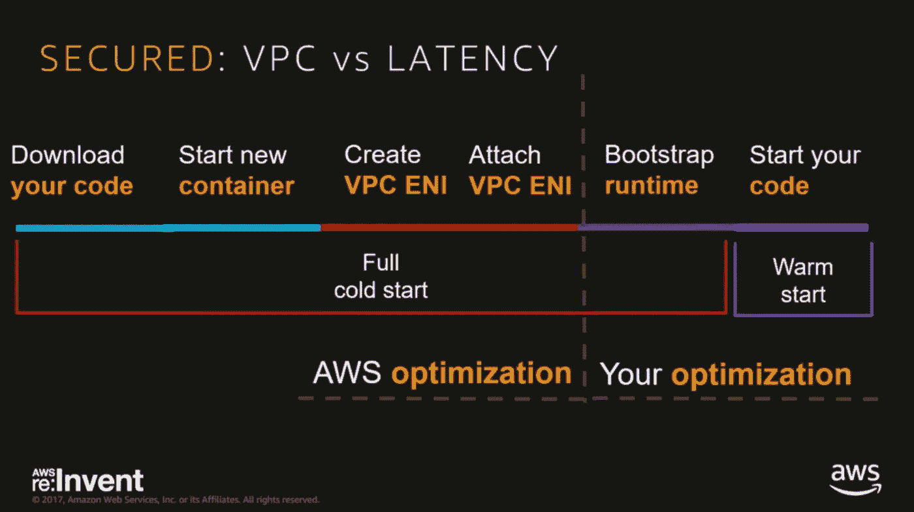
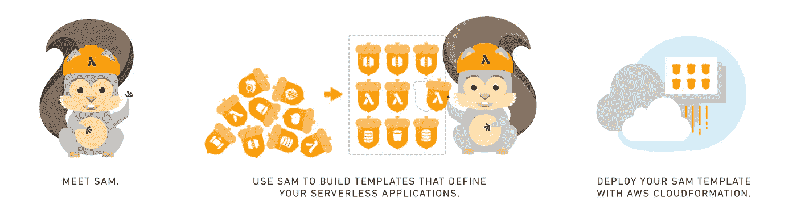
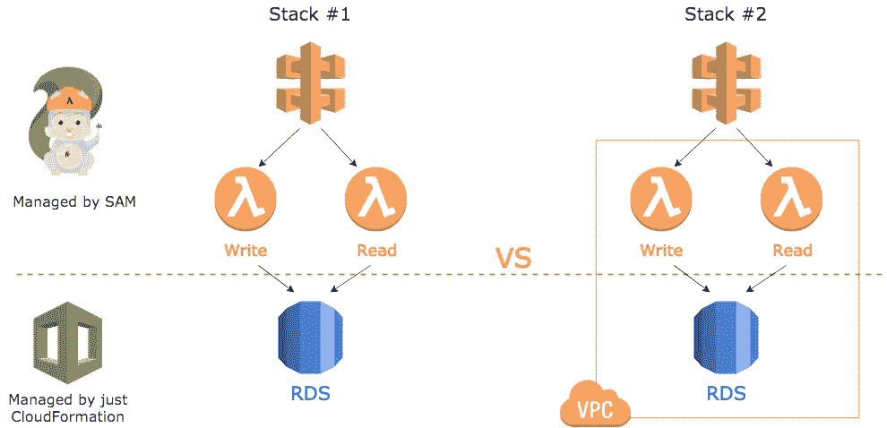
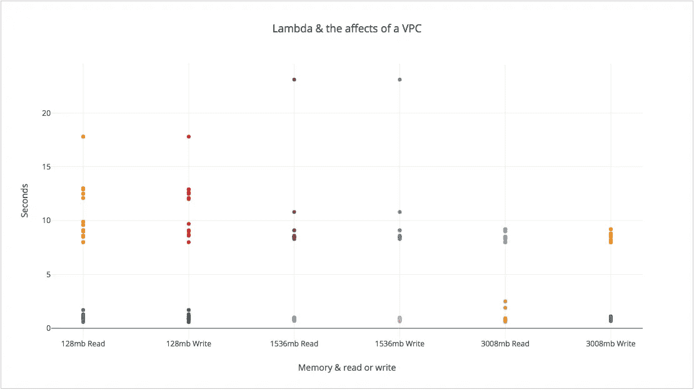
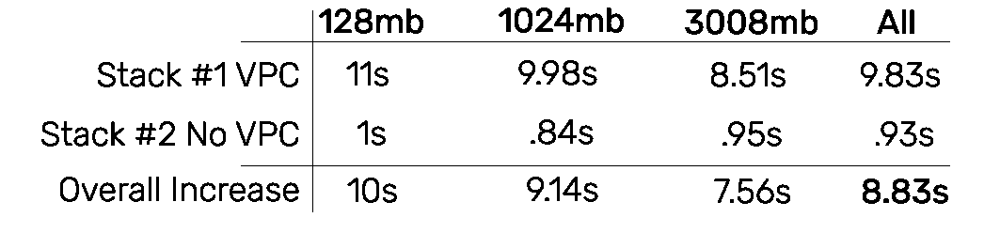
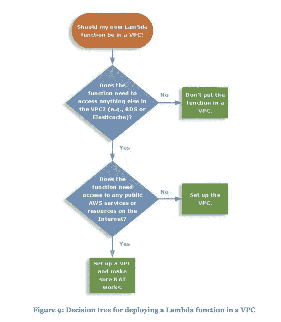

# AWS Lambda 和 VPC 冷启动—🕶⛈的黑暗面

> 原文：<https://levelup.gitconnected.com/lambda-vpc-cold-starts-a-latency-killer-5408323278dd>

由 [Ethan Hu](https://unsplash.com/photos/Ggt04LoGPBk?utm_source=unsplash&utm_medium=referral&utm_content=creditCopyText) 在 [Unsplash](https://unsplash.com/search/photos/cold?utm_source=unsplash&utm_medium=referral&utm_content=creditCopyText) 上拍摄的照片

**编辑:**这篇文章可能不太相关，因为自发表以来，AWS 已经像往常一样完成了令人敬畏的工程工作，并减少了 VPC 冷启动次数。我还没有测试它，但检查他们的文章[在这里](https://aws.amazon.com/blogs/compute/announcing-improved-vpc-networking-for-aws-lambda-functions/)。

所有无服务器计算都遭受着**可怕的**“**冷启动”，**和 [AWS Lambda](http://aws.amazon.com/lambda/) 也不例外。我在之前的一篇文章中已经探讨过[冷启动](https://medium.com/@nathan.malishev/lambda-cold-starts-language-comparison-️-a4f4b5f16a62)。但不为人知的是，将 Lambda 与虚拟私有云结合使用会如何影响延迟。从[各种](https://www.reddit.com/r/aws/comments/6lfubn/aws_lambda_vpc_redis_slow/) [报告](https://forums.aws.amazon.com/thread.jspa?threadID=231069)[网页](https://www.robertvojta.com/aws-journey-api-gateway-lambda-vpc-performance/)来看，VPCs 内的冷启动可能会增加**长达 10 秒的延迟！**😢

# **背景**

AWS Lambda 和无服务器计算正在通过按需执行代码来改变计算范式。是的，这意味着您只需在代码执行时付费！💸

无服务器**冷启动**是你的代码第一次被你的云提供商执行，需要下载、封装、启动并准备运行。这可能会增加大量开销— **高达 1.5 秒的延迟**！

但好消息是:这些冷启动预计是异常值，仅影响 5%的执行。因此，虽然它们并不总是发生，但在设计应用程序时考虑它们是很重要的。

[常规冷启动](https://youtu.be/oQFORsso2go?t=8m5s)(截图自视频)

**虚拟私有云(VPC)** 是一个私有网络，在其中您严格控制进出网络流量。它们被广泛使用，传统上，您会在 VPC 后面安全地运行数据库和服务器，只暴露一个负载平衡器。如果在需要访问的 VPC 后面已经有了严格的安全需求或服务，那么可能必须在 VPC 中部署 Lambda 函数。

在 VPC 中使用 Lambda 函数所增加的复杂性会带来新的延迟。这些延迟是由于创建一个弹性网络接口，然后等待 Lambda 为自己分配该 IP。也要小心，每个 Lambda 函数都需要一个 IP 地址，你不想用完！

[VPC 内冷启动](https://youtu.be/oQFORsso2go?t=41m49s)(截图自视频)

这是额外的网络开销，你对此无能为力，除非首先避免 VPC。那么，到底有多糟糕？

# 设置

为了测试 VPC 和冷启动的影响，我创建了两个几乎相同的云形成堆栈。

**CloudFormation 是代码为**的基础设施，由 AWS 提供本地支持。您可能听说过类似的产品，如 Terraform 或 Ansible，它们是很好的替代产品。CloudFormation 的巨大优势是与 AWS 及其[固有功能](https://docs.aws.amazon.com/AWSCloudFormation/latest/UserGuide/intrinsic-function-reference.html)的紧密集成。

[**AWS Sam**](https://github.com/awslabs/serverless-application-model) 是 CloudFormation 的一个令人敬畏的扩展，它大大降低了部署 Lambda 函数的复杂性。它将多个云形成资源联系在一起，因此您不必单独管理它们来部署 Lambda 功能。它还通过无缝地将您的代码压缩和部署到 S3，简化了部署过程。它还具有 [**内置金丝雀部署**](https://docs.aws.amazon.com/lambda/latest/dg/automating-updates-to-serverless-apps.html) ！但是如果你是云不可知论者的话，还有像[无服务器](https://serverless.com/)这样很好的选择。

这篇文章不是关于云的形成和 Sam。但是如果你想看的话，请发表评论:)

[AWS 山姆](https://github.com/awslabs/serverless-application-model)牛逼！

我的两个栈都是带有 AWS Sam 扩展的 CloudFormation 栈。它们都具有简单的读写功能，用 [Golang](https://golang.org/) 编写。这些函数读写单个 [AWS Aurora RDS](https://aws.amazon.com/rds/aurora/) 实例。不同之处在于，一个堆栈位于专用子网中，需要额外的冷启动开销。

VPC 和 RDS 实例仅由 CloudFormation 管理，而 API 网关和 Lambda 功能由 Sam 扩展管理。

该图试图给出两个栈的可视化表示&它们的部署是如何管理的。

下面是堆栈#1 的要点:

创建公共 Lambda & RDS 实例的云结构

另一个堆栈和剩余的代码可以在我的 GitHub repo [这里](https://github.com/nathanmalishev/go-lambda-vpc-experiment)找到。

# 结果

我运行了这些堆栈，使用自动化的 [CloudWatch](https://docs.aws.amazon.com/AmazonCloudWatch/latest/events/Create-CloudWatch-Events-Scheduled-Rule.html) 规则每小时触发一次 Lambda 函数。我还部署了不同内存级别的堆栈:128mb、1536mb 和 3008mb。在下图中，高于 5 秒标记的所有值都来自堆栈#2(在 VPC 内)，低于 5 秒标记的所有值都来自堆栈#1(在 VPC 外)。

栈#1 和#2 的 Lambda 读写函数。[在这里玩图形](https://plot.ly/~nathanmalishev/1/)

有趣的是，在所有数据点上，增加一个 **VPC 平均增加了 8.83 秒**的冷启动时间。增加 RAM 似乎确实减少了 VPC 增加的冷启动时间。

堆栈和 RAM 配置的平均冷启动时间

看起来互联网是对的，将 Lambda 函数部署到 VPC 会增加巨大的开销。仅仅 8 秒钟的延迟就已经是很糟糕的用户体验了。如果您的应用程序被适当地解耦，运行到多个冷启动将会对用户的体验产生负面影响。

冷启动时间的 3pt 移动平均值。[在这里玩图形](https://plot.ly/~nathanmalishev/3/)

# 什么时候去 VPC？

只有当你绝对需要访问不能暴露给外界的资源时，你才应该把你的 Lambda 函数放在 VPC 中。否则，你将在启动时间**为其买单，这很重要**。正如[崔琰](https://medium.com/u/d00f1e6b06a2?source=post_page-----5408323278dd--------------------------------)在他的文章[“你认为冷启动是错误的”](https://medium.com/p/im-afraid-you-re-thinking-about-aws-lambda-cold-starts-all-wrong-7d907f278a4f?source=user_popover)中强调的那样，冷启动可能在任何时候发生，尤其是在服务使用高峰期。

Lambda & VPC 的决策树来自他们的[无服务器白皮书](https://d1.awsstatic.com/whitepapers/architecture/AWS-Serverless-Applications-Lens.pdf)

# 明白了💣

如果您确实需要使用 VPC，请记住，每次执行 Lambda 函数时，它都会使用子网中一定比例的 ENI 容量。在 [AWS 文档](https://docs.aws.amazon.com/lambda/latest/dg/vpc.html)中，他们声明您必须有足够的 ENI 容量来支持您的 Lambda 扩展需求。如果你用完了 ENI 容量，这将导致你的 Lambda 函数失败！

要计算给定子网中的最大并发 Lambda 执行数，我们必须使用以下公式。

`ENI Capacity = Projected peak concurrent executions * (Memory in GB / 3GB)`

`ENI Capacity` =您的子网拥有的 IP 地址数量

`Memory in GB` =专用于 Lambda 函数的 RAM

例如，子网 10.0.70.0/24 有 251 个可用子网。如果我们有一个分配了 1.5gb 内存的 Lambda 函数:

251 =项目峰值并发执行数* (1.5/3)

预计峰值并发(λ)执行数= 502

因为您的并发 Lambda 执行直接依赖于子网中可用的 IP 地址，所以最好使用能提供 1000 多个 IP 地址的子网。

如果你不确定，你可以计算一下，确保给定子网中所有 Lambda 函数的 RAM 分配适合你的可用 IP。

**感谢阅读！如果你喜欢，一定要为它鼓掌。**

# 参考

展示冷启动变体的第一张幻灯片来自 AWS reinvention 2017 年的演讲“成为[无服务器](https://serverless.com)黑带”。

AWS 重塑 2017:成为无服务器黑带

## 有用的链接

[GitHub 上的 AWS 无服务器应用模型](https://github.com/awslabs/serverless-application-model)。

[我在 GitHub 上的λVPC 实验](https://github.com/nathanmalishev/go-lambda-vpc-experiment)。