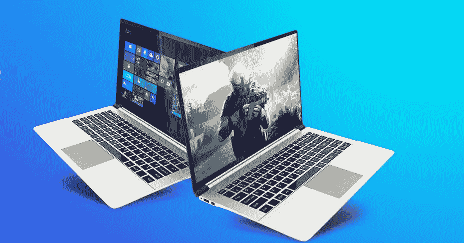
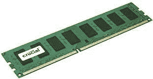
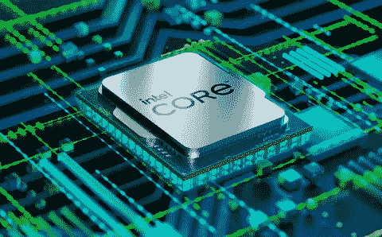
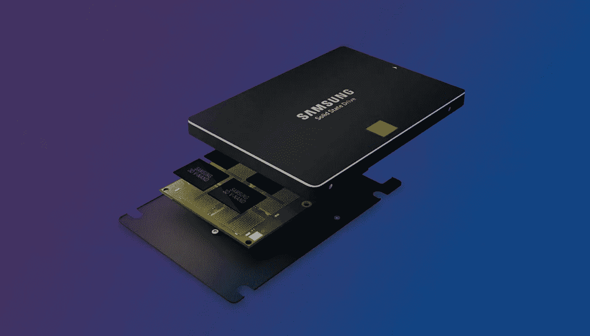

# 笔记本电脑购买指南:如何选择适合你的笔记本电脑

> 原文：<https://levelup.gitconnected.com/laptop-buy-guide-how-to-choose-perfect-laptop-for-you-b2f1ed79d7aa>

图片来源:亚马逊

嗨，伙计们，

在当今世界，我们购买笔记本电脑通常是为了完成以下任务—

**办公室/学校工作** —主要使用电脑进行文字处理、研究、电子表格以及其他专业和学术任务。
**游戏** —玩最新最棒的游戏，但仍使用电脑完成其他任务。
**网络使用** —主要使用电脑访问网站、电子邮件、流媒体视频和社交媒体。
**媒体制作** —将您的电脑用作工作站来录制音乐、编辑视频或处理图像。

在本文中，我们将挑选笔记本电脑规格的主要和重要类别，为了了解从在线或离线商店购买笔记本电脑的最佳方式，必须重点关注这些类别。

## 以下是需要关注的类别

1.  操作系统
2.  随机存取存储
3.  处理器
4.  储存；储备

我们来详细了解一下每一类。

# 操作系统

首先，我们需要知道市场上有什么类型的操作系统。你应该根据你要在笔记本电脑上执行的任务类型做出明智的选择。以下是列表— **Windows、MacOS、Linux**

Windows: 这个忠实的操作系统不再强迫自己，但它完成了工作。如果需要 MS Office、Access 或 Outlook 等微软应用，是最佳选择。Windows 笔记本电脑的选择也比其他任何操作系统都多。阅读我们对最佳笔记本电脑、最佳游戏笔记本电脑和最佳预算笔记本电脑的选择，了解一些选项。

苹果的 MacOS 比 Windows 更容易上手，但它与公司的硬件紧密相连。除非你拥有 iPhone 或 iPad，并且你的选择仅限于 MacBooks，否则它可能不是你的首选。请务必阅读我们的选择最佳 MacBook 指南。

**Linux:** 如果你不需要 MS Office，也不介意学习曲线，你几乎可以在任何一款笔记本电脑硬件上安装 Linux。问题是 MS Office 和 Adobe Creative Suite 等流行应用程序无法运行。然而，也有免费和开源的替代产品，如 LibreOffice、Darktable (Adobe Lightroom 替代产品)和 GIMP (Adobe Photoshop 替代产品)。

# 随机存取存储器

RAM 在笔记本电脑性能中起着主要作用，因为 RAM 负责处理处理器交给的任务。您可能需要至少 8 GB 的 RAM 来执行基本和日常工作区相关任务，对于视频编辑、图形设计等高级任务，您可能需要高达 64 GB 的 RAM。

图片来源:亚马逊

# 处理器

处理器只不过是一个 CPU ( *中央处理器*)，我们有许多类型的 CPU，它们在处理高级任务时发挥最佳性能和流畅度的作用。

一旦你知道你想要什么样的操作系统，并且对你将要运行的软件有了一些概念，你就可以计算出你需要的最低硬件规格。我们建议首先查看处理器，也称为芯片或 CPU。

实际上，有两家公司生产消费类笔记本电脑处理器:英特尔和 AMD。

*   **英特尔第 11 代 CPU**:英特尔推出了第 1 代 Tiger Lake 处理器，将为下一代笔记本电脑提供动力。你可以在这里阅读关于这些处理器的更多细节[。总而言之，Tiger Lake — —一种 10 纳米芯片— —提供了改进的集成 Iris Xe 图形，速度高达 4.8Ghz，并支持 Thunderbolt 4。新的 EVO 品牌为顶级笔记本电脑设定了参数，包括最少 9 小时的电池寿命。](https://www.laptopmag.com/news/intel-11th-gen-tiger-lake-cpus-unveiled-with-xe-graphics-evo-brand-and-48ghz-speeds)
*   **英特尔酷睿 i9:** 取代酷睿 i7 成为英特尔的顶级 CPU，[酷睿 i9 处理器](https://www.laptopmag.com/articles/core-i7-vs-i9)提供比任何其他移动芯片都更快的性能。Core i9 CPUs 仅在高端笔记本电脑、工作站和高端游戏平台上提供，只有当您是使用要求最苛刻的程序和应用程序的超级用户时，它才值回高价。
*   **英特尔酷睿 i7** :在酷睿 i5 的基础上，编号以 HQ 或 K 结尾的型号使用更高的功率，拥有四个内核，可以实现更快的游戏速度和工作效率。还有酷睿 i7 Y 系列芯片，功耗和性能更低。请留意型号中有 10 的 CPU，因为它们是英特尔最新、第 10 代和第 11 代酷睿系列的一部分，能够提供更好的性能。
*   **英特尔酷睿 i5** :如果您正在寻找性价比最佳的主流笔记本电脑，请选择采用英特尔酷睿 i5 CPU 的笔记本电脑。以 U 结尾的型号最常见。名称中带有 Y 的型号功耗较低，性能较差，而带有 HQ 的型号功耗较高，出现在较厚的游戏和工作站系统中。英特尔最新的第 11 代 Tiger Lake CPUs 有四个内核，以及许多有用的功能，包括 Wi-Fi 6 支持、Thunderbolt 4 集成和更好的人工智能。
*   **英特尔酷睿 i3** :性能仅比酷睿 i5 低一步，价格也是如此。如果你有可能升级到酷睿 i5，我们推荐你。
*   **英特尔至强:**面向大型移动工作站的极其强大且昂贵的处理器。如果你做专业级工程、3D 建模或视频编辑，你可能想要一个至强处理器，但你不会得到良好的电池续航时间或一个轻便的笔记本电脑。
*   **英特尔奔腾/赛扬**:在低于 400 美元的笔记本电脑中常见，这些芯片提供最慢的性能，但如果您的主要任务是网上冲浪和轻度文档编辑，它们也能胜任。如果你能花更多的钱买一台酷睿 i3 或 i5，你会过得更好。
*   **英特尔酷睿 m /酷睿 i5 / i7 "Y 系列:"**低功耗和低热量使采用这些处理器的系统无需风扇。性能优于赛扬，但比常规 Core U 系列低一个档次。
*   **AMD 锐龙 4000 和锐龙 5000** :一套新的芯片，旨在与英特尔酷睿 i5 和酷睿 i7 竞争。我们发现锐龙 4000 和[锐龙 5000](https://www.laptopmag.com/news/amd-unveils-ryzen-5000-series-cpus-at-ces-2021-why-intel-could-be-in-trouble) 芯片的性能超过了同等的英特尔酷睿处理器。例如，锐龙 5 4500U CPU 的性能与英特尔酷睿 i7 CPU 相当。您不仅可以获得出色的性能和耐用性，而且配备锐龙 4000 和锐龙 5000 的笔记本电脑往往比其英特尔同行更便宜。
*   **AMD A、FX 或 E 系列**:基于低成本笔记本电脑的 AMD 处理器——该公司称之为 APU 而非 CPU——提供了不错的性能，足以满足网上冲浪、媒体浏览和工作效率。
*   **苹果 M1:** 苹果定制芯片的第一款，基于 ARM 的 M1 芯片在原始性能和耐用性方面击败了竞争对手。在 [MacBook Air](https://www.laptopmag.com/reviews/macbook-air-m1-2020) 和 [MacBook Pro](https://www.laptopmag.com/uk/reviews/laptops/macbook-pro-13-inch-with-touch-barhttps://www.laptopmag.com/apple-macbook-pro-13-inch-m1) 上找到

图片来源:英特尔

**AMD 处理器:** AMD 的芯片命名和英特尔的一样难以破译。

在 AMD 锐龙 5 7600X 这个名字中，“7”是代(多大年纪；越高越好)，而“6”就是它有多强大。“6”将使本示例成为中等功率芯片，而 3 或 4 将是较弱的(较慢的)。接下来的两个数字对什么都没有太大影响。结尾的“X”表示高性能。其他字母名称包括代表超低功耗的 U。

英特尔和 AMD 的芯片有巨大的区别吗？我的经验是，每年都要测试几十个，看情况而定。一般来说，除了非常具体的基准测试之外，英特尔 i5 与锐龙 5 没有什么区别。当你浏览网页或编辑文档时，它们是相似的。英特尔 i7 和锐龙 7 以及英特尔 i3 和锐龙 3 也是如此。

图形性能是您会注意到差异的地方。在我的测试中，在基准测试和实际工作使用中，AMD 的集成显卡在图形密集型任务上的表现往往优于英特尔，比如编辑视频或玩游戏。英特尔的最新系列芯片已经显著缩小了这一差距，但 AMD 仍有优势。如果你是视频编辑或游戏玩家，你可能会从购买 AMD 机器中受益，但你最可能需要的是专用显卡。

# 储存；储备

硬盘是你储存所有数据的地方。把它想象成你办公桌旁边的文件柜。目前最常见的选择是 SSD(固态硬盘)，尽管一些廉价的笔记本电脑仍然使用旋转磁盘。

如果你能负担得起，去找一个至少 256 的固态硬盘。固态硬盘速度更快，尤其是如果它们使用 NVMe 连接，这种连接在硬盘上来回移动数据的速度比旧标准 SATA 快得多。有时候，你会发现笔记本电脑的固态硬盘采用 NVMe 来运行操作系统，但采用的是更老的 SATA 驱动器来存储文件。这为您提供了两全其美的优势:在您需要的地方获得速度，同时又不超出预算。

我们建议的最小空间量为 256。如果你把所有东西都存储在云端，或者在看 Chromebooks，你可能会用更少的空间，但如果你需要的话，留有空间是很好的。如果你打算安装很多游戏或软件，或者存储很多照片或视频，它会很快占用空间。

图片来源:Blackblaze

你可能已经注意到，你的硬盘似乎从来没有它宣传的空间。如果硬盘标记为 512 GB，在 Windows 中可能只有 490 GB 可用。你不浪费空间；这与二进制和十进制字节大小计算之间的差异有关。驱动器制造商使用十进制字节，但 Windows 使用二进制文件，因此报告不同的大小。从技术上来说，这两种说法都是正确的，尽管 Windows 报告的大小是您实际可以用来存储文件的磁盘空间量。

# 笔记本电脑的其他重要规格

购买时还需要考虑许多其他规格。

**1。显示器:**像素越多，屏幕能容纳的内容就越多，看起来也就越清晰。遗憾的是，一些经济型笔记本电脑仍然有 1366 x 768 的显示器，一些商务笔记本电脑也是如此，但如果你负担得起，我们建议你额外支付 1920 x 1080 的面板，也称为全高清或 1080p。高端笔记本电脑的屏幕分辨率为 2560 x 1600、3200 x 1800 甚至 3840 x 2160 (4K)，这些屏幕看起来都很清晰，但耗电量更大，会缩短电池寿命。

显示质量不仅仅是分辨率。IPS 面板有不同的颜色和亮度，所以请阅读我们的评论，看看您的笔记本电脑是否有良好的显示效果。我们通常寻找大于 100%的 sRGB 颜色等级和大于 300 尼特的亮度。如果你想要最好的图像质量，并且不在乎电池寿命，可以考虑有机发光二极管显示器。你还应该关注即将到来的显示技术对笔记本电脑的冲击，包括 miniLED。

**2。触摸屏:**如果你买的是普通翻盖式笔记本电脑，而不是二合一电脑，触摸屏不会给你带来太多好处，电池续航时间也会减少 1-2 小时。触摸屏是 2 合 1 设备的标准配置。如果您仍然想要触摸屏，请查看我们的最佳触摸屏笔记本电脑页面。

**3。显卡芯片:**除非你在玩电脑游戏、创建 3D 对象或进行高清视频编辑，否则集成显卡芯片(共享系统内存)就可以了，尤其是最新的英特尔 Iris Xe 显卡。但是，如果你有以上任何一种需求，Nvidia 或者 AMD 的独立 GPU 是必不可少的。

和 CPU 一样，显卡芯片也有高端和低端之分。如今，低端游戏或工作站系统通常采用英伟达 MX450 或 GTX 1660 GPU，而中端型号采用 RTX 2050 或 RTX 2060，高端型号采用 30 系列芯片，如 RTX 3070 或 3080 GPUs。Nvidia 维护一个从低到高的图形芯片列表(在新卡上打开)。

Nvidia 的竞争对手 AMD 是苹果的显卡供应商，虽然你真的不应该买 MacBook 来玩游戏。AMD 去年推出了镭龙 RX 5600M 和镭龙 RX 5700M GPUs。AMD 还维护着一份其显卡的清单。

**4。端口:**虽然在选择笔记本电脑时，缺少端口通常不是一个障碍，但在系统内部拥有您需要的连接是有用的，而不是随身携带一堆软件狗。大多数主流笔记本电脑都有 USB 3.0 端口和 HDMI 视频输出。然而，越来越多的笔记本电脑使用 USB Type-C 或兼容 USB Type-C 的雷电 3 和 Thunderbolt 4 端口

获得 C 型是一个明确的优势，因为你可以用它来连接通用充电器和基座。如果你能等待，USB 4 将很快到来，它具有更快的传输速度和用一根电缆连接 4K 显示器的能力。其他有用的连接包括 SD 卡插槽、耳机插孔和以太网端口(特别是如果你是一个游戏玩家)。

**5。连接:**如果你需要在旅途中使用笔记本电脑，可以考虑购买支持 4G LTE 或 5G 的笔记本电脑。您将不得不支付数据订阅费，但这将允许您在路由器之外访问互联网。如果您想要一台拥有最新、最强大连接选项的笔记本电脑，请选择支持 Wi-Fi 6 的笔记本电脑。Wi-Fi 6 提供了比 802.11ac 更高的理论吞吐量和更稳定的连接。

我们还建议寻找一台带有蓝牙 5 的笔记本电脑，这是一种最新的标准，可以改善与鼠标和耳机等蓝牙设备的连接。

**6。DVD/蓝光驱动器:**很少有笔记本电脑配有光驱，因为所有的软件和电影都可以下载，尽管我们也见过配有 DVD 驱动器的笔记本电脑。然而，如果你真的需要读/写光盘，而你的笔记本电脑没有内置的 DVD 驱动器，你可以花不到 20 美元买一个通过 USB 连接的外置驱动器。

**7。电池寿命:**你必须看到笔记本电脑中的备用电池，充满电后电池至少应有 6-8 小时的备用时间。你也可以检查充电器是否支持快速充电。

## 如果你正在寻找购买笔记本电脑，那么你可以参考以下链接

(游戏和执行基本任务的笔记本电脑)

1.  [惠普 Pavilion Gaming 最新 AMD 锐龙 5](https://amzn.to/3Ua25td)
2.  [宏碁 Nitro 5 游戏笔记本电脑/第 12 代英特尔酷睿 i5](https://amzn.to/3WsWEXX)
3.  [惠普 14s，第五代 AMD 锐龙 3](https://amzn.to/3DwGd3S)
4.  [惠普 15s，第 12 代英特尔酷睿 i5](https://amzn.to/3DBZYY8)
5.  [惠普 250 G8 笔记本电脑(第 11 代英特尔酷睿 i3](https://amzn.to/3TcAczg)

我希望这篇文章对你有所帮助。更多这样的文章请投票，关注并与朋友分享。

快乐学习…😁✌️

有关本文的任何疑问或任何其他技术建议，我们可以在**C**C[lue by 这里 上聊天。](https://clueby.com/dilipk)