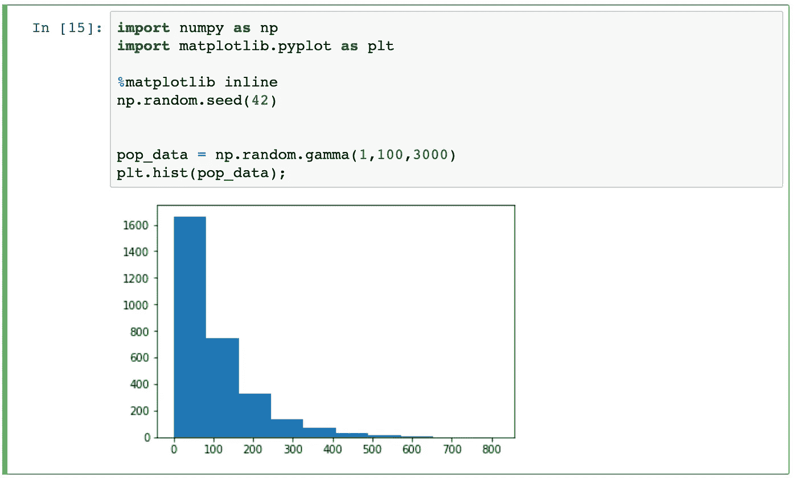
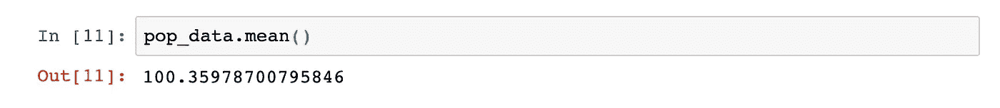
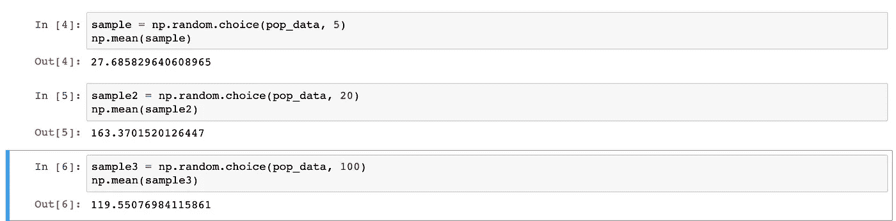
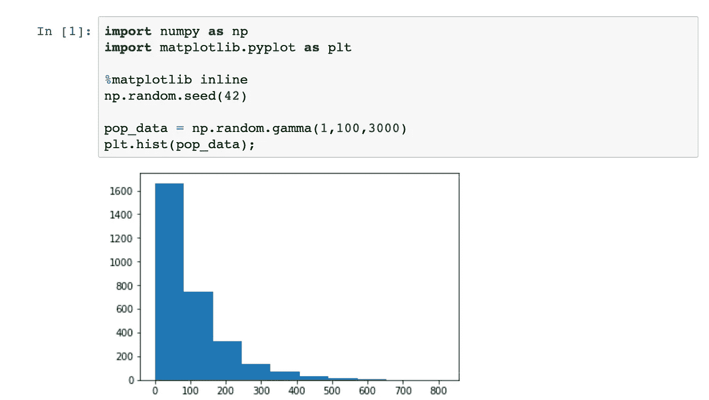
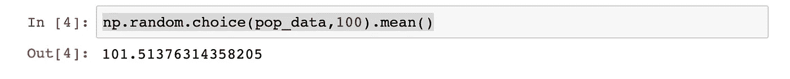
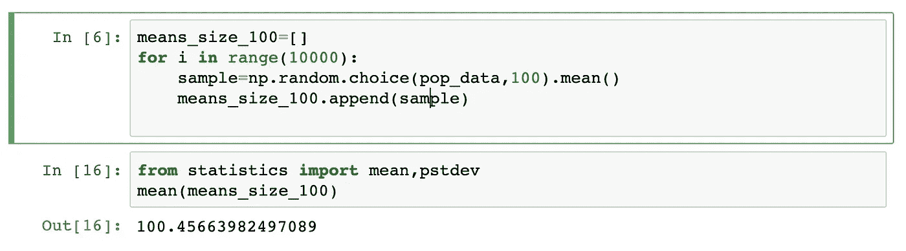
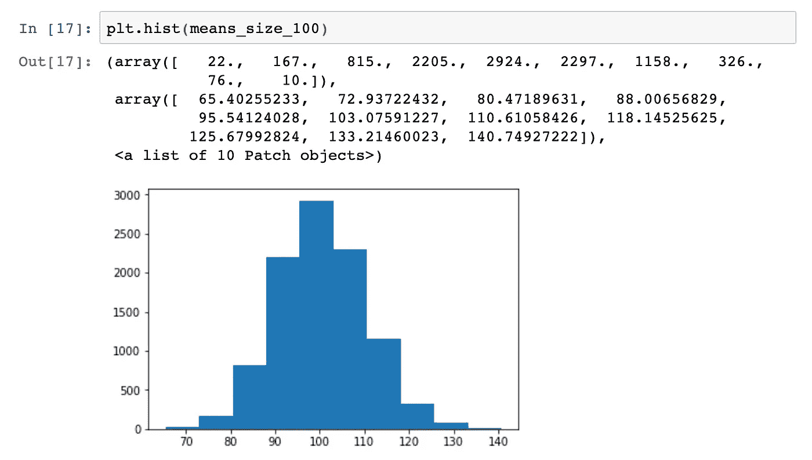

# 使用 NumPy 的大数和中心极限定理

> 原文：<https://levelup.gitconnected.com/large-numbers-and-central-limit-theorem-using-numpy-1c8199ef63b1>

## 数据科学的数学

## 使用编程来学习它们！

图片由来自 [Pixabay](https://pixabay.com/?utm_source=link-attribution&utm_medium=referral&utm_campaign=image&utm_content=1655118) 的[埃里克·斯坦](https://pixabay.com/users/erik_stein-2524241/?utm_source=link-attribution&utm_medium=referral&utm_campaign=image&utm_content=1655118)拍摄

在概率论中，为假设检验奠定基础的两个主要定理理解起来非常重要。

> *CLT 或中心极限定理*
> 
> *LLN 或大数定律*

一方面，LLN 谈到样本平均值收敛到他们的总体均值。另一方面，CLT 揭示了从总体中抽取多个样本时样本均值的分布。

> 跟 NumPy 一起来看看吧！

## 大数定律

据[维基百科](https://en.wikipedia.org/wiki/Law_of_large_numbers)介绍，在概率论中，**大数定律** ( **LLN** )是一个描述多次进行相同实验的结果的定理。根据该定律，从大量试验中获得的结果的平均值应该接近预期值，并且随着进行更多的试验，将趋向于变得更接近预期值。

> 随着样本量的增加，样本均值越来越接近总体均值。

让我们用 Numpy 来实现这个目标吧！

我用伽玛分布方法创建了一个包含 3000 个随机数的 NumPy 数组。然后，我调出了数组中所有数字的平均值。

我们的平均值在 100 左右。现在，让我们给出不同的样本来检查平均值。我试过模拟 5 次，20 次，100 次抽签。随着抽取次数的增加，平均值越来越接近总体平均值。

> PS:这里的抽取次数等于样本量

## 中心极限定理

中心极限定理又名 CLT 说，如果总体有一个均值μ和标准差σ，并从总体中随机抽取样本，样本均值的分布开始变得正态分布。

让我们通过编程实践来看看它是怎样的。

我带来了一个长度为 3000 的伽玛分布随机数组。创建了一个直方图，即右偏直方图。它的平均值在 100 左右。

现在，让我们创建一个包含 100 个随机数的样本。而且，看意思。

但是，如果我们将同样的过程进行 10，000 次，即随机抽取 100 个样本 10，000 次，然后输出它们的平均值，会怎么样呢？

> 现在会是什么样子？

经过这一过程后，它更接近总体均值。如果你看直方图，你会注意到一个正态分布图。简单地说，当我们随机抽取 100 个样本 10，000 次时，大多数情况下平均值都在 100 左右。

## 参考

*   [大数定律](https://en.wikipedia.org/wiki/Law_of_large_numbers)

**和平！**

 [## 编写面试问题

### 一个完整的平台，在这里我会教你找到下一份工作所需的一切，以及…

技术开发](https://skilled.dev)