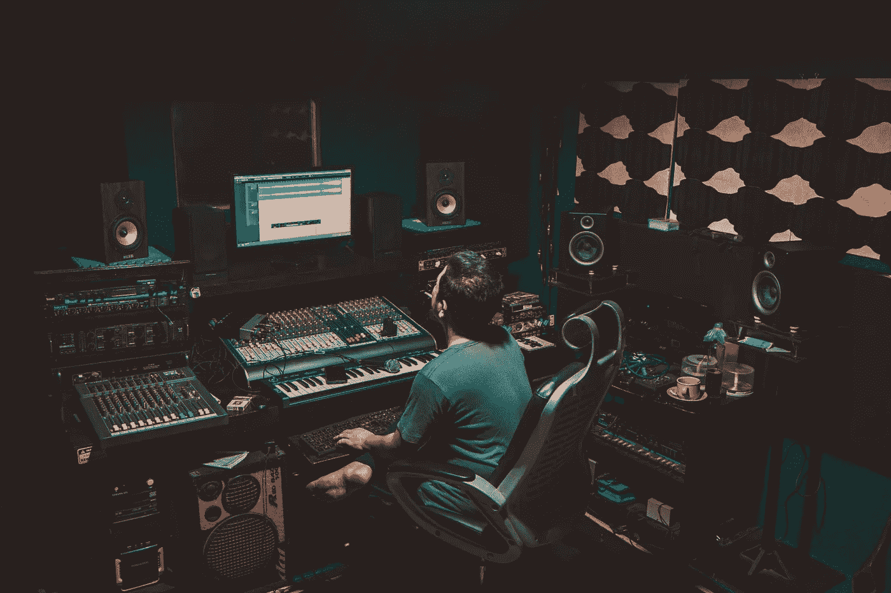
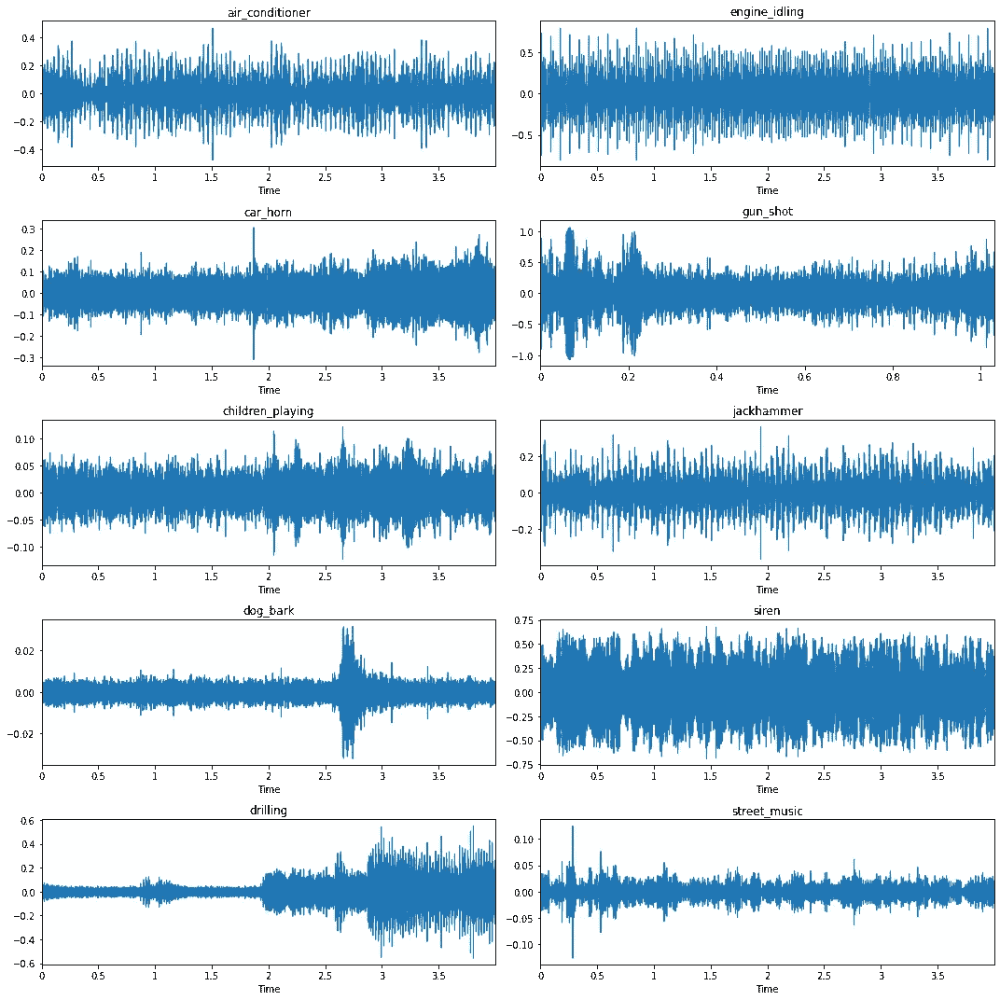
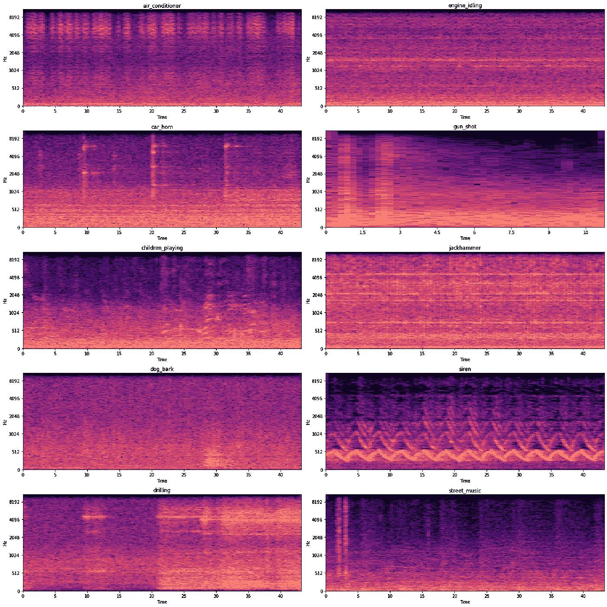
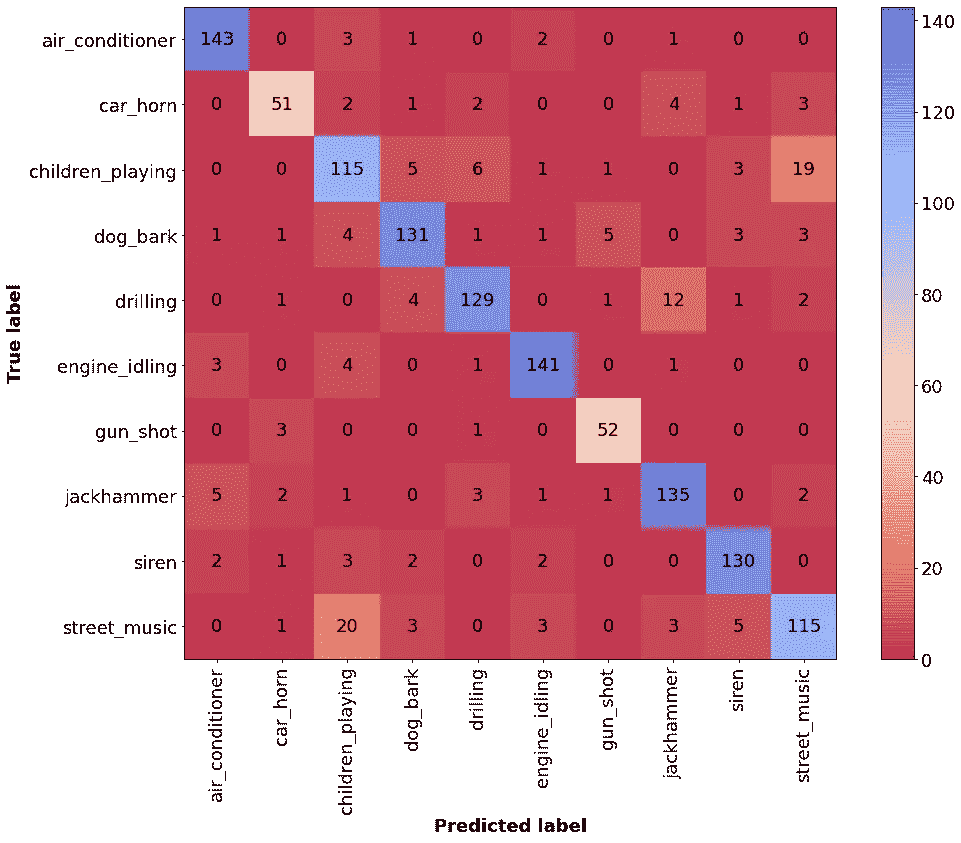
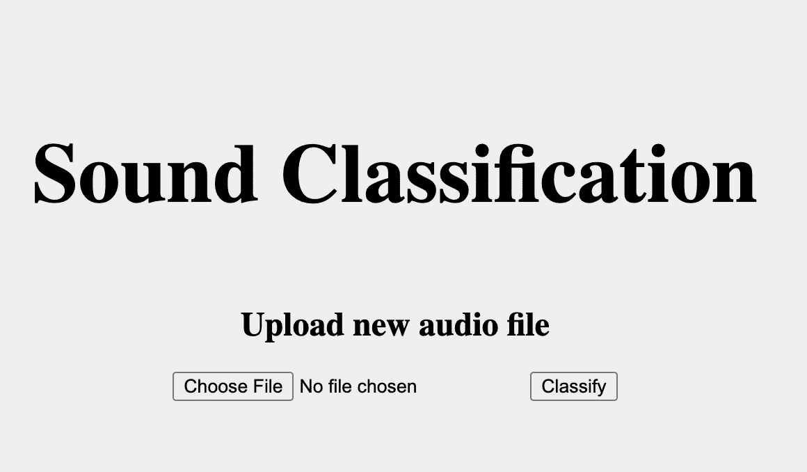
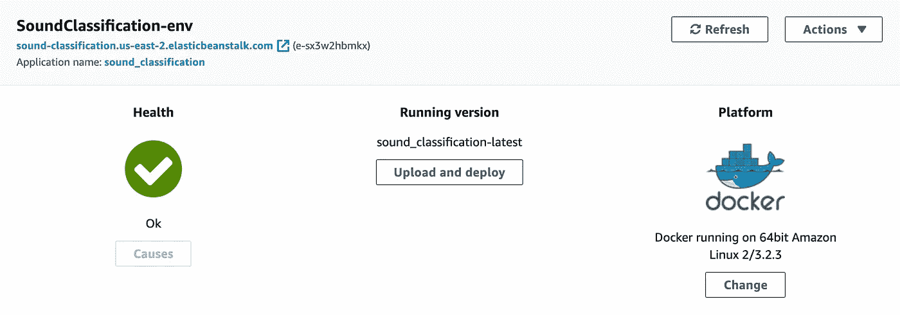

# 通过 4 个简单的步骤启动您的 ML 应用程序

> 原文：<https://levelup.gitconnected.com/launch-your-ml-app-in-4-easy-steps-861b2b2f2179>

## 从模型培训到 AWS 中的部署

机器学习和数据科学家从业者经常在 Jupyter 笔记本上进行项目和实验。这是一个允许他们快速迭代和轻松创建可视化的过程。然而，它不像在云中部署模型那样具有影响力、可伸缩性和易于向全世界发布。很多时候，一个好的分销网络甚至比产品本身的质量更重要。

本教程旨在介绍如何建立一个机器学习项目，并将其与 MLOps 实践相结合，例如创建一个 Docker 容器并将其部署在 Amazon Web Services (AWS)中。它适合初学者作为一种学习练习，也适合希望充分利用任何项目的经验丰富的从业者。


如果没人看得见，你的产品再好也没用——照片由 [Unsplash](https://unsplash.com/s/photos/blind?utm_source=unsplash&utm_medium=referral&utm_content=creditCopyText) 上的[乔希·卡拉布雷斯](https://unsplash.com/@joshcala?utm_source=unsplash&utm_medium=referral&utm_content=creditCopyText)拍摄

我们的主要目标将是创建一个机器学习应用程序，能够对不同的音频声音进行分类，并将其部署在云中。在本教程中，我们将进行数据探索和分析，随后是机器学习模型的训练和评估，我们将使用 [Flask](https://flask.palletsprojects.com/en/1.1.x/) 创建我们的应用程序，最后我们将使用[亚马逊弹性豆茎](https://aws.amazon.com/elasticbeanstalk/)和 [Docker](https://www.docker.com/) 免费将其部署在云上。

## 介绍

在这个[仓库](https://github.com/jsalbert/sound_classification_ml_production/)中，您将找到运行本教程所需的所有 python 代码。它包含:

1.  [用于进行数据探索和分析的 Colab 笔记本电脑](https://colab.research.google.com/github/jsalbert/sound_classification_ml_production/blob/main/notebooks/UrbanSound8k_data_exploration.ipynb)
2.  [用于执行机器学习模型的训练和评估的 Colab 笔记本](https://colab.research.google.com/github/jsalbert/sound_classification_ml_production/blob/main/notebooks/UrbanSound8k_machine_learning.ipynb)
3.  [创建自己的烧瓶应用程序的说明](https://github.com/jsalbert/sound_classification_ml_production#creating-the-flask-app)
4.  [创建 Docker 映像并将其上传到 AWS Beanstalk 以与世界分享您的应用程序的说明](https://github.com/jsalbert/sound_classification_ml_production#creating-a-docker-image-and-uploading-to-aws-elastic-beanstalk)



部署你的声音分类器——照片由[杰斯曼·法比奥](https://unsplash.com/@jesmanfabio?utm_source=unsplash&utm_medium=referral&utm_content=creditCopyText)在 [Unsplash](https://unsplash.com/s/photos/sounds?utm_source=unsplash&utm_medium=referral&utm_content=creditCopyText) 上拍摄

我建议在阅读的同时运行 Colab 笔记本，因为(为了简洁)有些步骤没有在文章中显示。

## 1.数据探索

我们将使用众所周知的 [UrbanSound8k 数据集](https://urbansounddataset.weebly.com/urbansound8k.html#10foldCV)，其中包含以下 10 种声音:空调声、汽车喇叭声、儿童玩耍声、狗吠声、钻孔声、发动机空转声、枪击声、手提钻声、警笛声和街头音乐。在本节中，我们将执行一组数据分析步骤，以观察和查看给定数据中的模式，并相应地选择最佳建模。

我们可以在笔记本上看到，数据以不同的方式被记录和数字化:

*   在几乎所有的样本(立体声)中，它大多是使用 2 个声道录制的。
*   采样速率从 8kHz 到 192kHz(主要是 44kHz、48Khz)。
*   音频的长度从 0.0008s 到 4s(大部分是 4s)。
*   使用的每个样本的比特从 4 到 32(大部分是 24 比特)。

由于这种可变性，数据将需要在被馈送到机器学习模型之前被标准化。我们将使用 [Librosa](https://librosa.org/doc/latest/index.html) 库来加载、标准化、绘制和执行音频处理。

我们可以在下图中观察到不同的信号波形(振幅与时间的关系)。



每个数据集类的随机样本的音频波形

短期傅立叶变换(STFT)、梅尔频谱和梅尔频率倒谱系数(MFCCs)都是处理音频信号并生成可用作机器学习算法输入的区别特征的流行方法。对于音频信号处理的回顾，我真的推荐观看 Valerio Velardo 制作的一个很棒的 youtube 视频系列[。](https://www.youtube.com/watch?v=-Yxj3yfvY-4&list=PL-wATfeyAMNqIee7cH3q1bh4QJFAaeNv0&index=15&ab_channel=ValerioVelardo-TheSoundofAI)

我们将可视化 Mel 谱图，它是不同时间步长的不同频率幅度的表示。考虑到人类如何感知和处理音频信号，频率幅度被转换为 Mel 尺度。



先前音频样本的 Mel 频谱图

在查看一些不同排列的图表后，我们可以观察到数据集类的信号差异足以被机器学习算法正确分类。

## 2.机器学习

在项目的这一部分，我们将训练一个机器学习模型，能够在我们的数据集的 10 种声音之间进行分类。根据数据探索，并在阅读了有关音频信号分类的最新技术后，我做出了以下设计选择:

*   我们将训练一个卷积神经网络(CNN ),并使用 MFCCs、STFT 或 Mel-Spectrogram 作为输入特征。
*   由于音频持续时间范围从 0 到 4 秒，我们将填充生成的声谱图，以使所有音频的长度相等。

我的第一选择是使用 STFT 特征，因为理论上 CNN 可以更好地利用频率-时间结构，并从原始信号而不是人类设计的表示中学习滤波器。然而，由于计算资源和使事情变得更快，我们将使用 MFCCs 作为特性，因为它们的内存效率更高。

为了将 MFCCs 计算为特征，通常要:

*   计算前 13 个 MFCCs、它们的导数和二阶导数。
*   使用前 40 个 MFCC(libro sa 默认)。

我们的机器学习模型将是一个完全卷积的网络(FCN)。由于我们的图像在形状上是矩形的(y 轴是 MFCC，x 轴是时间)，我们将使它们成为矩形，而不是使用方形滤波器(通常)，这样它们可以更好地学习 MFCC 与时间维度的相关性。

我们的模型定义如下所示:

我们正面临一个经典的多分类问题，所以我们将使用分类交叉熵损失函数。此外，作为优化器，我们将使用带有默认超参数值的 Adam 的 Keras 实现。

笔记本包含所有的培训和评估代码。您应该能够尝试不同的超参数和网络配置。一旦你训练了一个模型，你就可以看到结果，并把它们绘制在一个混淆矩阵中。这样你就可以比较不同型号的性能。



显示我们模型预测的混淆矩阵

## 3.创建烧瓶应用程序

一旦我们对我们训练的模型感到满意，我们将创建一个小应用程序，并将其部署在云中。我们将使用 [Flask](https://flask.palletsprojects.com/en/1.1.x/) 来构建我们的应用程序。

> *Flask 是一个轻量级的 WSGI web 应用框架。它旨在快速轻松地开始使用，并能够扩展到复杂的应用程序。它最初是一个围绕 Werkzeug 和 Jinja 的简单包装器，现在已经成为最流行的 Python web 应用程序框架之一。*

我将提供包含运行它所需的所有代码的`app.py`文件。您将需要 Python 安装和 pip 来运行下面的代码。

1.  克隆此存储库:

```
git clone git@github.com:jsalbert/sound_classification_ml_production.git
```

2.使用 [virtualenv](https://virtualenv.pypa.io/en/latest/) 创建虚拟环境并安装库要求:

```
pip install virtualenv
virtualenv .venv
source .venv/bin/activate
pip install -r requirements.txt
```

3.转到文件夹`flask_app`并在您的电脑上本地运行应用程序:

```
python app.py
```

4.通过 [localhost:5000](http://localhost:5000/) 访问

您应该能够看到这个屏幕:



此时，您应该能够在您的计算机上本地运行该应用程序。

# 4.创建 Docker 图像并上传到 AWS Elastic Beanstalk

最后…让我们使用 Docker 和 AWS Elastic Beanstalk 在云中部署我们的应用程序！

对于教程的这一部分，您需要安装 [Docker](https://www.docker.com/get-started) 并在[亚马逊网络服务(AWS)](https://aws.amazon.com/) 和 [Docker Hub](https://hub.docker.com/) 中创建一个帐户。我推荐阅读和浏览[Docker-课程表](https://docker-curriculum.com/)以获得对 Docker 更广泛的介绍。

Docker 是什么，有什么好处？

> Docker 是一个允许开发者、系统管理员等使用的工具。轻松地将他们的应用程序部署在沙箱(称为容器)中，以便在主机操作系统(即 Linux)上运行。Docker 的主要好处是，它允许用户将一个应用程序及其所有依赖项打包成一个标准化的软件开发单元。与虚拟机不同，容器没有很高的开销，因此能够更有效地利用底层系统和资源。
> 
> *容器提供了一种逻辑打包机制，其中应用程序可以从它们实际运行的环境中抽象出来。这种分离使得基于容器的应用程序可以轻松、一致地部署，无论目标环境是私有数据中心、公共云，甚至是开发人员的个人笔记本电脑。*

我们将使用 Docker 为我们的应用程序创建一个容器。我将提供必要的`Dockerfile`和`Dockerrun.aws.json`文件，以便能够在本地运行您的应用程序，并将其部署在 AWS 中。

首先，您应该通过运行以下命令来验证 Docker 是否正确安装:

```
docker run hello-world
```

您应该会看到:

```
Hello from Docker.
This message shows that your installation appears to be working correctly.
```

之后，我们将通过一个[Docker 文件](https://docs.docker.com/engine/reference/builder/)建立我们自己的 Docker 形象。

> Dockerfile 是一个文本文档，它包含用户可以在命令行上调用的所有命令来组合一个图像。使用 docker build，用户可以创建一个连续执行几个命令行指令的自动化构建。

您应该位于 docker 文件所在的目录中，并运行:

```
docker build -t yourusername/sound_classification .
```

现在，当您运行时，您应该能够在列表中看到您的图像:

```
docker images
```

您应该能够在本地运行应用程序:

```
docker run -p 8888:5000 yourusername/sound_classification
```

为了部署我们的图像，我们将在 AWS 可以访问的注册表上发布它，在我们的例子中是 Docker Hub。如果这是您第一次推送图像，客户端会要求您登录。提供用于登录 Docker Hub 的相同凭据。

```
docker login
```

之后，您可以通过运行以下命令将您的映像推送到注册表:

```
docker push yourusername/sound_classification
```

完成后，您应该可以在 Docker Hub 上查看您的图像。现在你的图片已经在线了，任何安装了 docker 的人都可以通过输入一个简单的命令来访问和使用你的应用。

```
docker run -p 8888:5000 yourusername/sound_classification
```

现在我们将看到如何在 AWS Elastic Beanstalk 上进行部署。

> *AWS Elastic Beanstalk 是一种易于使用的服务，用于部署和扩展使用 Java 开发的 web 应用程序和服务。NET、PHP、Node.js、Python、Ruby、Go、Docker 在 Apache、Nginx、Passenger、IIS 等熟悉的服务器上。您只需上传您的代码，Elastic Beanstalk 就会自动处理部署，从容量供应、负载平衡、自动扩展到应用健康监控。同时，您保留了对驱动应用程序的 AWS 资源的完全控制，并且可以随时访问底层资源。*

您需要修改`Dockerrun.aws.json`文件，用您的用户名替换用户名。如果你离开我的，它也应该工作，因为我主持一个公众形象。

遵循以下步骤:

1.  登录您的 AWS 控制台。
2.  在搜索栏或菜单上搜索*弹性豆茎*并点击。
3.  选择*创建新环境*。
4.  在应用程序名称上为您的应用程序引入一个名称。
5.  选择 Docker 作为平台。做出更改后，选择*上传您的代码*并上传`Dockerrun.aws.json`文件。

环境创建将需要几分钟时间，之后您应该能够访问托管您的应用程序的网站。



如果您点击该链接，您将被定向到部署该应用程序的网站。您可以播放自己的音频或[示例音频](https://github.com/jsalbert/sound_classification_ml_production/tree/main/audio_files)。

还有…不要忘记在完成时关闭 AWS 中的环境，以免因额外使用资源而被收费！

对于任何反馈、评论、打字错误或错误更正，请在[问题部分](https://github.com/jsalbert/sound_classification_ml_production/issues)告诉我。

希望你喜欢这个教程，感谢阅读。