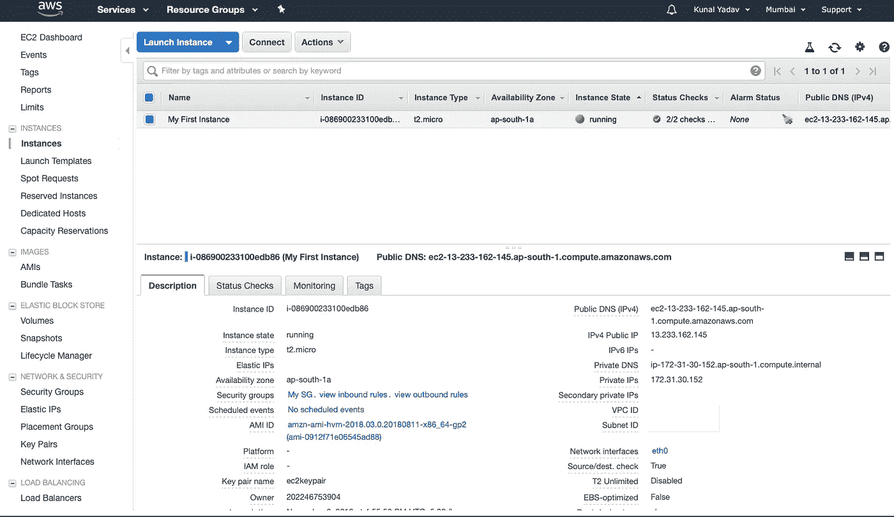

# 启动 Amazon EC2 实例

> 原文：<https://levelup.gitconnected.com/launching-an-ec2-instance-fbfd50894aac>

大家好，在我的上一篇文章[了解亚马逊 EC2 术语](https://medium.com/@kunalyadav/understanding-amazon-ec2-terminology-85be19d0af28)中，我们讨论了 EC2 中使用的术语。

现在我们将启动一个 EC2 实例。EC2 实例只是 AWS 数据中心的一台虚拟计算机。在启动实例时，我将详细讨论每个步骤。

要跟进，请登录您的 AWS 帐户，并从服务部分选择 EC2。

# 我们开始吧

实例的价格因地区而异，有些实例仅在某些地区可用。

在这种情况下，我将使用**亚太(孟买)**地区，您也可以选择这个地区或选择美国东部(N. Virginia)地区。您可以在页面的右上角更改您所在的地区。

现在点击**启动实例**按钮。

**一个**。第一步是选择将用于启动我们的实例的 Amazon 机器映像(AMI)。它就像是操作系统的一个可配置的 ISO 文件。

您可以选择由 AWS、AWS 社区 ami、AWS marketplace 或您自己的 ami 提供的 ami。

在这里，我将选择第一个，即亚马逊 Linux AMI。

**B** 。第二步是选择实例类型。AWS 根据您的用例提供了大量的实例供您选择。您可以向下滚动，查看针对计算、图形、内存和存储优化的实例。

每个实例都有固定数量的虚拟 CPU 和 RAM。尺寸越大，计算能力和内存大小越多。

我将在这里选择 **t2.micro** ，因为它在免费层中可用。

**注意**-如果您选择 t2.micro 以外的任何实例，您将被收费。

选择实例后，点击**Next:Configure Instance Details**按钮。

**C** 。现在是时候配置我们的实例细节了。您可以将鼠标悬停在每个选项后的信息按钮上，以了解有关该选项的更多信息。

1.  **实例数量** —您想要启动的实例总数。
2.  **购买选项**——你可以勾选这个复选框来启动现货实例。
3.  **网络** —您可以选择启动该实例的 VPC。
4.  **子网** —您可以指定启动此实例的首选子网(可用性区域)。
5.  **自动分配公共 IP** —启用此选项后，您的 EC2 实例将获得一个公共 IP。然后，您可以在此服务器上托管一个网站，并通过实例的公共 IP 访问它。
6.  **放置组—** 您可以通过选择此选项将此实例添加到放置组中。
7.  **容量预留—** 使用此选项，您可以在可用性区域中预留实例的容量。将此选项保留为默认值。
8.  **IAM 角色** —您可以为该实例分配一个 IAM 角色，以允许它访问其他 AWS 服务，而无需在该实例上存储访问键。
9.  **关机行为** —当执行操作系统级关机时，您可以停止或终止一个实例。
10.  **启用终止保护** —选择此选项将防止您意外终止实例。您必须禁用该选项才能终止实例。
11.  **监控** —选中此选项将启用 Cloudwatch 详细监控。详细监控每 1 分钟记录一次实例的性能指标，而基本监控每 5 分钟记录一次。如果您选择此选项，将收取额外费用。
12.  **租用** —默认情况下，您的实例托管在共享主机上。您可以选择专用实例或专用主机，以符合您的许可证，但您将不得不支付额外费用。将此选项保留为共享。
13.  **T2 无限制** —允许您的实例在高流量情况下爆发 CPU 利用率。选择此选项时，可能会收取额外费用。

在页面底部的高级详细信息部分，您有一个**用户数据**文本字段。您可以使用它运行配置脚本或命令来配置您的实例。

这些脚本或命令将在实例第一次启动时运行。

现在点击**下一步:添加存储**按钮。

**D** 。是时候给我们的实例添加一些存储了。将连接到您的实例的第一个卷将是一个**根卷。**你可以设置它的大小(默认是 8 GB)和它的卷类型。

您可以选择在实例终止时是否删除该卷。默认情况下，根卷在终止时会被删除，并且无法加密。

您可以使用**添加新卷**按钮添加额外的卷。默认情况下，其他卷可以加密，并且不会在终止时删除。

对于根卷，您有三个卷类型选项

1.  通用固态硬盘(gp2)
2.  调配 IOPS 固态硬盘(io1)
3.  磁性(标准)

对于其他卷，除了上述三个选项之外，您还有两个附加选项

1.  吞吐量优化的硬盘(st1)
2.  冷硬盘(sc1)

通常 SSD 类型的卷比 HDD 类型的卷更快更贵。

我不打算在这里做任何更改，所以单击**下一步:添加标签**按钮。

**E** 。在这里，我们可以向实例添加标签。标签只是键值对。

标签可用于按部门和团队对实例进行分组。它们可用于在 AWS 帐户中搜索资源。

他们还可以帮助管理资源成本。

在这里，我添加了一个带有关键字“Name”和值“My First Instance”的标签。

现在点击**下一步:配置安全组。**

**F** 。现在，我们将配置我们的安全组。安全组充当我们实例的防火墙。我们可以使用它为不同的应用程序打开不同的端口。

在这里，我将打开 SSH 端口，因为我们将在实例运行后登录到它。

HTTP 和 HTTPS 端口是打开的，因为我们将在实例运行后安装一个 apache 服务器。

在 source 选项卡中，您可以看到我们输入了 **0.0.0.0/0** ，以允许我们的实例接受来自互联网上任何地方的流量。这就是我们在屏幕上看到警告的原因。

对于我们个人来说，这不是问题，但是对于公司来说，您会希望 SSH 的源是您公司的静态 IP。

现在点击**查看并启动。**

**G** 。您现在可以查看实例详细信息。接下来点击**启动**按钮。

**H** 。现在，您将看到一个弹出窗口，用于选择密钥对。

选择**创建新的密钥对**选项，输入密钥对名称，点击**下载密钥对。**

下载密钥对文件后，点击**启动实例**按钮。

我们可以看到我们的实例现在正在启动，单击**查看实例**并等待几分钟，直到实例正在运行。

祝贺您，您已经启动了您的第一个 EC2 实例！

您现在可以看到我们的实例有一个公共 DNS 和一个公共 IP 地址。我们将使用这个 IP 地址 SSH 到我们的实例中。

# SSH 到 EC2 实例

如果你用的是 Linux 或者 MacOS 打开你的**终端**，如果你用的是 Windows，下载[**git bash**](https://git-scm.com/downloads)**继续。**

**1.在终端或 git bash 中，导航到保存密钥对文件的文件夹，并键入以下命令来更改文件权限。**

**对于 Linux 和 Mac 用户— `sudo chmod 600 ec2keypair.pem`
对于 Windows 用户— `chmod 600 ec2keypair.pem`**

**输入密钥对文件的名称，而不是 ec2keypair.pem。**

**2.现在，要登录到您的 ec2 实例，键入以下命令。**

**`ssh ec2-user@public-ip-address -i ec2keypair.pem`**

**如果提示您键入是或否，请键入是。**

**上面的命令在我的终端上看起来像下面这样。**

****

**现在，在终端中键入以下命令来启动 apache 服务器**

**`sudo yum update -y
sudo yum install -y httpd
sudo service httpd start
sudo chkconfig httpd on`**

**完成以下命令后。在网络浏览器中输入您的 IP 地址，然后按回车键。**

**您将看到一个与此类似的页面。**

****

**恭喜，您已经在 EC2 实例上安装了一个 apache 服务器。**

**现在，您可以使用导航中的 Actions 选项卡从 EC2 仪表板中终止实例。**

**感谢阅读这篇文章。如果你喜欢它，请给它一些掌声，让更多的人喜欢它！**