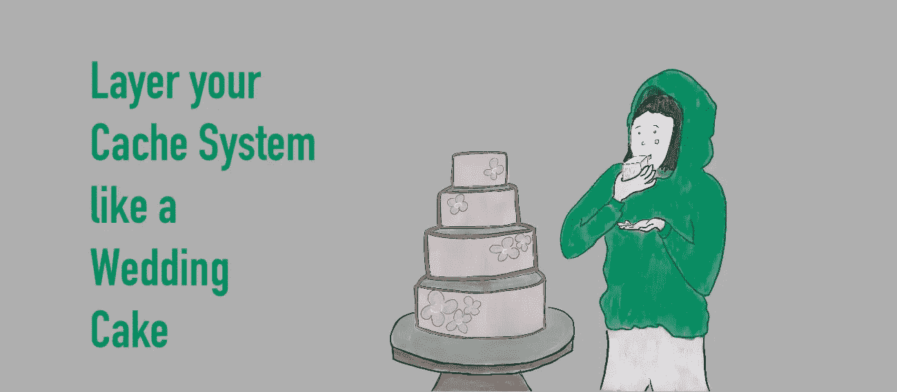
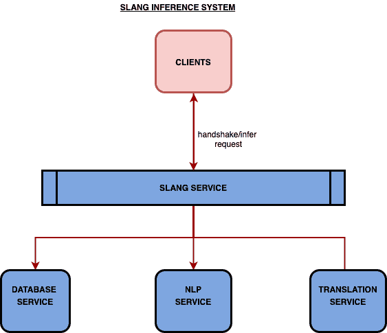
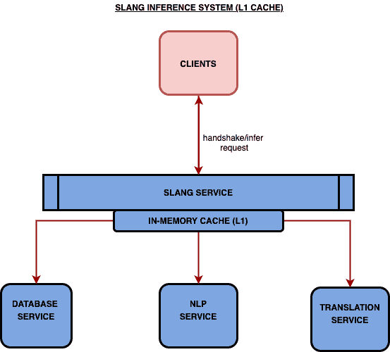
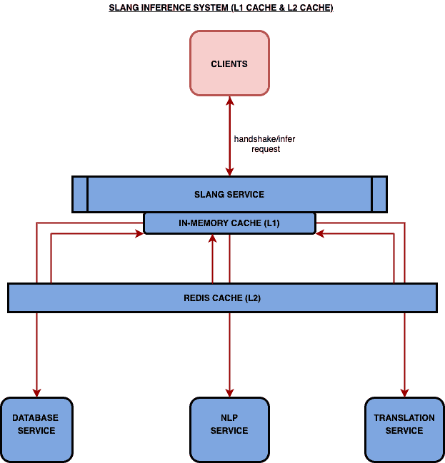

# 将您的缓存系统像结婚蛋糕一样分层

> 原文：<https://levelup.gitconnected.com/layer-your-cache-system-like-a-wedding-cake-5a2badb177ef>

在本文中，我将展示如何使用一系列缓存将推理延迟降低 30%以上。

在构建像语音助手这样的对话技术时，一个重要的服务是 infer 服务:负责处理用户语音查询并发送回识别的意图和实体，以便集成了语音助手的应用程序可以执行操作。推断本身由 2 个步骤组成；首先是握手，然后是实际的推断请求。握手包含提示、提示等数据，以及其他不会因推断而改变的数据。因此，握手不需要先于每个实际的推断请求。尽管如此，在应用程序的整个会话中，或者当用户改变语言时，它仍然是必需的。握手使应用程序能够根据推断请求采取行动。

但是，越来越多的服务器请求会降低性能。我们试图找出一种方法来大幅减少这种推理延迟**。**

## 高层架构:

## 过马路前，一定要左右看看:

当我和我的团队在构建俚语 CONVA，一个多语言[语音助手平台](https://www.slanglabs.in/)，时，我们观察到每个查询[延迟](https://www.cloudflare.com/en-in/learning/performance/glossary/what-is-latency/)需要一毫秒来响应，而对于英语和非英语查询，延迟分别增加到 1 秒和 2 秒以上。在我们一路深入优化和做出假设之前，我们从了解整体系统性能开始。当前的响应时间是我们处理 infer 请求的最佳时间，还是我们可以做得更好？如果我们通过添加更多服务器来处理峰值负载，从而进行水平扩展，会怎么样？系统在平均负载和峰值时的性能如何？这些是我们在开始调查性能瓶颈之前最初设置的一些问题。

作为一个标准流程，跨多个请求的最佳、平均和最差情况下的延迟是用百分位数来衡量的。你会经常看到 p50、p95、p99 等词。在这些百分位数上测量不同的参数。p50 表示第 50 个百分位数(表示系统对 50%的请求执行得有多好)，p90 表示第 90 个百分位数，其他的以此类推。

‍

## 但是为什么要用百分位数呢？

百分位数比平均值更适合测量延迟度量。考虑这个例子；你已经收集了用户在你的网站上等待加载时间的数据。您已经累积了 6 个数据点(以毫秒计):62、920、37、20、850 和 45。如果你取平均加载时间，你会得到 322 毫秒，但是 322 毫秒并不是用户体验的准确指标。从这些数据来看，很明显你的一些用户拥有高速体验(不到 70 毫秒)，一些用户拥有长时间体验(超过 850 毫秒)。但是他们都没有平均的经历。平均会给你不正确的度量。

避免被误导的方法是使用百分位数。一个很好的起点是 P50 和 P90。要计算 P50，即中值，按升序排列数据点:20，37，45，62，850，920。你得到 P50 的方法是去掉底部 50%的点，然后看剩下的第一个点:62 毫秒。你把最下面的 90%的点扔出去，看第一个点，就得到 P90，剩下的是:920。

**调查步骤:打电话给夏洛克**

为了测量我们当前的性能，我们将推理加载到沙盒环境中。我们通过以预定义的速率发送预定义数量的实际请求来模拟负载。我们考虑了高负载期间的 p75 延迟。

在不同的负载和 RPS(每秒请求数)下运行测试，我们能够识别三个重要的瓶颈。

🙌🏻握手需要将整个模式发送到客户端进行后推理操作，并且每次客户端会话结束时都要这样做，这在时间和实际财务成本方面都很昂贵。对于复杂的应用程序来说，握手模式可能非常庞大，而且额外的语言支持可能会增加到 4MB 以上。这是启动期间应用程序快速初始化的瓶颈。

🙌🏻对于每个请求，我们都往返于 NLP 服务，这是很昂贵的。它包括加载模型、提取意图和实体，以及对响应进行编码和解码。

🙌🏻我们的语音助手平台是多语言的，支持印度地区语言。然而，在幕后，NLP 服务仅使用英语，因此文本在发送到 NLP 之前需要额外的翻译和音译。涉及文本翻译的请求可能比英文文本大约多花两倍的时间。

‍

## 解决方法:这是最基本的，我亲爱的华生。

我们最初设置的问题的答案是在测试数据的帮助下找到的。事实证明，我们没有有效地利用我们的资源。我们现有的设置还有很大的改进空间。

如果我们仔细分析瓶颈，我们会发现大部分请求时间都花在了 NLP 或翻译系统上。大多数请求都是重复的，第一次请求的尾巴很长。但是，一个在模型上工作的 NLP 引擎，直到被再次训练，将会用相同的答案来回答。因此，要求 NLP 在完全相同的请求上花费时间来获得相同的响应是多余的。如果一个层可以存储一个给定命题和一个给定响应之间的映射会怎么样。每当用户说‘洋葱’时，我们就查找地图并回复 NLP 引擎已经处理过的相同响应。想象一下，如果数百个用户说同一套句子，我们将节省多少处理时间。

当前系统的另一个显而易见的问题是，即使没有模式更改，客户端也必须进行大量不必要的调用。

‍

## 我们能在这里做得更好吗？是的，我们可以！

**⚡️飞行前请求:**

[预检请求](https://developer.mozilla.org/en-US/docs/Glossary/Preflight_request)是客户在实际客户请求之前发送的一个小请求。这样做是为了判断是否需要更重要、更昂贵的请求。更大的请求可能是不必要的，因为支持它的数据还没有被无效。因此，我们可以使用客户机在之前的请求中收到的那个。

我们首先使用了一个预检 [HEAD](https://www.geeksforgeeks.org/head-method-python-requests/) 请求来检查是否需要客户的握手。这给了我们各种改进。由于我们实现了一个基于飞行前响应而失效的客户端缓存，客户端不必每次在推断请求前都进行握手。

**⚡️缓存全部:**

如上所述，为了改善 NLP 和翻译响应的延迟，我们决定根据响应的性质实现缓存。请求不必每次都去 NLP 或翻译；它可以跨请求重用。

当在多层系统(如客户端、服务器、模型等层)中设计缓存系统时，我们可以从设计中的每一层添加缓存中受益。然而，根据层的性质，可以选择缓存的类型和缓存的失效策略。

首先是 L1 的宝藏。L1 缓存是一种将数据存储在 RAM 中的易失性缓存，这意味着如果您再次启动系统或系统崩溃，所有数据都会丢失。但是，L1 缓存的好处是，它们是这里提到的所有可能的缓存中最快的。高速缓存的易失性意味着在重新启动时，必须根据每个推理请求重新填充高速缓存。

为了说明内存缓存的非持久性，可以使用像 [Redis](https://redis.io) 或 [Memcached](https://memcached.org) 这样的应用程序来创建 L2 缓存。这通过定期将内存中的数据保存到硬盘中来解决问题。这降低了 L1 缓存的易失性的影响。

我们首先为关键路径中的资源实现了 L1 缓存。它现在的工作方式是，当一个握手/推断请求被触发时，我们执行一个*内存*缓存查找，并从缓存中获取结果；但是，如果存在缓存未命中，那么请求会一直发送到 NLP 服务，响应会保存在*内存*缓存中，以便后续请求可以从缓存中检索数据。

然后我们开始探索 Redis 和 Memcache。这两个都是支持数据持久性的内存数据存储系统。Redis 是一个开源的键值存储，两者都将大部分数据存储在内存中。然而，Redis 支持对各种数据类型的操作，包括字符串、哈希表和链表。正是因为这种丰富的特性支持。我们决定继续为我们的 L2 缓存层使用 Redis。

Redis 群集不是自托管的；相反，它是托管在云提供商上的一个实例。云托管的 Redis 确保了高可用性，减少了团队管理集群的开销。

## 两级缓存系统:

在两层缓存系统设计中，设想一个推理请求被发送到一个俚语服务器。可以用下面描述的方式之一来满足响应。

1.  在 L1 缓存命中的情况下，响应从 L1 发送。
2.  在 L1 缓存未命中的情况下，我们进行 L2 缓存查找。
3.  如果 L2 缓存命中，则从 L2 发送响应。在返回的途中，L1 缓存用响应预热，以便后续请求可以从 L1 缓存得到满足。
4.  如果 L2 缓存未命中，请求将被路由到 NLP 服务。
5.  回来的路上，L2 和 L1 高速缓存都收到了回复。

我们已经讨论了多层缓存系统的细节，但是仍然缺少一点。让我们理解一下 ***当我们的缓存驱逐或者无效缓存条目*** 。

## 驱逐政策:

通常，缓存的代价是速度快，同时也很小。这意味着它将在更小、更快、更贵的内存单元中存储更少的数据。但这意味着，在某个时候，这个内存将被填满，我们需要策略来忽略新请求，或者通过删除旧的存储请求为新请求腾出空间。

我们的缓存使用 [LRU](https://www.geeksforgeeks.org/lru-cache-implementation/) (最近最少使用)策略。LRU 丢弃长时间不用的项目(比缓存中的其他元素更多)。当缓存变满时，最少使用的元素首先被逐出。它确保我们的记忆不会膨胀。

有许多可能的驱逐政策。但是，相比之下，另一种可能的驱逐政策是最少使用的。这意味着我们将请求从最常用到最少使用排序，然后删除最少使用的请求，其逻辑是，如果没有很多人或流程需要它，我们可能不需要它。然而，这里的问题是，如果我们有一个显著的单次使用请求长尾，那么几乎 80%的请求可能是等价的，因为它们是最少使用的。那么缓存的命中率将会很低，因为一旦存储了请求，就会为另一个请求移除该请求，然后该请求又移除了自己，依此类推。这叫做[颠簸，](https://en.wikipedia.org/wiki/Thrashing_(computer_science))，我们实现了它。

## 失效策略:

**“计算机科学中只有两件难事:缓存失效和命名”——菲尔·卡尔顿。**

缓存的另一个缺点是它可以更快地提供数据，但不一定是最新的数据。为什么会这样呢？因为缓存通过不查看数据库或执行一些为数据计算可能的新值的函数来节省时间。这意味着我们需要策略来决定缓存何时失效，何时需要重新计算数据并尽可能刷新缓存。

为了使缓存无效，我们重新审视了我们的推理流程，以便更好地理解 NLP/握手/翻译响应何时会改变。模式更改需要对助理进行重新培训。这意味着一旦训练完成，所有的缓存必须被无效。但是我们怎么知道火车是否完成了呢？我们可以通过两种方式做到这一点。第一个是广播系统。一旦训练完成，它将通知每个训练过程。然后，该进程知道，在后续的推理中，它应该查看数据库。

另一种方法是，在一个特定的位置存储一个标志，并让相关的进程不断地、定期地 ping 这个标志。如果标志发生了变化，那么这意味着底层数据或模型已经失效，在后续的推理中必须刷新缓存。这被称为生存时间(TTL)方法。由于服务中配置了 ping 的周期(TTL ),因此它认为数据仍然“有效”或新鲜的时间。保持较小的 TTL 意味着高速缓存非常频繁地使其高速缓存无效。如果 TTL 变为 0，就等同于没有缓存。

我们用了第二种。当助手接受训练时，它会存储训练完成助手元数据的时间戳。一旦 TTL 在推理时间用完，它就 pinged 数据库以获取助手的元数据。它查看了最后一趟列车的时间戳。如果它比它已经知道的更重要，那么这意味着自上次以来已经有一列火车出现。然后，该进程使其数据无效，并请求新数据。

‍

## 为什么我们需要这些层？为什么一层不够？

上面，我们谈到了推理流程中的两个层次。我们在服务器上实现了更多的缓存。另一个是 NLU 模型缓存。在推断过程中，NLU 模型本身需要大约 2 秒钟来加载。它首先必须从数据库中取出，反序列化，然后才能使用。然而，我们可以通过缓存反序列化的模型本身来节省时间。我们正是利用上述原则做到了这一点；我们缓存了模型本身，并选择了一个 TTL 回收策略，该策略基于元数据中可用的最后一个时间戳回收它。

现在，我们在客户端有了一个缓存，在服务器端有两个不同的缓存，它们以话语为键，我们还有一个 NLU 模型缓存，它以助手 ID 为键。

我们有这么多缓存，因为它们都有不同的权衡，并且都在各自的层以不同的方式节省处理时间。

客户端缓存仅用于该客户端。如果一个用户在电话中说了同一句话，我们可以使用之前的响应，并注意通常的缓存失效。但是，由于这种缓存仅用于客户端，重复的话语对其他客户端没有好处，因为没有跨客户端共享的数据。从客户机的角度来看，这当然是最快的，因为请求甚至没有到达服务器，从而节省了网络和处理时间。

如上所述，L1 缓存通过不去 NLU 获取响应而节省了时间，因为相同话语的先前响应被存储并由该话语键控。然而，这种缓存的问题是它是不稳定的，无法在重启后保留其内存。

L2 缓存节省了时间，因为它不需要去 NLU，但是比 L1 要慢，当然，只有在话语已经被说过的情况下才有效。

所有话语的最终手段是实际的 NLU 过程，如果它们不存在于较低的缓存中的话。但是，如果我们知道助理模型与数据库中的模型保持一致，为什么我们每次都要在数据库中查找模型呢？

因此每一层都有它的目的，并且由于[局部性原则，它们一起保持了正确性并加速了返回。](https://en.wikipedia.org/wiki/Principle_of_locality)(快速题外话:你问局部性的焦点是什么？现在用过 Instagram 吗？你看过一个帖子有一个东西，然后之后的每个帖子都是一样的东西？)

看着上面的解释，你可能会认为一个更好的比喻是筛子，但是嘿，谁不喜欢自己一块结婚蛋糕呢！

## 结论:

解决推理延迟问题的一些要点:

1.  在深入问题之前——衡量一切，只处理数据。
2.  优先考虑什么是重要的，什么是你想要的。我们在实施 L1 时优先考虑开发时间，而不是 L2。但是后来，我们发现 2 个级别的组合是我们性能的最佳方法。
3.  重新审视你对系统各部分工作速度的假设。
4.  理解请求流，以便更好地理解循环模式。