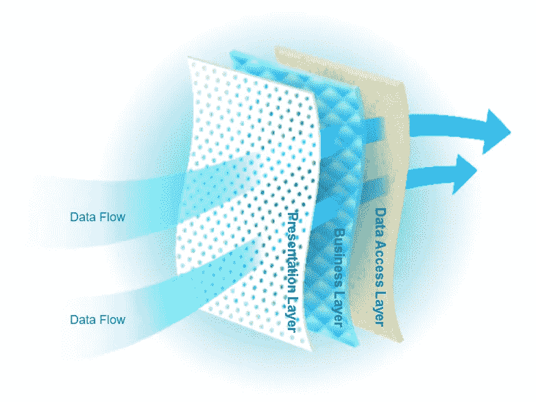
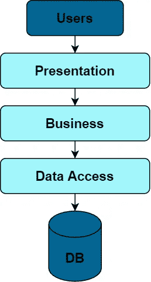
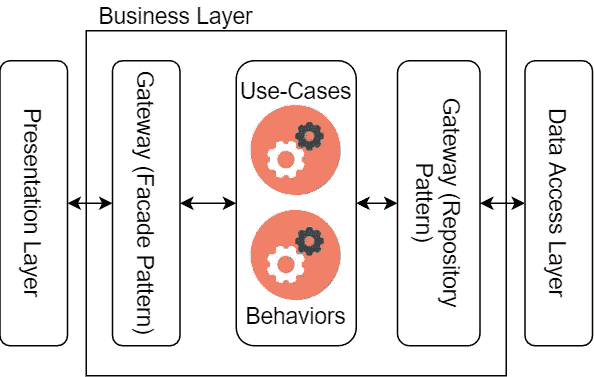

# 每个软件架构师都应该知道的软件体系结构的层次

> 原文：<https://levelup.gitconnected.com/layers-in-software-architecture-that-every-sofware-architect-should-know-76b2452b9d9a>

## 软件架构和重构

## 架构有相同的目标——关注点的分离。他们都是通过将软件分层来实现的。—鲍勃叔叔

层和通过它们的数据流方向

# 层

层是水平的(不要与标题图像混淆),是应用程序的抽象部分。它们的边界与数据流成直角。层代表了伴随软件开发的不同层次和抽象类型的关注点。

## 为什么要将应用程序分成几层

*   维持[单一责任原则](/how-to-rewrite-your-code-to-achieve-more-flexible-design-3c86dad822e)。
*   遵循[关注点分离](https://en.wikipedia.org/wiki/Separation_of_concerns)。
*   隔离发展角色和技能。(表示层— FE 开发，业务层— BE 开发)
*   支持多种实现。(可互换表示层)
*   不同的变化率。
*   将应用程序分割到更易管理的单元。

## 分层架构模式

这是最常见的架构模式，也称为 n 层架构模式。它成为大多数 OOP 架构师和开发人员的标准。

每一层都涵盖了应用程序中的一个特定角色。大多数情况下，我们区分经典的三层架构或四层以领域为中心的架构。在本文中，我将介绍三层架构。如果您对以领域为中心的架构更感兴趣，请点击下面的链接。

 [## 每个软件开发人员都应该知道的 3 个以领域为中心的架构

### 建筑师首先关心的是确保房子是可用的；并不是要保证房子造出来…

levelup.gitconnected.com](/3-domain-centric-architectures-every-software-developer-should-know-a15727ada79f) 

# 三层架构

三层架构是 CRUD 应用程序的首选。对于 CRUD，我指的是软件，最常见的用例是创建、**读取、**更新或删除某些东西。****

我不会为这样的系统推荐更复杂的以领域为中心的架构。如果你为 CRUD 系统选择以领域为中心的架构，你会发现随着时间的推移，没有领域建模的素材。

以数据库为中心的三层架构

## 表示层

顾名思义，表示层包含用户体验的代码和技术。所以，我说的是 web 开发框架，如 Angular 或 Blazor，较少使用的桌面框架，如 WPF 或 WinForms，以及移动开发框架，如 Xamarin。

像 MVVM 或 MVC 这样的表现模式也是这一层的一部分。这种模式的后端部分在逻辑上应该只与表示模型(表示数据结构)一起操作。

一旦需要实现实体行为、命令、查询或与外部系统的某些通信，就表明这些代码属于其他地方。更准确地说，进入业务层。

## 业务层

业务层是负责软件存在意义的填充代码。您的应用程序不存在，因为它是一个移动应用程序，或者因为它使用 Azure SQL Server。它之所以存在，是因为它有自己的目的，而实现那个目的的算法属于业务层。

层输入是从表示层接收的数据结构，另一端是来自数据访问层的数据结构。输出是表示层期望的数据结构或数据访问层期望的数据结构。

业务层

业务层输出数据结构的形式要尽可能满足其他两层。用例和行为是负责这种格式化的修饰符。

有更多的方法来处理业务层的设计。命令质问责任分离或 CQRS 就是其中之一。你可以通过下面的链接了解更多关于 CQRS 的信息。

 [## 每个软件架构师都应该知道的 3 个 CQRS 架构

### 关注点分离是一种有效整理一个人思想的技术。你应该集中注意力…

levelup.gitconnected.com](/3-cqrs-architectures-that-every-software-architect-should-know-a7f69aae8b6c) 

## 数据访问层

数据访问层负责连接到持久性。最常见的持久性是关系数据库，因此数据访问层通常包含对象关系映射(ORM)框架，如实体框架核心或 Hibernate。

如果您像我一样使用实体框架核心，这是您将设计实体和数据库上下文的层。

# 来源

*   罗伯特·c·马丁的话引自这篇博文。
*   [多视角课程——清洁建筑:模式、实践和原则，作者马修·伦茨](https://www.pluralsight.com/courses/clean-architecture-patterns-practices-principles)
*   [Oreilly 关于软件架构模式的文章，作者 Mark Richards](https://www.oreilly.com/library/view/software-architecture-patterns/9781491971437/ch01.html)

# 进一步阅读

 [## 5 分钟内从整体服务到微服务

### 微服务架构风格是将单个应用程序开发成一套小型服务的方法——

levelup.gitconnected.com](/from-monolith-to-microservices-in-5-minutes-83069677d021)  [## 文件夹和尖叫建筑的功能组织

### 架构应该表达系统的意图——鲍勃叔叔

danielrusnok.medium.com](https://danielrusnok.medium.com/let-me-hear-you-screaming-architecture-3adcc02f2ca3)  [## 丹尼尔·鲁斯诺克的时事通讯

### 每个月我都会给你发一封邮件，列出我的最新文章。当然，这将是友好的联系…

www.danielrusnok.com](https://www.danielrusnok.com/daniel-rusnoks-newsletter) 