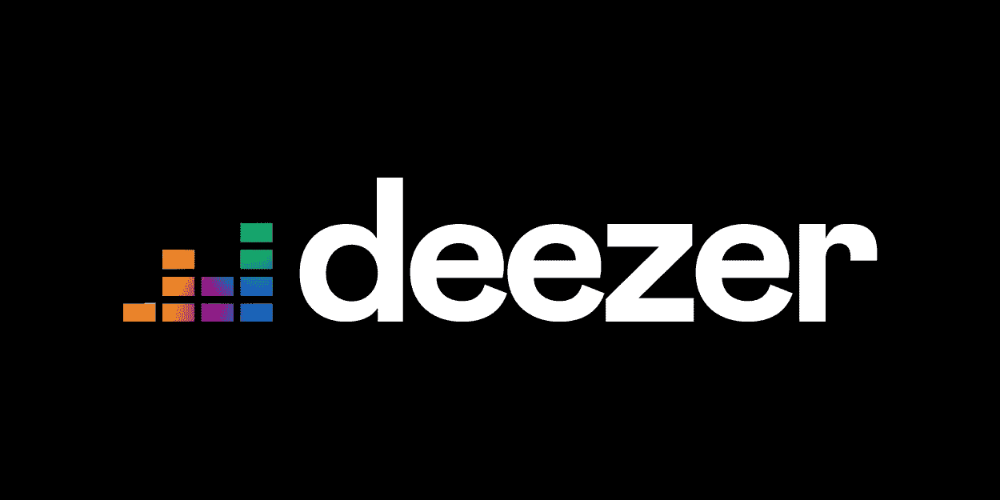

# 使用 Deezer 为定制播放器开发奠定基础

> 原文：<https://levelup.gitconnected.com/laying-the-groundwork-for-custom-player-development-with-deezer-11f44a3f3006>

## Deezer Javascript SDK 简介



新的 Deezer 标志

我最近的很多工作都围绕着使用苹果音乐和 Spotify 提供给开发者的平台，为我的客户和他们的粉丝建立独特的体验。这些体验可能包括自定义播放器、播放列表生成或音频特征分析。最近，我收到一个额外的请求:*你能集成 Deezer 吗？*我不是全球市场份额方面的专家，但我可以有把握地说，总部位于巴黎的 [Deezer](https://en.wikipedia.org/wiki/Deezer) 对国际营销战略非常重要。

直到最近，我才知道 Deezer 为开发者提供的平台，但应我客户的要求，我花了很长时间查看了他们的 [API](https://developers.deezer.com/api) 和 [JavaScript SDK](https://developers.deezer.com/sdk/javascript) 。它实际上是相当广泛的，API 覆盖了他们产品的所有对象(使用一个没有虚饰的 url 结构)和一个文档良好的 Javascript 库，使他们的服务集成到客户端应用程序变得容易。本质上，我应该能够在未来将 Deezer 集成到类似于 [Tycho](https://medium.com/@leemartin/turning-weather-into-music-with-dark-sky-and-spotify-for-tycho-f4f40aef97ed?source=friends_link&sk=ea8afe07bd998dc93739a5f53f1cb8fa) 和 [Slipknot](https://medium.com/@leemartin/broadcasting-a-dynamic-youtube-video-for-slipknot-8ca018fb7775?source=friends_link&sk=3e7659fd8ea50f12e280cd6c838bf68d) 的项目中。

我想分享你将如何着手创建一个新的 Deezer 应用程序和开发一个非常简单的自定义音频播放器。作为一个额外的奖励，我包括一个链接到[小故障](https://glitch.com/~deezer-player)以便于重新混合。🎤

## 创建 Deezer 应用程序

请确保您已在 Deezer 注册，并访问其平台网站的“我的应用”部分。在这里你会发现一个“创建一个新的应用程序”链接。单击它开始创建您的新应用程序。此时，您需要为您的应用程序命名，说明它将从哪个域提供服务，告诉身份验证重定向到哪里(稍后将详细介绍)，提供一个指向您的术语将出现的位置的链接，最后描述您的应用程序。假设这个玩家生活在 Glitch 上，我是这样填写这个表格的:

*   名称:故障播放器
*   域:[https://deezer-player . glitch . me](https://deezer-player.glitch.me)
*   重定向 URL:[https://deezer-player . glitch . me](https://deezer-player.glitch.me)/callback
*   条款链接:[https://deezer-player . glitch . me](https://deezer-player.glitch.me)
*   描述:一个简单的自定义 Deezer 播放器建立在 Glitch 上

同意 Deezer 平台政策，点击“创建”，您将成功创建一个新的 Deezer 应用程序。您将立即被重定向到应用程序摘要页面。请记下应用程序 ID，因为我们很快就会用到它。

## 初始化 JavaScript SDK 和播放器

回到 Glitch，首先创建通道 URL，Deezer 将使用它进行跨域通信。你可以通过点击“新建文件”并将其命名为`callback/index.html`来实现。在这个文件中，您只需要包含 Deezer SDK:

```
<script src="[https://e-cdns-files.dzcdn.net/js/min/dz.js](https://e-cdns-files.dzcdn.net/js/min/dz.js)"></script>
```

像任何 web 应用程序一样，我们将有一个包含我们的播放器元素的`index.html`文件和一个包含让它做一些事情所需的所有逻辑的 JavaScript 文件。HTML 文件可以非常简单地开始。Deezer 只是要求我们包含他们的 JavaScript SDK 和 id 为“dz-root”的`div`我们还将包含一个到脚本文件的链接，一个用于登录的`button`，以及另一个用于切换播放的`button`。让我们隐藏切换按钮，直到我们的用户成功登录。

```
<html>
  <head>
    <title>Deezer Player</title>
    <script src="/script.js"></script>
  </head>
  <body>
    <button id="login">Login to Deezer</button>
    <button id="toggle" style="display:none">Toggle Playback</button>
    <div id="dz-root"></div>
    <script src="[https://e-cdns-files.dzcdn.net/js/min/dz.js](https://e-cdns-files.dzcdn.net/js/min/dz.js)"></script>
  </body>
</html>
```

在我们关于 Glitch 的`script.js`文件中，我们将初始化 Deezer SDK，加载一个播放器，并使用`DZ.player.playTracks`方法加载新的 Lower Dens 曲目[“Galapagos”](https://www.deezer.com/track/654870372?utm_source=deezer&utm_content=track-654870372&utm_term=1394785248_1566832171&utm_medium=web)，将 autoplay 设置为`false`。

```
DZ.init({
  appId: 'YOUR_APP_ID',
  channelUrl: '[https://deezer-player.glitch.me/callback](https://deezer-player.glitch.me/callback)',
  player: {
    onload: function() {
      DZ.player.playTracks([654870372], false)
    }
  }
})
```

随着 SDK 的初始化和我们的播放器准备就绪，让我们登录用户并开始播放曲目。

## 认证和回放

让我们连接登录按钮来调用`DZ.login`方法，并允许我们的用户连接到 Deezer。这将允许 Deezer 用户通过您的自定义播放器完整播放曲目。一旦用户成功登录，我们将隐藏登录按钮，显示切换按钮，并使用`DZ.player.play`方法开始回放。很简单。

```
let login  = document.getElementById('login')
let toggle = document.getElementById('toggle')login.onclick = function() {
  DZ.login(function(response) {
    if (response.authResponse) {
      toggle.style.display = "block"
      login.style.display  = "none"                  DZ.player.play()
    } else {
      // login failed
    }
  })
}
```

现在，在我们登录之前，让我们将切换按钮连接到*来切换*当前播放曲目的回放。

```
toggle.onclick = function() {
  if (DZ.player.isPlaying()) {
    DZ.player.pause()
  } else {
    DZ.player.play()
  }
}
```

现在，您可以单击登录按钮登录 Deezer，并通过切换按钮控制曲目的播放。

## 后续步骤

我知道你在想什么。真的吗李？一个切换按钮！？嗯，我相信这让你在一个伟大的地方，建立更多的功能，并开始定制你的播放器。你可能想看看 Deezer 提供的其他控制播放器的[方法](https://developers.deezer.com/sdk/javascript/controls)和构建播放器 UI 时可能需要的[属性](https://developers.deezer.com/sdk/javascript/player_object)。同样重要的是你可以订阅的所有玩家事件，以确保你的用户界面对正在发生的事情做出反应。

## Deezer 的反馈

总的来说，我真的很喜欢我从 Deezer 平台上看到的东西，并期待将其集成到未来的项目中。不过，我确实有一些重要的反馈:

*   我对频道文件和重定向 url 的互换使用有点困惑。我会简单地调用这个回调 url，这似乎是大多数 auth 文档中的标准。
*   我无法在本地主机上让回放工作，必须部署(或在 Glitch 这样的网站上开发)才能让它工作。
*   能够为开发和生产环境提供多个回调 URL 将会很有帮助。与此同时，开发人员可以设置一个用于本地开发的应用程序*和用于已部署产品的各种生产应用程序。*

一旦这个平台进入我的工作，我会分享更多关于它的信息。如果您有任何问题，请告诉我，祝您好运！