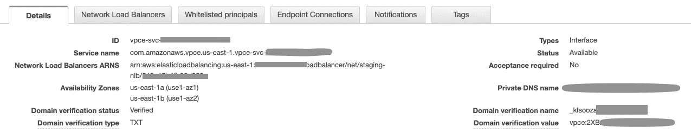

# 铺设从 AWS API Gateway 到 ECS Fargate 的轨道|第一部分

> 原文：<https://levelup.gitconnected.com/laying-the-rails-from-aws-api-gateway-to-ecs-fargate-part-i-debf754d6a8b>

## 在两个不协调的产品之间建立网络路径的指南(使用 Terraform)

## 废弃通知

3 月 12 日，亚马逊发布了“[构建更快、更低成本、更好的 API——HTTP API 现已普遍可用](https://aws.amazon.com/blogs/compute/building-better-apis-http-apis-now-generally-available/)”因此，我建议希望将 API Gateway 与 ALB 集成的读者忽略本文中涉及 NLB 和目标更新程序函数的说明。相反，VPC 链路应该直接路由到 ALB。


# 介绍

在以安全和开发友好的方式部署和服务应用程序时，Amazon 提供了非凡的灵活性。这有许多好处，其中之一是它提供了绘制代码图的独特机会，如上所述。另一方面，有时产品的广度会造成两个看似兼容的东西，比如 API 网关和后端 API，很难组合在一起。我很乐意接受这种权衡，而不是必须处理一个不灵活的、规范的平台，但是这些集成的一些微妙细节仍然很神秘，直到您真正深入了解。

本系列文章将指导读者实现从 API Gateway 到 ECS Fargate 的完整集成路径，包括前端(网关)的 AWS Cognito 客户端认证、与 VPC 的私有集成、负载平衡和安全 HTTP。HCL for Terraform 将是我显示配置细节的主要手段，因此我假设您熟悉该工具以及所涉及的云资源的一般功能。我将从网关开始，向后(或者向前，如果您是后端开发人员)。

本文是两篇文章的第一部分。第一篇文章将以对 VPC 环节的讨论结束，第二篇文章将从这一环节继续。

## 关于代码示例的注释

当我从博客或堆栈溢出答案中找到一个代码示例时，我总是想知道它可能存在于我的应用程序生态系统中的什么地方。对于这个例子，让我们假设我们有很多后端服务，我们希望通过网关公开它们。一些地形配置将需要进入基础设施的共享项目(以下简称*以下简称*)，该项目提供由许多组件共享的资源。其他配置将进入一个单一的、示范性服务的项目，我将称之为 *ice-station-zebra* 作为对目前电视上最好的节目的敬意，*最好叫索尔* (AMC，周一)。因此，对于每个代码示例，我将尝试提供实现这一效果的上下文。

## 特别感谢

这里的一些实现借用了文章 [*如何为 AWS 应用负载平衡器*](https://www.bluematador.com/blog/static-ips-for-aws-application-load-balancer) 使用静态 IPs。

# 认知

在设置 API 网关之前，我们应该先解决这个先决条件。我们将在我们的 *infra* 项目中定义一个用户池和一个[用户池域](https://docs.aws.amazon.com/cognito/latest/developerguide/cognito-user-pools-assign-domain.html)。如果您的设置在不同阶段(开发、生产等)有不同的帐户。)在您的开发管道中，这可能应该在每个环境(每个 AWS 帐户)的基础上应用，因为应用程序用户是特定于阶段的实体。

```
resource "aws_cognito_user_pool" "users" {
  name = "users"
}resource "aws_cognito_user_pool_domain" "users" {
  domain = "${var.stage}-users"
  user_pool_id = aws_cognito_user_pool.users.id
}
```

在我们的 *ice-station-zebra* 项目中，对于每个阶段，我们都可以获取用户池的 ID，并使用[客户端凭证流](https://aws.amazon.com/blogs/mobile/understanding-amazon-cognito-user-pool-oauth-2-0-grants/)设置 Cognito 认证的基础，这是典型的机器对机器认证。为了简单起见，我在这里只配置了*认证*，而没有配置*授权*机制——这是另一个话题——所以*资源服务器*主要是一个占位符。`aws_cognito_user_pool_client`是 App 客户端。属性`aws_cognito_user_pool_client.this.id`为`client_credentials`认证提供了“用户名”。

```
data "aws_cognito_user_pools" "users" {
  name = "users"
}locals {
  user_pool_id = tolist(data.aws_cognito_user_pools.users.ids)[0]
  cognito_idp_name = "cognito-idp.${data.aws_region.current.name}.amazonaws.com/${local.user_pool_id}"
}

resource "aws_cognito_resource_server" "this" {
  identifier = "ice-station-zebra"
  name = "ice-station-zebra"
  user_pool_id = local.user_pool_id
  scope {
    scope_name = "read"
    scope_description = "Read"
  }
  scope {
    scope_name = "edit"
    scope_description = "Edit"
  }
}

resource "aws_cognito_user_pool_client" "this" {
  name = var.name
  user_pool_id = local.user_pool_id
  supported_identity_providers = ["COGNITO"]
  generate_secret = true
  allowed_oauth_flows_user_pool_client = true
  allowed_oauth_flows = ["client_credentials"]
  allowed_oauth_scopes = aws_cognito_resource_server.this.scope_identifiers
}output "cognito_client_secret" {
  sensitive = true
  value = aws_cognito_user_pool_client.this.client_secret
}
```

我继续添加了客户端密码的输出。请记住，Terraform 以纯文本的形式存储其状态中的一些敏感值，因此要保护状态文件并谨慎运行`terraform output`。

# API 网关

## 基础设施

让我们继续在 *infra* 项目中设置 API 网关。如 Cognito 部分所述，这可以在每个环境中定义一次。或者，它可以包含在“共享”配置中，这样每个 API 网关“阶段”指向不同的 AWS 环境帐户。这似乎是他们对 stage 特性的想法，但是您是否有效地利用它取决于您如何从字面上理解特定于一个阶段的资源应该与另一个阶段的资源分离的概念。对于用于多个阶段的单个网关，CI/CD 系统可能必须在部署期间在网关上执行特定的操作，尤其是在需要金丝雀类型的部署时，而这种方法将它视为任何其他资源。

```
resource "aws_api_gateway_account" "this" {
  cloudwatch_role_arn = aws_iam_role.api_gateway_cloudwatch.arn
}
```

这是一个 IAM 角色，附带一个 AWS 管理的策略，允许 API Gateway 将日志推送到 CloudWatch。

```
data "aws_iam_policy_document" "api_gateway_assume_role" {
  statement {
    actions = ["sts:AssumeRole"]
    principals {
      type = "Service"
      identifiers = ["apigateway.amazonaws.com"]
    }
  }
}resource "aws_iam_role" "api_gateway_cloudwatch" {
  name = "api-gateway-cloudwatch"
  assume_role_policy = data.aws_iam_policy_document.api_gateway_assume_role.json
}data "aws_iam_policy" "api_gateway_cloudwatch" {
  arn = "arn:aws:iam::aws:policy/service-role/AmazonAPIGatewayPushToCloudWatchLogs"
}resource "aws_iam_role_policy_attachment" "api_gateway_cloudwatch" {
  role = aws_iam_role.api_gateway_cloudwatch.id
  policy_arn = data.aws_iam_policy.api_gateway_cloudwatch.arn
}
```

现在，作为 API 开发者，我们需要弄清楚我们的消费者将为 *ice-station-zebra* API 使用哪个 URL。默认情况下，REST API 提供了一个难看的 URL，`https://*{restapi-id}*.execute-api.*{region}*.amazonaws.com/*{stage}*`。该 URL 可用于与 AWS Lambda 的集成，但要将其用于与 ECS 任务的集成，需要在集成路径上的不同点拥有该子域的 TLS 证书，并且除了杰夫·贝索斯之外，任何人都无法获得该证书。所以，让我们假设我们拥有一个域名，*abq.com*，并且我们有一个它所有子域名的 TLS 证书( **.abq.com* ) *。*我希望服务的 REST API 在基本路径“https://API . abq . com/ice-station-zebra”及其所有子路径中都可用。这是为了提供一个完整的例子，如果你看到 *ice-station-zebra* 代表一个单一的后端，你可能希望有一个像“https://ice-station-zebra.com”一样简单的 URL 基路径。

值得注意的是，API Gateway 还支持“HTTP APIs”在撰写本文时， [REST API 是一个更加通用的选项](https://docs.aws.amazon.com/apigateway/latest/developerguide/http-api-vs-rest.html)；我会保守一点，在这个例子中使用 REST API。

建立该 URL 的第一步是[为包含 *ice-station-zebra* 的一组服务建立一个*自定义域名*](https://docs.aws.amazon.com/apigateway/latest/developerguide/how-to-custom-domains.html) 。这个配置由多个后端 API 共享，并进入下面的*配置。我选择创建一个[“区域”API](https://docs.aws.amazon.com/apigateway/latest/developerguide/create-regional-api.html) ，它提供了对地理分布的更大控制；默认的端点类型是`EDGE`。我已经在 ACM 中导入了一个 TLS 证书，但是如果您使用 ACM 作为您的证书颁发机构，您可以使用一个`[resource](https://www.terraform.io/docs/providers/aws/r/acm_certificate.html)`来代替`data`源。*

```
data "aws_acm_certificate" "star_dot_abq_dot_com" {
  domain = "*.abq.com"
}resource "aws_api_gateway_domain_name" "com_abq_api" {
  domain_name = "api.abq.com"
  endpoint_configuration {
    types = ["REGIONAL"]
  }
  regional_certificate_arn = data.aws_acm_certificate.star_dot_abq_dot_com.arn
  security_policy = "TLS_1_2"
}
```

## 服务

在我们建立“/ice-station-zebra”路径之前，我们需要在我们的 *i-s-z* 项目中对我们的特定于服务的 REST API 进行平台化。我们还可以设置*授权器*，它为整个 REST API 设置 Cognito 认证。现在，所有对 REST 资源的请求都必须包含一个“Authorization”头。头值将是 Base-64 编码的 JSON Web 令牌(奇怪的是，前缀必须是“Bearer”，而不是“T8”)。

```
resource "aws_api_gateway_rest_api" "this" {
  name = "ISZAPIv1"
  endpoint_configuration {
    types = ["REGIONAL"]
  }
}resource "aws_api_gateway_authorizer" "cognito" {
  name = "${aws_api_gateway_rest_api.this.name}CognitoUserPoolAuthorizer"
  type = "COGNITO_USER_POOLS"
  rest_api_id = aws_api_gateway_rest_api.this.id
  provider_arns = data.aws_cognito_user_pools.users.arns
  identity_source = "method.request.header.Authorization"
}
```

网关的一个基本特性是允许您使用一些标准规范(如 OpenAPI)定义 REST 资源，并将它们与各自的后端端点集成在一起。这种实践在[中有很好的记录](https://docs.aws.amazon.com/apigateway/latest/developerguide/how-to-method-settings.html)，所以这里我们将适当地偷懒并利用 API 网关 [HTTP 代理](https://docs.aws.amazon.com/apigateway/latest/developerguide/setup-http-integrations.html)特性。这实际上是集成第三方/黑盒类型的服务的一个很好的选择，这种服务由您自己托管，并且具有自定义的 API。

我们将为代理资源定义一个带有子路径“{proxy+}”的*资源*以及一个*方法*。该方法对“代理”请求参数的引用确保了被代理的路径片段将在*集成*中可用。然后，集成能够将路径片段传递给集成组件，不管它是什么。

```
resource "aws_api_gateway_resource" "proxy" {
  rest_api_id = aws_api_gateway_rest_api.this.id
  parent_id = aws_api_gateway_rest_api.this.root_resource_id
  path_part = "{proxy+}"
}resource "aws_api_gateway_method" "proxy" {
  rest_api_id = aws_api_gateway_rest_api.this.id
  resource_id = aws_api_gateway_resource.proxy.id
  http_method = "ANY"
  authorization = "COGNITO_USER_POOLS"
  authorizer_id = aws_api_gateway_authorizer.cognito.id
  request_parameters = {
    "method.request.path.proxy" = true
  }
  authorization_scopes = aws_cognito_resource_server.this.scope_identifiers
}resource "aws_api_gateway_integration" "this" {
  rest_api_id = aws_api_gateway_rest_api.this.id
  resource_id = aws_api_gateway_resource.proxy.id
  http_method = aws_api_gateway_method.proxy.http_method
  integration_http_method = "ANY"
  type = "HTTP_PROXY"
  uri = "https://api.abq.com/ice-station-zebra/{proxy}"
  connection_type = "VPC_LINK"
  connection_id = "$${stageVariables.vpcLinkId}"
  request_parameters = {
    "integration.request.path.proxy" = "method.request.path.proxy"
  }
}
```

另外，除了代理 API，我可能不会使用`aws_api_gateway_resource`和相关资源来定义 REST API。`aws_api_gateway_rest_api`采用`body`参数，允许你[用 OpenAPI/Swagger 规范](https://docs.aws.amazon.com/apigateway/latest/developerguide/create-api-using-swagger.html)定义一切。导入的规范需要为 API Gateway 定义一些特殊的属性，但是对于一个拥有大量资源的 API 来说，似乎更容易维护。与在资源上定义“描述”属性相比，资源`aws_api_gateway_documentation_part`似乎有些笨拙。这是我的直觉，你的里程可能会有所不同。

进一步，我们需要[一个*部署*和一个*阶段*](https://docs.aws.amazon.com/apigateway/latest/developerguide/how-to-deploy-api.html) 。这部分很乱，原因有几个。如果不做一些调整，Terraform 无法管理 API 网关阶段的状态。例如，AWS Terraform 提供者周围的社区似乎倾向于在部署中使用`create_before_destroy`,这样 stage 就不会因为无效的部署 id 而挂起。我发现偶尔有必要在部署资源上运行`terraform taint`,以强制对要部署的其他资源进行更改。这些资源存在未解决的问题，因此请谨慎使用。此外，在测试中，我发现部署 REST API 需要一段时间，之前的部署会停留一两分钟。如果你期望立即得到反馈，这种滞后会令人困惑。

`vpc_link`的东西将在下一节解释。

```
resource "aws_api_gateway_deployment" "this" {
  rest_api_id = aws_api_gateway_rest_api.this.id
  stage_name = var.stage
  depends_on = [aws_api_gateway_integration.this]

  variables = {
    // just to trigger redeploy on resource changes
    resources = join(", ", [aws_api_gateway_resource.proxy.id])

    // note: redeployment might be required with other gateway changes.
    // when necessary run `terraform taint <this resource's address>`
  }

  lifecycle {
    create_before_destroy = true
  }
}data "aws_api_gateway_vpc_link" "env" {
  name = var.stage
}resource "aws_api_gateway_stage" "this" {
  deployment_id = aws_api_gateway_deployment.this.id
  rest_api_id = aws_api_gateway_rest_api.this.id
  stage_name = aws_api_gateway_deployment.this.stage_name
  access_log_settings {
    destination_arn = aws_cloudwatch_log_group.api_gateway.arn
    // Common Log Format
    format = "$context.identity.sourceIp $context.identity.caller $context.identity.user [$context.requestTime] \"$context.httpMethod $context.resourcePath $context.protocol\" $context.status $context.responseLength $context.requestId"
  }
  variables = {
    vpcLinkId = data.aws_api_gateway_vpc_link.env.id
  }
}
```

我们还需要将 REST API 映射到一个*基本路径*以添加到我们的域中。在代理路径和整合 URI 方面取得成功是令人困惑的——如果我有一个[辛普森一家的类比](https://medium.com/swlh/a-tale-of-two-aws-iam-roles-in-springfield-d19a4f9ffd91?source=friends_link&sk=b6a97091062d1013cac2b36ac01181cd)就好了！基本上，在请求方法的“{proxy}”占位符中代理的路径部分将位于基本路径映射的末尾，该 URL 成为网关对 API 集成发出的请求。最终结果是[进来的 URL 和出去的 URL 是同一个。](https://en.wikipedia.org/wiki/The_Myth_of_Sisyphus)

```
resource "aws_api_gateway_base_path_mapping" "this" {
  domain_name = "api.abq.com"
  api_id = aws_api_gateway_rest_api.this.id
  stage_name = aws_api_gateway_stage.this.stage_name
  base_path = "ice-station-zebra"
}
```

集成 URI 主机名在技术上不必与自定义域名相同，但出于几个原因，这是一个实用的选择。在下一节中，我将说明 API 网关和 VPC 之间的私有链接要求您拥有一个能够修改公共 DNS 记录的域名。您也可以在内部重用该属性。

最后，让我们创建一个 CloudWatch 日志组，其名称采用 API Gateway 将识别的特定格式[。](https://docs.aws.amazon.com/apigateway/latest/developerguide/set-up-logging.html)

```
resource "aws_cloudwatch_log_group" "api_gateway" {
  name = "API-Gateway-Execution-Logs_${aws_api_gateway_rest_api.this.id}/${aws_api_gateway_deployment.this.stage_name}"
  retention_in_days = 7
}
```

# VPC 链接

将 API 网关与 VPC 中的资源集成在一起始于到网络负载平衡器的 [VPC 链路](https://docs.aws.amazon.com/apigateway/latest/developerguide/set-up-private-integration.html)。我将在后面的部分中介绍 NLB，但这是 VPC 链接的先决条件。这一资源以及从现在开始的大多数其他资源都属于*基础设施的范畴。*

```
resource "aws_api_gateway_vpc_link" "this" {
  name = var.stage
  target_arns = [aws_lb.network.arn]
}
```

VPC 链接是一个 [VPC 端点服务](https://docs.aws.amazon.com/vpc/latest/userguide/endpoint-service.html)，在其“白名单主体”列表中有一个条目:为配置区域提供 API 网关的 AWS 管理的帐户的`root`(有一个列表)。

如果您将本文作为教程来阅读，这里有一个基本的网络负载平衡器。

```
resource "aws_lb" "network" {
  name = "nlb"
  load_balancer_type = "network"
  enable_cross_zone_load_balancing = true
  internal = false
  subnets = var.private_subnet_ids
}
```

## 私有 DNS

用 Terraform 创建`vpc_link`资源只是一个开始，还需要一些手工操作。VPC 链路开始时缺少其专用 DNS 名称。如果没有它，网关将返回神秘的 500 错误，因为它试图击中一个 VPC 端点 URI 不匹配插值积分 URI。我们用`uri = "https://api.abq.com/ice-station-zebra/{proxy}"`配置了整合资源；在我们将其定义为私有 DNS 名称之前，该端点并不存在。这个[在文档](https://docs.aws.amazon.com/apigateway/latest/developerguide/getting-started-with-private-integration.html)中并没有真正解释。这张截图显示了我们想要的最终结果。



专用 DNS 名称需要经过“验证”才能被访问。我是这样做的:

1.  在 AWS 控制台中，设置专用 DNS 名称(例如，“api.abq.com”)。
2.  “域验证状态”现在应该是“待定”获取“域验证名”和“域验证值”
3.  向您的 DNS 提供商注册一个值为`*{domain verification name}*=*{domain verification value}*`的域名 TXT 记录。(两者之间只是一个等号。)
4.  在 AWS 控制台中，点击按钮验证 DNS 名称。
5.  等 10 分钟吧。

在`aws_api_gateway_stage`中，我们在`variables`下引用了这个 VPC 链接的 ID。这允许我们使用“${stageVariables.vpcLinkId}”来引用它。Amazon 建议这样做，而不是直接定义 ID，这样“您可以通过更改 stage 变量值轻松切换到 API 的不同 VPC 链接。”如果不切换阶段，这种间接方式可能没有用。

# 摘要

在这个由两部分组成的系列文章的第一部分中，我演示了如何集成 AWS API Gateway、Cognito 和 VPC 服务端点。我很想听听你的反馈。我会在本周的某个时候发布第二部分。感谢阅读。

## 后续行动

第二部分:

[](https://medium.com/@lucjross/laying-the-rails-from-aws-api-gateway-to-ecs-fargate-part-ii-7b9294ead2e4) [## 铺设从 AWS API 网关到 ECS Fargate 的轨道|第二部分

### 《急诊室的故事》前情提要中，我描述了从 API 网关到 VPC 链接的集成线路。这第二部分将涵盖…

medium.com](https://medium.com/@lucjross/laying-the-rails-from-aws-api-gateway-to-ecs-fargate-part-ii-7b9294ead2e4)