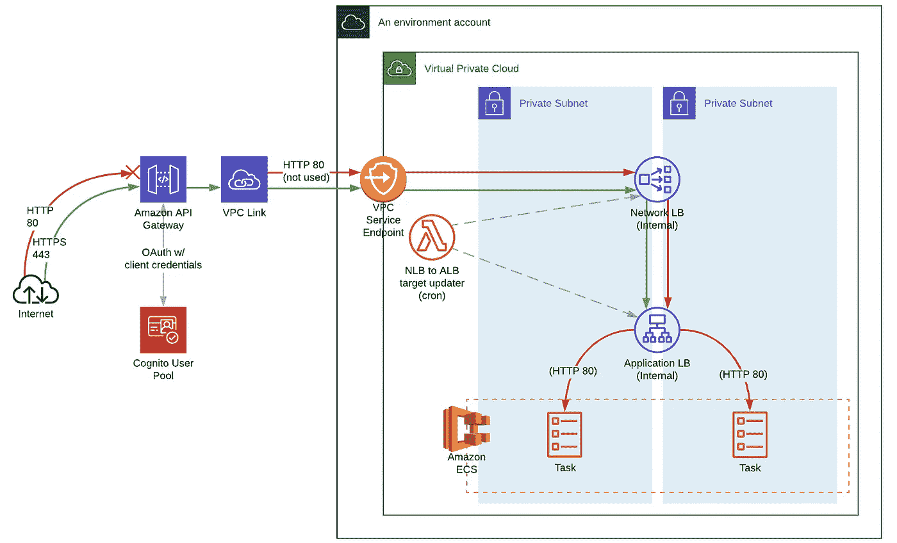
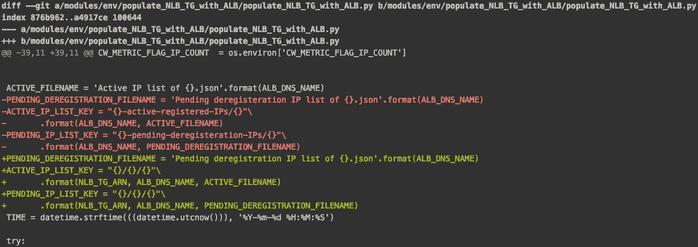

# 铺设从 AWS API 网关到 ECS Fargate 的轨道|第二部分

> 原文：<https://levelup.gitconnected.com/laying-the-rails-from-aws-api-gateway-to-ecs-fargate-part-ii-7b9294ead2e4>



前情提要，我描述了从 API 网关到 VPC 链接的集成线路。

[](https://medium.com/@lucjross/laying-the-rails-from-aws-api-gateway-to-ecs-fargate-part-i-debf754d6a8b) [## 铺设从 AWS API Gateway 到 ECS Fargate 的轨道|第一部分

### 在两个不兼容的资源之间建立网络路径的指南

medium.com](https://medium.com/@lucjross/laying-the-rails-from-aws-api-gateway-to-ecs-fargate-part-i-debf754d6a8b) 

第二部分将涵盖其余部分，从网络负载平衡器到 ECS 任务。让我们跳进来。

# 网络负载平衡器

## 基本原理

为什么将 API Gateway 连接到网络负载平衡器，而不是直接连接到应用程序负载平衡器？基本上，这是因为 VPC 服务端点只连接到 NLB，而 VPC 服务端点是 API Gateway 的——呃，是我们 VPC 的网关。

假设，如果我们希望 API Gateway 通过互联网访问我们的服务，我们可以使用一个带有公共 DNS 名称的面向互联网的 ALB，但是我们不希望从互联网访问我们的 ALB。如果是的话，我们会有另一个潜在的安全漏洞，特别是考虑到我们没有将身份验证与 ALB 集成，而只是与网关集成。所以，我把负载平衡器做成了内部的，这样就避免了给它们附加公共 IP。这使得 VPC(或对等 VPC)之外的任何设备都无法访问它们。但是，VPC 服务端点可以连接到 NLB，而不考虑其子网关联。

如果 Amazon 做了一件小事，我们的实现可能会简单得多:在应用程序负载平衡器侦听器规则中允许 Cognito 客户端凭证认证。据我所知，它只与“授权代码授权”和“隐式授权”流集成，这是为使用 web 浏览器的人设计的。从图中可以看到，内部 ALB 直接与 ECS 任务接口。如果 ALB 支持简单的客户端凭证 OAuth 流，我们将只使用一个外部 ALB 来代替，然后，API Gateway 就不必添加太多。

## 基础设施实施

让我们创建 NLB 及其非特定于服务的资源。

```
resource "aws_lb" "network" {
  name = "${var.stage}-nlb"
  load_balancer_type = "network"
  enable_cross_zone_load_balancing = true
  internal = true
  subnets = var.private_subnet_ids
  access_logs {
    enabled = true
    bucket = var.nlb_logs_bucket_id
    prefix = ""
  }
}

resource "aws_lb_target_group" "nlb_80" {
  name = "nlb-80"
  protocol = "TCP"
  port = 80
  target_type = "ip"
  vpc_id = var.vpc_id
  proxy_protocol_v2 = false
}

resource "aws_lb_target_group" "nlb_443" {
  name = "nlb-443"
  protocol = "TLS"
  port = 443
  target_type = "ip"
  vpc_id = var.vpc_id
  proxy_protocol_v2 = false
}

resource "aws_lb_listener" "nlb_80" {
  load_balancer_arn = aws_lb.network.arn
  protocol = "TCP"
  port = 80
  default_action {
    type = "forward"
    target_group_arn = aws_lb_target_group.nlb_80.arn
  }
}

resource "aws_lb_listener" "nlb_443" {
  load_balancer_arn = aws_lb.network.arn
  protocol = "TLS"
  port = 443
  certificate_arn = var.server_certificate_arn
  default_action {
    type = "forward"
    target_group_arn = aws_lb_target_group.nlb_443.arn
  }
}
```

我们已经创建了两个目标组，一个用于端口 80 上的 TCP，另一个用于端口 443 上带有 TLS 的 TCP。API Gateway 实际上不允许不安全的 HTTP 流量，但是我认为对于内部负载平衡器来说，提供一个非 TLS 路径对于 VPC 内部与我们的示例服务( *ice-station-zebra* )的集成是很好的。此外，这是我最初的错误观念的残余，即 API Gateway 确实允许端口 80，我是一个 LB 侦听器贮藏者——我还有数百个，只是收集网络灰尘。

这些监听器没有*监听器规则*，因为每个监听器的`default_action`将足以路由到目标组。此外，`nlb_443`监听器的服务器证书可以是自签名的，也可以是真实证书颁发机构签名的。它不像公共网站，当他们出示自签名或其他可疑的 SSL 证书时，应该被视为非法。来自已经在 API 网关端接受证书的客户端的流量应该能够假设网关后面的任何东西都是可信的，因此对于内部组件来说，证书只是一个逻辑需求。

# 应用负载平衡器

您可能想知道，当 NLB 可以直接针对 ECS 任务时，我们为什么还要使用 ALB。ALB 支持更复杂的路由规则，可以在多个端口上转发流量。NLB 提供了更高的性能，因为它们在较低的级别上运行，但它们不提供我们进行这种集成所需的基于路径的路由功能，无论如何，Amazon 推荐并支持 ALB 与 ECS Fargate 进行负载平衡。

## 基础设施

在调配 ALB 时，我们需要为其指定一个安全组，这与 NLB 不同，后者不适用安全组。我们可以简单地允许所有端口上的所有出口和端口 80 上的所有入口，因为它是 VPC 的内部端口。默认的目标组不是必须使用的，但是我们需要一个用于监听器的默认动作。

```
resource "aws_security_group" "alb_internal" {
  vpc_id = var.vpc_id
  name = "alb-internal"
}

resource "aws_security_group_rule" "alb_internal_egress" {
  type = "egress"
  from_port = "0"
  to_port = "0"
  protocol = "-1"
  cidr_blocks = ["0.0.0.0/0"]
  security_group_id = aws_security_group.alb_internal.id
}

resource "aws_security_group_rule" "alb_internal_http_ingress" {
  type = "ingress"
  from_port = 80
  to_port = 80
  protocol = "tcp"
  cidr_blocks = ["0.0.0.0/0"]
  security_group_id = aws_security_group.alb_internal.id
}

resource "aws_lb" "internal" {
  name = local.internal_alb_name
  internal = true
  load_balancer_type = "application"
  security_groups = [
    aws_security_group.vpc.id,
    aws_security_group.alb_internal.id,
  ]
  subnets = var.private_subnet_ids
  idle_timeout = 60
  ip_address_type = "ipv4"
  access_logs {
    enabled = true
    bucket = var.alb_internal_access_logs_bucket_id
    prefix = ""
  }
}

resource "aws_lb_target_group" "alb_internal_default" {
  name = "alb-internal-default"
  port = 80
  protocol = "HTTP"
  vpc_id = var.vpc_id
  target_type = "ip"
  deregistration_delay = 10
  lifecycle {
    create_before_destroy = true
  }
}

resource "aws_lb_listener" "alb_internal_http" {
  load_balancer_arn = aws_lb.internal.arn
  port = 80
  protocol = "HTTP"
  default_action {
    target_group_arn = aws_lb_target_group.alb_internal_default.arn
    type = "forward"
  }
}

resource "aws_lb_listener" "alb_internal_http_443" {
  count = local.nlb_count
  load_balancer_arn = aws_lb.internal.arn
  port = 443
  protocol = "HTTPS"
  certificate_arn = var.server_certificate_arn
  default_action {
    target_group_arn = aws_lb_target_group.alb_internal_default.arn
    type = "forward"
  }
}
```

正如我的图表所示，这个负载平衡器是 TLS 的终点。读者对终止的需求可能会有所不同，或者可以在 NLB 或在 ECS 任务中完成。我选择终止于 ALB，因为它尽可能地靠近服务，而没有在服务上安装证书的复杂性。

## 静态 IPs

为了在 NLB 之后直接引入 ALB，我们必须解决它们之间的不兼容性。ALB 的 IP 地址是动态的，这对于用 DNS CNAME 记录引用它们的通常情况来说是很好的，但是 NLB 没有办法自己跟上这些变化。为了解决这个问题，我将提供 AWS 博客文章 [*的一个实现，为应用程序负载平衡器使用静态 IP 地址*](https://aws.amazon.com/blogs/networking-and-content-delivery/using-static-ip-addresses-for-application-load-balancers/) 。

首先，我们将创建“IP 列表”桶。

```
resource "aws_s3_bucket" "internal_alb_static_ips" {
  bucket = "${var.stage}-internal-alb-static-ips"
  acl = "private"
  region = data.aws_region.this.name

  versioning {
    enabled = true
  }
}
```

然后我们将向 Lambda 提供 IAM 资源。它需要访问 CloudWatch、S3 和弹性负载平衡。

```
data "aws_iam_policy_document" "lambda_assume_role" {
  statement {
    actions = ["sts:AssumeRole"]
    principals {
      type = "Service"
      identifiers = ["lambda.amazonaws.com"]
    }
  }
}

resource "aws_iam_role" "nlb_tg_to_alb_lambda" {
  name = "nlb-tg-to-alb-lambda"
  assume_role_policy = data.aws_iam_policy_document.lambda_assume_role.json
}

data "aws_iam_policy_document" "nlb_tg_to_alb_lambda" {
  statement {
    actions = [
      "logs:CreateLogGroup",
      "logs:CreateLogStream",
      "logs:PutLogEvents",
    ]
    resources = ["arn:aws:logs:*:*:*"]
  }
  statement {
    actions = [
      "s3:GetObject",
      "s3:PutObject",
    ]
    resources = ["${aws_s3_bucket.internal_alb_static_ips.arn}/*"]
  }
  statement {
    actions = [
      "elasticloadbalancing:RegisterTargets",
      "elasticloadbalancing:DeregisterTargets",
    ]
    resources = [
      aws_lb_target_group.nlb_80.arn,
      aws_lb_target_group.nlb_443.arn,
    ]
  }
  statement {
    actions = ["elasticloadbalancing:DescribeTargetHealth"]
    resources = ["*"]
  }
  statement {
    actions = ["cloudwatch:putMetricData"]
    resources = ["*"]
  }
}

resource "aws_iam_role_policy" "nlb_tg_to_alb_lambda" {
  role = aws_iam_role.nlb_tg_to_alb_lambda.name
  policy = data.aws_iam_policy_document.nlb_tg_to_alb_lambda.json
}
```

接下来，从 AWS 教程中的链接下载 Lambda 函数，并将其解压缩到您的基础设施项目中。

在我们用 Terraform 创建 Lambda 函数之前，我们可能需要对 Lambda 代码做一点小小的修改。如果您的 NLB 只使用端口 443，您不需要这样做。如果您希望端口 80 上的流量也从 NLB 路由，则需要修改 Lambda，以便它保存其 IP 列表，其中包含特定于目标组而不仅仅是 ALB 的对象名称。为此，根据这个 Git diff 进行更改。(图片为上下文，文字为复制+粘贴。Medium 并不是共享代码的最佳媒介。)



```
PENDING_DEREGISTRATION_FILENAME = 'Pending deregistration IP list of {}.json'.format(ALB_DNS_NAME)
ACTIVE_IP_LIST_KEY = "{}/{}/{}"\
       .format(NLB_TG_ARN, ALB_DNS_NAME, ACTIVE_FILENAME)
PENDING_IP_LIST_KEY = "{}/{}/{}"\
       .format(NLB_TG_ARN, ALB_DNS_NAME, PENDING_DEREGISTRATION_FILENAME)
```

我们可以使用这个 shell 脚本来打包 Lambda，我这样做只是为了重现性——它可能只需要运行一次。执行`cd`是为了让`zip`只打包内容，因为如果处理程序代码不在包的根目录下，Lambda 不会欣赏上传。

```
**#!/bin/sh** set -e

(cd populate_NLB_TG_with_ALB && zip -r -FS ../package/nlb-tg-to-alb-lambda.zip .)
```

现在，一旦运行了 shell 脚本，我们就可以创建 Lambdas 了。

```
locals {
  alb_static_ips_lambda_zip_path = "${path.module}/package/nlb-tg-to-alb-lambda.zip"
}

resource "aws_lambda_function" "nlb_tg_to_alb_80" {
  filename = local.alb_static_ips_lambda_zip_path
  function_name = "nlb-tg-to-alb-80"
  role = aws_iam_role.nlb_tg_to_alb_lambda.arn
  handler = "populate_NLB_TG_with_ALB.lambda_handler"

  source_code_hash = filebase64sha256(local.alb_static_ips_lambda_zip_path)

  runtime = "python2.7"
  memory_size = 128
  timeout = 300

  environment {
    variables = {
      ALB_DNS_NAME = aws_lb.internal.dns_name
      ALB_LISTENER = "80"
      S3_BUCKET = aws_s3_bucket.internal_alb_static_ips.id
      NLB_TG_ARN = aws_lb_target_group.nlb_80.arn
      MAX_LOOKUP_PER_INVOCATION = 50
      INVOCATIONS_BEFORE_DEREGISTRATION = 10
      CW_METRIC_FLAG_IP_COUNT = true
    }
  }
}

resource "aws_lambda_function" "nlb_tg_to_alb_443" {
  filename = local.alb_static_ips_lambda_zip_path
  function_name = "nlb-tg-to-alb-443"
  role = aws_iam_role.nlb_tg_to_alb_lambda.arn
  handler = "populate_NLB_TG_with_ALB.lambda_handler"

  source_code_hash = filebase64sha256(local.alb_static_ips_lambda_zip_path)

  runtime = "python2.7"
  memory_size = 128
  timeout = 300

  environment {
    variables = {
      ALB_DNS_NAME = aws_lb.internal.dns_name
      ALB_LISTENER = "443"
      S3_BUCKET = aws_s3_bucket.internal_alb_static_ips.id
      NLB_TG_ARN = aws_lb_target_group.nlb_443.arn
      MAX_LOOKUP_PER_INVOCATION = 50
      INVOCATIONS_BEFORE_DEREGISTRATION = 10
      CW_METRIC_FLAG_IP_COUNT = true
    }
  }
}
```

CloudWatch cron 作业触发 Lambdas 的调用，CloudWatch 事件服务被允许调用它们。

```
resource "aws_cloudwatch_event_rule" "nlb_tg_to_alb_cron" {
  name = "nlb-tg-to-alb-cron"
  schedule_expression = "rate(1 minute)"
  is_enabled = true
}

resource "aws_cloudwatch_event_target" "nlb_tg_to_alb_cron_80" {
  rule = aws_cloudwatch_event_rule.nlb_tg_to_alb_cron.name
  target_id = "TriggerStaticPort80"
  arn = aws_lambda_function.nlb_tg_to_alb_80.arn
}

resource "aws_cloudwatch_event_target" "nlb_tg_to_alb_cron_443" {
  rule = aws_cloudwatch_event_rule.nlb_tg_to_alb_cron.name
  target_id = "TriggerStaticPort443"
  arn = aws_lambda_function.nlb_tg_to_alb_443.arn
}

resource "aws_lambda_permission" "allow_cloudwatch_80" {
  statement_id = "AllowExecutionFromCloudWatch"
  action = "lambda:InvokeFunction"
  function_name = aws_lambda_function.nlb_tg_to_alb_80.function_name
  principal = "events.amazonaws.com"
  source_arn = aws_cloudwatch_event_rule.nlb_tg_to_alb_cron.arn
}

resource "aws_lambda_permission" "allow_cloudwatch_443" {
  statement_id = "AllowExecutionFromCloudWatch"
  action = "lambda:InvokeFunction"
  function_name = aws_lambda_function.nlb_tg_to_alb_443.function_name
  principal = "events.amazonaws.com"
  source_arn = aws_cloudwatch_event_rule.nlb_tg_to_alb_cron.arn
}
```

总结一下 ALB 的讨论:我们已经创建了一个应用程序负载平衡器，它有两个监听器(443 和 80)和一个让网络负载平衡器保持与 ALB 连接的机制。

## 服务

在这一点上，我们可以把我们的焦点带回到个体服务的领域。您需要为每一个创建负载平衡器目标组。如果 LB 提供的服务不超过 50 个左右，这应该没问题[，假设每个服务使用一对目标组(用于 HTTP 和 HTTPS)。更多服务，添加更多 LBs。](https://docs.aws.amazon.com/elasticloadbalancing/latest/application/load-balancer-limits.html)

这个 Terraform 配置至少创建一个目标组，每个目标组都用服务名和一个随机的六字符十六进制后缀命名。我使用了一个`blue_green`布尔变量来支持 AWS CodeDeploy，它通过将流量(或部分流量)从一个目标组切换到另一个目标组来完成 ECS 任务的蓝绿色/金丝雀式部署。这就是我使用随机 TG 名称而不是“蓝色”/“绿色”或小整数的原因——我想避免认为它们有任何自然顺序，或者将它们与活动/不活动相关联，因为它们中的任何一个都可能在任何时候提供流量，如果不查看侦听器规则，您是不会知道的。我不会在这里讨论部署问题，所以就假装你没有看到`count`的论点，但是对于你的生产环境来说，这是值得考虑的。

```
resource "random_id" "target_group_http_80" {
  count = var.blue_green ? 2 : 1
  byte_length = 3
}resource "aws_alb_target_group" "http_80" {
  count = var.blue_green ? 2 : 1
  name = "${substr(var.name, 0, 20)}-${random_id.target_group_http_80[count.index].hex}"
  protocol = "HTTP"
  port = 80
  vpc_id = var.vpc_id
  slow_start = 30
  stickiness {
    type = "lb_cookie"
  }
  target_type = "ip"
  health_check {
    path = local.health_checks.path
    port = 8080
    timeout = local.health_checks.timeout
    interval = local.health_checks.interval
    matcher = "200-299"
  }
}
```

因为 *infra* 在另一个根模块中，我们需要对我们设置的 ALB 进行推断。

```
data "aws_alb_listener" "http_80" {
  load_balancer_arn = var.internal_alb_arn
  port = 80
}data "aws_alb_listener" "https_443" {
  load_balancer_arn = var.internal_alb_arn
  port = 443
}
```

接下来，我们将为端口 80 创建一个监听器规则，并定义特定的行为:

*   如果是以“http://API . abq . com/ice-station-zebra/”开头的 URL，它将匹配一个请求。注意，如果您还需要精确地提供根路径“/ice-station-zebra”，那么您将需要另一个具有该路径模式的侦听器规则(在一个规则中，每种条件类型只允许一个)。
*   如果请求匹配，ALB 将使用 301 进行响应，并将用户重定向到相同的 URL，但在端口 443 上。

同样，为了与 API Gateway 集成，并不真正需要端口 80，所以这只是一种保护措施。如果我们希望 VPC 中的另一个服务通过端口 80 监听器调用 *ice-station-zebra* ，那么我们可以创建另一个监听器规则。它不会有重定向，但需要另一个条件来允许 VPC 内部的流量，比如一个带有 VPC CIDR 阻塞的`source-ip`。

我们还将为端口 443 创建一个侦听器规则，该端口具有相同的请求条件，但是会将流量传递给目标组。443 规则转发到端口 80 目标组，这使其成为 TLS 终止符(😎).

```
resource "aws_alb_listener_rule" "http_80" {
  listener_arn = data.aws_alb_listener.http_80.arn action {
    type = "redirect"
    redirect {
      port = data.aws_alb_listener.https_443.port
      protocol = data.aws_alb_listener.https_443.protocol
      status_code = "HTTP_301"
    }
  }

  condition {
    host_header {
      values = ["api.abq.com"]
    }
  }

  condition {
    path_pattern {
      values = ["/ice-station-zebra/*"]
    }
  }
}resource "aws_alb_listener_rule" "http_443" {
  listener_arn = data.aws_alb_listener.http_443.arn action {
    type = "forward"
    target_group_arn = aws_alb_target_group.http_80.arn
  }

  condition {
    host_header {
      values = ["api.abq.com"]
    }
  }

  condition {
    path_pattern {
      values = ["/ice-station-zebra/*"]
    }
  }
}
```

# 弹性集装箱服务…服务

现在，在不涉及 ECS 的太多细节的情况下，让我们为自己创建一个服务，并将其与我们的 ALB 相关联。假设我们已经有了一个 ECS 集群、任务定义和任何适当的安全组。

```
resource "aws_ecs_service" "non_blue_green" {
  name = "ice-station-zebra"
  task_definition = local.task_definition
  desired_count = local.desired_task_instance_count
  deployment_maximum_percent = 200
  deployment_minimum_healthy_percent = 100
  launch_type = "FARGATE"
  platform_version = "1.3.0"
  scheduling_strategy = "REPLICA"

  load_balancer {
    container_name = "app"
    container_port = 8080
    elb_name = null
    target_group_arn = aws_alb_target_group.http_80.arn
  }

  cluster = var.ecs_cluster_arn
  propagate_tags = "TASK_DEFINITION"

  deployment_controller {
    type = "ECS"
  }

  network_configuration {
    security_groups = compact(concat(var.ecs_security_group_ids, [
      aws_security_group.ecs_service.id,
    ]))
    subnets = var.private_subnet_ids
    assign_public_ip = false
  }

  depends_on = [aws_alb_listener_rule.http_80, aws_alb_listener_rule.https_443]
}
```

我们刚刚…是这样吗？我想是的！

# 摘要

请求将通过“https://API . abq . com/ice-station-zebra/*”进入 API Gateway，并将通过 VPC 服务端点(我在第一部分中介绍了所有这些)。然后，流量将通过 NLB 和 ALB，最终到达我们的 ECS 任务。任务的响应将采取相反方向的相同路径。

我希望这对你有所帮助。一如既往，我很高兴听到您的反馈，并感谢您的阅读。