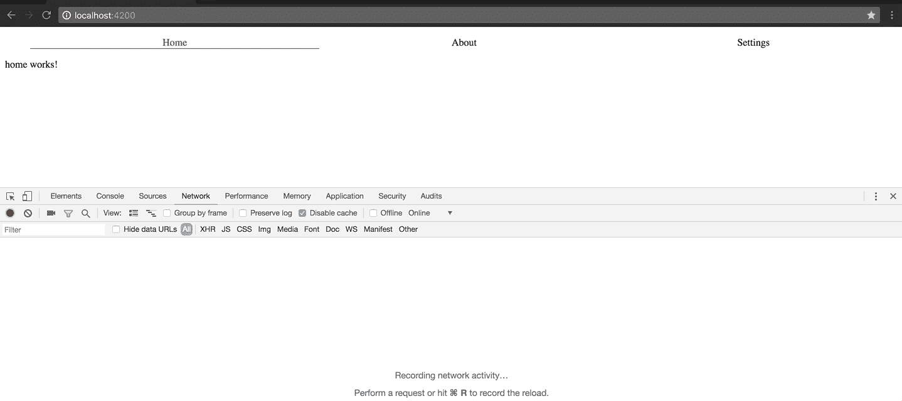
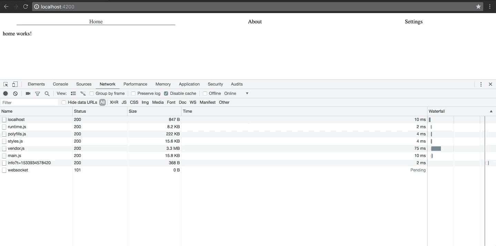
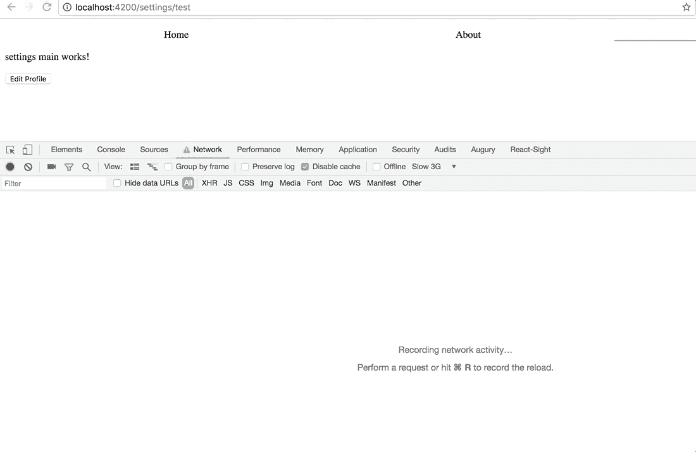
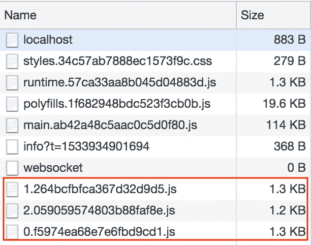
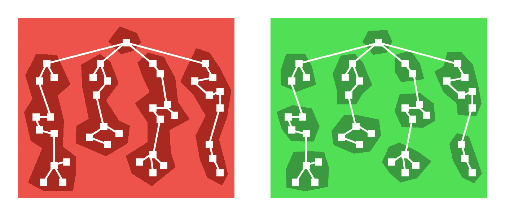
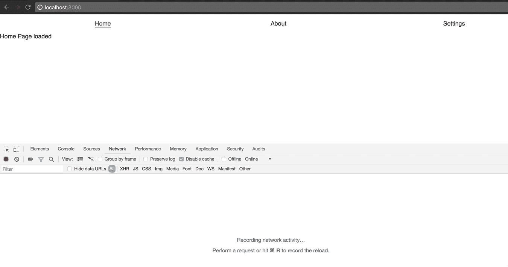
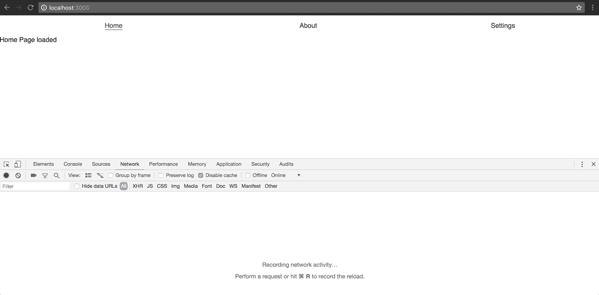
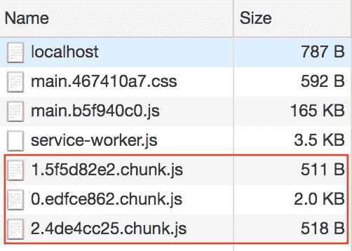

# Angular 和 React 应用中延迟加载组件的比较

> 原文：<https://levelup.gitconnected.com/lazy-loading-components-in-angular-and-react-applications-3f7f251c9277>


在本文中，我们将讨论延迟加载是如何工作的，以及在 Angular 和 React 应用程序中的区别。我们不会讨论 Angular 或 React 的各种特性，也不会讨论使用这些技术构建应用程序所需的设置。

然而，我们将非常快速地引导应用程序(使用它们各自的 CLI ),然后转移到症结——延迟加载。这不是一篇 Angular vs React 的文章，这只是一个简单的比较，如何使用两种框架实现相同的结果(延迟加载组件)。

## 什么是懒装？

惰性加载是一种仅在必要时加载额外负载的技术。惰性加载最简单的类比就是只有当用户点击`signup`按钮时才加载与`signup`相关的 JS、CSS 和 HTML。毕竟，与`login`或`home`页面相比，它是大多数应用程序中使用相对较少的部分。使初始页面加载更快，并对应用程序的结构和层次结构进行整体改进。我们可以将应用程序分成逻辑块，这些逻辑块可以按需加载。

## 我们将建造什么

为了简单起见，我们将建立一个简单网站的一部分，它有一个`home`页面，然后两个懒惰加载的兄弟路线— `about`和`settings`。我们将在用户导航中加载`about`和`settings`页面。在`settings`视图中，我们将基于用户交互进一步加载惰性加载子组件，在本例中，是一个按钮点击。这里的目标是看看这两个框架如何让我们达到相同的结果。

# 倾斜惰性负载

假设您已经安装了`angular-cli`，设置项目和一些组件应该轻而易举。遵循以下命令:

```
ng new angular-lazy-loadedcd angular-lazy-loadedng generate module about --routingng generate module settings --routingng generate component homeng generate component about/mainng generate component settings/main
```

这就建立了我们将要使用的三条基本路线。根据上述命令，`home`组件不必是一个附加了路由配置的模块，这与`about`和`settings`模块不同。我们将在应用程序加载时加载`home`组件，为此，我们可以设置整个应用程序路由，如下所示。

对于基于基本路由的延迟加载，我们可以简单地用我们为`about`和`settings`路由创建的模块来定义路由。当应用程序加载默认路径时，默认加载`HomeComponent`。

另一件需要注意的事情是，我们在`settings`和`about`路线中都添加了一个`main`组件。让我们将`main`组件包含到这两个模块中，这样当用户导航到这些路径中的任何一个时，它们都会被默认加载。为了保持文章简洁，省略了一些代码，但是请参考[完整代码库](https://github.com/40x/angular-lazy-loading)以供参考。

当我们使用 cli 启动应用程序并向模板添加一些基本样式来加载应用程序时，我们会看到惰性加载路线的输出，如下所示:



页面最初加载时会加载`main`和`vendor` javascript 文件(并呈现`HomeComponent`)。只有当用户试图导航到这些路线时，`about`和`settings`模块(以及它们的`MainComponents`)才会被请求和呈现。

> 我们在上面看到的有效载荷比预期的要大，因为它不是生产版本。我们将在以后的生产版本中测试相同的功能。

到目前为止，我们已经通过 route 按需加载组件，现在让我们尝试通过其他用户交互在预渲染的 route 上延迟加载组件。举例来说，我们将通过点击`settings`页面中的`edit`按钮来编辑用户配置文件。页面`settings`已经被延迟加载，我们现在在用户点击`edit`按钮时延迟加载页面的另一部分。

这是事情变得有点混乱的地方。在 Angular 中，应用程序层次结构的主要焦点是模块，而不是组件。如果模块(包括组件、服务、管道等)被直接或间接地通过依赖树导入到主模块中，它们将被打包到主包中。如果没有，这些模块将被捆绑成块，并作为延迟加载的模块提供。

为了能够延迟加载一个组件，我们必须把它捆绑成一个模块，当有请求时，这个模块就会被分块和加载。没有其他方法可以在不依赖于路由和模块的情况下延迟加载角度组件。要设置所讨论的必要组件，请运行以下命令:

```
ng generate module settings/main/edit-profile --routingng generate component settings/main/edit-profile/edit
```

这些命令将为`settings`页面的`edit`部分设置必要的子模块(我们将路由到该子模块)和组件。

要加载这些更改，我们必须用惰性加载子组件设置我们的`settings`路由，如下所示:

一切都像预期的那样，我们添加了新的`outlet`属性，指示我们希望组件呈现的位置(在设置 html 页面内),以及`loadChildren`属性，指示它将被延迟加载。不幸的是，由于 angular 中的一个错误，命名路由器出口的父级不能是`‘’`，因此，我们在它们之间引入了一个临时路由，当加载父路由时，该临时路由将重定向到我们的`MainComponent`。加载这个惰性组件的`settings`模板的相应变化如下:

这样，我们就可以开始摇滚了。让我们再次运行应用程序，并尝试在路线之间导航。结果将类似于您在下面看到的。



延迟加载增加了发送给服务器的加载必要文件的请求的数量。这意味着，如果任何延迟加载请求耗时太长、失败或被拒绝，将由我们来通知用户。如果能够处理这些情况，并在请求需要很长时间才能解决时显示一个加载指示器，那就更好了。

在 Angular 中有几种方法可以实现这一点，但是最简单的方法是将惰性加载路由事件与某种加载指示器联系起来。Angular 提供了`RouteConfigLoadStart`和`RouteConfigLoadEnd`事件，当惰性加载路线开始加载和结束加载时，这些事件被专门触发。我们可以使用这些事件，并在发出请求的`settings`模块的`main`组件上设置一个监听器，如下所示:

和模板:

当服务器重新运行时，这将按预期运行



然而，当有多个懒惰加载的组件时，问题就出现了。我们必须在我们的`subscribe`方法中添加对`event`的进一步检查，以确定哪个请求正在进行，并显示相应的加载消息/指示器。

## 分析

虽然它像预期的那样工作，但你可能会有点困惑，这是公平的。Angular 并没有让理解如何延迟加载组件变得特别容易。一切都与模块和我们通过路由延迟加载模块的能力联系在一起。bugs 变通方法的存在也不理想。

现在我们的更改已经完成，让我们压缩构建并再次测试这些更改，以分析有效负载的大小。



这是我们最终捆绑的应用程序加载的内容。最后三块是我们的延迟加载模块。请注意，它们都是相当精简的代码——每个都只包含几条语句。我们大部分的代码修改都是围绕着设置必要的路由。

还有其他方面的比较，如服务器端渲染，但我们将在以后的文章中处理。

[角度延迟加载的完整代码库](https://github.com/40x/angular-lazy-loading)。

# 对延迟加载做出反应

在进入 react 应用程序的惰性加载之前，让我们使用`create-react-app`快速启动一个新的 React 应用程序。因为 React 只处理应用程序的视图部分，所以我们需要添加额外的依赖项来处理应用程序的其他部分。我们将使用`react-router`和`react-loadable`来加载我们的路由并启用延迟加载，所以让我们安装它们。

```
npm i -S react-loadable react-router react-router-dom
```

我们将遵循与上面相同的例子，我们的应用程序由 3 条路线组成，`home`、`about`和`settings`。`Home`应用程序加载时加载到默认路径。`About`和`settings`路线是懒装的。在`settings`中，我们将进一步在点击按钮时为用户配置文件的`edit`惰性加载组件。

我们所有组件的初始版本都非常简洁明了，类似于下面所示的组件:

我们现在将使用路由器加载页面导航组件。让我们在主`app.jsx`中设置路由器，以方便路由，如下所示:

当我们运行应用程序时，一切都按预期运行。我们可以单击链接并导航到各自的视图。

接下来是重要的一步——设置延迟加载。在本例中，我们使用的是`react-loadable`。这是一个令人惊叹的库，具有广泛的开箱即用特性。事实上，下面是他们的自述文件中的[图片，展示了他们关于惰性加载应该如何工作的建议。](https://github.com/jamiebuilds/react-loadable)



从上面的图片中可以清楚地看到，`react-loadable`希望让我们能够按照功能组件而不是基于某个特定的路线来划分块。让我们首先使用`react-loadable`启用基于路由的延迟加载，然后在我们的设置页面中添加更多的逻辑来延迟加载`edit`组件。

`React-loadable`内部是对`webpack`功能的扩展，增加了语法成分，这样我们就不需要担心所有的边缘情况和样板代码。

代码更改相对容易且易于理解。只需在当前组件旁边添加一个`index.jsx`文件，并根据需要使用`react-loadable`到`import`即可。

然后我们可以调用这个`LazySettings`组件而不是常规的`Settings`组件来启用延迟加载。结果是我们的惰性加载组件被加载到路线导航上。



最后，我们将把`button`添加到`settings`页面，该页面将把子组件加载到`edit`用户配置文件。为此，我们需要将我们的`settings`组件更新为有状态组件，它可以加载我们尚未创建的`LazyEditProfile`组件。

并且`LazyEditProfile`组件类似于所有其他延迟加载的组件:

为了简洁起见，省略了一些代码。完整实现请参考[完整代码库](https://github.com/40x/react-lazy-loading)。

预期的结果是延迟加载组件。



## 分析

与 Angular 相比，React 的使用、安装和设置非常简单。该功能是以组件为中心的，它让您可以完全控制如何加载组件。

有效负载分析的生产构建向我们展示了以下块的有效负载大小:



# 结论

在我个人看来，从开发人员的角度来看，React 的延迟加载更加自然和简单。也许有进一步的优化和改变可以使整体开发更容易和更快，但就目前的情况来看，`react-loadable`肯定有优势。

完整的代码库: [react 懒加载 app](https://github.com/40x/react-lazy-loading) ， [angular 懒加载 app](https://github.com/40x/angular-lazy-loading) 。

*如果你喜欢这个博客，一定要为它鼓掌，* [*阅读更多*](https://medium.com/@kashyap.mukkamala) *或者关注我的*[*LinkedIn*](https://www.linkedin.com/in/kashyap-mukkamala/)*。*

[](https://levelup.gitconnected.com)[](https://gitconnected.com/learn/angular) [## 学习角度-最佳角度教程(2019) | gitconnected

### 47 大角度教程。课程由开发人员提交并投票，使您能够找到最佳角度…

gitconnected.com](https://gitconnected.com/learn/angular)